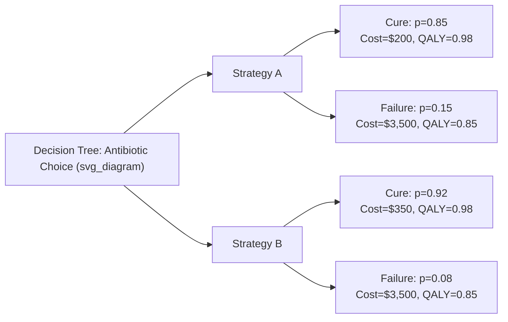
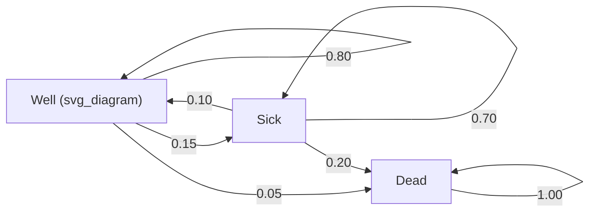

## Decision Trees and Markov Modeling

### Purpose in Health Technology Assessment

Decision trees and Markov models are the two foundational decision-analytic modeling techniques used to synthesize evidence and estimate the long-term costs and outcomes of health interventions when trial data alone are insufficient — either because trials have short follow-up relative to the disease's natural history, or because a full economic comparison requires extrapolating beyond observed data. Both techniques provide the structural framework within which cost-effectiveness analysis (CEA) inputs (probabilities, costs, utilities) are combined to generate expected values for each comparator.

### Decision Trees

**Key Points**

A decision tree represents a sequence of choices and chance events as a branching structure, in which:

- **Decision nodes** (conventionally drawn as squares) represent points where the modeler chooses between comparator strategies (e.g., "Treatment A" vs. "Treatment B").
- **Chance nodes** (conventionally drawn as circles) represent probabilistic events, each with mutually exclusive and exhaustive branches summing to a probability of 1.0.
- **Terminal nodes** (conventionally drawn as triangles) represent final outcomes, each assigned an associated cost and health outcome (e.g., QALYs).

The expected value of a strategy is calculated by "folding back" the tree — multiplying outcome values at each terminal node by the cumulative probability of reaching that node, then summing across all terminal nodes for that strategy:

$$E[\text{Outcome}] = \sum_{i=1}^{n} p_i \times v_i$$

Where $p_i$ is the cumulative probability of reaching terminal node $i$ and $v_i$ is the cost or outcome value at that node.

**Example**

Consider a decision tree comparing two antibiotic treatment strategies for an infection, where each strategy branches into "cure" (probability $p$) or "treatment failure requiring hospitalization" (probability $1-p$):

Expected cost of Strategy A: $(0.85 \times 200) + (0.15 \times 3{,}500) = 170 + 525 = \$695$

Expected cost of Strategy B: $(0.92 \times 350) + (0.08 \times 3{,}500) = 322 + 280 = \$602$

Despite Strategy B's higher upfront drug cost, its higher cure rate produces a lower expected total cost — illustrating how decision trees can reveal that a more expensive intervention is cost-saving overall when downstream failure costs are incorporated.

### When Decision Trees Are Appropriate

**Key Points**

Decision trees are best suited to:

- Short time horizons where the clinical question resolves within a defined, non-repeating episode (e.g., diagnostic pathway outcomes, acute treatment success/failure, single surgical procedure outcomes).
- Conditions without significant risk of recurring events or chronic, evolving health states.

Decision trees become impractical for chronic or recurring conditions because the tree structure grows exponentially with the number of time periods modeled (each additional cycle multiplies the number of branches), making long-horizon chronic disease models computationally unwieldy and difficult to interpret. This limitation is the primary motivation for using Markov models instead.

### Markov Models

**Key Points**

A Markov model represents disease progression as movement of a hypothetical cohort (or individual, in microsimulation variants) among a finite, mutually exclusive, and exhaustive set of **health states** over discrete **cycles** (fixed time intervals, e.g., 1 month, 1 year). Structural elements include:

- **Health states**: Defined clinical or disease-severity categories (e.g., "Well," "Progressed Disease," "Dead"). States must be mutually exclusive (a patient occupies exactly one at any time) and collectively exhaustive.
- **Transition probabilities**: The probability of moving from one health state to another (or remaining in the same state) during a single cycle, typically organized into a **transition probability matrix** where each row sums to 1.0.
- **Cycle length**: The discrete time interval between recalculations of state membership; shorter cycles increase precision but computational burden, and models sometimes apply a **half-cycle correction** to adjust for the assumption that transitions occur at a single point (start or end) within each cycle rather than continuously.
- **Markov (memoryless) assumption**: Transition probabilities depend only on the current health state, not on the path taken to reach it or time already spent in that state — a simplifying assumption that is sometimes violated in real disease processes (e.g., where risk of a recurrent event depends on time since a prior event).

### The Transition Probability Matrix

**Example**

For a simplified three-state model ("Well," "Sick," "Dead"), the transition matrix might be:

| From \ To | Well | Sick | Dead |
| --- | --- | --- | --- |
| Well | 0.80 | 0.15 | 0.05 |
| Sick | 0.10 | 0.70 | 0.20 |
| Dead | 0.00 | 0.00 | 1.00 |

Each row sums to 1.0. "Dead" is an **absorbing state** — once entered, the cohort cannot transition out (probability of remaining = 1.00), reflecting the irreversibility of death in the model structure.

### Cohort Simulation and the Markov Trace

**Key Points**

Running a Markov model over multiple cycles produces a **Markov trace**: a table showing the proportion (or expected number, for a hypothetical cohort of, e.g., 1,000 patients) of the cohort occupying each health state at each cycle. Starting from an initial distribution vector $\pi_0$ (e.g., 100% in "Well" at cycle 0), the state distribution at cycle $t$ is calculated by repeated matrix multiplication:

$$\pi_t = \pi_0 \times P^t$$

Where $P$ is the transition probability matrix. Total expected costs and outcomes are then calculated by summing, across all cycles, the state occupancy proportions multiplied by the cost/utility values assigned to each state, typically discounted to present value:

$$\text{Total Expected Cost} = \sum_{t=0}^{T} \frac{1}{(1+r)^t} \sum_{s} \pi_{s,t} \cdot c_s$$

Where $\pi_{s,t}$ is the proportion of the cohort in state $s$ at cycle $t$, $c_s$ is the cost of state $s$, and $r$ is the per-cycle discount rate.

### Converting Rates to Probabilities

**Key Points**

Clinical literature often reports event **rates** (from survival analysis, e.g., an annual hazard rate) rather than the cycle-specific **probabilities** a Markov model requires. Converting between the two uses the standard exponential relationship:

$$p = 1 - e^{-rt}$$

Where $r$ is the rate, $t$ is the cycle length, and $p$ is the resulting transition probability. This conversion assumes a constant underlying hazard within the interval; when hazards vary over time (common in disease progression), rates should be time-specific rather than treated as constant across the full model horizon. [Inference: the appropriateness of the constant-hazard assumption depends on the clinical context and should be validated against observed data patterns, such as Kaplan-Meier curve shape, rather than applied by default.]

### Extensions to Standard Markov Structure

**Key Points**

- **Semi-Markov models**: Relax the memoryless assumption by allowing transition probabilities to depend on time already spent in the current state (a "tunnel state" approach, where a condition is split into multiple time-since-entry-specific sub-states, is a common workaround within a standard cohort Markov framework).
- **Microsimulation (patient-level simulation)**: Simulates individual patients one at a time through the model using random number draws against transition probabilities, allowing full tracking of individual patient history and enabling more complex logic (e.g., cumulative dose thresholds, prior-event-dependent risk) that a cohort-level Markov model cannot represent. Trades off increased flexibility and realism against greater computational cost and the need for many simulated patients (often tens of thousands) to achieve stable results, requiring careful reporting of Monte Carlo error separately from parameter uncertainty.
- **Partitioned survival models**: An alternative to explicit Markov transitions, commonly used in oncology, where health-state membership at each time point is derived directly from fitted parametric survival curves (e.g., overall survival and progression-free survival curves) rather than from a transition matrix; particularly suited to settings where trial data include mature survival curves that can be extrapolated using standard parametric distributions (exponential, Weibull, log-normal, log-logistic, gamma, Gompertz).

### Comparison: Decision Trees vs. Markov Models

| Feature | Decision Tree | Markov Model |
| --- | --- | --- |
| Time structure | Single decision point/short episode | Multiple discrete cycles over extended horizon |
| Best suited for | Acute, non-recurring events | Chronic, recurring, or progressive conditions |
| Complexity growth | Exponential with added time periods | Linear with added cycles (fixed state count) |
| Memory of history | Full path-dependency (each branch distinct) | Memoryless (Markov assumption), unless extended (semi-Markov, microsimulation) |
| Typical software implementation | Spreadsheet (Excel), TreeAge, R | Excel, TreeAge, R (e.g., `heemod` package), specialized HTA modeling software |

### Building and Validating a Markov Model: Practical Workflow

**Key Points**

1. **Define health states**: Should reflect clinically meaningful and mutually exclusive disease categories relevant to the cost and outcome differences being studied; too few states may miss important distinctions, too many complicate parameterization and interpretation.
2. **Determine cycle length**: Should match the frequency of clinically important events or data reporting intervals (e.g., annual cycles are common for chronic diseases with slow progression).
3. **Populate transition probabilities**: Derived from trial data, published literature, or expert elicitation when data are unavailable; probabilities from different cycle lengths must be converted to the model's cycle length using the rate-probability relationship above.
4. **Assign costs and utilities to each state**: Typically drawn from costing studies and utility catalogs/trial EQ-5D data respectively.
5. **Apply discounting and half-cycle correction**: Standard conventions to align with HTA reporting guidelines.
6. **Run the base-case cohort simulation**: Generates total expected costs and outcomes per strategy, from which the ICER is calculated.
7. **Conduct sensitivity analysis**: One-way, scenario, and probabilistic sensitivity analysis (PSA) to characterize the effect of parameter uncertainty on results, typically required for HTA submission.
8. **Validate the model**: Includes internal validation (verifying the model reproduces expected/logical outputs, such as trace behavior matching known epidemiology), cross-validation against other published models, and, where possible, external validation against independently observed long-term outcome data.

### Common Pitfalls

**Key Points**

- Using transition probabilities derived from a different cycle length without proper conversion, introducing systematic bias into long-run projections.
- Omitting half-cycle correction, which can bias cost and outcome estimates, particularly in models with few cycles.
- Structural misspecification, such as failing to capture clinically important recurrent-event dependency in a purely memoryless cohort model when disease biology suggests time-since-event matters.
- Extrapolating survival curves far beyond the observed trial follow-up period using a parametric form chosen primarily for statistical fit rather than clinical plausibility; results for extrapolated periods should be interpreted cautiously since actual long-term behavior may vary from the fitted curve. [Inference: extrapolation risk is well recognized in the HTA methods literature as a major source of model uncertainty, though the degree of risk is context-specific.]
- Insufficient number of microsimulation replications, leading to Monte Carlo noise being mistaken for genuine parameter-driven uncertainty.

### Software and Implementation

**Key Points**

Common platforms for building decision trees and Markov models include:

- **Microsoft Excel**: Widely used for both structures due to accessibility and transparency for HTA reviewers, though prone to error at scale and limited for microsimulation.
- **TreeAge Pro**: Purpose-built commercial decision-analytic modeling software supporting both tree and Markov structures with built-in sensitivity analysis and visualization tools.
- **R**: Increasingly used in academic and some HTA submissions, with packages such as `heemod` supporting Markov cohort modeling, and general-purpose simulation code supporting microsimulation and partitioned survival approaches; favored for reproducibility and open-source transparency.

### Related Topics

- Parametric survival analysis and extrapolation methods for oncology models
- Probabilistic sensitivity analysis and Monte Carlo simulation techniques
- Cost-effectiveness analysis fundamentals and ICER interpretation
- Half-cycle correction and discrete time modeling conventions
- Microsimulation and discrete event simulation in health economics
- Value of information analysis for prioritizing further research
- Model validation frameworks in health economic modeling (ISPOR-SMDM guidance)
- Budget impact modeling versus long-term cost-effectiveness modeling
- Network meta-analysis as an input source for transition probabilities
- Partitioned survival modeling in oncology HTA submissions