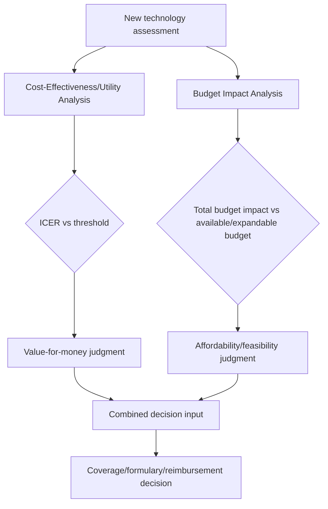

## Budget Impact Analysis

### Overview

Budget Impact Analysis (BIA) estimates the projected financial consequences of adopting a new health technology or intervention on a specific payer's or health system's budget over a defined, typically short-to-medium-term time horizon. Unlike cost-effectiveness analysis, which asks whether health gained is worth the cost incurred, BIA asks the fundamentally different question of whether a payer can **afford** to adopt a technology given its actual budget constraints — making BIA a required complementary analysis alongside CEA/CUA in most major HTA submission frameworks, addressing affordability and cash-flow feasibility rather than value-for-money.

### Key Points

- BIA and cost-effectiveness analysis answer different questions: CEA/CUA assesses value for money (is the health gain worth the incremental cost), while BIA assesses affordability and financial feasibility (can the payer's budget absorb the total incremental spending).
- BIA typically uses a **shorter time horizon** than CEA (commonly 1–5 years, reflecting realistic budget planning cycles) rather than the lifetime horizons common in cost-effectiveness modeling.
- BIA compares two scenarios — a "current" (reference) scenario without the new technology and a "new" (intervention) scenario with it — projecting the total budget difference (not per-patient incremental cost) across the entire eligible population over the analysis horizon.
- Key inputs specific to BIA (beyond those needed for CEA) include: eligible population size and growth, uptake/diffusion rate of the new technology over time, and the technology's displacement effect on existing treatments' market share.
- A drug can simultaneously be judged cost-effective (favorable ICER) yet raise significant budget impact concerns (large absolute total cost) if the eligible population is large, illustrating why both analyses are typically required together rather than either alone.
- ISPOR (International Society for Pharmacoeconomics and Outcomes Research) has published widely referenced good-practice guidance for BIA methodology, commonly cited as a standard reference framework.

### Why BIA Is Distinct From and Necessary Alongside CEA/CUA

**The core distinction**

| Question | Analytical Method |
| --- | --- |
| Is the health gained worth the incremental cost per unit of health? | Cost-Effectiveness / Cost-Utility Analysis (ICER) |
| Can the payer's budget actually absorb the total incremental spending required? | Budget Impact Analysis |

A technology can be **cost-effective but not affordable** in the near term: an ICER below the relevant threshold indicates good value per QALY, but if the eligible population is very large or the technology is very expensive in absolute terms, the *total* budget impact may exceed what a payer can accommodate within existing or realistically expandable budget constraints in the short-to-medium term — even though, per-patient, the cost-effectiveness case is sound.

Conversely, a technology could have a modest total budget impact (e.g., very rare condition, small eligible population) while having an unfavorable ICER — the two dimensions are conceptually and often numerically independent, which is precisely why most major HTA frameworks (e.g., US formulary/payer submissions increasingly following AMCP Format guidance, and various national HTA bodies) require both analyses as complementary, not substitute, submissions.

### Core BIA Methodology

**Two-scenario comparison structure**

BIA calculates the difference in total budget between:

1. **Reference scenario**: projected total spending on the relevant disease area/patient population under current standard of care, without the new technology
2. **New scenario**: projected total spending under a defined uptake trajectory of the new technology, accounting for its price and its displacement of existing treatments

$$\text{Budget Impact}_t = \text{Total Cost (New Scenario)}_t - \text{Total Cost (Reference Scenario)}_t$$

calculated separately for each year $t$ within the analysis horizon (commonly presented as a year-by-year table rather than a single aggregated figure, since payers are typically interested in the year-by-year cash-flow trajectory, not just a cumulative total).

**Key input categories**

| Input Category | Description |
| --- | --- |
| Eligible/target population size | Number of patients in the relevant disease area/indication, often projected to grow or change over the analysis horizon (e.g., incidence/prevalence trends, population aging) |
| Current market share distribution | How the eligible population currently distributes across existing treatment options (including no treatment) in the reference scenario |
| Uptake/diffusion curve | Projected rate at which the new technology will be adopted over time in the new scenario — typically modeled as an S-shaped or otherwise specified adoption curve reaching a peak market share by a specified year, not instantaneous full adoption |
| Displacement/substitution pattern | Which existing treatments the new technology is assumed to replace, and in what proportion (a new technology rarely displaces only one existing option uniformly) |
| Per-patient costs (all relevant components) | Drug acquisition cost, administration cost, monitoring cost, cost of managing adverse events, and any downstream cost offsets (e.g., avoided hospitalizations) for both reference and new scenarios |

**Illustrative worked example**

A health plan is assessing a new biologic therapy for a chronic inflammatory condition, with a 3-year budget impact horizon:

| Year | Eligible Population | New Technology Uptake (% of eligible pop.) | Existing Therapy Displaced (% of new uptake) |
| --- | --- | --- | --- |
| Year 1 | 10,000 | 5% | 70% |
| Year 2 | 10,300 | 12% | 70% |
| Year 3 | 10,600 | 20% | 70% |

| Year | Reference Scenario Total Cost | New Scenario Total Cost | Budget Impact (New − Reference) |
| --- | --- | --- | --- |
| Year 1 | $45,000,000 | $46,800,000 | +$1,800,000 |
| Year 2 | $46,350,000 | $49,900,000 | +$3,550,000 |
| Year 3 | $47,700,000 | $53,600,000 | +$5,900,000 |

This stylized example illustrates the standard BIA output format: a year-by-year projection showing the incremental budget impact growing as uptake increases, information a payer uses to assess whether the projected incremental spending trajectory is financially manageable within their budget planning cycle. [Inference — illustrative constructed figures for pedagogical purposes, not derived from any specific real technology's actual submitted budget impact model.]

### Uptake Curve Modeling

**Why uptake trajectory matters**

Unlike a simplified assumption of instantaneous full market penetration, real-world technology adoption typically follows a gradual diffusion pattern, influenced by factors including prescriber familiarity, guideline incorporation timing, prior-authorization/formulary-tier placement, and patient/prescriber risk aversion toward newer therapies. BIA models commonly specify an explicit uptake curve rather than assuming immediate or arbitrary adoption rates, since the shape and speed of this curve materially affects the year-by-year budget impact trajectory even when the eventual peak market share assumption is held constant.

**Common uptake curve specifications**

| Specification | Shape | Typical Use Case |
| --- | --- | --- |
| Linear uptake | Constant increase per year toward peak share | Simple base-case assumption when specific diffusion data is unavailable |
| S-shaped (logistic) uptake | Slow initial adoption, accelerating mid-period, plateauing near peak | Reflects typical technology diffusion patterns observed empirically across many health technologies |
| Analogous-product-based uptake | Uptake curve modeled on the observed historical diffusion pattern of a clinically/therapeutically similar prior technology | Used when a reasonably comparable historical analog exists and is considered a more evidence-grounded approach than an assumed generic curve shape |

[Inference — the relative merits and appropriate selection criteria among these uptake curve specifications is a standard methodological discussion point in BIA guidance documents; no single specification is universally "correct" independent of the specific technology and market context being modeled.]

### Perspective and Time Horizon in BIA

**Perspective**

BIA is almost always conducted from the **payer's perspective** specifically (e.g., a particular health plan, a national health system budget, a Medicaid program budget) rather than a broader societal perspective — this is a deliberate and defining methodological choice, since BIA's entire purpose is assessing affordability for the specific budget-holder making the adoption decision, not broader societal welfare (which is the domain of CEA/CUA and CBA instead).

**Time horizon**

BIA time horizons are typically much shorter than CEA/CUA lifetime horizons — commonly 1 to 5 years — reflecting the reality that payers plan and allocate budgets on annual or multi-year cycles, not lifetime patient horizons. This shorter horizon is a deliberate methodological difference from CEA, not an oversight: a payer needs to know what a new technology will cost their budget *next year and the following few years*, a fundamentally different planning question than the lifetime cost-effectiveness value calculation.

### ISPOR Good Practice Guidance

The International Society for Pharmacoeconomics and Outcomes Research (ISPOR) has published widely referenced good-practice recommendations for BIA, commonly cited as a de facto methodological standard across submissions to numerous payers and HTA bodies internationally, covering elements including: appropriate population definition and sizing methodology, uptake curve justification, sensitivity/scenario analysis expectations, and reporting transparency standards. [Unverified — specific current ISPOR task force report details, recommendation specifics, and any subsequent updates should be verified against the current published ISPOR guidance document rather than assumed to be static, since methodological guidance documents are periodically revised.]

### Sensitivity and Scenario Analysis in BIA

Because BIA outputs are highly sensitive to several uncertain assumptions (uptake rate, eligible population size projections, displacement patterns), standard BIA practice includes:

1. **One-way sensitivity analysis**: varying key uncertain parameters (uptake rate, population size, price) individually across plausible ranges to identify which assumptions most influence the projected budget impact
2. **Scenario analysis**: presenting alternative plausible combinations of assumptions (e.g., "conservative uptake" vs. "aggressive uptake" scenarios) as distinct named scenarios rather than a single point estimate, since payers often want to see a plausible range of financial exposure rather than one number presented with false precision
3. **Threshold/break-even analysis**: identifying the uptake rate, price, or population size at which the budget impact would exceed a specified affordability threshold, directly answering payer questions about the conditions under which the technology's adoption would become financially problematic

### Illustrative Example: Cost-Effective but Budget-Challenging Scenario

A new therapy for a moderately common chronic condition has:

- ICER: $40,000 per QALY (favorable relative to a $100,000/QALY threshold — clearly cost-effective)
- Eligible population: 500,000 patients nationally
- Annual per-patient cost: $60,000
- Projected peak uptake: 30% of eligible population by Year 3

$$\text{Peak-year incremental budget impact} \approx 500{,}000 \times 0.30 \times \$60{,}000 \approx \$9 \text{ billion/year}$$

Despite a clearly favorable ICER, the absolute scale of the eligible population produces a multi-billion-dollar annual budget impact at peak uptake — a figure that may prompt payer concern about affordability and could motivate risk-sharing arrangements, phased rollout, or price negotiation, entirely independent of the technology's demonstrated cost-effectiveness. This scenario illustrates precisely why BIA is required as a distinct, complementary analysis rather than treating a favorable ICER as sufficient information for an adoption decision. [Inference — illustrative constructed figures for pedagogical purposes, not derived from any specific real technology's actual population size, price, or budget impact model.]

### Relationship to Managed Entry Agreements

Budget impact concerns identified through BIA frequently motivate **managed entry agreements** (also called risk-sharing agreements) between payers and manufacturers, structured to mitigate affordability/uncertainty concerns without necessarily reducing the technology's list price outright:

| Agreement Type | Mechanism |
| --- | --- |
| Price-volume agreements | Price per unit decreases as cumulative volume/spending exceeds specified thresholds, directly capping total budget exposure |
| Outcomes-based agreements | Payment contingent on real-world clinical outcomes meeting specified benchmarks |
| Annual spending caps | Manufacturer rebates any spending above a pre-agreed annual budget ceiling back to the payer |
| Subscription/capitation models | Payer pays a fixed total amount regardless of volume/uptake, transferring uptake-volume risk to the manufacturer |

These arrangements are frequently a direct response to budget impact analysis findings, illustrating how BIA functions not merely as an assessment tool but as a driver of contract structure negotiation between payers and manufacturers. [Inference — this is a well-documented general pattern connecting BIA findings to managed entry agreement negotiation, not a claim about any specific named agreement.]

### Conclusion

Budget Impact Analysis addresses the distinct, practically essential question of financial affordability that cost-effectiveness analysis does not answer — a technology can be simultaneously cost-effective and budget-challenging, particularly when the eligible population is large, making BIA a required complement rather than a substitute for CEA/CUA in comprehensive HTA submissions. The methodology's defining features — payer perspective, shorter time horizon, explicit uptake and displacement modeling, and year-by-year (not just cumulative) reporting — reflect its purpose of informing realistic budget planning and negotiation rather than assessing broader societal value for money. BIA findings frequently motivate managed entry agreements and risk-sharing arrangements as practical mechanisms for reconciling a technology's demonstrated clinical/cost-effectiveness value with a payer's real-world budget constraints.

**Related Topics**

- Managed entry agreements and outcomes-based/risk-sharing contract design
- ISPOR good practice guidance for budget impact analysis methodology
- Technology diffusion and uptake curve modeling approaches
- AMCP Format for formulary submissions (US payer-focused evaluation framework)
- Price-volume agreements and annual spending cap contract structures
- Population health management and eligible-population forecasting methodology
- Relationship between cost-effectiveness analysis and budget impact analysis in combined HTA dossiers
- Health system budget planning cycles and multi-year financial forecasting practices