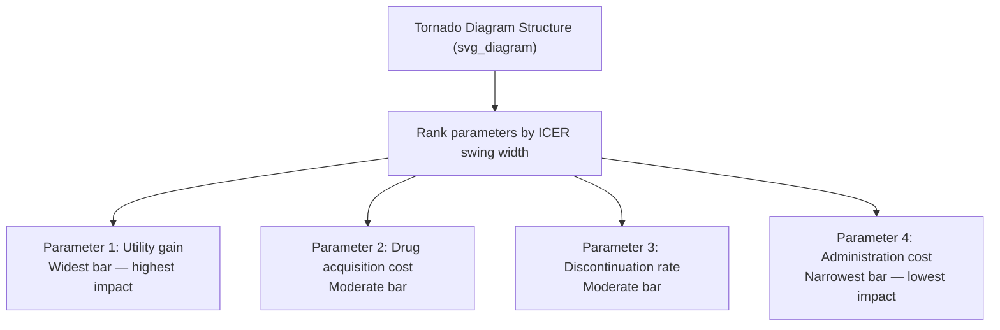
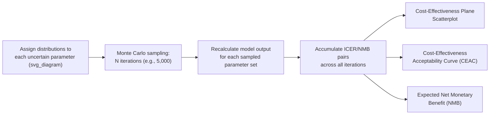

## Sensitivity and Uncertainty Analysis

### Purpose and Role in Health Technology Assessment

Sensitivity and uncertainty analysis systematically examines how variation in the inputs of an economic model affects its outputs, most importantly the incremental cost-effectiveness ratio (ICER). Because every parameter in a cost-effectiveness model — clinical effectiveness estimates, costs, utility weights, transition probabilities — is estimated with some degree of imprecision, and because structural modeling choices themselves involve judgment, sensitivity analysis is a standard and generally required component of credible health economic evaluation submitted to HTA bodies such as NICE, CADTH, and ICER (the Institute for Clinical and Economic Review). Its core purpose is to characterize how much confidence decision-makers should place in a model's headline result and to identify which parameters most influence that result.

### Taxonomy of Uncertainty

**Key Points**

Health economic modeling literature typically distinguishes four categories of uncertainty, each requiring a different analytic approach:

1. **Parameter uncertainty**: Imprecision in the estimated values of individual model inputs (e.g., a transition probability estimated from a trial with a 95% confidence interval), addressed primarily through sensitivity analysis (deterministic or probabilistic).
2. **Structural uncertainty**: Uncertainty about the model's overall design and assumptions — the choice of health states, the functional form used to extrapolate survival curves, or whether to include a particular cost category — addressed through scenario analysis comparing alternative structural assumptions.
3. **Heterogeneity**: Variability in outcomes across different patient subgroups (e.g., by age, disease severity, or biomarker status) that is not uncertainty per se but reflects genuinely different expected outcomes; addressed through subgroup analysis rather than sensitivity analysis, since heterogeneity does not resolve with more data the way parameter uncertainty does.
4. **Methodological uncertainty**: Disagreement or ambiguity about which analytic methods are correct (e.g., which discount rate convention or perspective to adopt), often addressed through reference-case scenario comparisons defined in HTA agency methods guides.

### Deterministic Sensitivity Analysis

**Key Points**

**One-way sensitivity analysis (OWSA)** varies a single parameter across a plausible range — typically its 95% confidence interval bounds, or a percentage variation (e.g., ±20%) when no confidence interval is available — while holding all other parameters at their base-case values, to observe the resulting change in the ICER or net monetary benefit. This is repeated independently for each parameter of interest.

Results of a one-way sensitivity analysis are conventionally displayed as a **tornado diagram**, a horizontal bar chart ranking parameters from top to bottom by the magnitude of their effect on the outcome measure (widest bars at top), providing an immediate visual indication of which parameters are the most influential drivers of model uncertainty.

**Example**

A tornado diagram for a drug cost-effectiveness model might show that varying the drug's utility benefit across its confidence interval swings the ICER from $40,000 to $95,000 per QALY (the widest bar), while varying a minor administration cost parameter swings the ICER only from $58,000 to $62,000 (a narrow bar) — indicating that further research to reduce uncertainty in the utility estimate would be more valuable than refining the cost estimate.

**Two-way (or multi-way) sensitivity analysis** varies two (or more) parameters simultaneously to examine interaction effects between them, useful when parameters are correlated or when a decision-maker wants to understand joint threshold conditions (e.g., the combination of price and effectiveness at which an ICER crosses a specific willingness-to-pay threshold).

**Threshold analysis** identifies the specific value of a single parameter (commonly price) at which the ICER equals a specified cost-effectiveness threshold, directly answering questions such as "at what price would this drug become cost-effective at $100,000 per QALY?"

### Scenario Analysis

**Key Points**

Scenario analysis tests the effect of adopting entirely different structural or methodological assumptions rather than varying continuous parameter values — for example, comparing results under a healthcare-payer perspective versus a societal perspective, under alternative discount rates (e.g., 1.5% vs. 3.5%), under different time horizons, or under alternative parametric survival extrapolation functions (exponential vs. Weibull vs. log-logistic). Because these are discrete structural choices rather than points along a continuous distribution, they are generally not incorporated into probabilistic sensitivity analysis and are instead reported as separate scenario results alongside the base case.

### Probabilistic Sensitivity Analysis (PSA)

**Key Points**

Probabilistic sensitivity analysis addresses parameter uncertainty comprehensively by assigning a **probability distribution** to each uncertain input (rather than a single point estimate) and running **Monte Carlo simulation** — repeatedly sampling a value for each parameter from its assigned distribution, recalculating the model output for each draw, and accumulating results across many iterations (commonly 1,000 to 10,000, though the number required for stable estimates depends on model complexity and desired precision).

**Distributional assumptions** are typically chosen to match the statistical properties of each parameter type:

- **Probabilities and proportions**: Beta distribution, bounded between 0 and 1.
- **Costs**: Gamma distribution, bounded at zero and right-skewed (reflecting that costs cannot be negative and occasionally include high outliers).
- **Relative risks, hazard ratios, odds ratios**: Log-normal distribution, since these are typically estimated and reported on a log scale with approximately normal sampling distributions in log-space.
- **Utility values**: Beta distribution when bounded between 0 and 1, though a more general approach is sometimes needed for utility values that can be negative (states considered worse than death).

The output of PSA is a scatter of ICER pairs (incremental cost, incremental effect) across all simulation iterations, from which several standard decision-analytic outputs are derived:

- **Cost-effectiveness plane scatterplot**: Visualizes the joint distribution of incremental cost and incremental effect pairs across all iterations, showing the spread of plausible outcomes across the four quadrants.
- **Cost-effectiveness acceptability curve (CEAC)**: Plots, for a range of possible willingness-to-pay thresholds ($\lambda$) on the x-axis, the proportion of PSA iterations in which the intervention is cost-effective (i.e., $ICER < \lambda$, or equivalently net monetary benefit is positive) on the y-axis — directly answering "what is the probability this intervention is cost-effective at threshold X?"
- **Net monetary benefit (NMB)**: Reframes each simulation iteration's cost and effect pair into a single monetary value using a chosen threshold $\lambda$:

$$NMB = (\lambda \times \Delta E) - \Delta C$$

An intervention is preferred when its expected NMB is positive and higher than the comparator's; this reformulation avoids some interpretive difficulties associated with ratio statistics (ICERs) and is generally considered statistically preferable for uncertainty analysis, since ICERs can behave erratically (e.g., undefined or sign-reversing) when the denominator ($\Delta E$) is close to zero.

### Value of Information Analysis

**Key Points**

Value of information (VOI) analysis extends probabilistic sensitivity analysis by quantifying the monetary value of reducing decision uncertainty through further research, providing a formal economic framework for prioritizing future studies:

- **Expected Value of Perfect Information (EVPI)**: The maximum amount a decision-maker should theoretically be willing to pay to eliminate all parameter uncertainty entirely, calculated as the difference between the expected net benefit under perfect information (choosing the optimal strategy for each simulated parameter set) and the expected net benefit under current uncertainty (choosing a single strategy across all parameter sets):

$$EVPI = E_\theta[\max_j NB_j(\theta)] - \max_j E_\theta[NB_j(\theta)]$$

Where $NB_j(\theta)$ is the net benefit of strategy $j$ given parameter set $\theta$.

- **Expected Value of Partial Perfect Information (EVPPI)**: Estimates the value of resolving uncertainty in only a specific subset of parameters (e.g., just the utility values, or just the long-term extrapolation parameters), useful for identifying which specific area of future research would be most valuable.
- **Expected Value of Sample Information (EVSI)**: Estimates the value of a specific proposed study design of a defined sample size, providing a direct input into research prioritization and trial design decisions.
- Population-level EVPI is calculated by multiplying per-patient EVPI by the expected number of patients who will be affected by the decision over the relevant time horizon, which can produce substantial aggregate values that inform whether commissioning further research is worthwhile relative to its cost. [Inference: the practical use of population-level EVPI to directly commission research remains more common in some HTA systems (e.g., UK NIHR context) than others, and adoption varies by jurisdiction.]

### Comparison of Sensitivity Analysis Methods

| Method | Addresses | Output | Typical Use |
| --- | --- | --- | --- |
| One-way (deterministic) | Parameter uncertainty, one at a time | Tornado diagram | Identifying key cost/outcome drivers |
| Two-way/multi-way | Parameter interactions | Contour plots, threshold surfaces | Understanding joint parameter effects |
| Scenario analysis | Structural/methodological uncertainty | Alternative ICER estimates per scenario | Testing discrete structural assumptions |
| Threshold analysis | Single critical parameter value | Break-even price/value | Pricing and reimbursement negotiation |
| Probabilistic (PSA) | Joint parameter uncertainty | CEAC, cost-effectiveness plane, NMB distribution | Comprehensive uncertainty characterization; typically required for HTA submission |
| Value of information | Decision uncertainty relevant to future research | EVPI, EVPPI, EVSI | Prioritizing and designing further research |

### Reporting Considerations

**Key Points**

- HTA reference cases (e.g., NICE's methods guide) generally require both deterministic sensitivity analysis (for transparency on individual parameter influence) and probabilistic sensitivity analysis (for the primary characterization of decision uncertainty), rather than treating either as a substitute for the other.
- The choice of distribution for PSA parameters should reflect the statistical properties of the underlying data-generating process (e.g., Beta for bounded probabilities) rather than being selected arbitrarily; misspecified distributions can distort PSA results, particularly at the tails.
- The number of Monte Carlo iterations should be sufficient to produce stable estimates of the CEAC and NMB; convergence should ideally be checked (e.g., by observing whether results change meaningfully with additional iterations) rather than assumed from a fixed, arbitrary iteration count. [Inference: standard practice varies, and convergence diagnostics are not uniformly reported across published health economic evaluations.]
- Correlation between parameters (e.g., correlated cost components, or correlated arms of a trial) should be accounted for in PSA sampling when a strong theoretical or empirical basis for correlation exists; ignoring known correlation structures can either overstate or understate the overall uncertainty in results, depending on the direction of the correlation. Behavior may vary depending on the specific correlation structure and how it interacts with the model's other parameters.

### Related Topics

- Decision trees and Markov modeling structural foundations
- Cost-effectiveness analysis fundamentals and ICER interpretation
- Value of information analysis and research prioritization frameworks
- Parametric survival extrapolation and structural uncertainty in oncology models
- CHEERS reporting standards for health economic evaluations
- Net monetary benefit framework versus ICER-based decision rules
- Bayesian methods in health economic parameter estimation
- HTA reference case requirements across NICE, CADTH, and ICER
- Discrete event simulation and its treatment of parameter uncertainty
- Real-world evidence integration and its effect on parameter uncertainty over time