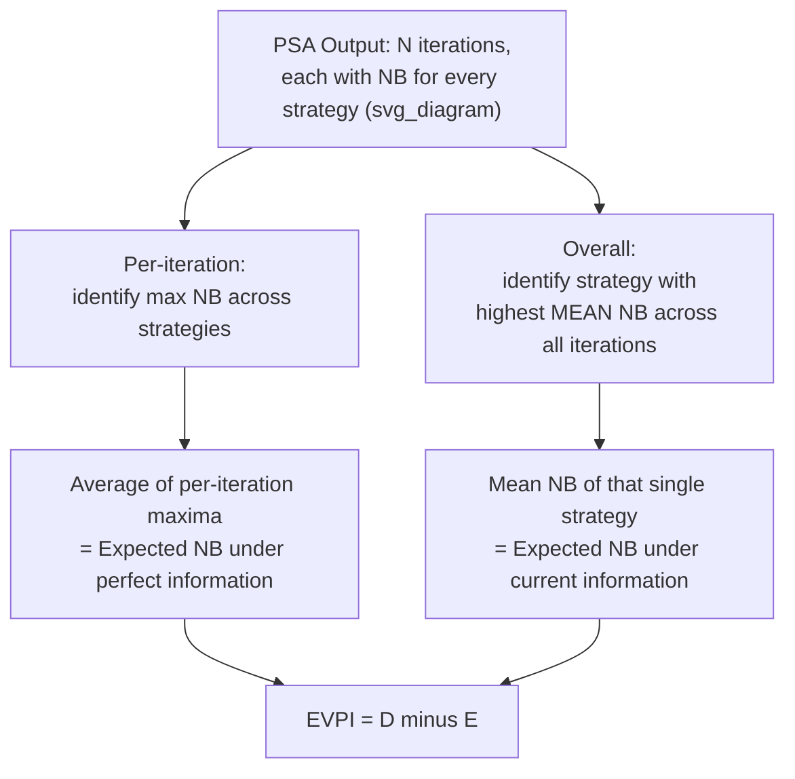
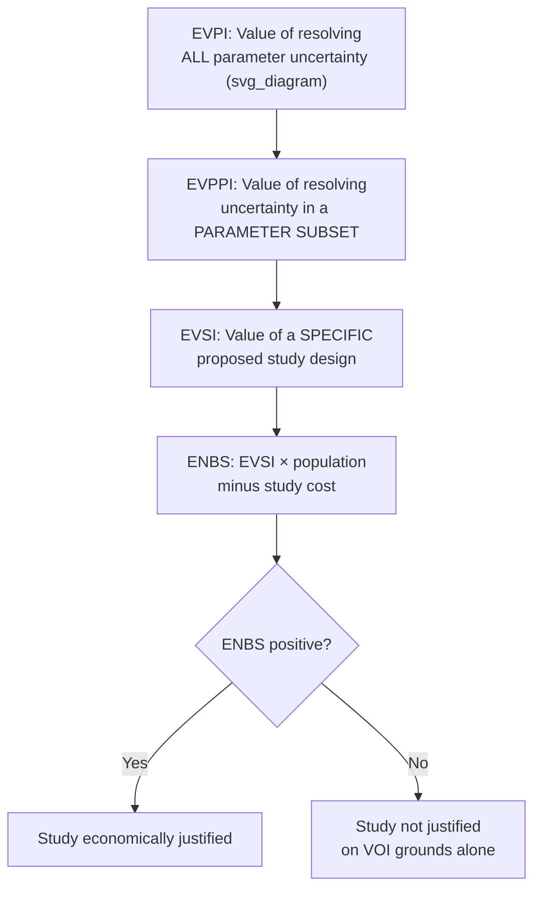

## Value of Information Analysis

### Definition and Purpose

Value of information (VOI) analysis is a decision-analytic framework that quantifies, in monetary terms, the benefit of reducing uncertainty in a health economic decision by conducting further research. Rather than treating parameter uncertainty solely as a limitation to be reported (as in standard sensitivity analysis), VOI analysis reframes uncertainty as an economic quantity — the expected cost of making a suboptimal decision because current evidence is imperfect — and uses this to determine whether, and what kind of, additional research is worth funding. VOI analysis is built directly on top of probabilistic sensitivity analysis (PSA) outputs and represents one of the more advanced and formally decision-theoretic tools within health technology assessment (HTA).

### Conceptual Foundation

**Key Points**

The central intuition behind VOI is that a decision made under uncertainty carries an **expected opportunity loss**: because the "true" values of model parameters are unknown, the strategy selected as optimal based on current expected values may, in fact, not be optimal once the true parameter values are known. VOI analysis calculates the expected magnitude of this potential error and treats it as an upper bound on what should rationally be spent to resolve the underlying uncertainty through research.

This distinguishes VOI from standard sensitivity analysis: whereas sensitivity analysis characterizes *how much* uncertainty exists and *which* parameters drive it, VOI analysis asks *how much that uncertainty is worth resolving*, in the same currency used elsewhere in the economic evaluation (typically monetized health benefit via net monetary benefit).

### Net Monetary Benefit as the Underlying Metric

**Key Points**

VOI calculations are built on the net monetary benefit (NMB) framework, which converts each strategy's cost and effect into a single monetary value using a chosen cost-effectiveness threshold $\lambda$ (willingness to pay per unit of health outcome, e.g., per QALY):

$$NB_j(\theta) = \lambda \times E_j(\theta) - C_j(\theta)$$

Where $NB_j(\theta)$ is the net benefit of strategy $j$ given parameter set $\theta$, $E_j(\theta)$ is the expected health effect, and $C_j(\theta)$ is the expected cost. Under current uncertainty, the decision-maker selects the strategy that maximizes *expected* net benefit across the full range of parameter uncertainty; VOI analysis examines what would be gained if the correct strategy could instead be chosen for each specific realization of the parameters.

### Expected Value of Perfect Information (EVPI)

**Key Points**

EVPI represents the maximum amount a decision-maker should theoretically be willing to pay to completely eliminate all uncertainty in every model parameter. It is calculated as the difference between:

1. The expected net benefit achievable if the optimal strategy could be chosen separately for each possible "true" parameter set (i.e., under perfect information), and
2. The expected net benefit actually achievable today, given that only one strategy can be chosen across all uncertainty (i.e., under current information).

$$EVPI = E_\theta\left[\max_j NB_j(\theta)\right] - \max_j E_\theta\left[NB_j(\theta)\right]$$

In practice, EVPI is estimated directly from PSA output: for each of the $N$ Monte Carlo iterations (each representing one sampled parameter set $\theta_i$), the analyst identifies the strategy with the highest net benefit for that specific iteration, averages these "best possible" net benefits across all iterations, and subtracts the net benefit of whichever single strategy has the highest *average* net benefit across all iterations (the strategy that would be chosen under current uncertainty).

**Example**

Suppose a PSA with 1,000 iterations comparing Drug A and Drug B shows Drug A has the higher mean net benefit overall (so Drug A would be chosen under current information) — but in 300 of the 1,000 iterations, Drug B actually has the higher net benefit for that specific parameter draw. EVPI captures the expected value lost in those 300 iterations from having chosen Drug A instead of the (in-that-scenario) superior Drug B, averaged across all 1,000 iterations.

### Population-Level EVPI

**Key Points**

Per-patient EVPI is typically scaled to a **population-level EVPI** by multiplying by the number of patients expected to be affected by the decision over a relevant time horizon (e.g., the number of patients who will receive the treatment before the technology or evidence base is next reviewed, or before a patent expires). This scaling can produce substantial aggregate values, since even a small per-patient EVPI can represent a large sum when applied across a large and long-lived patient population:

$$EVPI_{population} = EVPI_{per-patient} \times \text{(expected number of patients affected)}$$

Population-level EVPI provides a direct, monetized ceiling on what a health system should be willing to spend on research to resolve the decision's uncertainty — if the expected cost of a proposed trial exceeds population EVPI, the trial is not worth conducting on a purely VOI-economic basis, regardless of its scientific interest. [Inference: while this decision rule is theoretically well-established in the VOI literature, its direct operational use to approve or reject specific funding proposals varies across health systems and research funders, and some jurisdictions use it as one input among several rather than as a strict cutoff.]

### Expected Value of Partial Perfect Information (EVPPI)

**Key Points**

EVPPI estimates the value of resolving uncertainty in only a **subset** of the model's parameters (for example, only the long-term survival extrapolation parameters, or only the utility values), while leaving uncertainty in all other parameters unresolved. This is more clinically and practically useful than full EVPI, since real-world research studies almost always target specific parameters rather than eliminating all uncertainty simultaneously.

EVPPI for a parameter subset $\phi$ is calculated as:

$$EVPPI_\phi = E_\phi\left[\max_j E_{\psi|\phi}[NB_j(\phi, \psi)]\right] - \max_j E_{\theta}[NB_j(\theta)]$$

Where $\phi$ is the parameter subset of interest and $\psi$ represents all remaining parameters. Because this calculation requires evaluating an inner expectation over $\psi$ for each sampled value of $\phi$ (a computationally intensive "nested" Monte Carlo procedure if done naively), modern EVPPI estimation commonly uses more efficient statistical approaches, most notably:

- **Generalized additive model (GAM) regression**: Regresses net benefit outcomes from the existing PSA sample on the parameters of interest, then uses the fitted regression surface to approximate the inner expectation without requiring additional nested simulation.
- **Nonparametric regression methods** more broadly, developed specifically to make EVPPI computationally tractable using only a single-level PSA sample rather than the computationally prohibitive two-level nested simulation originally proposed.

EVPPI results are typically reported for several different parameter subsets, allowing researchers to rank which specific areas of the model (e.g., "long-term extrapolation" vs. "treatment effect" vs. "utility values") contribute the most to overall decision uncertainty — directly informing which type of future study would be most valuable.

### Expected Value of Sample Information (EVSI)

**Key Points**

EVSI extends VOI analysis one step further by estimating the value of a **specific proposed study design** — of a defined type, sample size, and follow-up duration — rather than the value of eliminating uncertainty in a parameter subset entirely. EVSI thus provides a direct, quantitative input into research and trial design decisions, since it can be compared to the actual expected cost of running the proposed study to compute the **Expected Net Benefit of Sampling (ENBS)**:

$$ENBS = (EVSI \times \text{population affected}) - \text{Cost of proposed study}$$

A positive ENBS indicates the proposed study is expected to be worth its cost from a societal decision-making perspective; different candidate study designs (varying by sample size, duration, or endpoints measured) can be compared by their respective ENBS values to identify an efficient trial design. EVSI estimation historically required computationally intensive nested simulation (simulating a hypothetical trial's data, then updating parameter distributions via Bayesian updating, then re-running PSA for each simulated dataset), though more efficient approximation methods (e.g., using regression-based approaches analogous to those used for EVPPI) have been developed to make EVSI more practically feasible for typical HTA modeling timelines. [Inference: computational feasibility for a given model depends heavily on model complexity, number of parameters targeted, and the specific estimation method chosen; behavior and runtime may vary substantially across implementations.]

### Relationship Between VOI Metrics

| Metric | Question Answered | Computational Basis |
| --- | --- | --- |
| EVPI | What is resolving ALL uncertainty worth? | Direct from existing PSA output |
| EVPPI | What is resolving uncertainty in a SUBSET of parameters worth? | PSA output + regression/GAM approximation |
| EVSI | What is a SPECIFIC proposed study design worth? | Simulated trial data + Bayesian updating + PSA re-run (or regression approximation) |
| ENBS | Is a specific proposed study worth its cost? | EVSI × population, minus study cost |

### Practical Applications in HTA

**Key Points**

- **Research prioritization**: Funding bodies (e.g., the UK's National Institute for Health and Care Research) can use population EVPI/EVPPI estimates to compare candidate research topics across different disease areas or technologies on a common monetized scale, supporting allocation of limited research funding.
- **Conditional reimbursement / coverage with evidence development**: Where population EVPI is high (substantial value in resolving uncertainty) but a technology otherwise appears cost-effective, some HTA systems use VOI results as a rationale for recommending conditional approval alongside mandated further data collection, rather than either unconditional approval or outright rejection.
- **Trial design optimization**: EVSI comparisons across candidate sample sizes and endpoints allow trial sponsors to identify a sample size that maximizes expected net benefit of the study rather than relying solely on traditional statistical power calculations, which do not account for the downstream decision-relevant value of the information generated.

### Limitations and Practical Challenges

**Key Points**

- **Computational burden**: Full nested-simulation approaches for EVPPI and EVSI can be computationally prohibitive for complex models with many parameters, though regression-based approximation methods have substantially reduced this barrier in recent years.
- **Threshold dependency**: VOI estimates depend on the assumed cost-effectiveness threshold $\lambda$; because this threshold is itself contested (see cost-effectiveness analysis fundamentals), VOI results are sometimes presented across a range of threshold values rather than a single point estimate.
- **Population and time horizon assumptions**: Population-level EVPI/EVSI estimates are highly sensitive to assumptions about the number of future patients affected and the time horizon before the decision would next be revisited (e.g., due to patent expiry, new evidence, or technology obsolescence); these assumptions are often uncertain themselves and should be treated as a source of additional, generally unquantified uncertainty in the VOI estimate.
- **Model structural uncertainty is generally not captured**: Standard VOI analysis addresses parameter uncertainty within a given model structure; it does not typically quantify the value of resolving structural uncertainty (e.g., which survival extrapolation function is correct), which requires separate scenario-based approaches.
- **Adoption is uneven**: While VOI methodology is well established academically and endorsed in some HTA methods guidance, routine, mandatory use in HTA submissions varies by jurisdiction and is less universal than standard deterministic and probabilistic sensitivity analysis. [Unverified: the degree of formal requirement versus optional/supplementary use differs across specific HTA agencies and may have changed since any given source's publication; current agency-specific methods guides should be consulted for up-to-date requirements.]

### Related Topics

- Sensitivity and uncertainty analysis (probabilistic sensitivity analysis foundations)
- Net monetary benefit framework and cost-effectiveness decision rules
- Bayesian updating methods for incorporating new trial evidence
- Coverage with evidence development and managed entry agreements
- Trial design and sample size optimization beyond traditional power calculations
- Decision trees and Markov modeling as the underlying model structures for VOI
- Research funding prioritization frameworks in national health research bodies
- Structural uncertainty and scenario analysis in economic evaluation
- Parametric survival extrapolation uncertainty in oncology VOI applications
- HTA reference case requirements across NICE, CADTH, and ICER