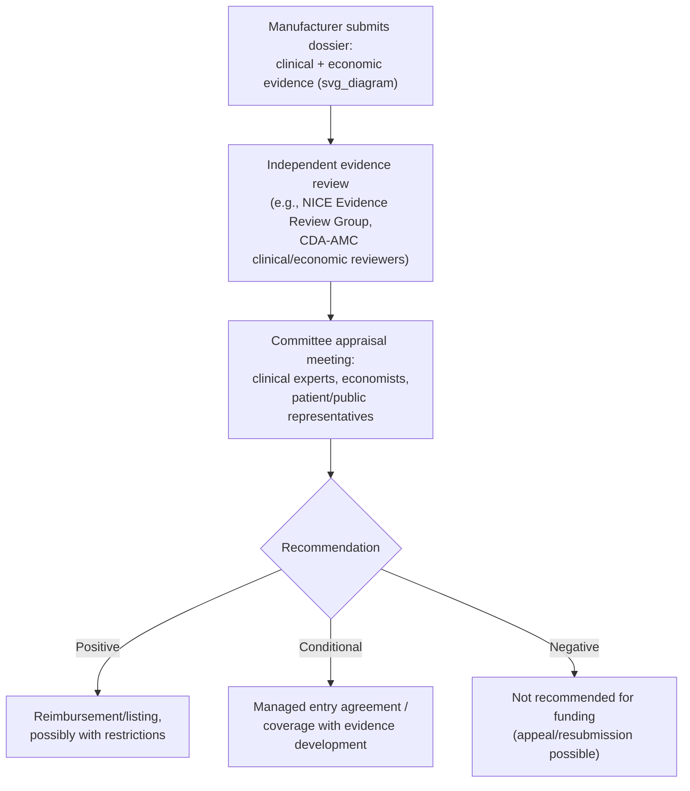

## Health Technology Assessment Agencies and Their Role

### Definition and Function

Health technology assessment (HTA) agencies are formal bodies — governmental, quasi-governmental, or independent nonprofit — that systematically evaluate the clinical effectiveness, safety, and economic value of health technologies (drugs, devices, diagnostics, procedures) to inform decisions about public or insurer funding, pricing, and clinical guidance. HTA is distinct from, and generally occurs after, regulatory approval: a regulator (e.g., the FDA, the European Medicines Agency (EMA), or the UK's Medicines and Healthcare products Regulatory Agency (MHRA)) determines whether a technology is safe and effective enough to be marketed at all, while HTA determines whether a health system should pay for it, at what price, and for which patient populations — meaning a technology can be fully approved by a regulator and still receive a negative HTA recommendation on cost-effectiveness or comparative-value grounds.

### Core Functions of HTA Agencies

**Key Points**

- **Evidence synthesis and appraisal**: Reviewing manufacturer-submitted clinical trial data, conducting or commissioning systematic reviews and meta-analyses, and critically appraising the quality and applicability of the evidence base.
- **Economic evaluation and re-analysis**: Assessing manufacturer-submitted cost-effectiveness models (often via an independent academic or contracted evidence review group) and frequently re-running or adjusting the model with alternative assumptions before reaching a final recommendation.
- **Recommendation issuance**: Publishing a formal recommendation — typically framed as "recommend for reimbursement," "recommend with restrictions/conditions," or "do not recommend" — that is binding, strongly influential, or advisory depending on the health system's legal and administrative structure.
- **Price negotiation support**: In many systems, HTA recommendations directly feed into, or are a precondition for, price or reimbursement-rate negotiations between the payer/government and the manufacturer.
- **Ongoing/managed evidence generation**: Establishing conditions for time-limited or conditional approval (e.g., managed entry agreements, coverage with evidence development) requiring manufacturers to collect additional real-world or trial data before a final recommendation is confirmed.

### Major HTA Agencies by Jurisdiction

| Agency | Country/Region | Legal Status | Binding Nature |
| --- | --- | --- | --- |
| NICE (National Institute for Health and Care Excellence) | England (and, for some functions, Wales) | Non-departmental public body | Recommendations are generally mandatory for NHS funding within England once issued |
| CDA-AMC (Canada's Drug Agency, formerly CADTH) | Canada | Independent, government-funded agency | Advisory to federal/provincial/territorial drug plans, which retain final funding authority |
| PBAC (Pharmaceutical Benefits Advisory Committee) | Australia | Statutory advisory committee | Positive PBAC recommendation is a legal precondition for listing on the Pharmaceutical Benefits Scheme (PBS) |
| ICER (Institute for Clinical and Economic Review) | United States | Independent nonprofit | Non-binding; influences payer and PBM formulary decisions but has no statutory authority, reflecting the absence of a single national statutory HTA body in the U.S. |
| IQWiG (Institute for Quality and Efficiency in Health Care) | Germany | Independent scientific institute | Advises the Federal Joint Committee (G-BA), which makes binding decisions |
| HAS (Haute Autorité de Santé) | France | Independent public authority | Assessments feed into binding pricing/reimbursement decisions made jointly with other bodies |
| ZIN (Zorginstituut Nederland / National Health Care Institute) | Netherlands | Government agency | Advisory to the Ministry of Health, generally highly influential |
| SMC (Scottish Medicines Consortium) | Scotland | NHS Scotland advisory body | Advisory but generally determinative for NHS Scotland formulary decisions |
| PMDA / Chuikyo | Japan | Regulatory (PMDA) and advisory pricing body (Chuikyo) | Feeds into statutory drug pricing rules |

PBAC (Australia), CDA-AMC (Canada), NICE (England), IQWiG (Germany), and ZIN (the Netherlands) are frequently identified as internationally influential agencies that act as catalysts for broader HTA methodological reforms. [Cambridge Core](https://www.cambridge.org/core/journals/international-journal-of-technology-assessment-in-health-care/article/navigating-change-a-comparative-analysis-of-health-technology-assessment-reforms-across-agencies-processes-drivers-and-interdependencies/9268F4BCAEC02C6172E54E4F1BE38AAF)

### The HTA Process: Generalized Workflow

**Key Points**

While specific procedures differ by agency, most HTA processes follow a broadly similar structural sequence:

1. **Submission**: Manufacturer prepares and submits a dossier including clinical trial evidence, a cost-effectiveness model, and often a budget impact analysis, following the agency's specific methods and reporting template.
2. **Independent review**: An external or in-house evidence review group critically appraises the submitted clinical and economic evidence, frequently identifying methodological weaknesses, alternative assumptions, or missing comparators, and may produce an independently re-run version of the economic model.
3. **Committee appraisal**: A multidisciplinary committee (typically including clinicians, health economists, statisticians, and often patient or public representatives) reviews the evidence and independent critique, and deliberates on a recommendation, weighing the ICER against a cost-effectiveness threshold alongside other decision-modifying factors.
4. **Recommendation and publication**: A formal recommendation and supporting public report are issued, which in many systems can be appealed or is subject to a further consultation period before finalization.
5. **Post-decision evidence generation** (where applicable): For technologies approved conditionally, ongoing data collection requirements are specified, with a defined review point at which the conditional decision is reconfirmed, revised, or withdrawn.

### Decision-Modifying Factors Beyond the ICER

**Key Points**

Most HTA agencies do not apply the cost-effectiveness threshold mechanically; several agencies incorporate explicit or de facto modifiers to the standard ICER-threshold comparison:

- **Disease severity weighting**: Some agencies (e.g., NICE's "severity modifier," introduced to replace the earlier "end-of-life" criterion) apply a higher acceptable cost-effectiveness threshold for treatments addressing more severe conditions, reflecting a societal preference to weight health gains for the more severely ill more heavily.
- **Rarity/orphan status**: Agencies frequently apply higher effective thresholds or separate evaluation pathways for treatments of rare diseases, in recognition of the inherently smaller evidence base and higher per-patient cost structure typical of orphan drugs.
- **Innovation and unmet need**: Some frameworks give qualitative weight to the degree of unmet medical need or the novelty of a treatment mechanism, beyond what is captured in the quantitative ICER alone.
- **Equity considerations**: A small but growing number of agencies have explored or piloted distributional cost-effectiveness analysis approaches to formally weigh equity impacts alongside aggregate cost-effectiveness.
- **Budget impact**: Even a technology deemed cost-effective at the margin may face additional scrutiny, delayed implementation, or price negotiation pressure if its aggregate budget impact on the payer is very large, since affordability and cost-effectiveness are related but distinct considerations.

### Cross-National Variation in Outcomes

**Key Points**

Empirical comparisons of HTA agency recommendations for the same technologies show substantial cross-national variation in outcomes, reflecting differences in methodology, threshold conventions, and decision-modifying criteria. One comparative study of oncology reimbursement dossiers found that 94% of NICE recommendations were positive, compared with 78% for CADTH and 53% for PBAC, over the period studied. Such differences illustrate that even when agencies review substantially similar underlying clinical and economic evidence, differing thresholds, risk tolerance, and procedural conventions can produce materially different funding outcomes for the same technology across jurisdictions. [Unverified: these specific percentages reflect one study's dataset and time period (oncology submissions, 2019–2020) and should not be generalized as a fixed or current cross-agency comparison, since positive-recommendation rates shift over time and vary by therapeutic area.] [MDPI](https://www.mdpi.com/1718-7729/29/10/602)

### Time-Limited and Conditional Recommendations

**Key Points**

Many international HTA agencies — including NICE (England), the Scottish Medicines Consortium, France's Haute Autorité de Santé, the Netherlands' Zorginstituut Nederland, Italy's AIFA, Belgium's NIHDI, and Australia's PBAC — have implemented formal processes for time-limited recommendations, operationalized through managed entry agreements, special access funds, or comparable programs. Agencies differ substantially in which medicines are eligible for such processes, which types of agreements are used, how the evidence needed to resolve uncertainty is collected, which stakeholders are involved in assessing and reassessing therapies during the time-limited period, how long that period lasts, and whether its terms are applied consistently or negotiated case-by-case. By contrast, formal time-limited-recommendation processes were not identified in publicly available information for Canada's CADTH or INESSS, or for the U.S.'s ICER or AHRQ. [Overview of Health Technology Assessment Processes for Time-Limited Recommendations - NCBI Bookshelf +2](https://www.ncbi.nlm.nih.gov/books/NBK594388/)

### Confidentiality and Transparency Practices

**Key Points**

CDA-AMC (Canada's drug and health technology agency), in collaboration with ICER in the U.S. and NICE in England, jointly issued a position statement on the confidentiality of clinical evidence informing HTA decision-making. The statement describes how these three HTA bodies are changing their handling of certain confidential clinical evidence submitted through their review processes, aiming to streamline procedures while increasing transparency. This reflects a broader, ongoing tension in HTA practice between protecting commercially confidential information (such as confidential discounted prices or unpublished trial data) and ensuring the transparency of the evidence base underlying public funding decisions — an area of active methodological and policy development across multiple agencies. [Inference: specific confidentiality practices are subject to periodic revision and may have changed since this position statement's publication; current agency-specific policy should be checked for up-to-date rules.] [CDA-AMC](https://www.cda-amc.ca/news/cadth-icer-and-nice-release-joint-position-statement-redacting-clinical-data-awaiting)[CDA-AMC](https://www.cda-amc.ca/news/cadth-icer-and-nice-release-joint-position-statement-redacting-clinical-data-awaiting)

### The Special Case of the United States

**Key Points**

- The Institute for Clinical and Economic Review (ICER) is a U.S. nonprofit that performs health technology assessment-style evaluation but operates in a market that otherwise lacks a single statutory HTA body. [CASRAI](https://casrai.org/dictionary/term/health-technology-assessment)
- Unlike NICE, CDA-AMC, or PBAC, ICER's assessments carry no legal or binding authority; instead, they function as an independent input that influences payer coverage policy, pharmacy benefit manager (PBM) formulary placement, and public/media discourse on drug pricing.
- The Agency for Healthcare Research and Quality (AHRQ) also conducts comparative effectiveness research relevant to HTA-style questions in the U.S., though, similarly, without binding reimbursement authority.
- The Centers for Medicare & Medicaid Services (CMS) makes coverage determinations (National Coverage Determinations and Local Coverage Determinations) that function in some respects analogously to HTA decisions in other countries, though CMS's process is procedurally and legally distinct from a dedicated HTA agency's appraisal process.
- This institutional fragmentation is frequently cited as a key structural difference between U.S. drug pricing/coverage policy and the more centralized HTA-driven systems used in the UK, Canada, Australia, and much of Western Europe.

### Terminology Note: HTA vs. ICER (Institute) vs. ICER (Ratio)

**Key Points**

A specific appraisal process, such as NICE's multiple technology appraisal involving evidence review groups and an appraisal committee, is one instance of HTA rather than a synonym for the discipline as a whole. Separately, the acronym "ICER" refers both to the Institute for Clinical and Economic Review (a specific U.S. nonprofit organization performing HTA) and, unrelatedly, to the incremental cost-effectiveness ratio (a numeric output of cost-effectiveness analysis) — a naming collision that requires care in both academic writing and cross-agency comparative discussion to avoid ambiguity. [CASRAI](https://casrai.org/dictionary/term/health-technology-assessment)[CASRAI](https://casrai.org/dictionary/term/health-technology-assessment)

### Reporting Standards Across Agencies

**Key Points**

Reporting of the underlying economic evaluation submitted to any HTA body is generally expected to follow the CHEERS 2022 checklist standard, regardless of which specific HTA agency ultimately receives the submission, providing a degree of methodological consistency in how evidence is reported even where agencies differ substantially in their appraisal processes, thresholds, and decision-modifying criteria. [CASRAI](https://casrai.org/dictionary/term/health-technology-assessment)

### Related Topics

- Cost-effectiveness analysis fundamentals and threshold conventions across agencies
- Managed entry agreements and coverage with evidence development
- Value of information analysis in supporting conditional recommendation decisions
- Distributional cost-effectiveness analysis and equity-weighted HTA
- Comparative regulatory approval frameworks (FDA, EMA, MHRA, PMDA)
- Pharmaceutical pricing negotiation mechanisms across HTA-linked systems
- CHEERS 2022 reporting standards for economic evaluations
- Real-world evidence and post-launch data collection requirements
- Budget impact analysis versus cost-effectiveness analysis in payer decision-making
- Cross-national drug launch sequencing and HTA-driven market access strategy