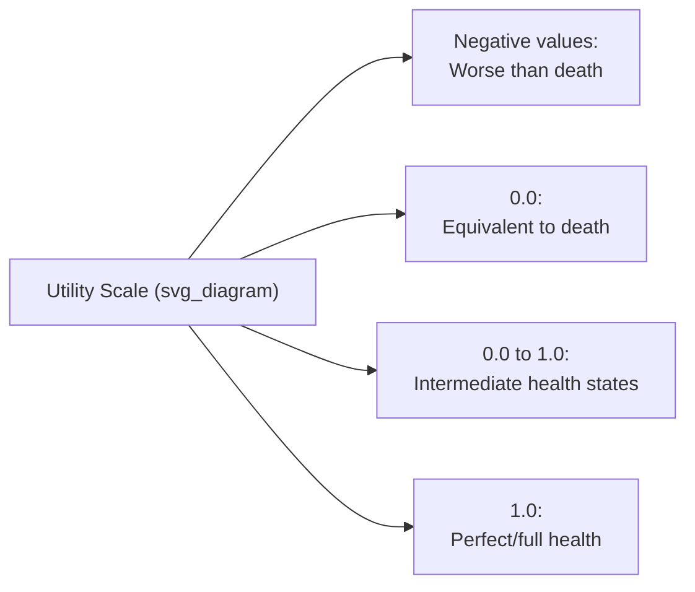

## Quality-Adjusted Life Years

### Definition and Purpose

The quality-adjusted life year (QALY) is a generic health outcome metric that combines the quantity of life (survival duration) and the quality of life (health-related utility) into a single composite index, enabling comparison of health benefits across fundamentally different diseases, interventions, and patient populations. One QALY represents one year of life lived in a state of perfect health; a year lived in a state of less-than-perfect health contributes proportionally less than a full QALY, and death contributes zero QALYs from that point forward. The QALY is the standard outcome metric underlying cost-utility analysis, a specific subtype of cost-effectiveness analysis (CEA), and is the outcome measure explicitly required or preferred by most major health technology assessment (HTA) agencies internationally, including NICE.

### Mathematical Formulation

**Key Points**

The QALY for an individual over a defined period is calculated as the sum, across each time interval, of the utility weight for the health state occupied during that interval multiplied by the duration of that interval:

$$QALY = \sum_{t} U_t \times L_t$$

Where $U_t$ is the utility weight (health-state value) at time $t$, conventionally anchored at 1.0 for perfect health and 0.0 for death, and $L_t$ is the duration (in years, or fractions thereof) spent in that health state. For continuous rather than discrete health-state transitions, this can be expressed as an integral:

$$QALY = \int_0^T U(t)\, dt$$

Where $U(t)$ is the utility value as a continuous function of time over the horizon $T$.

**Example**

A patient who lives 10 years following a treatment, spending the first 4 years in a health state with utility 0.8 and the remaining 6 years in a health state with utility 0.6, accumulates:

$$QALY = (0.8 \times 4) + (0.6 \times 6) = 3.2 + 3.6 = 6.8 \text{ QALYs}$$

This is fewer than the 10 QALYs that 10 years in perfect health would represent, reflecting the quality-of-life decrement experienced throughout the period.

### The Utility Scale

**Key Points**

- **1.0** represents a health state of perfect or full health.
- **0.0** represents a health state equivalent to death.
- Values between 0 and 1 represent health states of intermediate quality (e.g., a chronic condition causing pain or functional limitation).
- **Negative values** are permitted under several standard utility elicitation instruments and value sets, representing health states judged by respondents to be "worse than death" — states so severe that non-existence is preferred to living in them. The inclusion of negative values is a deliberate design feature of instruments such as certain EQ-5D value sets, not a calculation error, and reflects the elicitation methodology's capacity to capture genuinely aversive health states.

### Eliciting Utility Weights

**Key Points**

Utility weights can be derived through several standard methods, differing in cognitive demand, theoretical grounding, and practical feasibility:

1. **Standard gamble (SG)**: Considered the theoretically "gold standard" method, directly rooted in von Neumann-Morgenstern expected utility theory. Respondents are asked to choose between (a) living with certainty in a defined health state for the remainder of their life, or (b) a gamble with probability $p$ of achieving perfect health and probability $(1-p)$ of immediate death. The probability $p$ at which the respondent is indifferent between the certain outcome and the gamble is taken as the utility value of the health state. Standard gamble is cognitively demanding and less commonly used in large-scale population surveys due to the difficulty many respondents have reasoning about probabilistic gambles involving death.
2. **Time trade-off (TTO)**: Respondents are asked how many years of life in a defined impaired health state they would be willing to give up in exchange for a shorter lifespan in perfect health. If a respondent considers 10 years in an impaired state equivalent to 7 years in perfect health, the utility of the impaired state is calculated as $7/10 = 0.7$. TTO is more intuitive for respondents than standard gamble and is the most common method used to generate population-representative value sets for preference-based instruments such as the EQ-5D.
3. **Visual analog scale (VAS)** / rating scale: Respondents rate a health state on a scale (commonly 0 to 100, "worst imaginable health state" to "best imaginable health state"). VAS is simple to administer but does not directly incorporate risk or trade-off reasoning, and VAS scores typically require a transformation before being used as utility values in QALY calculations, since raw VAS ratings tend to differ systematically from TTO- or SG-derived values.
4. **Discrete choice experiments (DCE)**: Respondents repeatedly choose between pairs of hypothetical health-state profiles, and statistical modeling of the choice patterns is used to derive relative utility weights; increasingly used in the development of newer value sets due to lower respondent burden per task compared to TTO or SG.

### Preference-Based Multi-Attribute Utility Instruments

**Key Points**

Rather than eliciting a utility value for every possible individual health state directly (which would be infeasible given the vast number of possible combinations of symptoms and severity levels), most QALY calculations use a **preference-based multi-attribute utility instrument**: a standardized questionnaire that classifies a person's health into a defined health-state description, which is then mapped to a utility value using a pre-established **value set** derived from a population sample using one of the elicitation methods above.

| Instrument | Dimensions | Levels per Dimension | Notes |
| --- | --- | --- | --- |
| EQ-5D-3L | Mobility, self-care, usual activities, pain/discomfort, anxiety/depression | 3 (no problems, some problems, extreme problems) | Widely used; 243 possible health states |
| EQ-5D-5L | Same 5 dimensions as EQ-5D-3L | 5 (no problems to extreme problems) | Newer version with finer discrimination; 3,125 possible health states; increasingly preferred by agencies for greater sensitivity |
| SF-6D | Physical functioning, role limitations, social functioning, pain, mental health, vitality | 4–6 depending on dimension | Derived from the widely used SF-36/SF-12 quality-of-life survey |
| HUI3 (Health Utilities Index Mark 3) | Vision, hearing, speech, ambulation, dexterity, emotion, cognition, pain | 5–6 depending on dimension | Commonly used in Canadian HTA and pediatric populations |

The **EQ-5D** (developed and maintained by the EuroQol Group) is the instrument most widely required or preferred by HTA agencies internationally, including as the reference-case preferred measure in NICE's methods guide, due to its brevity, broad population-level value set availability across many countries, and extensive use in clinical trials.

### Value Sets and Country-Specific Weighting

**Key Points**

A **value set** is the specific mapping from a health-state description (e.g., a particular EQ-5D-5L response profile) to a utility number, derived empirically from a representative population sample in a given country using TTO, DCE, or a hybrid elicitation protocol. Because societal preferences regarding health states can differ across populations and cultures, and because elicitation methodology itself affects results, different countries maintain distinct value sets (e.g., a UK EQ-5D-5L value set differs numerically from a US or Japanese value set for the same health-state description), and HTA reference cases generally specify which country-specific value set should be used for submissions to that particular agency. [Inference: the degree and clinical significance of cross-country value-set divergence varies by health-state severity and specific instrument version, and is an active area of methodological research rather than a fully settled question.]

### Mapping (Cross-Walking) Algorithms

**Key Points**

When a clinical trial has collected quality-of-life data using a disease-specific instrument (e.g., an oncology-specific quality-of-life questionnaire) rather than a generic preference-based instrument like the EQ-5D, **mapping algorithms** (also called "cross-walking") are used to statistically predict what EQ-5D (or other utility instrument) responses would likely have been, based on the relationship between the two instruments established in datasets where both were administered to the same respondents. Mapping is a second-best approach relative to direct utility elicitation and introduces additional uncertainty into the resulting utility estimates, since it relies on the statistical relationship between instruments holding in the new population and disease context in which it is being applied.

### QALYs in Health Technology Assessment Decision-Making

**Key Points**

QALYs gained are the standard denominator of the incremental cost-effectiveness ratio (ICER) used in cost-utility analysis:

$$ICER = \frac{\Delta \text{Cost}}{\Delta \text{QALY}}$$

HTA agencies compare the resulting cost-per-QALY figure against a cost-effectiveness threshold to inform reimbursement recommendations (see cost-effectiveness analysis fundamentals and HTA agency roles). Because the QALY is a generic, condition-agnostic metric, it in principle enables comparison of the value of interventions across entirely different disease areas (e.g., comparing a cancer treatment's cost per QALY against a diabetes treatment's cost per QALY), which is a primary reason for its adoption as the standard HTA outcome metric — natural, disease-specific outcome units (e.g., "cases of disease X averted") do not permit this kind of cross-disease comparison.

### Critiques and Limitations

**Key Points**

- **Equal weighting of QALYs across recipients**: The standard QALY framework treats a QALY gained by any individual as equally valuable regardless of who receives it, a design feature intended to promote a form of distributive neutrality but criticized by some as failing to reflect genuine societal preferences, which some empirical work suggests may favor prioritizing certain groups (e.g., the severely ill, children, or those facing imminent death) more heavily than strict QALY-maximization would imply.
- **The "disability paradox" critique**: Because health-state utility for a person with a chronic disability may be assessed as permanently below 1.0 even when treatment on some other dimension succeeds, some critics argue standard QALY calculations can systematically undervalue treatments that primarily improve outcomes among people with pre-existing disabilities, since their maximum achievable utility ceiling is lower than that of an otherwise-healthy population. This is a genuinely contested methodological and ethical concern within the literature rather than a settled critique.
- **Aggregation and severity insensitivity**: A treatment producing small QALY gains spread across a very large population can, under simple QALY-maximization, outrank a treatment producing large QALY gains for a small population with severe disease, prompting some HTA agencies to introduce severity weighting or modifiers (see HTA agencies and their role) to adjust for this.
- **Elicitation method sensitivity**: Utility values for the same health state can differ measurably depending on which elicitation method (SG, TTO, VAS, DCE) and which population sample were used, introducing a source of variability into QALY-based comparisons that is sometimes underappreciated relative to the apparent numerical precision of a final utility value. [Inference: the practical materiality of this variability for a given HTA decision depends on how close the resulting ICER is to the relevant decision threshold.]
- **Alternative metrics proposed**: Critics have proposed alternative outcome metrics — including disability-adjusted life years (DALYs, more common in global health), healthy years equivalent (HYE), and various equity-weighted or severity-weighted QALY variants — though none has displaced the QALY as the dominant metric in mainstream HTA practice in jurisdictions such as the UK, Canada, and Australia.

### QALYs Versus Related Metrics

| Metric | Direction of Measurement | Typical Use Context |
| --- | --- | --- |
| QALY | Health gained (from a baseline of illness/death) | HTA in high-income countries (UK, Canada, Australia) |
| DALY | Health burden/loss (disability + premature mortality) | Global health, WHO burden-of-disease studies, LMIC HTA |
| HYE (Healthy Years Equivalent) | Health gained, theoretically more consistent with expected utility theory | Rarely used in practice due to elicitation complexity |
| Natural/clinical units | Disease-specific outcome (e.g., strokes averted) | Single-disease-area CEA where cross-disease comparability is not needed |

### Related Topics

- Cost-effectiveness analysis fundamentals and ICER calculation
- Disability-adjusted life years and global burden of disease methodology
- EQ-5D instrument versions and country-specific value sets
- Distributional cost-effectiveness analysis and equity-weighted QALYs
- Mapping/cross-walking algorithms between disease-specific and generic utility instruments
- Severity modifiers and decision-modifying factors in HTA appraisal
- Health technology assessment agencies and their role in reimbursement
- Standard gamble and time trade-off elicitation methodology in depth
- Cost-utility analysis as a subtype of cost-effectiveness analysis
- Patient-reported outcome measures (PROMs) and their relationship to utility instruments