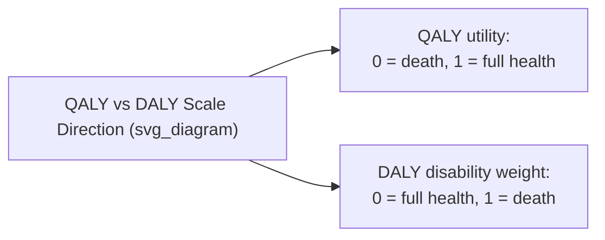

## Disability-Adjusted Life Years

### Definition and Purpose

The disability-adjusted life year (DALY) is a summary measure of population health that quantifies the overall burden of disease by combining years of life lost due to premature mortality with years lived in a state of less than full health due to disease or disability. Unlike the quality-adjusted life year (QALY), which measures health *gained* by an intervention relative to a baseline, the DALY measures health *lost* relative to an ideal of living to old age in full health — making it fundamentally a burden-of-disease metric rather than a health-gain metric, though it is also used in cost-effectiveness analysis (as "cost per DALY averted") in a manner directly analogous to "cost per QALY gained." The DALY was developed for the World Bank's 1993 World Development Report and has since become the primary metric of the Global Burden of Disease (GBD) study, a major ongoing collaborative epidemiological research program coordinated by the Institute for Health Metrics and Evaluation (IHME).

### Mathematical Formulation

**Key Points**

One DALY represents one lost year of healthy life. The DALY for a given disease or condition in a population is calculated as the sum of two components:

$$DALY = YLL + YLD$$

Where:

- $YLL$ = **Years of Life Lost** due to premature mortality
- $YLD$ = **Years Lived with Disability** (or non-fatal health loss)

### Years of Life Lost (YLL)

**Key Points**

YLL quantifies the mortality component of disease burden, calculated by comparing the age at death to a standard reference life expectancy:

$$YLL = N \times L$$

Where $N$ is the number of deaths from the cause in question and $L$ is the standard life expectancy at the age of death, drawn from a reference life table (the Global Burden of Disease study uses a single global standard life table — the theoretical maximum life expectancy observed across populations — rather than country-specific life tables, so that a death at a given age contributes the same YLL regardless of which country it occurred in, enabling consistent cross-national burden comparison).

**Example**

If a standard reference life table specifies a life expectancy of 70 additional years at age 10, then a death at age 10 from a preventable infectious disease contributes 70 YLLs, whereas a death at age 75 (where remaining reference life expectancy might be, e.g., 12 years) contributes only 12 YLLs — reflecting the much larger loss of potential life-years associated with premature death at a young age.

### Years Lived with Disability (YLD)

**Key Points**

YLD quantifies the non-fatal component of disease burden — the health loss experienced by people living with a disease or its sequelae, without dying from it (or before dying from it):

$$YLD = P \times DW$$

Where $P$ is the number of prevalent cases of the condition (or incident cases multiplied by average duration, depending on the specific GBD calculation approach used) and $DW$ is the **disability weight** — a value between 0 (equivalent to full health) and 1 (equivalent to death) representing the severity of health loss associated with that specific condition or sequela.

Disability weights are derived through large-scale population surveys (a major methodological input to successive iterations of the GBD study) using paired-comparison and other preference-elicitation methods, in which respondents compare hypothetical individuals with different described health conditions and indicate which they judge to represent worse health, with the resulting choice data statistically modeled to produce a disability weight for each of several hundred distinct health states or disease sequelae catalogued in the GBD framework.

### The Disability Weight Scale

**Key Points**

The DALY disability-weight scale is deliberately structured in the *opposite direction* from the QALY utility scale, which is an important and frequently confused distinction:

| Scale | 0 represents | 1 represents |
| --- | --- | --- |
| QALY utility weight | Death (or worse) | Perfect health |
| DALY disability weight | Full health | Death (or equivalent) |

This inversion means a QALY utility value of 0.7 and a DALY disability weight of 0.3 represent the *same* underlying health state severity, but expressed on oppositely oriented scales — a source of common confusion when comparing or converting between the two metrics.

### Assembling Total DALYs: A Worked Illustration

**Example**

Consider a hypothetical population-level disease burden calculation for a chronic respiratory condition:

- 500 premature deaths occur, at ages where the standard reference life table implies an average of 15 remaining life-years each: $YLL = 500 \times 15 = 7{,}500$
- 10,000 people live with the condition for an average of 8 years each, at a disability weight of 0.2 (moderate severity): $YLD = 10{,}000 \times 8 \times 0.2 = 16{,}000$

$$DALY = YLL + YLD = 7{,}500 + 16{,}000 = 23{,}500 \text{ DALYs}$$

This total represents the estimated combined burden of premature mortality and non-fatal disability attributable to the condition in that population over the period studied.

### Discounting and Age Weighting: Historical Practice

**Key Points**

Early formulations of the DALY (particularly the original 1990s Global Burden of Disease methodology) incorporated two additional adjustments that have since been substantially revised or removed in later GBD iterations:

- **Time discounting**: Applying a discount rate (commonly 3% annually in early formulations) to future years of life lost, on the rationale that health in the present is valued more highly than equivalent health in the future — directly analogous to cost/outcome discounting in CEA.
- **Age weighting**: Applying a non-uniform weighting function that valued a year of life lived at certain ages (typically young to middle adulthood) more highly than years lived in early childhood or old age, intended to reflect social role and productivity considerations.

Both discounting and age weighting proved methodologically and ethically controversial, and subsequent GBD study iterations (from approximately the 2010 GBD study onward) removed age weighting entirely and generally do not apply time discounting in standard DALY reporting, reflecting a shift toward valuing all years of healthy life lost equally regardless of the age at which they occur. [Unverified: exact discounting/age-weighting conventions have evolved across successive GBD study rounds, and researchers using or citing DALY figures should verify which specific methodological version and GBD study year the figures being referenced were calculated under, since this materially affects comparability across studies from different periods.]

### DALYs in Cost-Effectiveness Analysis

**Key Points**

Analogous to cost-per-QALY analysis, DALYs are used as the outcome denominator in **cost per DALY averted** analyses:

$$\text{Cost-effectiveness ratio} = \frac{\Delta \text{Cost}}{\text{DALYs averted}}$$

This framework is the dominant cost-effectiveness metric used by global health organizations, including the World Health Organization (WHO), and by health economic evaluations conducted in or for low- and middle-income countries (LMICs), where the DALY-based approach connects naturally to WHO-led global burden-of-disease data infrastructure and to historical WHO-CHOICE cost-effectiveness threshold guidance (e.g., historical rules of thumb expressing thresholds as multiples of per-capita GDP, though such simple GDP-multiple thresholds have themselves been increasingly critiqued and superseded by more context-specific opportunity-cost-based threshold approaches in more recent methodological guidance). [Inference: the degree to which any specific threshold convention remains current practice varies by institution and has been an area of active methodological revision; current guidance from the relevant funding or normative body should be checked.]

### DALY Versus QALY: Comparative Framework

| Feature | QALY | DALY |
| --- | --- | --- |
| Directionality | Health gained (from illness/death baseline) | Health lost (from full-health baseline) |
| Primary use context | HTA in high-income countries (UK, Canada, Australia) | Global burden of disease; global health economic evaluation; LMIC HTA |
| Weight scale | 0 (death) to 1 (full health); negative values possible | 0 (full health) to 1 (death) |
| Typical data source for weights | Preference-based instruments (EQ-5D, TTO, standard gamble) applied to specific patients/populations | Disability weights derived from large-scale general population paired-comparison surveys, applied to standardized disease sequelae |
| Age weighting (historical) | Not typically applied | Applied in early formulations; largely removed in modern GBD methodology |
| Governing institution | HTA agencies (NICE, CDA-AMC, PBAC methods guides) | Institute for Health Metrics and Evaluation (IHME); World Health Organization |

### Applications Beyond Individual Intervention Evaluation

**Key Points**

- **Global Burden of Disease study**: DALYs are the central metric of the ongoing GBD study, used to rank and compare the disease burden attributable to hundreds of distinct diseases, injuries, and risk factors across countries and over time, informing global health priority-setting, resource allocation, and research funding decisions at a population and policy level.
- **Risk factor attribution**: DALY methodology is extended to quantify the burden attributable to specific risk factors (e.g., tobacco use, air pollution, high blood pressure) via comparative risk assessment, estimating the DALYs that would be avoided if exposure to a given risk factor were reduced to a theoretical minimum level.
- **National and subnational health planning**: Governments and international development agencies use DALY-based burden-of-disease estimates to prioritize public health interventions and allocate health budgets, particularly in resource-constrained settings where DALY-based cost-effectiveness analysis provides a common metric for comparing very different types of interventions (e.g., vaccination programs versus infrastructure investments such as sanitation).

### Limitations and Critiques

**Key Points**

- **Reliance on a single global life table for YLL**: While methodologically consistent for cross-national comparison, using a single aspirational global reference life expectancy rather than country-specific life expectancy has been criticized as not reflecting the *realistically achievable* health gain within a specific country's current epidemiological and health-system context.
- **Disability weight elicitation source**: Disability weights are typically derived from general population survey respondents (who may not have direct experience of the health states being rated) rather than from patients actually living with the condition, and research has found some systematic differences between general-population and patient-derived valuations of the same health states — an active area of methodological debate analogous to similar debates in QALY utility elicitation.
- **Equity and distributive critiques**: Similar to QALY-based approaches, DALY-based prioritization can be criticized for not inherently capturing distributive or equity preferences (e.g., prioritizing the worst-off) unless explicitly modified to do so.
- **Comparability challenges with QALY-based HTA systems**: Because DALYs and QALYs are calculated using different underlying weight-elicitation populations, methodologies, and scale conventions, converting or directly comparing cost-per-DALY figures from global health literature with cost-per-QALY figures from high-income-country HTA systems requires caution and is not a straightforward numerical conversion. [Inference: while the two metrics are conceptually related as "inverse" framings of health-state value, treating them as directly interchangeable numbers without methodological adjustment is a recognized source of error in cross-literature comparison.]

### Related Topics

- Quality-adjusted life years and the utility scale (contrast with disability weights)
- Global Burden of Disease study methodology and the Institute for Health Metrics and Evaluation
- Cost-effectiveness analysis fundamentals and threshold conventions in global health
- WHO-CHOICE and cost-effectiveness thresholds in low- and middle-income countries
- Comparative risk assessment and risk-factor-attributable burden of disease
- Health technology assessment agencies and their role in high-income versus LMIC contexts
- Disability weight elicitation methodology (paired comparison surveys)
- Equity-weighted and distributional approaches to burden-of-disease metrics
- National health accounts and burden-of-disease-informed budget allocation
- Historical evolution of GBD methodology (age weighting and discounting practices)