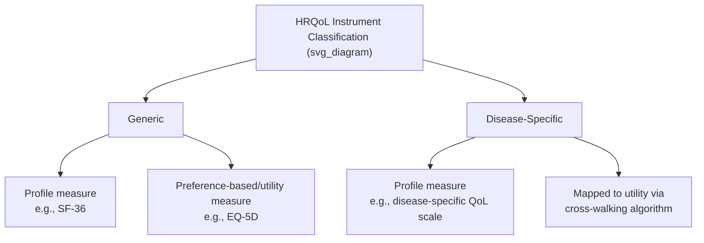

## Health-Related Quality of Life Instruments

### Definition and Purpose

Health-related quality of life (HRQoL) instruments are standardized measurement tools used to quantify a person's physical, mental, and social well-being as it relates to their health status. They serve two broadly distinct but related purposes in health economics and outcomes research: (1) **descriptive/discriminative measurement** — characterizing a patient's health status and tracking change over time or across treatment arms in a clinical trial, and (2) **utility/preference-based measurement** — generating a single index value (utility weight) suitable for QALY calculation in cost-utility analysis. Not all HRQoL instruments serve both purposes; the distinction between generic profile measures, disease-specific measures, and preference-based utility measures is central to selecting the appropriate instrument for a given research or evaluation context.

### Classification Framework

**Key Points**

HRQoL instruments are typically classified along two independent dimensions:

1. **Generic versus disease-specific**:
   - **Generic instruments** are designed to be applicable across any health condition or population, enabling comparison of health status across entirely different diseases (e.g., comparing quality of life in diabetes versus quality of life in depression).
   - **Disease-specific (or condition-specific) instruments** are designed to capture the particular symptoms, functional limitations, and concerns relevant to a specific condition (e.g., an asthma-specific or oncology-specific quality-of-life questionnaire), typically offering greater sensitivity to clinically meaningful change within that condition but no cross-disease comparability.
2. **Profile measures versus preference-based (utility) measures**:
   - **Profile measures** report scores across multiple separate dimensions or domains (e.g., physical functioning, mental health, social functioning) without combining them into a single index value.
   - **Preference-based (utility) measures** apply a population-derived value set to convert a health-state description into a single index number anchored to the QALY utility scale (0 = death, 1 = full health), making them directly usable for cost-utility analysis.

### Major Generic Preference-Based (Utility) Instruments

**Key Points**

**EQ-5D (EuroQol 5-Dimension)**: Developed and maintained by the EuroQol Research Foundation, the EQ-5D is the most widely used preference-based instrument internationally and the instrument most frequently specified or preferred in HTA reference cases (including NICE's methods guide). It assesses five dimensions — mobility, self-care, usual activities, pain/discomfort, and anxiety/depression — with two versions in common use:

- **EQ-5D-3L**: Three severity levels per dimension (no problems, some/moderate problems, extreme problems), yielding 243 distinct health states.
- **EQ-5D-5L**: Five severity levels per dimension, yielding 3,125 distinct health states, offering greater sensitivity to smaller changes in health status and increasingly favored over the 3L version by HTA agencies for its improved discriminative properties.

  Both versions include a visual analog scale (EQ VAS) component alongside the descriptive system, though the VAS score is typically reported separately from the descriptive-system-derived utility index.

**SF-6D**: Derived by applying a specific scoring algorithm to a subset of items from the widely used SF-36 (Short Form 36-item survey) or its shorter SF-12 variant, covering six dimensions (physical functioning, role limitations, social functioning, pain, mental health, vitality). Because it is derived from an already-established generic profile instrument, the SF-6D allows utility estimation in datasets where the SF-36/SF-12 was collected without a dedicated preference-based instrument.

**HUI (Health Utilities Index)**, particularly **HUI3**: Covers eight attributes (vision, hearing, speech, ambulation, dexterity, emotion, cognition, pain), each with five or six levels. HUI has been used extensively in Canadian health surveys and clinical research, and in some pediatric outcome studies where its attribute structure is considered well suited to childhood health conditions.

**AQoL (Assessment of Quality of Life)**: An Australian-developed multi-attribute utility instrument with several versions (AQoL-4D, AQoL-6D, AQoL-8D of increasing dimensionality), used particularly within Australian HTA contexts alongside or as an alternative to the EQ-5D.

**15D**: A 15-dimension generic health-related quality-of-life instrument developed in Finland, used more prominently within Nordic health economic evaluation contexts.

### Generic Profile (Non-Preference-Based) Instruments

**Key Points**

**SF-36 (Short Form 36-Item Health Survey)**: One of the most widely used generic HRQoL profile instruments internationally, covering eight domains grouped into physical and mental component summary scores (physical functioning, role-physical, bodily pain, general health, vitality, social functioning, role-emotional, mental health). Provides rich profile-level detail but does not directly yield a single utility index without conversion (e.g., via the SF-6D algorithm or a mapping approach).

**SF-12**: A shortened 12-item version of the SF-36, offering reduced respondent burden at some cost to precision, often used in large population surveys or settings where minimizing questionnaire length is a priority.

**WHOQOL (World Health Organization Quality of Life instrument)**: Developed collaboratively across multiple countries with the aim of achieving strong cross-cultural applicability, available in a full version (WHOQOL-100) and an abbreviated version (WHOQOL-BREF) covering physical, psychological, social, and environmental domains.

**Sickness Impact Profile (SIP)** and **Nottingham Health Profile (NHP)**: Earlier-generation generic profile instruments, less commonly used in current research than SF-36 or EQ-5D-family instruments but historically influential in the development of the field.

### Disease-Specific Instruments

**Key Points**

Disease-specific instruments are designed for greater responsiveness to condition-relevant clinical change than generic instruments typically provide, at the cost of cross-disease comparability. Representative examples across major therapeutic areas include:

| Therapeutic Area | Representative Disease-Specific Instrument(s) |
| --- | --- |
| Oncology | EORTC QLQ-C30 (core questionnaire with disease-specific modules); FACT-G (Functional Assessment of Cancer Therapy — General) and its disease-specific FACT modules |
| Respiratory | St. George's Respiratory Questionnaire (SGRQ); Asthma Quality of Life Questionnaire (AQLQ) |
| Cardiovascular | Minnesota Living with Heart Failure Questionnaire (MLHFQ); Kansas City Cardiomyopathy Questionnaire (KCCQ) |
| Diabetes | Diabetes Quality of Life measure (DQOL); Audit of Diabetes-Dependent Quality of Life (ADDQoL) |
| Rheumatology | Health Assessment Questionnaire (HAQ); Arthritis Impact Measurement Scales (AIMS) |
| Dermatology | Dermatology Life Quality Index (DLQI) |
| Mental health | Beck Depression Inventory (BDI, primarily a symptom-severity rather than quality-of-life measure per se); various condition-specific quality-of-life scales |

Because these instruments do not natively produce a QALY-compatible utility index, their scores must typically be either converted via a validated mapping (cross-walking) algorithm to a generic preference-based measure such as the EQ-5D, or supplemented by administering a generic preference-based instrument alongside the disease-specific one within the same clinical trial.

### Mapping (Cross-Walking) Between Instruments

**Key Points**

Mapping algorithms use statistical models (commonly ordinary least squares, response mapping/multinomial logistic regression, or more advanced Bayesian methods) fitted to datasets where both a disease-specific instrument and a generic preference-based instrument (typically the EQ-5D) were administered to the same respondents, to predict utility values for studies that collected only the disease-specific measure. Mapping is considered a second-best solution relative to directly collecting a preference-based instrument within the trial, since:

- It introduces additional statistical uncertainty beyond that of directly elicited utility values.
- The predictive relationship established in one dataset/population may not transfer accurately to a different population, disease severity distribution, or time period, a limitation sometimes referred to as extrapolation or "mapping validity" risk. [Inference: the degree of risk depends heavily on how similar the target population is to the population used to derive the original mapping algorithm, and should be assessed case by case rather than assumed acceptable by default.]
- HTA agencies (e.g., NICE) generally treat directly collected preference-based data as the reference-case preferred approach and regard mapped utility values as an acceptable but less preferred alternative when direct data are unavailable.

### Selecting an Instrument: Key Considerations

**Key Points**

- **Purpose of measurement**: If the primary need is a utility value for cost-utility analysis, a preference-based instrument (EQ-5D, SF-6D, HUI3) is required or strongly preferred; if the primary need is detailed clinical characterization of symptom burden, a disease-specific profile instrument may be more appropriate or used alongside a generic instrument.
- **HTA reference case requirements**: Many HTA agencies specify a preferred instrument (commonly the EQ-5D) and country-specific value set for economic submissions, making early instrument selection in trial design important for downstream reimbursement dossier compatibility.
- **Sensitivity to clinically meaningful change**: Disease-specific instruments are generally more responsive to condition-relevant changes over the course of treatment than generic instruments, which can sometimes fail to detect meaningful clinical improvement that does not map cleanly onto the generic instrument's broader dimensions — a common rationale for administering both types of instrument concurrently in trials.
- **Respondent burden and administration mode**: Instrument length, complexity, and required administration format (paper, electronic/ePRO, interviewer-administered) affect completion rates and data quality, particularly in longer-duration trials, elderly populations, or populations with cognitive impairment.
- **Population appropriateness**: Some instruments have pediatric-specific versions (e.g., EQ-5D-Y, a youth version of the EQ-5D; various pediatric-specific quality-of-life instruments), and instrument selection should reflect appropriate validation in the age group and clinical population being studied.

### Psychometric Properties Relevant to Instrument Evaluation

**Key Points**

When evaluating or selecting an HRQoL instrument, several standard psychometric properties are assessed:

- **Validity**: The degree to which the instrument measures what it purports to measure, assessed through construct validity (correlation with related and unrelated constructs as theoretically expected), content validity (appropriate coverage of relevant domains), and criterion validity (correlation with an accepted reference standard where one exists).
- **Reliability**: The consistency of the instrument's measurements, including internal consistency (e.g., Cronbach's alpha for multi-item scales) and test-retest reliability (consistency of scores when administered to a stable population at two time points).
- **Responsiveness (sensitivity to change)**: The instrument's ability to detect clinically meaningful change over time, often assessed via effect size or standardized response mean statistics comparing pre- and post-treatment scores in populations known to have changed clinically.
- **Minimal important difference (MID) / minimal clinically important difference (MCID)**: The smallest change in an instrument's score considered meaningful to patients or clinicians, used to interpret whether observed differences between treatment arms in a trial are not just statistically significant but also clinically relevant.

### Instruments in the Broader Outcomes Research Landscape

**Key Points**

HRQoL instruments sit within a broader category of **patient-reported outcome measures (PROMs)**, which also include instruments focused on specific symptom burden (e.g., pain scales), functional status, and patient-reported experience measures (PREMs) focused on the care experience rather than health status per se. Regulatory agencies, including the FDA (through its Patient-Focused Drug Development guidance series) and the EMA, have increasingly emphasized the incorporation of well-validated PROMs, including HRQoL instruments, into clinical trial endpoints and regulatory submissions, reflecting a broader shift toward incorporating the patient perspective directly into both regulatory and HTA decision-making processes. [Unverified: specific current regulatory guidance documents and their requirements are subject to periodic revision; current agency guidance should be consulted for up-to-date specifics.]

### Related Topics

- Quality-adjusted life years and utility elicitation methodology
- EQ-5D value sets and country-specific utility weighting
- Mapping/cross-walking algorithms between disease-specific and generic instruments
- Patient-reported outcome measures (PROMs) in regulatory and HTA submissions
- Minimal clinically important difference and interpreting trial outcome data
- Cost-utility analysis and its reliance on preference-based utility instruments
- Standard gamble, time trade-off, and discrete choice experiment elicitation methods
- Pediatric and population-specific HRQoL instrument variants
- Disability-adjusted life years and disability weight elicitation (contrast with QALY-based utility)
- Real-world evidence collection using electronic patient-reported outcomes (ePRO)