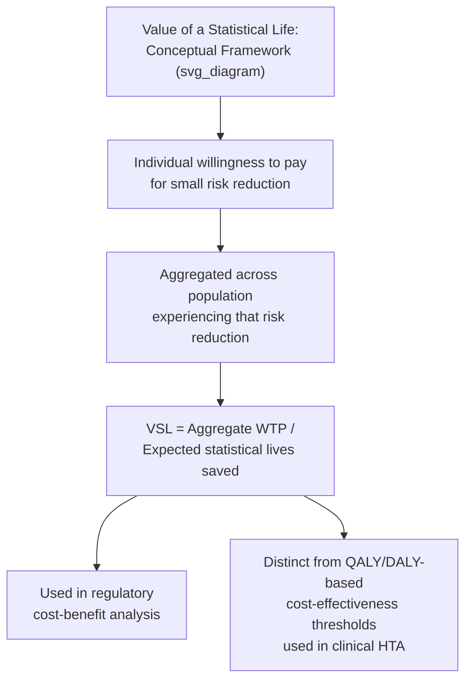

## Value of a Statistical Life

### Definition and Purpose

The value of a statistical life (VSL) is an economic measure representing the marginal rate of substitution between money and mortality risk — specifically, the aggregate amount a population is willing to pay to reduce the expected number of deaths in that population by one, given small individual-level risk reductions spread across many people. Critically, VSL does not represent the value of saving an identified, specific individual's life (a distinct and much larger quantity in most empirical and ethical framings, often referred to as the value of an identified life); rather, it is derived from how individuals value small changes in their own personal risk of death, aggregated across a population. VSL is the standard metric used in cost-benefit analysis (CBA) of health, safety, and environmental regulations, distinguishing it from the QALY/DALY-based cost-effectiveness analysis (CEA) framework more commonly used in pharmaceutical and clinical HTA contexts.

### Conceptual Foundation

**Key Points**

VSL is derived from the economic concept of **willingness to pay (WTP) for small risk reductions**, formalized as follows: if a group of $N$ individuals is each willing to pay $x$ dollars for a program that reduces each person's individual annual mortality risk by $\Delta p$, then the expected number of statistical lives saved in that population is $N \times \Delta p$, and the implied VSL is:

$$VSL = \frac{N \times x}{N \times \Delta p} = \frac{x}{\Delta p}$$

**Example**

If 100,000 people are each willing to pay $50 for a safety intervention that reduces each person's individual annual risk of death by 1 in 100,000 (0.00001), the total willingness to pay is $100{,}000 \times \$50 = \$5{,}000{,}000$, and the expected number of statistical lives saved is $100{,}000 \times 0.00001 = 1$. The implied VSL is therefore $\$5{,}000{,}000 / 1 = \$5{,}000{,}000$ — meaning the population's aggregate willingness to pay corresponds to $5 million per one statistical (not identified) life saved.

This framing distinguishes VSL sharply from any notion of "pricing an individual human life": no single person in the example paid $5 million, and no single specific person's death was averted with certainty; rather, a very small individual risk reduction was purchased by many people, and the VSL figure is the population aggregate implied by those small individual valuations.

### Theoretical Basis: Compensating Wage Differentials and Hedonic Pricing

**Key Points**

The dominant empirical approach to estimating VSL historically has been the **hedonic wage (compensating wage differential) method**, based on labor economics theory: workers in occupations with higher fatality risk should, in a competitive labor market with full information, demand a wage premium to compensate for that additional risk, all else equal. By statistically estimating the relationship between wages and occupational fatality risk (controlling for other wage determinants such as education, experience, industry, and union status), economists can back out an implied VSL from the estimated wage-risk trade-off:

$$VSL = \frac{\partial \text{Wage}}{\partial \text{Risk}}$$

Where the derivative represents the additional annual wage associated with a marginal increase in annual occupational fatality risk, estimated via regression analysis (typically a Mincer-style hedonic wage equation augmented with an occupational or industry fatality-risk variable).

### Alternative Estimation Methods

**Key Points**

Beyond hedonic wage studies, several other empirical approaches have been used to estimate VSL:

- **Stated preference / contingent valuation surveys**: Directly asking survey respondents about their willingness to pay for specified reductions in mortality risk, or their willingness to accept compensation for increased risk, using carefully designed hypothetical scenarios. This approach can be applied outside labor market contexts (e.g., valuing risk reductions from environmental or safety regulations affecting the general population, including non-working individuals) but is subject to well-documented critiques of stated-preference methodology generally, including hypothetical bias (respondents may not behave as stated when facing a real financial decision) and difficulty for many respondents in reasoning accurately about very small probability changes.
- **Revealed preference from consumer product/safety-equipment purchases**: Inferring implicit risk valuations from consumer choices involving trade-offs between cost and safety (e.g., purchase of safety equipment, choice between products with differing safety features), though such studies are less common as a primary VSL estimation method than labor market studies.
- **Behavioral/observational studies of risk-related decisions**: Examining decisions such as seatbelt use, smoking behavior, or residential location choices near environmental hazards, though these studies face substantial challenges in fully controlling for confounding factors and systematic differences in risk perception across individuals.

### VSL in Regulatory Cost-Benefit Analysis

**Key Points**

VSL is the standard input used by regulatory agencies to monetize the mortality-risk-reduction benefits of proposed regulations in formal cost-benefit analysis, particularly in the United States:

- The U.S. Environmental Protection Agency (EPA) and Department of Transportation (DOT), among other federal agencies, maintain and periodically update official VSL estimates used in regulatory impact analyses required under U.S. executive orders governing federal rulemaking.
- VSL estimates used by different U.S. federal agencies have historically varied somewhat from one another, reflecting differences in the underlying studies each agency has chosen to rely upon and differences in how each agency has updated older estimates for inflation and income growth over time. [Unverified: specific current dollar-value VSL figures used by any given agency are subject to periodic official revision; current agency guidance documents should be consulted for up-to-date figures rather than relying on a fixed number, since these are revised over time for inflation and evolving methodology.]
- VSL-based CBA is used to justify or evaluate regulations across domains including workplace safety (e.g., Occupational Safety and Health Administration standards), environmental air and water quality regulation, transportation and vehicle safety standards, and consumer product safety regulation.
- Regulatory VSL analysis is distinguished from healthcare-sector CEA (using QALYs/DALYs and a cost-effectiveness threshold) partly by disciplinary tradition (VSL work originates primarily from labor and environmental economics; QALY-based CEA originates primarily from health economics and clinical epidemiology) and partly by the type of decision being informed (broad societal regulatory cost-benefit trade-offs versus specific healthcare technology reimbursement decisions).

### Relationship Between VSL and Cost-Effectiveness Thresholds

**Key Points**

VSL and QALY-based cost-effectiveness thresholds are conceptually related but methodologically distinct approaches to valuing health and mortality-risk reduction, and economists have explored converting between the two frameworks:

$$\text{Implied value per QALY} \approx \frac{VSL}{\text{Remaining life expectancy in QALY terms}}$$

This conversion is approximate and contested, since it requires assumptions about the age distribution and remaining health-adjusted life expectancy of the population from which the VSL estimate was derived, and VSL studies (predominantly drawn from working-age populations in labor market studies) may not straightforwardly generalize to the age and health profile of patients affected by a given healthcare intervention. Some researchers and analysts have used VSL-derived implied values per QALY or per life-year as a complementary benchmark alongside, or as an alternative frame of reference to, conventional HTA cost-effectiveness thresholds, though this remains a methodologically debated area rather than a standardized cross-walk. [Inference: the degree of acceptance of VSL-to-QALY conversion as a valid or reliable technique varies substantially across the health economics literature and is not a settled methodological consensus.]

### VSL Versus Value of a Statistical Life-Year (VSLY)

**Key Points**

Because VSL estimates are typically derived from studies of working-age populations facing relatively small annual risk changes, and because a regulation's expected mortality-risk-reduction benefit may accrue differently across age groups with different remaining life expectancies, some analysts use the related concept of the **value of a statistical life-year (VSLY)**, dividing an aggregate VSL estimate by an assumed remaining life expectancy to derive an annualized per-life-year value, which can then be applied differently depending on the age distribution of the affected population. Using VSLY rather than a constant VSL implies that regulations primarily benefiting older populations (with fewer expected remaining life-years) would be assigned a smaller monetized benefit than equivalent regulations benefiting younger populations — a implication that has itself been a subject of methodological and ethical debate in regulatory economics, particularly regarding whether age-differentiated valuation of life-years is an appropriate or ethically acceptable practice in public policy analysis.

### Limitations and Critiques

**Key Points**

- **Heterogeneity across populations**: VSL estimates derived from working-age labor market studies may not appropriately represent the risk preferences or income constraints of children, retirees, or populations outside the paid labor force, raising questions about the appropriate VSL to apply when a regulation's benefits accrue disproportionately to a demographic group different from the one studied in the underlying labor market research.
- **Income and wealth effects**: Because VSL is derived from willingness to pay, which is inherently constrained by ability to pay, VSL estimates tend to be higher in higher-income populations and countries; applying a single VSL figure across different income contexts (e.g., in cross-national or international-development cost-benefit analysis) raises significant equity concerns and has prompted the development of income-adjustment approaches for transferring VSL estimates across countries. [Inference: the specific adjustment methodology used and its degree of acceptance varies by application context and institution.]
- **Sensitivity to study design and risk perception accuracy**: Hedonic wage estimates depend on workers accurately perceiving and responding to occupational fatality risk differences, an assumption that has been questioned in the labor economics literature, particularly regarding whether workers in high-risk, lower-education occupations have accurate information about relative risk levels across job alternatives.
- **Wide range of published estimates**: Published VSL estimates vary substantially across studies, methodologies, countries, and time periods, and meta-analyses of the VSL literature have found this variation to be a persistent challenge for selecting a single "correct" value for regulatory or evaluative use, contributing to ongoing methodological debate about appropriate VSL selection and standardization practices.
- **Ethical objections to monetizing mortality risk**: Some critics object on philosophical grounds to any approach that assigns a finite monetary value to mortality risk reduction, though this objection applies to cost-benefit analysis of health and safety regulation more broadly and is not unique to the VSL framework specifically.

### VSL Versus QALY-Based CEA: Comparative Framework

| Feature | Value of a Statistical Life (VSL) | QALY-based Cost-Effectiveness Analysis |
| --- | --- | --- |
| Disciplinary origin | Labor and environmental economics | Health economics, clinical epidemiology |
| Outcome unit | Monetary value per statistical life/risk reduction | Health-related quality-adjusted life-years |
| Primary application | Regulatory cost-benefit analysis (environmental, safety, transportation) | Healthcare technology reimbursement (HTA) |
| Typical estimation method | Hedonic wage studies, stated preference surveys | Utility elicitation (TTO, standard gamble) applied within CEA models |
| Age/population sensitivity | Estimated primarily from working-age populations; extension to other groups debated | Directly incorporates patient population's own or population-normed utility values |

### Related Topics

- Cost-effectiveness analysis fundamentals and cost-effectiveness thresholds
- Quality-adjusted life years and utility elicitation methodology
- Cost-benefit analysis versus cost-effectiveness analysis as evaluation frameworks
- Hedonic wage models and compensating wage differential theory in labor economics
- Regulatory impact analysis requirements for U.S. federal agencies
- Value of a statistical life-year (VSLY) and age-differentiated valuation debates
- International and cross-country VSL transfer and income-adjustment methodology
- Contingent valuation and stated preference survey methodology
- Environmental and occupational health economics applications of VSL
- Ethical debates in health economic valuation of mortality risk