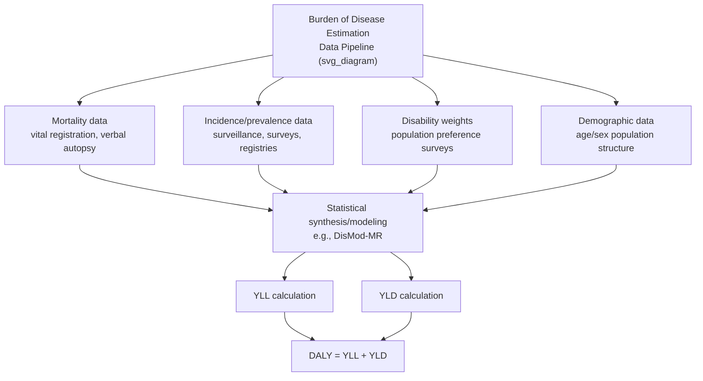

## Burden of Disease Measurement

### Definition and Purpose

Burden of disease measurement is the systematic quantification of the health loss a population experiences due to diseases, injuries, and risk factors, expressed through summary measures that combine mortality and morbidity into comparable metrics. Rather than examining prevalence or mortality figures for individual diseases in isolation, burden of disease frameworks aim to enable consistent comparison of the relative health impact of hundreds of different conditions and risk factors, both across diseases and across countries, over time, and among demographic subgroups — supporting evidence-based health policy prioritization, resource allocation, and research funding decisions at the population level.

### Historical Development

**Key Points**

Systematic burden of disease measurement emerged prominently with the **Global Burden of Disease (GBD) study**, first developed for the World Bank's 1993 World Development Report ("Investing in Health") as a collaboration between the World Bank, the World Health Organization (WHO), and Harvard University. The GBD study introduced the disability-adjusted life year (DALY) as its central summary metric and has since evolved into a large-scale, continuously updated international research collaboration coordinated by the Institute for Health Metrics and Evaluation (IHME) at the University of Washington, involving thousands of collaborators worldwide and producing periodically updated estimates covering hundreds of diseases, injuries, and risk factors across essentially all countries.

### Core Summary Measures of Population Health

**Key Points**

Several distinct summary measures have been developed to quantify burden of disease, differing in whether they measure health loss or health gain, and in their treatment of mortality versus morbidity:

| Measure | What It Captures | Direction |
| --- | --- | --- |
| DALY (Disability-Adjusted Life Year) | Years of life lost (YLL) + years lived with disability (YLD) | Health loss from an ideal |
| QALY (Quality-Adjusted Life Year) | Years of life weighted by health-related utility | Health gained (used in intervention evaluation, not typically population burden reporting) |
| HALE (Health-Adjusted Life Expectancy) | Expected years of life in full health, given current mortality and morbidity patterns | Positive health expectancy |
| YLL (Years of Life Lost) | Premature mortality component alone | Health loss (mortality only) |
| YLD (Years Lived with Disability) | Non-fatal health loss component alone | Health loss (morbidity only) |

The DALY is the dominant metric in modern global burden of disease reporting (see disability-adjusted life years for full methodological detail), while HALE serves as a complementary population-health-expectancy indicator often reported alongside DALY-based burden estimates, particularly in WHO reporting, as an intuitive parallel to standard life expectancy that additionally accounts for time spent in less-than-full health.

### Key Components of Burden of Disease Estimation

**Key Points**

Constructing burden of disease estimates for a given disease or population requires several distinct categories of epidemiological input data:

1. **Mortality data**: Cause-specific death counts and rates, typically drawn from vital registration systems where available, supplemented by verbal autopsy studies, sample registration systems, and statistical modeling in settings with incomplete death registration (a substantial methodological challenge in many low- and middle-income countries).
2. **Incidence and prevalence data**: The number of new cases (incidence) and existing cases (prevalence) of each disease or condition, drawn from disease surveillance systems, population health surveys, disease registries, and published epidemiological studies, often synthesized across multiple data sources using systematic review and meta-analytic or Bayesian statistical modeling techniques (e.g., DisMod-MR, a statistical tool developed specifically for GBD disease modeling to reconcile incidence, prevalence, remission, and mortality data that may be individually incomplete or inconsistent).
3. **Disability weights**: Standardized severity weightings for each disease sequela, derived from large-scale population survey data using paired-comparison and related preference-elicitation methods (see disability-adjusted life years for detail on disability weight derivation).
4. **Population and demographic data**: Age- and sex-structured population estimates for the relevant geography and time period, required to convert disease-specific rates into absolute burden estimates and to enable age-standardized comparisons across populations with different demographic structures.
5. **Reference life table**: A standard life expectancy table used to calculate years of life lost from premature death, generally a single global reference standard (reflecting the highest observed life expectancy across populations) rather than a country-specific life table, to enable consistent comparison of premature mortality burden across countries.

### Age Standardization

**Key Points**

Because disease burden is often strongly age-dependent, and because populations being compared (across countries, over time, or across subnational regions) frequently have very different underlying age structures, burden of disease studies commonly report **age-standardized rates** in addition to raw/crude counts and rates. Age standardization applies a common reference population age structure to each population being compared, removing the confounding effect of differing age distributions and allowing a cleaner comparison of underlying disease risk or health system performance rather than simply reflecting, for example, that one population happens to be older on average. Both direct and indirect standardization methods are used, following standard demographic and epidemiological standardization conventions.

### Comparative Risk Assessment and Risk Factor Attribution

**Key Points**

A major extension of burden of disease methodology is **comparative risk assessment**, which estimates the burden of disease attributable to specific modifiable risk factors (e.g., tobacco use, high blood pressure, air pollution, alcohol use, dietary risk factors, unsafe water and sanitation) rather than to specific diseases directly. This is calculated using the **population attributable fraction (PAF)** framework, estimating what fraction of a disease's burden would be eliminated if population exposure to the risk factor were reduced to a theoretical minimum risk exposure level (TMREL):

$$PAF = \frac{P_e \times (RR - 1)}{P_e \times (RR - 1) + 1}$$

Where $P_e$ is the proportion of the population exposed to the risk factor and $RR$ is the relative risk of the disease outcome associated with that exposure, compared to the unexposed (or minimum-risk) group. Risk-factor-attributable DALYs are then calculated by applying the PAF to the total disease burden, and the GBD study aggregates such estimates across many risk factors and diseases to rank risk factors by their total attributable burden across a population — informing public health prevention priorities distinctly from burden estimates organized by disease alone.

### Uses of Burden of Disease Data

**Key Points**

- **National and global health priority-setting**: Governments, international development agencies, and global health funders use burden of disease rankings to identify which diseases and risk factors contribute most to population health loss, informing budget allocation and program design decisions.
- **Health system performance monitoring**: Tracking changes in age-standardized burden of disease over time allows assessment of whether health system interventions, public health programs, or broader socioeconomic changes are reducing disease burden, and enables benchmarking against comparator countries or regions.
- **Input to cost-effectiveness analysis**: Burden of disease estimates, particularly DALY-based figures, feed directly into "cost per DALY averted" cost-effectiveness analyses used extensively in global health and development economics contexts (see disability-adjusted life years).
- **Research funding prioritization**: Research funders use burden of disease data alongside other criteria (tractability, existing research investment, potential for innovation) to guide allocation of research funding across disease areas.
- **Health equity and disparities monitoring**: Disaggregating burden of disease estimates by subnational region, socioeconomic status, sex, or other demographic characteristics allows identification of health disparities within a population that aggregate national figures would obscure.

### Data Quality Challenges

**Key Points**

- **Incomplete vital registration**: Many low- and middle-income countries lack complete civil registration and vital statistics (CRVS) systems, requiring burden of disease estimation to rely on modeled estimates, verbal autopsy studies (interviewing family members about symptoms preceding a death to statistically assign a probable cause), and sample-based surveillance systems rather than complete administrative death records, introducing additional uncertainty into mortality and cause-of-death estimates for these settings.
- **Diagnostic and coding variation**: Differences in diagnostic practices, disease classification systems (e.g., revisions to the International Classification of Diseases, ICD), and clinical coding accuracy across countries and over time can introduce inconsistency into raw incidence and mortality data before statistical adjustment.
- **Uncertainty intervals**: Because burden of disease estimates rely heavily on statistical modeling to reconcile and extrapolate from imperfect underlying data, major burden of disease studies including the GBD study report **uncertainty intervals** alongside point estimates for most quantities, reflecting the substantial data and modeling uncertainty inherent in estimating burden for settings and diseases with sparse underlying data; users of burden of disease figures should generally consider these uncertainty ranges rather than treating point estimates as precise. [Inference: the practical width and interpretation of these uncertainty intervals vary considerably by disease, geography, and time period, and are wider in settings and conditions with more limited underlying surveillance data.]
- **Double-counting and comorbidity**: Because many individuals experience multiple co-occurring health conditions simultaneously, methodological choices about how to combine YLD estimates across comorbid conditions (to avoid summing disability weights in a way that could imply disability greater than complete incapacitation) require specific statistical adjustment approaches (e.g., multiplicative combination formulas) within GBD methodology.

### International and Institutional Landscape

**Key Points**

- **Institute for Health Metrics and Evaluation (IHME)**: The primary institutional coordinator of the ongoing Global Burden of Disease study, based at the University of Washington, producing periodically updated comprehensive burden of disease estimates and associated data visualization tools.
- **World Health Organization (WHO)**: Produces its own complementary global health estimates and burden of disease-related statistics, sometimes using methodology that differs in some respects from IHME's GBD approach, and uses burden of disease data to inform its own global health strategy and priority-setting processes.
- **National statistical and health agencies**: Many countries maintain national burden of disease studies using GBD-consistent or locally adapted methodology to support domestic health policy, often disaggregating national GBD estimates to a finer subnational geographic or demographic level than the global study provides directly.

### Related Topics

- Disability-adjusted life years and detailed YLL/YLD calculation methodology
- Quality-adjusted life years as an intervention-level (versus population-level) health metric
- Cost-effectiveness analysis fundamentals and cost-per-DALY-averted frameworks
- Comparative risk assessment and population attributable fraction methodology
- Health-adjusted life expectancy (HALE) as a population health indicator
- Value of a statistical life and monetized approaches to mortality risk
- Health technology assessment agencies and their use of burden-of-disease evidence
- Vital registration systems and verbal autopsy methodology in low-resource settings
- Global health research funding prioritization frameworks
- Health equity and distributional analysis of disease burden