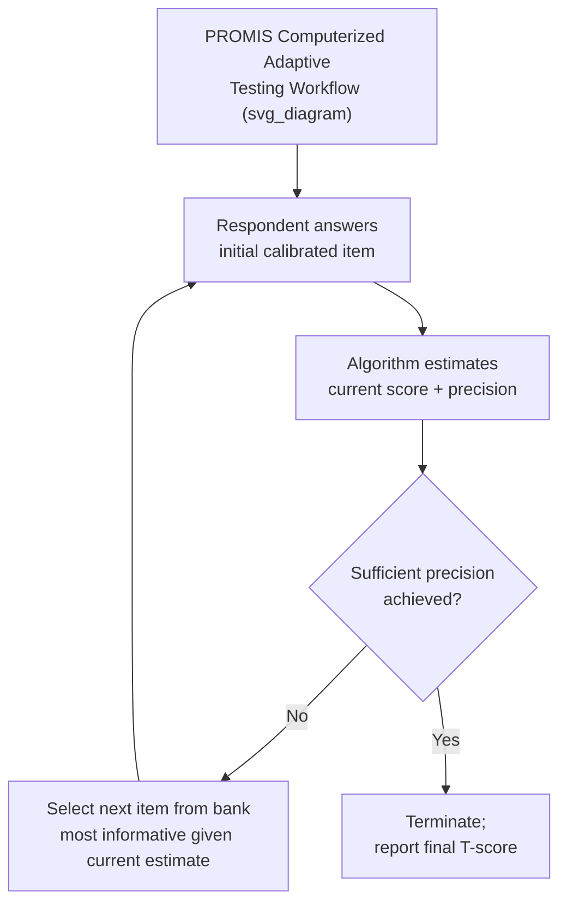

## Patient-Reported Outcome Measures

### Definition and Purpose

Patient-reported outcome measures (PROMs) are standardized, validated instruments that capture a patient's health status, symptoms, functioning, or quality of life directly from the patient's own perspective, without interpretation or modification by a clinician or other observer. The defining feature of a PROM is that the measurement originates from the patient's own report of their experience — distinguishing it from clinician-reported outcomes, observer-reported outcomes, or performance-based (objective/biomarker) outcome measures. PROMs are used across a range of applications in health economics, clinical research, and healthcare delivery, including clinical trial endpoints, health-related quality of life (HRQoL) assessment for cost-utility analysis, routine clinical care monitoring, and value-based payment program quality metrics.

### PROMs Within the Broader Outcome Measurement Taxonomy

**Key Points**

Regulatory and methodological literature (notably FDA guidance) distinguishes PROMs from three related but conceptually distinct categories of clinical outcome assessment:

| Assessment Type | Source of Report | Example |
| --- | --- | --- |
| Patient-reported outcome (PRO) | The patient directly | Pain intensity rating; quality-of-life questionnaire |
| Clinician-reported outcome (ClinRO) | A trained clinician's observation or judgment | Clinician-rated disease severity scale |
| Observer-reported outcome (ObsRO) | A non-clinician observer (e.g., parent, caregiver) reporting on someone unable to self-report | Parent-reported symptom scale for a young child |
| Performance outcome (PerfO) | A standardized task performed by the patient and measured by an assessor | Timed walk test; grip strength measurement |

PROMs are distinguished specifically by the absence of any clinical judgment or interpretation between the patient's experience and the recorded data point — the patient answers directly, and the instrument's scoring algorithm, not a clinician's interpretation, converts responses into a score.

### Categories of Patient-Reported Outcome Measures

**Key Points**

PROMs can be organized along several classification dimensions relevant to instrument selection:

1. **Generic versus disease-specific**: Generic PROMs (e.g., the SF-36, EQ-5D) apply across any health condition, enabling cross-disease comparison; disease-specific PROMs (e.g., the EORTC QLQ-C30 for oncology) capture condition-relevant symptoms and functional domains with greater sensitivity to clinically meaningful change within that condition. (See health-related quality of life instruments for detailed coverage of this distinction.)
2. **Single-item versus multi-item/multidimensional**: Some PROMs capture a single construct with one item (e.g., a numeric pain rating scale), while others assess multiple domains through a battery of items combined into domain scores or a composite index.
3. **Preference-based (utility) versus non-preference-based**: A subset of PROMs — specifically the preference-based multi-attribute utility instruments (EQ-5D, SF-6D, HUI3) — are designed so their scores can be converted into a utility index anchored to the QALY scale, making them directly usable in cost-utility analysis; most other PROMs report domain or symptom scores without this direct utility-scale mapping.
4. **Static versus computerized adaptive testing (CAT)**: Traditional PROMs use a fixed set of items administered to every respondent; newer item-response-theory-based instruments (notably the NIH's Patient-Reported Outcomes Measurement Information System, PROMIS) use computerized adaptive testing, dynamically selecting each subsequent question based on prior responses to achieve precise measurement with fewer total items administered to any individual respondent.

### The PROMIS Framework

**Key Points**

The **Patient-Reported Outcomes Measurement Information System (PROMIS)**, developed through a National Institutes of Health (NIH)-funded initiative, represents a methodologically distinct approach to PRO measurement built on item response theory (IRT) rather than classical test theory. Key features include:

- **Item banks**: Large pools of calibrated items for each measured domain (e.g., physical function, fatigue, pain interference, depression, anxiety), from which a subset can be administered depending on the assessment mode chosen.
- **Computerized adaptive testing (CAT)**: Software selects each subsequent item based on the respondent's prior answers, converging on a precise score estimate with substantially fewer items than a fixed-form questionnaire would require to achieve comparable measurement precision.
- **Fixed short forms**: Standardized fixed-length forms (e.g., 4-item, 6-item, 8-item short forms) drawn from the same calibrated item banks, providing a non-adaptive administration option when CAT infrastructure is unavailable.
- **T-score metric**: PROMIS domain scores are standardized to a T-score metric (mean of 50, standard deviation of 10) referenced to a general U.S. population sample, allowing consistent interpretation of scores as being above or below the population average regardless of which specific items or administration mode were used.

PROMIS instruments are increasingly incorporated into clinical research and, in some settings, routine clinical care, due to their modularity, precision, and reduced respondent burden compared to some legacy fixed-form instruments.

### PROM Development and Validation Process

**Key Points**

Developing a scientifically robust PROM follows a structured, iterative process, generally aligned with FDA and international regulatory guidance on patient-reported outcome instrument development for use as clinical trial endpoints:

1. **Conceptual framework development**: Defining the specific construct(s) to be measured and their theoretical relationship to one another, often informed by qualitative research (patient interviews, focus groups) to ensure the instrument captures concepts that matter to patients (**content validity**).
2. **Item generation and reduction**: Drafting candidate items based on the conceptual framework and qualitative input, then reducing the item pool through cognitive interviewing and statistical item-reduction techniques (e.g., item response theory analysis, factor analysis) to retain the most informative and non-redundant items.
3. **Psychometric validation**: Formal testing of the instrument's measurement properties in a representative sample, including:
   - **Reliability**: Internal consistency (e.g., Cronbach's alpha) and test-retest reliability in a stable population.
   - **Validity**: Construct validity (correlation with related/unrelated measures as theoretically expected), convergent and discriminant validity, and known-groups validity (ability to distinguish between groups expected to differ on the construct).
   - **Responsiveness**: Sensitivity to detect clinically meaningful change over time in populations known to have changed.
4. **Establishing interpretability benchmarks**: Determining the **minimal important difference (MID)** or **minimal clinically important difference (MCID)** — the smallest change in score considered meaningful to patients — through anchor-based methods (comparing score change to an external clinical or patient-reported anchor of meaningful change) and/or distribution-based methods (statistical approaches based on the instrument's measurement variability).
5. **Ongoing evaluation across new populations and modes of administration**: Instruments validated in one population, language, or administration mode (paper versus electronic) generally require additional validation work (including formal linguistic translation and cultural adaptation processes for use in new languages) before being assumed equivalent in a new context.

### Modes of Administration

**Key Points**

- **Paper-based**: Traditional administration mode, still used in some clinical and research settings, though subject to data entry burden and potential for missing or ambiguous responses.
- **Electronic PRO (ePRO)**: Administration via tablet, smartphone application, web portal, or dedicated electronic data capture device, increasingly preferred in clinical trials for its ability to timestamp responses, enforce complete item completion, reduce transcription error, and, in some cases, enable more frequent or real-time (ecological momentary assessment) data capture between clinic visits.
- **Interactive voice response (IVR)**: Telephone-based automated data collection, used in some settings, particularly for populations with limited access to internet-connected devices.
- Mode-of-administration equivalence (i.e., whether scores from paper and electronic versions of the same instrument are directly comparable) is a specific psychometric question that instrument developers and regulatory guidance address through dedicated equivalence testing rather than assuming automatic comparability across modes. [Inference: the degree of equivalence testing required or expected varies depending on the regulatory context and intended use of the PROM data, e.g., as a primary trial endpoint versus supportive/exploratory evidence.]

### Applications in Health Economics and HTA

**Key Points**

- **Cost-utility analysis inputs**: Preference-based PROMs (EQ-5D, SF-6D) collected during clinical trials provide the utility data used to calculate QALYs for cost-effectiveness analysis submitted to HTA agencies (see quality-adjusted life years).
- **Clinical trial endpoints**: PROMs are increasingly used as primary or secondary endpoints in regulatory submissions, particularly for conditions where subjective symptom burden (e.g., pain, fatigue, quality of life) is a primary concern that objective clinical measures do not fully capture; the FDA's Patient-Focused Drug Development guidance series has formalized expectations for incorporating the patient voice, including through validated PROMs, into drug development and regulatory review.
- **Value-based payment and quality measurement**: Some value-based healthcare payment models and quality reporting programs incorporate PROM data (sometimes referred to in this context as PROM-based performance measures) to assess the outcomes actually experienced by patients, complementing traditional process-of-care or clinical outcome quality metrics.
- **Routine clinical monitoring**: Some health systems have implemented routine PROM collection integrated into clinical workflows (sometimes linked to electronic health records) to support individual patient management and population-level outcome monitoring, an application area sometimes discussed under the broader term "patient-reported outcome measures in clinical practice" or "PROMs implementation."

### Distinguishing PROMs from PREMs

**Key Points**

PROMs are frequently discussed alongside, but should be distinguished from, **patient-reported experience measures (PREMs)**, which capture a patient's experience of the *process* of receiving care (e.g., communication quality, wait times, perceived respect and dignity during care) rather than their *health status* or *outcomes*. Both PROMs and PREMs originate directly from the patient, but they measure conceptually distinct constructs — health outcome versus care experience — and are generally used for different purposes: PROMs primarily inform clinical and economic outcome evaluation, while PREMs primarily inform care-quality and patient-satisfaction improvement initiatives.

### Data Quality and Analytical Challenges

**Key Points**

- **Missing data and non-response**: PROM data collection in clinical trials and routine practice is subject to missing data challenges (e.g., patients who discontinue treatment or drop out of a study may be systematically different from those who complete follow-up assessments), requiring careful statistical handling (e.g., multiple imputation, pattern-mixture models) to avoid biased conclusions, particularly when missingness may be related to the outcome being measured (informative or non-random missingness).
- **Response shift**: A phenomenon in which a patient's internal standard, values, or conceptualization of a construct (e.g., "quality of life") changes over the course of an illness or treatment, potentially confounding straightforward before-after score comparisons, since an apparent lack of change in score might mask an underlying recalibration of the patient's frame of reference rather than a genuine absence of clinical change. [Inference: the practical magnitude and clinical significance of response shift effects vary by condition, treatment context, and time horizon studied, and remain an area of ongoing methodological research rather than a fully resolved measurement problem.]
- **Ceiling and floor effects**: Some instruments may fail to adequately discriminate at the healthiest or most severely affected ends of the measured construct's range, limiting sensitivity to change in populations clustered near either extreme.
- **Cross-cultural and cross-linguistic comparability**: Translated versions of PROMs require formal linguistic validation (forward-backward translation, cognitive debriefing in the target population) to ensure conceptual equivalence, since direct literal translation does not guarantee that an item retains the same meaning or measurement properties across languages and cultures.

### Related Topics

- Health-related quality of life instruments and generic versus disease-specific measures
- Quality-adjusted life years and preference-based utility instrument scoring
- Minimal clinically important difference and interpretation of trial outcome data
- FDA Patient-Focused Drug Development guidance and PRO endpoint qualification
- PROMIS item banks and computerized adaptive testing methodology
- Electronic data capture and ePRO implementation in clinical trials
- Value-based payment models and PROM-based quality measurement
- Patient-reported experience measures (PREMs) and care-quality assessment
- Missing data methods for longitudinal patient-reported outcome collection
- Response shift and recalibration effects in longitudinal quality-of-life measurement