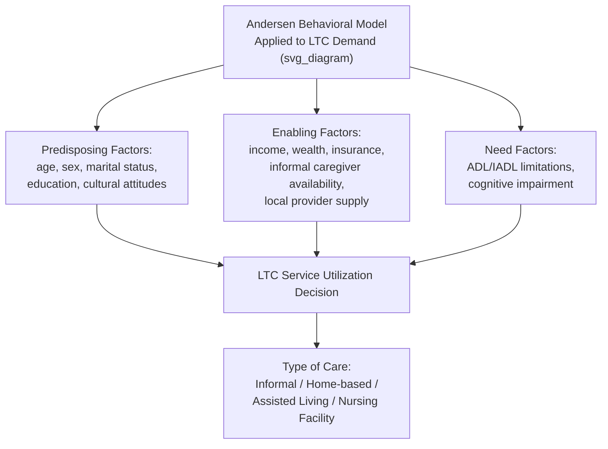

## Demand for Long-Term Care Services

### Definition and Scope

Long-term care (LTC) encompasses a range of medical and non-medical services provided to individuals who need ongoing assistance with activities of daily living (ADLs) or instrumental activities of daily living (IADLs) due to chronic illness, disability, or cognitive impairment, typically over an extended period rather than for acute recovery. Demand for LTC services spans a continuum of settings — home- and community-based care, assisted living, and skilled nursing facility care — and is shaped by demographic, health, economic, and family/social factors that together determine both whether an individual seeks formal LTC services and which type and intensity of care they use.

### Determinants of LTC Demand: The Andersen Behavioral Model Framework

**Key Points**

Health services research commonly applies the **Andersen Behavioral Model of Health Services Use** to LTC demand, organizing determinants into three categories:

1. **Predisposing factors**: Demographic and social-structural characteristics that influence propensity to use LTC services independent of current need, including age, sex, marital status, education, and cultural or family attitudes toward formal versus informal care.
2. **Enabling factors**: Resources that facilitate or constrain access to LTC services, including income, wealth, insurance coverage (private long-term care insurance, Medicaid eligibility), availability of informal caregivers (spouse, adult children), and local supply of LTC providers and facilities.
3. **Need factors**: The clinical basis for requiring care, most commonly operationalized through counts of ADL limitations (bathing, dressing, toileting, transferring, continence, eating) and IADL limitations (managing finances, medications, transportation, meal preparation, housekeeping), as well as cognitive impairment status (e.g., dementia diagnosis).

### The Economics of Informal Versus Formal Care

**Key Points**

A central feature of LTC demand economics is the choice between **informal care** (unpaid care provided by family members, typically a spouse or adult child) and **formal care** (paid services from home care agencies, adult day programs, assisted living, or nursing facilities). This choice is frequently modeled as a household production and time-allocation decision, in which:

- The **opportunity cost of the informal caregiver's time** (foregone wages, career progression, or leisure) is weighed against the market price of formal care substitutes.
- Adult children's labor force participation, geographic proximity to the care recipient, and number of siblings available to share caregiving responsibilities are consistently found in the literature to influence the informal-versus-formal care split.
- Formal and informal care are generally found to function as at least partial economic substitutes: increases in the price or reduced availability of formal care are associated with increased informal care provision, and vice versa, though the two are not perfect substitutes given the different nature and quality dimensions of care each provides.
- Some empirical work also identifies a complementary relationship in certain contexts — for example, informal caregivers coordinating and supplementing formal home care services rather than the two being pure substitutes — suggesting the substitution/complementarity relationship can depend on the specific care setting and intensity level involved. [Inference: the specific mix of substitution versus complementarity likely varies by country, care setting, and the specific type of formal service being considered, rather than following a single universal pattern.]

### Modeling the LTC Demand Decision

**Key Points**

A simplified reduced-form model of the probability of formal LTC service utilization can be expressed as a function of the determinants above:

$$P(\text{Formal LTC use}) = f(\text{ADL/IADL count}, \text{Cognitive status}, \text{Income}, \text{Insurance status}, \text{Informal caregiver availability}, \text{Local supply}, X)$$

Where $X$ represents additional demographic and geographic controls. Empirical estimation of such models typically uses discrete choice methods (logit or probit models for the binary formal-care decision, or multinomial/ordered models when distinguishing among multiple care-intensity categories), applied to longitudinal panel datasets that track individuals' health and care-utilization trajectories over time (e.g., in the U.S. context, the Health and Retirement Study, HRS, is a commonly used data source for this type of analysis).

### Demographic Drivers of Aggregate LTC Demand

**Key Points**

- **Population aging**: The most fundamental driver of growth in aggregate LTC demand is the rising share of the population in older age groups, particularly the "oldest old" (typically defined as age 85+), who have substantially higher rates of ADL/IADL limitation and cognitive impairment than younger elderly cohorts.
- **Rising life expectancy with morbidity implications**: Increases in life expectancy raise the number of years individuals may spend with chronic conditions and functional limitations, though the relationship between increased longevity and increased *disabled* years (versus increased *healthy* years) is debated in the literature under competing hypotheses — the "expansion of morbidity" hypothesis (longer life mostly adds years with disability) versus the "compression of morbidity" hypothesis (longer life is accompanied by disability onset being pushed to a smaller proportion of the lifespan near death) — with empirical evidence somewhat mixed across populations, time periods, and specific conditions studied.
- **Changing family structure**: Declining fertility rates, increased geographic dispersion of adult children, and rising female labor force participation (historically the primary source of informal caregiving) are cited in the literature as factors that may reduce the future supply of informal caregivers relative to the population needing care, potentially shifting demand toward formal LTC services over time. [Inference: the magnitude and timing of this shift depends on offsetting factors such as evolving cultural norms, immigration patterns affecting the paid caregiving workforce, and policy responses, making precise quantitative projections uncertain.]
- **Prevalence trends in dementia and cognitive impairment**: Because dementia is strongly associated with high-intensity LTC need (including a disproportionate share of nursing facility admissions), trends in age-specific dementia prevalence are a particularly influential driver of projected LTC demand, and there is some evidence in certain high-income countries of declining age-specific dementia incidence over recent decades, which if it continues could partially offset the demand-increasing effect of population aging. [Unverified: the consistency, causes, and likely persistence of any age-specific dementia incidence decline are actively debated in the epidemiological literature and vary across studies and populations.]

### Price Elasticity and Insurance Effects on LTC Demand

**Key Points**

- **Price sensitivity**: Empirical estimates generally find LTC service demand to be price-inelastic in the short run, particularly for higher-need populations for whom formal care is a near-necessity rather than a discretionary purchase, though price sensitivity is generally found to be somewhat higher for lower-acuity home-based services than for skilled nursing facility care.
- **Moral hazard from insurance coverage**: As with other health services, insurance coverage for LTC (whether through private long-term care insurance or public programs such as Medicaid in the U.S.) is associated with increased utilization relative to an uninsured counterfactual, consistent with standard health insurance moral hazard theory; this has been a persistent concern in the design of both private LTC insurance products and public LTC financing programs.
- **The "Medicaid spend-down" phenomenon (U.S. context)**: Because Medicaid in the U.S. serves as the dominant public payer for long-term nursing facility care but generally requires near-exhaustion of personal assets as an eligibility condition, a substantial share of LTC demand economics research examines how anticipated future LTC needs affect household saving, asset-transfer, and insurance-purchase behavior in the years preceding potential LTC need — a dynamic that has motivated policy interest in encouraging private LTC insurance uptake as a complement to public safety-net coverage. [Inference: specific eligibility rules, asset limits, and program names vary by state and are subject to periodic legislative change; current program rules should be verified against current government guidance rather than assumed static.]

### Private Long-Term Care Insurance Market Dynamics

**Key Points**

The private LTC insurance market has historically faced several well-documented structural challenges relevant to understanding demand-side behavior:

- **Adverse selection**: Individuals who anticipate higher future LTC needs (due to family history, existing health conditions, or private information about their own risk) are more likely to purchase LTC insurance, all else equal, which can raise premiums and further discourage lower-risk individuals from purchasing coverage — a dynamic consistent with standard insurance market adverse selection theory.
- **Low voluntary take-up**: Despite the significant financial risk LTC needs represent for many households, voluntary private LTC insurance uptake has historically remained relatively low in markets such as the U.S., a pattern that health economists have examined through several candidate explanations, including underestimation of personal LTC risk, reliance on the expectation of informal family care or public safety-net coverage (a form of implicit "crowding out" of private insurance demand by the anticipated availability of Medicaid), high and sometimes unpredictable premiums, and behavioral factors such as present bias in planning for low-probability, distant-future risks.
- **Insurer exit and market contraction**: A number of major insurers have exited the standalone LTC insurance market in various countries over past decades, citing difficulty accurately pricing long-duration LTC risk given uncertainty about future claims costs, interest rates, and lapse rates, which has itself further constrained the supply side of the private insurance market available to meet consumer demand. [Unverified: the current state and scale of the private LTC insurance market is subject to ongoing change and varies significantly by country; current market conditions should be checked against up-to-date sources rather than assumed from historical patterns alone.]

### International Variation in LTC System Structure and Demand-Shaping Policy

**Key Points**

LTC financing and delivery system structures vary substantially across countries, which in turn shapes how demand for formal LTC services is expressed and measured:

- Some countries (e.g., Germany, Japan, South Korea) operate dedicated **social long-term care insurance** systems, financed through mandatory contributions, which structure LTC demand as a social-insurance entitlement subject to formal needs-assessment eligibility criteria.
- Other countries (e.g., the United States) rely more heavily on a mixed system combining means-tested public coverage (Medicaid), limited private insurance uptake, substantial informal family caregiving, and out-of-pocket private payment, producing a demand pattern more directly shaped by household income, assets, and family caregiving capacity than in social-insurance-based systems.
- Cross-national comparative research on LTC demand and financing structure is used to inform policy debates about the relative merits of social-insurance, means-tested, and private-market-based approaches to organizing LTC systems, particularly as most high-income countries face similar demographic pressures from population aging.

### Related Topics

- Nursing home and assisted living market structure and pricing
- Long-term care insurance design and adverse selection
- Informal caregiving economics and opportunity cost of caregiver time
- Medicaid long-term care financing and eligibility rules (U.S. context)
- Cross-national comparative long-term care system design
- Dementia epidemiology trends and their effect on LTC demand projections
- Aging population demographics and health system capacity planning
- Home- and community-based service models as formal care alternatives
- Activities of daily living (ADL) and instrumental activities of daily living (IADL) assessment
- Compression versus expansion of morbidity hypotheses in aging populations