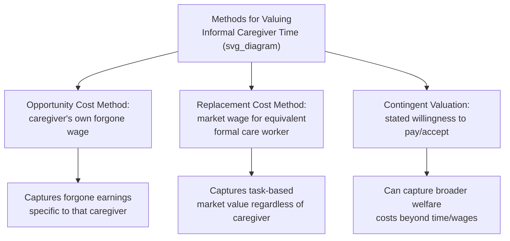

## Informal Caregiving and Opportunity Costs

### Definition and Scope

Informal caregiving refers to unpaid assistance provided to individuals with chronic illness, disability, or functional limitations by family members, friends, or other unpaid helpers, as distinguished from formal care provided by paid professionals or institutions. Informal caregivers — most commonly spouses, adult children (particularly daughters and daughters-in-law), and other relatives — constitute the largest single source of long-term care (LTC) provision in most countries, substantially exceeding the volume of care delivered through formal paid channels. The economic analysis of informal caregiving centers on quantifying its **opportunity cost**: the value of what caregivers forgo (wages, career advancement, leisure time, health, and personal financial security) in order to provide unpaid care, a cost that is real and substantial but does not appear in conventional market transactions or standard national accounting frameworks.

### Why Opportunity Cost Matters in Health Economics

**Key Points**

Because informal care is unpaid, it is frequently — and, from a health economics perspective, incorrectly — treated as a "free" resource in analyses that consider only formal, market-priced care costs. Excluding informal caregiving costs from an economic evaluation:

- Understates the true societal cost of a disease or health condition, since the caregiver's time and welfare loss represent a genuine resource cost even though no market transaction records it.
- Can distort cost-effectiveness comparisons between interventions that differ in how much informal caregiving burden they impose (e.g., a treatment that reduces disease severity and thus caregiver burden may appear less favorable if caregiver time costs are omitted from the analysis).
- Is a central reason health economists distinguish between the **healthcare payer perspective** (formal medical costs only) and the **societal perspective** (all costs regardless of who bears them, including informal caregiver time and lost productivity) in cost-effectiveness analysis, with many methodological guidelines recommending the societal perspective as more complete precisely because it captures costs like informal care that a narrower payer perspective would miss.

### Methods for Valuing Informal Caregiver Time

**Key Points**

Three principal methodological approaches are used in the health economics literature to monetize informal caregiver time, each with distinct theoretical grounding and practical limitations:

**1. Opportunity cost method**: Values caregiver time at the wage the caregiver would have earned in the labor market had they not been providing care, typically using the caregiver's own actual or imputed wage rate. For caregivers not in the labor force (e.g., retired individuals or those who have never worked), an imputed wage based on comparable demographic characteristics or a shadow wage rate is used.

$$\text{Opportunity Cost} = \text{Hours of Caregiving} \times \text{Caregiver's (actual or imputed) Wage Rate}$$

This method is grounded in standard labor economics theory (time not spent working is valued at the forgone wage) but has been criticized for potentially misvaluing caregiving provided by individuals who are not otherwise employed or who would not otherwise have used that time productively in a labor-market sense, and for producing systematically different valuations of identical caregiving tasks depending solely on the caregiver's own earning potential rather than the nature of the care provided.

**2. Replacement cost (market cost / proxy good) method**: Values caregiver time at the market wage rate that would be paid to a formal, paid worker performing an equivalent set of tasks (e.g., a home health aide's hourly wage), regardless of the caregiver's own actual earning potential.

$$\text{Replacement Cost} = \text{Hours of Caregiving} \times \text{Market Wage for Equivalent Formal Care Worker}$$

This method avoids the criticism that valuation should depend on the specific caregiver's own labor market characteristics, instead valuing the *task* rather than the *person* performing it, but requires a defensible mapping between the specific caregiving activities performed and an equivalent formal-care job category and wage rate, which can be methodologically contestable, particularly for more complex or medically technical caregiving tasks that may not have a precise formal-sector wage analog.

**3. Contingent valuation (stated preference) methods**: Directly elicits caregivers' or the general public's willingness to pay for a reduction in caregiving burden, or willingness to accept compensation for providing care, through survey-based stated-preference techniques. This approach can, in principle, capture the full welfare cost of caregiving (including psychological and emotional burden) beyond what either the opportunity cost or replacement cost methods capture, but is subject to the general methodological critiques of contingent valuation (hypothetical bias, sensitivity to survey design, and respondent difficulty in accurately reasoning about complex hypothetical trade-offs).

### Comparing the Valuation Methods

| Method | Basis of Valuation | Key Strength | Key Limitation |
| --- | --- | --- | --- |
| Opportunity cost | Caregiver's own (actual/imputed) wage | Grounded in standard economic theory of time allocation | Undervalues caregiving by non-employed individuals; values identical tasks differently by caregiver |
| Replacement cost | Market wage for equivalent formal care worker | Values the task consistently regardless of who performs it | Requires defensible formal-care wage analog; may not capture family-specific care quality |
| Contingent valuation | Stated willingness to pay/accept | Can capture broader welfare/psychological burden | Subject to hypothetical bias and survey design sensitivity |

Because these three methods can produce substantially different monetary estimates for the same underlying caregiving activity, cost-of-illness and cost-effectiveness studies that incorporate informal care costs typically specify which method was used and often present sensitivity analysis using more than one valuation approach, given the lack of a single universally agreed-upon "correct" method in the literature.

### The Time-Allocation and Labor Supply Framework

**Key Points**

Informal caregiving is commonly modeled within a household time-allocation framework, in which an individual divides a fixed total time endowment among paid work, informal caregiving, and leisure/other activities, subject to a budget constraint. Providing informal care is thus understood as displacing some combination of paid work hours and leisure time, with the specific mix depending on factors such as the caregiver's labor market attachment, the availability of flexible work arrangements, and the intensity and predictability of the care recipient's needs. Empirical labor economics research using this framework has generally found that:

- Providing intensive informal care is associated with reduced labor force participation, reduced hours worked among those who remain employed, and, in some studies, reduced hourly wages (potentially reflecting reduced experience accumulation, forgone promotions, or selection into more flexible but lower-paying jobs) among caregivers, particularly for higher-intensity caregiving roles.
- These labor market effects are found to differ by caregiver demographic characteristics, with the literature generally finding larger labor-supply effects for female caregivers than male caregivers, consistent with gendered patterns in the division of caregiving responsibility observed across many populations, though the size of this gap and its underlying causes remain active areas of research. [Inference: the magnitude of these effects varies across studies, populations, and time periods, and should not be treated as a fixed universal parameter.]
- Caregiving-related labor market withdrawal can also generate **long-term financial consequences** extending beyond the caregiving period itself, including reduced accumulated retirement savings and pension entitlements, which some analyses treat as a distinct and additional opportunity cost category beyond the immediate forgone wages during the caregiving period.

### Non-Financial Dimensions of Caregiver Burden

**Key Points**

While opportunity cost frameworks focus on the monetizable component of informal caregiving's economic impact, the broader caregiving literature documents substantial non-financial burden that is more difficult to monetize but is increasingly incorporated into health economic evaluation through complementary approaches:

- **Caregiver health effects**: Research has documented associations between intensive caregiving and elevated caregiver stress, and some studies have examined physical and mental health outcomes among caregivers, motivating the concept of caregiver **health-related quality of life (HRQoL) spillover effects** — the idea that a patient's illness and care needs affect not only the patient's own utility but also that of their informal caregiver(s), and that comprehensive cost-utility analysis should, in principle, capture caregiver QALY effects (sometimes termed "spillover QALYs") in addition to patient QALYs, though standard HTA reference cases vary in whether and how they require this to be incorporated. [Inference: methodological convention on including caregiver spillover effects in formal cost-utility analysis is still evolving and differs across HTA agencies and jurisdictions.]
- **Social and relational costs**: Reduced time for social activities, strain on family relationships, and reduced participation in other unpaid caregiving roles (e.g., grandparent childcare) represent further non-market costs generally not captured in standard opportunity-cost calculations.

### Informal Care in the Cost-of-Illness and Cost-Effectiveness Literature

**Key Points**

Cost-of-illness studies — which estimate the total economic burden of a disease across a population — routinely distinguish between **direct medical costs** (formal healthcare utilization), **direct non-medical costs** (e.g., transportation to appointments, home modifications), and **indirect costs**, within which informal caregiving time costs are typically classified alongside patient productivity losses (e.g., missed work due to illness). Because informal caregiving costs can represent a substantial share of a disease's total societal economic burden — particularly for chronic, long-duration conditions with high care-intensity needs such as dementia, severe disability, and pediatric chronic illness — omitting this cost category from a societal-perspective cost-effectiveness analysis can materially understate an intervention's true value, especially for treatments that primarily work by reducing patient dependency and associated caregiving burden rather than by extending survival.

### Policy Responses Addressing Informal Caregiver Opportunity Costs

**Key Points**

Several policy mechanisms across different countries attempt to partially offset or formally recognize informal caregivers' opportunity costs, reflecting explicit or implicit policy acknowledgment of the economic burden informal caregiving represents:

- **Caregiver cash benefit/allowance programs**: Some countries provide direct cash payments to informal caregivers (or to care recipients who may then compensate a family caregiver), varying substantially in eligibility criteria, payment level, and whether the payment is intended to fully or only partially offset opportunity costs.
- **Caregiver leave policies**: Job-protected leave provisions (analogous to family/medical leave for other purposes) allow caregivers to temporarily reduce or pause paid work without permanent job loss, mitigating but not eliminating the labor-market opportunity cost of intensive caregiving episodes.
- **Respite care programs**: Publicly or privately funded temporary formal care services intended to provide informal caregivers periodic relief, indirectly reducing the cumulative opportunity cost and health burden of sustained caregiving.
- **Tax credits and deductions**: Some tax systems provide credits or deductions related to caregiving expenses or caregiver status, though the value and eligibility criteria of such provisions vary substantially by country and are subject to periodic legislative change. [Unverified: specific current program names, eligibility rules, and payment levels vary by jurisdiction and change over time; current government sources should be consulted for up-to-date program details.]

### Related Topics

- Demand for long-term care services and the informal-versus-formal care substitution decision
- Cost-effectiveness analysis fundamentals and the societal versus payer perspective distinction
- Quality-adjusted life years and caregiver spillover effects in cost-utility analysis
- Cost-of-illness studies and direct/indirect cost classification
- Long-term care insurance design and its interaction with informal care supply
- Labor supply economics and household time-allocation models
- Dementia care economics and high-intensity caregiving burden
- Caregiver support policy: leave, respite care, and cash benefit program design
- Gender economics of unpaid care work
- Health-related quality of life instruments applied to caregiver populations