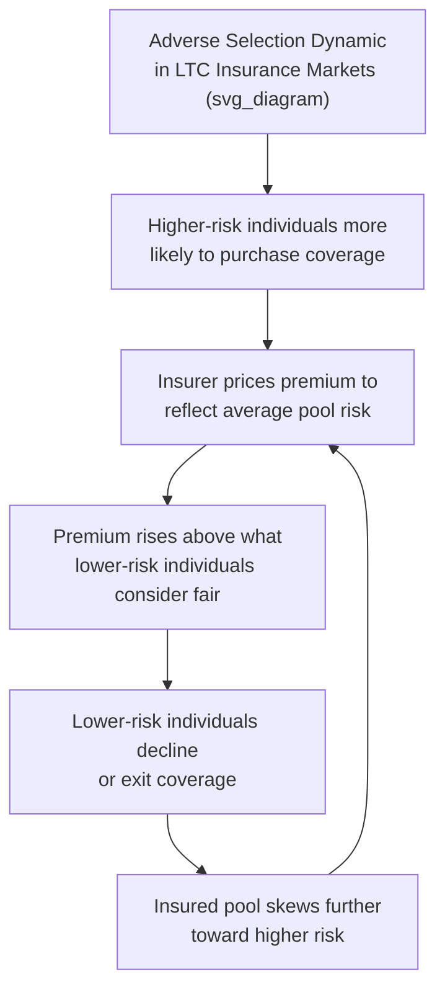

## Long-Term Care Insurance Market Failures

### Definition and Overview

Long-term care (LTC) insurance market failures refer to the persistent, well-documented structural problems in private LTC insurance markets that prevent them from functioning efficiently — resulting in low voluntary take-up, high and often unpredictable premiums, insurer exit, and, in aggregate, a substantially smaller private insurance market than the magnitude of LTC financial risk facing households would predict under standard insurance-demand theory. These market failures are a central topic in long-term care economics because they help explain why most countries rely heavily on public safety-net programs, informal family care, and out-of-pocket payment to finance LTC, rather than on private insurance markets functioning as the primary financing mechanism, in contrast to how private insurance operates in many other lines of risk (e.g., auto, homeowners, term life).

### The "LTC Insurance Puzzle"

**Key Points**

Health and insurance economists have long noted what is often termed the **long-term care insurance puzzle**: despite LTC representing a large, uncertain, and potentially catastrophic financial risk for many households (a nursing facility stay or extended home care need can cost a substantial fraction of a household's lifetime savings), voluntary private LTC insurance uptake has remained persistently low in markets such as the United States, well below what standard expected-utility-based insurance demand models would predict for a risk-averse household facing this magnitude of financial exposure. This puzzle has motivated a substantial body of research examining the specific market failure mechanisms and behavioral factors that might explain the gap between theoretically predicted and actually observed demand.

### Adverse Selection

**Key Points**

**Adverse selection** arises when individuals possess private information about their own risk of needing LTC that is not available to (or not fully priced by) the insurer, leading those who anticipate higher future LTC needs to be more likely to purchase coverage:

- Individuals with family history of conditions associated with high LTC need (e.g., dementia, certain chronic diseases), or with private knowledge of early symptoms or risk factors not yet formally diagnosed, may be more inclined to purchase LTC insurance than the average population, all else equal.
- If insurers cannot fully distinguish higher-risk from lower-risk applicants (or can only partially do so through underwriting), premiums must reflect the average risk of the insured pool, which — under adverse selection — is skewed toward higher-risk individuals, raising premiums above what a lower-risk individual would consider actuarially fair for their own risk level.
- This can produce a self-reinforcing dynamic (sometimes termed an "adverse selection death spiral" in the general insurance economics literature): as premiums rise to reflect a higher-risk pool, lower-risk individuals increasingly find coverage unattractive and exit or decline to purchase, further concentrating risk in the remaining insured pool and pushing premiums higher still.
- Empirical evidence on the magnitude of adverse selection specifically in LTC insurance markets has been mixed in the health economics literature, with some studies finding evidence consistent with adverse selection dynamics and others finding evidence more consistent with alternative explanations (such as risk-averse individuals with both higher risk and higher demand for insurance generally, a pattern sometimes called "propitious selection" that can partially offset standard adverse selection effects). [Inference: the balance of evidence on the precise magnitude and mechanism of selection effects in LTC insurance specifically remains an active empirical research question rather than fully settled.]

### Moral Hazard

**Key Points**

As with health insurance generally, LTC insurance coverage can create **moral hazard** — a tendency for insured individuals or their families to increase utilization of covered services relative to what they would use if paying the full cost out of pocket, since insurance reduces the marginal cost faced by the insured party at the point of service use. In the LTC context, this can manifest as:

- Choosing higher-intensity or higher-cost formal care settings (e.g., a nursing facility rather than home-based care) than would be chosen absent insurance coverage.
- Reduced reliance on informal family caregiving once formal paid care becomes more affordable at the margin due to insurance coverage, a dynamic sometimes discussed as insurance-induced "crowding out" of informal care supply.
- Insurers attempting to manage moral hazard through policy design features such as elimination periods (a waiting period before benefits begin, functioning similarly to a deductible), benefit caps, and requirements for formal needs assessment (e.g., documented inability to perform a specified number of ADLs) before benefits are triggered.

### Underestimation of Personal Risk and Behavioral Factors

**Key Points**

Beyond classical adverse selection and moral hazard, behavioral economics research has identified several psychological and cognitive factors that may help explain persistently low voluntary LTC insurance demand:

- **Underestimation of LTC risk**: Survey research has found that many individuals substantially underestimate their own lifetime probability of needing LTC services, potentially due to unfamiliarity with LTC risk statistics, optimism bias, or reliance on non-representative personal experience (e.g., not having witnessed extended LTC need among family members).
- **Present bias and procrastination**: LTC insurance is typically most affordably purchased well before the risk period (LTC insurance premiums rise steeply with age at purchase, and pre-existing conditions can render coverage unavailable), meaning the decision to purchase requires planning for a low-probability, temporally distant risk — a type of decision that behavioral economics research finds is systematically prone to procrastination and present-biased under-preparation relative to what a fully rational, exponentially-discounting model would predict.
- **Reliance on public safety-net expectations ("crowding out")**: Some research has examined whether the anticipated availability of means-tested public coverage (e.g., Medicaid in the U.S. context, which functions as a payer of last resort for LTC once household assets are substantially depleted) reduces households' perceived need for private LTC insurance — an implicit crowding-out effect analogous to crowding-out dynamics studied elsewhere in social insurance economics. Empirical findings on the magnitude of this specific crowding-out effect in LTC insurance markets have varied across studies. [Inference: the extent of this effect likely depends on household wealth level, since Medicaid's asset-based eligibility rules make it a more or less relevant fallback option depending on a household's asset position.]
- **Reliance on informal family care expectations**: Households that expect to receive substantial informal care from family members may rationally (or with some degree of overoptimism about future family caregiving availability and willingness) discount their perceived need for private LTC insurance.

### Pricing Uncertainty and Insurer-Side Market Failures

**Key Points**

LTC insurance also presents distinctive challenges on the **supply side** that have contributed to insurer exit and market contraction:

- **Long-duration, hard-to-predict risk**: LTC insurance policies typically involve a very long time horizon between premium collection (often decades before a claim) and eventual claim payment, requiring insurers to make long-range actuarial projections about future morbidity trends, interest rates (which affect the investment returns insurers earn on accumulated premiums), and policyholder lapse rates — all of which have historically proven difficult to project accurately over such long horizons.
- **Historical mispricing and subsequent premium increases**: A number of major LTC insurers in various markets have, at different points, been required to substantially raise premiums on existing (in-force) policies after finding that original pricing assumptions (particularly regarding lapse rates, which were often assumed higher than what was subsequently observed, and interest rate assumptions, which in some periods proved higher than subsequently realized low-interest-rate environments) had been inaccurate — creating significant financial strain for both insurers and policyholders facing unexpected premium increases on policies they had already held for years. [Unverified: the specific scale and timing of historical premium increases and insurer exits varies by company, country, and time period, and should be verified against current sources rather than treated as a single uniform industry-wide event.]
- **Regulatory and reserve requirements**: Insurance regulators in various jurisdictions impose reserve and solvency requirements intended to ensure insurers can meet long-term LTC insurance obligations, but the inherent difficulty of long-horizon actuarial projection for this product line has contributed to a number of insurers exiting the standalone LTC insurance market entirely over past decades, reducing the range of products and insurer choice available to consumers.

### Information Asymmetry and Product Complexity

**Key Points**

- **Complexity of policy terms**: LTC insurance policies often include complex features (elimination periods, benefit triggers based on specific ADL limitation thresholds, inflation protection riders, benefit period limits, and varying definitions of covered care settings) that can make it difficult for consumers to accurately compare products or fully understand what circumstances would and would not trigger benefit payment, a form of information asymmetry that can depress demand among consumers who find the product difficult to evaluate with confidence.
- **Difficulty forecasting one's own future care needs and preferences**: Even with full information about policy terms, consumers face genuine uncertainty about their own future health trajectory, family caregiving availability, and care setting preferences decades in advance, which is a more fundamental source of decision difficulty distinct from information asymmetry about the insurance product itself.

### Hybrid and Alternative Product Innovations

**Key Points**

In response to the standalone LTC insurance market's structural challenges, insurers in some markets have developed **hybrid products** that combine LTC benefits with other insurance types, most commonly life insurance policies with an LTC rider (allowing the policyholder's death benefit to be accessed early to pay for LTC expenses if needed, with any unused portion still paid as a death benefit) or annuities with LTC riders. These hybrid products are sometimes viewed as partially addressing certain LTC insurance market failures:

- They can mitigate a specific consumer objection to standalone LTC insurance — the risk of paying premiums for years and never using LTC benefits, receiving no return if the insured never needs LTC — since a hybrid product's death or annuity benefit provides value regardless of whether LTC is ever needed.
- They may also somewhat reduce adverse selection relative to standalone LTC products, since the underlying life insurance or annuity component may attract a broader range of buyers not specifically self-selected on LTC risk alone. [Inference: the degree to which hybrid products meaningfully reduce adverse selection versus standalone products, and their overall net effect on closing the broader LTC insurance protection gap at a market-wide level, remains a subject of ongoing analysis rather than an established consensus finding.]

### Policy Responses to LTC Insurance Market Failures

**Key Points**

Given the persistent private-market challenges described above, policymakers in various countries have pursued several distinct approaches:

- **Social (mandatory public) long-term care insurance**: Countries including Germany, Japan, and South Korea have established mandatory, contribution-financed public LTC insurance systems, effectively addressing adverse selection and low-uptake problems by making participation compulsory (removing the individual selection decision from the equation) and pooling risk at the national level.
- **Public-private partnership approaches**: Some jurisdictions have explored partnership models (e.g., "LTC partnership" programs in some U.S. states) that provide Medicaid asset-protection incentives to households that purchase qualifying private LTC insurance, intended to encourage private insurance uptake by improving its perceived value relative to a pure private-market baseline.
- **Tax incentives**: Various tax deduction or credit provisions for LTC insurance premiums have been implemented in some countries in an attempt to reduce the effective cost of coverage and encourage voluntary uptake, with mixed evidence in the literature regarding the effectiveness of such incentives at meaningfully expanding overall market participation. [Unverified: specific current program details, tax treatment, and their measured effectiveness vary by jurisdiction and are subject to legislative change; current sources should be consulted for up-to-date specifics.]
- **Public catastrophic LTC insurance proposals**: Some health policy researchers and policymakers have proposed public "back-end" catastrophic LTC insurance models (covering only very high-intensity or long-duration LTC need beyond a defined threshold, potentially reducing the risk pool problem the private market faces for indefinite-duration risk while leaving a defined role for private insurance or self-funding for shorter-duration or lower-intensity need), though the design, adoption, and specific policy status of such proposals vary by country and have evolved over time.

### Related Topics

- Demand for long-term care services and the Andersen behavioral model framework
- Informal caregiving and opportunity costs, including crowding-out dynamics with formal insurance
- Adverse selection and moral hazard in health insurance markets generally
- Medicaid long-term care financing and eligibility rules (U.S. context)
- Behavioral economics of insurance purchase decisions and present bias
- Social long-term care insurance systems: Germany, Japan, and South Korea models compared
- Hybrid life insurance/annuity products with long-term care riders
- Actuarial pricing challenges in long-duration insurance products
- Cross-national comparative long-term care system financing structures
- Public catastrophic long-term care insurance policy proposals