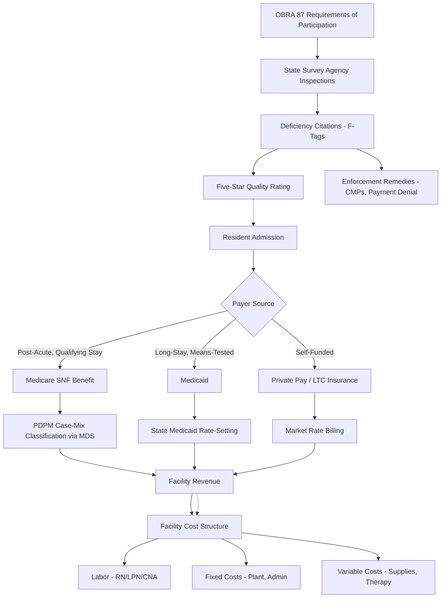

## Nursing Home Industry Structure and Regulation

### Overview

Nursing home care sits at the intersection of medical service delivery, long-term custodial care, and heavily regulated public financing. The industry's economic structure is shaped by three forces operating simultaneously: a payer mix dominated by public insurance programs with below-cost reimbursement, a regulatory framework that sets minimum quality and safety floors, and an ownership landscape increasingly dominated by chains and private equity. Understanding this sector requires analyzing how these forces interact to produce persistent economic tension between cost containment and quality of care.

### Industry Structure

#### Ownership Typology

Nursing facilities are classified along several dimensions that materially affect their economic behavior:

- **For-profit facilities**: Represent the majority of US nursing homes (roughly 70% of facilities). Subject to shareholder or owner return expectations, more likely to be part of multi-facility chains, and empirically associated with lower staffing ratios and higher rates of care deficiencies in numerous studies. [Inference: the direction of this association is well-documented in health services research, but causal mechanisms are debated]
- **Nonprofit facilities**: Roughly a quarter of facilities, often affiliated with religious organizations, community foundations, or continuing care retirement communities (CCRCs). Tend to reinvest surplus into the facility rather than distributing it.
- **Government-operated facilities**: A small remainder, including state veterans' homes and county-run facilities, often serving as safety-net providers for Medicaid-only or otherwise hard-to-place residents.

#### Chain Structure and Consolidation

A defining structural feature of the industry is the dominance of multi-facility chains and the growing role of private equity and real estate investment trusts (REITs):

- **Operating company / property company (OpCo/PropCo) splits**: Many chains separate the entity that operates the facility (OpCo) from the entity that owns the real estate (PropCo). The PropCo leases the building back to the OpCo, often at rents set to extract most of the operating margin. This structure has significant economic implications:
  - It obscures true profitability, since the operating entity may show minimal margin while the affiliated property entity captures returns.
  - It complicates regulatory oversight, since enforcement actions and financial penalties target the operating entity, which can be thinly capitalized.
  - It facilitates bankruptcy-remote structuring, where an underperforming OpCo can be discharged without threatening the real estate asset.
- **Private equity ownership**: Since the 2000s, private equity firms have acquired a meaningful share of nursing home beds. [Inference/Unverified: precise national ownership share estimates vary across studies and years; figures should be verified against current sources before being cited as fixed statistics] Research associates PE ownership with increased use of management fees, related-party transactions, and debt-financed acquisitions, which some studies link to worse resident outcomes, though this remains an active area of empirical debate.
- **REIT ownership**: Publicly traded healthcare REITs (e.g., large diversified healthcare property trusts) own significant nursing home real estate, leasing facilities to operators under long-term "triple net" leases (operator pays taxes, insurance, and maintenance).

#### Facility-Level Economics

A typical nursing facility's cost structure is labor-intensive:

- **Labor costs**: Typically 60–70% of operating expenses, dominated by nursing staff (RNs, LPNs/LVNs, and certified nursing assistants (CNAs)), who deliver the majority of direct resident care hours.
- **Fixed costs**: Building depreciation or lease payments, utilities, and administrative overhead are relatively inelastic to occupancy in the short run, making occupancy rate a key driver of per-resident-day profitability.
- **Variable costs**: Food, medical supplies, pharmacy costs, and therapy services scale more directly with census and acuity mix.

Facility profitability is highly sensitive to **payer mix** — the proportion of resident-days billed to Medicare, Medicaid, private insurance, and private pay — because these payers reimburse at substantially different rates for functionally similar care.

### Payer Mix and Reimbursement Structure

#### Medicaid

Medicaid is the dominant payer for nursing home custodial (long-stay) care, covering the largest share of resident-days nationally.

- Medicaid nursing facility rates are typically set by state Medicaid agencies using cost-based, price-based, or hybrid rate-setting methodologies.
- Medicaid reimbursement is widely characterized in industry and policy literature as being below the actual cost of care delivery, creating a structural shortfall that facilities must offset through other payer sources — a dynamic often called **cost-shifting**.
- To qualify for Medicaid long-term care coverage, residents generally must "spend down" assets to meet state-specific means-tested eligibility thresholds, which shapes the demand-side economics of the industry (private payers eventually transition to Medicaid as savings deplete).

#### Medicare

Medicare covers **skilled nursing facility (SNF)** stays, but only under specific conditions:

- Coverage is limited to post-acute, short-term rehabilitative stays (e.g., following a qualifying hospital stay), historically capped at up to 100 days per benefit period, with a coinsurance requirement kicking in after day 20.
- Medicare reimburses SNF stays at substantially higher per-diem rates than Medicaid, making Medicare-covered rehabilitation beds the most profitable segment of facility operations. [Inference: this profitability differential is a widely cited driver of facility strategy, such as prioritizing short-stay rehab admissions]
- Since October 2019, Medicare has used the **Patient-Driven Payment Model (PDPM)** to determine SNF reimbursement, replacing the prior therapy-minutes-based **RUG-IV** system. PDPM bases payment on clinical characteristics and resident classification (nursing, PT, OT, speech-language pathology, non-therapy ancillary services) rather than volume of therapy minutes delivered, intended to reduce incentives for over-provision of therapy services.

#### Private Pay and Long-Term Care Insurance

- Private-pay residents (self-funded, often via savings or family contribution) and long-term care insurance policyholders round out the payer mix.
- Private-pay rates are typically the highest per-diem rates, and facilities often rely on a blend of private-pay and Medicare short-stay revenue to subsidize Medicaid's shortfall — a structural cross-subsidization dynamic central to facility financial viability.

**Simplified facility margin logic:**

$$\text{Facility Margin} \approx \sum_{i} (P_i - C) \times D_i$$

Where $P_i$ is the per-diem reimbursement rate for payer $i$, $C$ is the per-diem cost of care, and $D_i$ is resident-days under payer $i$. Because $P_{\text{Medicaid}} < C$ for many facilities while $P_{\text{Medicare}} \gg C$, overall margin depends heavily on the mix of $D_i$ across payers.

### Regulatory Framework

#### Federal Certification Requirements (OBRA '87)

The **Omnibus Budget Reconciliation Act of 1987 (OBRA '87)** established the foundational federal regulatory framework for nursing homes participating in Medicare and Medicaid, commonly called "Requirements of Participation." Key provisions include:

- **Resident rights**: Codified protections including the right to be free from unnecessary physical or chemical restraints, the right to participate in care planning, and grievance procedures.
- **Comprehensive resident assessment**: Mandated use of a standardized assessment instrument (the **Minimum Data Set, MDS**) at admission and at regular intervals, forming the clinical basis for both care planning and reimbursement classification (including PDPM).
- **Quality of care standards**: Requirements addressing pressure ulcers, incontinence care, nutrition/hydration, and psychosocial well-being.
- **Nurse staffing minimums**: A baseline requirement for RN coverage (historically 8 consecutive hours/day) and licensed nurse coverage 24 hours/day, though these minimums have long been criticized by researchers and advocates as inadequate relative to acuity levels.

#### Survey and Certification Process

Facilities are subject to periodic, largely unannounced **state survey agency inspections** (conducted under contract with CMS) to verify compliance with federal requirements:

- **Standard surveys**: Occur at least annually (statistically, roughly every 9–15 months) and assess compliance across all regulatory domains.
- **Complaint investigations**: Triggered by resident, family, or staff complaints, conducted independently of the standard survey cycle.
- **Deficiency citations**: Violations are cited under "F-tags" corresponding to specific regulatory requirements, and classified by **scope and severity** (isolated, pattern, or widespread; no harm, potential for harm, actual harm, immediate jeopardy).
- **Enforcement remedies**: Range from directed plans of correction, to civil monetary penalties (CMPs), denial of payment for new admissions, to (in severe or repeated cases) termination from Medicare/Medicaid participation.

#### CMS Five-Star Quality Rating System

CMS publishes a composite **Five-Star Quality Rating** for each certified facility via the Care Compare tool, intended to inform consumer choice and create market-based quality incentives. The composite draws on three domains:

- **Health inspections**: Based on the most recent three years of survey deficiency data (weighted most heavily toward recent surveys).
- **Staffing**: Derived from **Payroll-Based Journal (PBJ)** data — auditable, payroll-sourced staffing hours (rather than self-reported estimates) submitted quarterly, which CMS uses to calculate RN and total nurse staffing hours per resident-day, risk-adjusted for case-mix.
- **Quality measures (QMs)**: A set of clinical outcome and process indicators (e.g., rates of falls with major injury, pressure ulcers, antipsychotic medication use, hospital readmissions) derived from MDS assessment data and claims.

[Unverified/Inference: exact current weighting formulas and specific measure sets are periodically revised by CMS; the general three-domain structure is well-established, but readers should verify current-year technical specifications against CMS's published rating methodology.]

#### Proposed and Evolving Federal Minimum Staffing Standards

In recent years, CMS has pursued a national minimum staffing standard (proposed rule published in 2023–2024) that would establish specific RN and total nurse staffing hour-per-resident-day thresholds, along with a 24/7 RN on-site requirement, phased in with rural exemptions. [Unverified: the finalization, implementation timeline, litigation status, and any subsequent modification or rescission of this rule should be verified via current CMS sources, as such rules are subject to legal challenge and administrative reversal.]

#### State-Level Regulation

States layer additional requirements on top of federal minimums:

- **Certificate of Need (CON) laws**: Many states require regulatory approval before new nursing home beds can be added to the market, intended to control Medicaid expenditure growth by limiting bed supply — an economically significant supply-side constraint that affects market entry and competition.
- **State-specific staffing ratios**: A number of states impose staffing minimums stricter than the federal floor.
- **State Medicaid rate-setting methodologies**: Vary considerably, affecting facility profitability differently across states.

### Regulatory-Economic Feedback Loops

The interaction between regulation and industry economics produces several notable dynamics:

- **Cost-shifting and case-mix optimization**: Facilities have a financial incentive to maximize Medicare short-stay and private-pay census while managing Medicaid long-stay census, shaping admission and marketing strategies.
- **Regulatory arbitrage via corporate structuring**: OpCo/PropCo splits and multi-layered LLC ownership structures can limit financial liability exposure from enforcement actions or litigation, a pattern documented in government and academic studies of nursing home ownership transparency.
- **Staffing-quality-cost tension**: Because labor is the largest cost driver, staffing minimums directly increase operating costs; the central policy debate is whether reimbursement rates (particularly Medicaid) are adjusted sufficiently to offset compliance costs without compromising facility solvency or access, especially in rural and Medicaid-dependent markets.
- **Consolidation pressure**: Compliance costs, capital requirements for physical plant standards, and CON constraints on new supply favor larger chains with economies of scale and access to capital markets, contributing to industry consolidation over time.

### Illustrative Diagram: Nursing Home Payer and Regulatory Flow

### Related Topics

- Certificate of Need (CON) laws and nursing home market entry economics
- Private equity acquisition models and their effect on long-term care outcomes
- Patient-Driven Payment Model (PDPM) mechanics and case-mix classification
- Medicaid spend-down and asset transfer rules (look-back periods)
- CMS Payroll-Based Journal staffing data and its use in enforcement
- Assisted living vs. skilled nursing: regulatory and economic distinctions
- Continuing Care Retirement Communities (CCRCs) and actuarial financing models
- Hospital-to-SNF discharge planning and post-acute care economics
- Nursing home workforce economics and labor market shortages
- Comparative international models of long-term care financing (e.g., social insurance models in Germany, Japan)