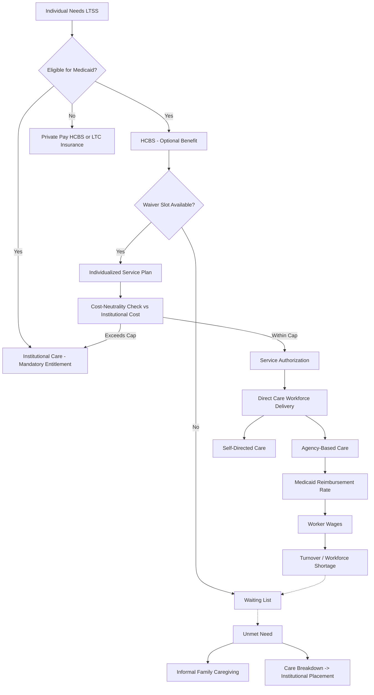

## Home and Community-Based Care Economics

### Overview

Home and community-based services (HCBS) encompass long-term care delivered in a recipient's own home or community setting rather than an institutional facility, including personal care assistance, home health aides, adult day services, respite care, and home modifications. The economics of HCBS are defined by a persistent policy and market tension: HCBS is generally lower-cost per recipient than institutional (nursing facility) care, yet historic financing structures have favored institutional care, creating what health economists term an **institutional bias**. Understanding HCBS economics requires examining financing mechanisms, workforce cost structures, waiver-based rationing, and the comparative cost-effectiveness debate relative to nursing facility care.

### Financing Structure

#### Medicaid HCBS Waivers

Medicaid is the dominant public payer for HCBS, delivered primarily through several mechanisms:

- **Section 1915(c) Home and Community-Based Services Waivers**: The primary vehicle historically used by states to offer HCBS as an alternative to institutional care. Because Medicaid's institutional benefit (nursing facility care) is a mandatory entitlement while HCBS is optional, states use 1915(c) waivers to extend HCBS eligibility, but critically, **waivers permit enrollment caps and waiting lists**, unlike the institutional entitlement.
- **Section 1915(i) State Plan HCBS**: Allows states to offer HCBS as a state plan benefit (not a waiver), which removes the ability to cap enrollment but requires the benefit to be offered statewide, creating a cost-predictability versus access trade-off for state budgets.
- **Section 1115 Demonstration Waivers**: Broader research and demonstration waivers that some states use to restructure their overall long-term care delivery system, including managed long-term services and supports (MLTSS) arrangements.
- **Section 1915(k) Community First Choice**: Offers states an enhanced federal medical assistance percentage (FMAP) match specifically for attendant care services, incentivizing HCBS expansion.

#### The Institutional Bias and Rebalancing

Historically, Medicaid's mandatory nursing facility benefit combined with optional, cap-eligible HCBS produced systematic underinvestment in home-based alternatives — a dynamic economists and policymakers term the **institutional bias**. Over the past several decades, states have pursued **"rebalancing"** initiatives to shift the share of long-term care spending toward HCBS:

- National Medicaid long-term services and supports (LTSS) spending has shifted substantially toward HCBS relative to institutional care over the past two decades, though the degree of rebalancing varies considerably by state. [Inference: while the overall national trend toward HCBS spending share growth is well-documented in Medicaid LTSS expenditure reports, precise current-year percentages should be verified against the latest CMS or Medicaid and CHIP Payment and Access Commission (MACPAC) data before being cited as fixed figures.]
- Rebalancing is driven by both cost considerations and the **Olmstead v. L.C.** (1999) Supreme Court decision, which held that unjustified institutionalization of individuals with disabilities violates the Americans with Disabilities Act (ADA) when community-based services are appropriate and can be reasonably accommodated — creating a legal, not merely economic, pressure toward HCBS expansion.

#### Waiting Lists as a Rationing Mechanism

Because 1915(c) waivers permit enrollment caps, many states manage HCBS demand through waiting lists rather than price:

- Waiting lists function as a non-price rationing mechanism in a market where the "price" (Medicaid reimbursement rate) is fixed by the state rather than adjusting to clear demand.
- Wait times vary substantially by state and by waiver target population (e.g., intellectual/developmental disability waivers frequently have materially longer wait times than aging/physical disability waivers). [Unverified: specific national wait-list figures change year to year and by state; current figures should be verified against KFF or MACPAC state-level tracking data.]
- This creates a documented economic externality: unmet HCBS demand can shift costs onto unpaid family caregivers, emergency medical services, or, paradoxically, more expensive institutional placement when informal care arrangements break down.

### Cost Comparison: HCBS vs. Institutional Care

#### Per-Recipient Cost Differential

A central empirical finding in LTSS economics is that per-person Medicaid HCBS spending is generally lower than per-person nursing facility spending, though the comparison requires important caveats:

- The cost differential reflects both lower service intensity per day for many HCBS recipients (who may need fewer hours of paid care than a nursing facility resident needs in-facility hours) and the exclusion of room-and-board costs, which are separately borne by the HCBS recipient (typically via SSI or personal income) rather than paid by Medicaid.
- **Population acuity is not held constant** in simple aggregate comparisons: institutional populations tend to have higher average acuity/dependency levels than home-based populations. This makes naive "HCBS is cheaper" claims analytically incomplete; the more rigorous economic question is whether HCBS is cost-effective **for a given acuity level**, and evidence on this point is more mixed, particularly at higher acuity levels requiring near-constant supervision. [Inference: this acuity-adjustment caveat is a standard critique in the health services research literature on LTSS cost comparisons.]
- Some research finds that as recipient acuity/care hours increase, the cost advantage of HCBS narrows and can, at sufficiently high care-hour thresholds, approach or exceed facility-based costs — informing "cost-neutrality" caps that many waiver programs impose (a beneficiary cannot receive a waiver if their individualized HCBS cost plan would exceed the cost of the institutional alternative).

#### Cost-Neutrality Requirements

Federal 1915(c) waiver rules require that average per-capita HCBS waiver expenditures not exceed what would have been spent on institutional care for the same population — a budget-neutrality constraint embedded directly into program design and central to how states structure individual service plans and utilization caps.

### Workforce Economics

The direct care workforce (home health aides, personal care aides, and certified nursing assistants working in home settings) is the central labor input for HCBS delivery and a major driver of both cost and access constraints.

- **Wage levels**: Direct care workers are among the lowest-paid occupations in the healthcare sector, with wages frequently close to state or federal minimum wage thresholds, despite the physically and emotionally demanding nature of the work.
- **High turnover**: The sector experiences persistently high annual turnover rates, which economists link directly to low wages, limited benefits (many direct care workers lack employer-sponsored health insurance despite working in healthcare), and inconsistent scheduling (many are classified as part-time or have fluctuating hours tied to client authorizations).
- **Workforce shortage dynamics**: Because Medicaid reimbursement rates constrain what agencies can pay workers, and because rates are set through a political/budgetary process rather than a competitive labor market mechanism, HCBS wages have historically lagged wage growth in adjacent lower-skill sectors (e.g., retail, food service), producing chronic workforce shortages that translate directly into waiting lists and unfilled authorized service hours, independent of waiver enrollment caps. [Inference: this causal chain from reimbursement-constrained wages to workforce shortage to service access gaps is a widely supported finding in LTSS workforce literature, though the magnitude of effect varies by region and study.]
- **Self-directed care models**: Many states offer **consumer-directed** or **self-directed** HCBS options, where the beneficiary (or a representative) directly hires, trains, and manages their own care worker — often a family member — using a Medicaid-funded budget. This model has distinct economic properties: it can reduce agency overhead costs, increase worker retention (given personal relationship dynamics), but raises separate policy questions around wage floors, tax/employment classification (many function as household employers under IRS rules), and fraud/oversight mechanisms.

#### Fair Labor Standards Act (FLSA) Companionship Exemption

Historically, home care workers were excluded from federal minimum wage and overtime protections under the FLSA's "companionship services" exemption. A 2013 Department of Labor rule narrowed this exemption significantly for third-party employers (home care agencies), extending minimum wage and overtime protections to most home care workers employed by agencies — a regulatory change with direct cost implications for HCBS provider agencies and, by extension, for state Medicaid HCBS budgets. [Unverified: subsequent litigation, enforcement posture, and any further regulatory modification to this rule should be verified against current Department of Labor guidance.]

### Long-Term Care Insurance and Private-Pay HCBS

- Private long-term care insurance policies increasingly cover home-based care, reflecting insurer recognition that HCBS benefit payouts are often lower than equivalent institutional claims, though adverse selection and rising premiums have contributed to a shrinking private LTC insurance market overall.
- Private-pay HCBS (self-funded, non-Medicaid) constitutes a significant share of total HCBS spending nationally, particularly among middle- and upper-income households who do not qualify for Medicaid but choose to delay or avoid institutional placement.

### Managed Long-Term Services and Supports (MLTSS)

A growing number of states have shifted Medicaid LTSS delivery, including HCBS, into capitated managed care arrangements (MLTSS):

- Under MLTSS, states pay managed care organizations (MCOs) a fixed per-member-per-month capitated rate to coordinate and finance the full range of LTSS, shifting utilization and cost risk from the state to the MCO.
- Proponents argue MLTSS incentivizes MCOs to invest in HCBS as a lower-cost care-management strategy to avoid more expensive institutional placements under capitation; critics raise concerns about network adequacy, care coordination quality, and the risk of underservice given the capitated payment structure's inherent incentive to minimize utilized services. [Inference: both the theoretical incentive structure and the corresponding critique are standard features of the MLTSS policy debate, though empirical outcomes vary by state program design and evaluation methodology.]

### Illustrative Diagram: HCBS Financing and Rationing Flow

### Related Topics

- Olmstead v. L.C. and the ADA's integration mandate in long-term care policy
- Managed Long-Term Services and Supports (MLTSS) capitation and risk-adjustment design
- Direct care workforce wage policy and Medicaid rate pass-through requirements
- Informal/family caregiver economics and unpaid care valuation methods
- Consumer-directed care models and household employer tax/legal frameworks
- Medicaid Money Follows the Person (MFP) demonstration program
- Long-term care insurance market dynamics and adverse selection
- State-by-state HCBS waiting list and waiver design comparison
- Adult day services and respite care as caregiver-support economic interventions
- Comparative HCBS models internationally (e.g., Germany's long-term care insurance home-care benefits)