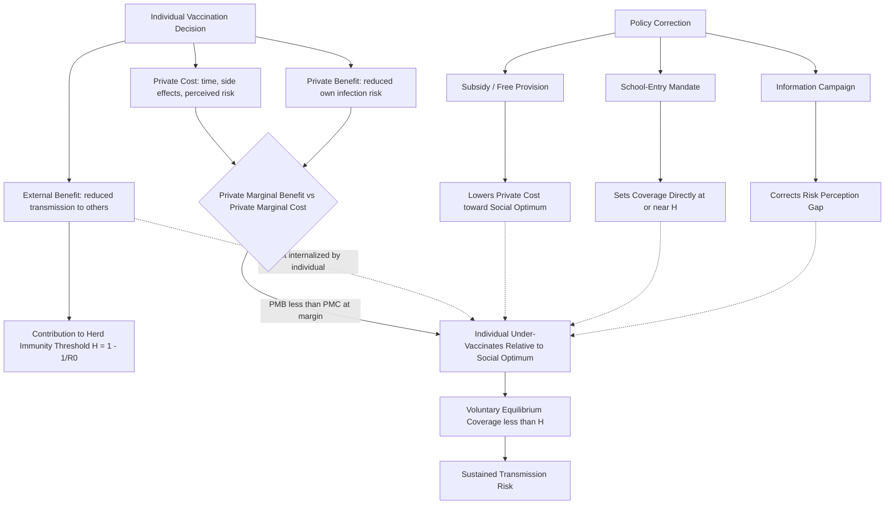

## Externalities in Infectious Disease Control

### Overview

Infectious disease control is a canonical case study in externality theory because disease transmission is inherently interpersonal: an individual's decision to seek vaccination, isolate when sick, or adhere to treatment generates consequences for third parties who are not party to that decision. This creates a systematic divergence between the private incentives individuals face and the socially optimal level of prevention, treatment, and control effort. Because infectious disease externalities operate through a nonlinear transmission process (rather than a fixed per-unit spillover, as in classic pollution examples), they require distinct analytical tools — most notably epidemiological compartmental models integrated with economic optimization frameworks.

### The Nature of the Externality

#### Positive Externalities of Prevention

When an individual reduces their own probability of becoming infected or infectious, they simultaneously reduce the probability that they transmit the pathogen to others. This generates a **positive externality**: the social marginal benefit (SMB) of prevention activities exceeds the private marginal benefit (PMB).

- **Vaccination**: A vaccinated individual benefits directly from reduced personal infection risk (the private benefit) but also reduces the pool of susceptible-to-infectious transmission pathways available to the pathogen, protecting others who may be unvaccinated, too young to vaccinate, or immunocompromised (the external benefit). This latter effect underlies the concept of **herd immunity** (also termed community or herd protection): once the immune fraction of a population exceeds a threshold, sustained transmission chains become statistically improbable, protecting even unvaccinated members.
- **Isolation and quarantine**: An infected individual who isolates bears private costs (lost wages, discomfort, social cost) but generates a positive externality by preventing onward transmission.
- **Treatment adherence**: Completing a full course of treatment (notably for tuberculosis) reduces both individual relapse risk and the risk of transmitting a drug-resistant strain to others — the latter being a pure externality with no direct private benefit component.

#### The Free-Rider Problem

Because prevention generates external benefits, rational self-interested individuals under-invest in prevention relative to the social optimum — a classic **free-rider problem**. If enough others vaccinate to achieve herd immunity, an individual can capture the protective benefit without bearing the private cost (time, minor side effects, perceived risk) of vaccinating themselves. This produces:

- **Underprovision equilibrium**: Voluntary, unsubsidized vaccination rates in a decentralized market will generally fall short of the socially optimal (and often the epidemiologically necessary herd immunity threshold) vaccination rate.
- **Vaccination "arms race" instability**: Some formal epidemiological-economic models show that voluntary vaccination equilibria are inherently unstable — as disease incidence falls due to rising vaccination rates, the perceived private risk of infection falls, which reduces the private incentive to vaccinate, potentially causing coverage to oscillate below the herd immunity threshold. [Inference: this instability result is a well-established finding in the game-theoretic epidemiology literature (e.g., work building on Bauch and Earn's vaccination game models), though real-world coverage dynamics are also shaped by policy interventions that can dampen this oscillation.]

#### Negative Externalities of Non-Compliance and Antimicrobial Use

The mirror image of the positive prevention externality is the negative externality generated by behaviors that increase transmission risk or resistance:

- **Non-isolation while infectious**: Continuing normal activity while infectious imposes direct transmission risk costs on others (analogous to a negative production externality).
- **Antimicrobial resistance (AMR)**: Antibiotic use by one patient contributes to a shared, depletable resource problem: the population-level effectiveness of an antibiotic class. Overuse or misuse accelerates the evolutionary selection of resistant pathogen strains, degrading the drug's future effectiveness for all future users — a dynamic frequently modeled as a **common-pool resource** or "tragedy of the commons" problem rather than a simple externality, since antibiotic efficacy is both non-excludable and rivalrous (one patient's resistant-strain-inducing use diminishes the resource available to others).

### Modeling Framework: Epidemiological-Economic Integration

#### The SIR Model as an Economic Foundation

The foundational epidemiological model used to formalize these externalities is the **SIR (Susceptible-Infectious-Recovered)** compartmental model:

$$\frac{dS}{dt} = -\beta S I, \quad \frac{dI}{dt} = \beta S I - \gamma I, \quad \frac{dR}{dt} = \gamma I$$

Where $\beta$ is the transmission rate and $\gamma$ is the recovery rate. The **basic reproduction number**, $R_0 = \beta/\gamma$, represents the expected number of secondary infections generated by a single infectious individual in a fully susceptible population.

The economic significance of this structure is that an individual's infection risk depends on the **prevalence of infection in the population**, $I$, which is itself the aggregate outcome of every other individual's behavior. This makes individual risk endogenous to collective behavior — the essential feature that generates the externality, since no individual internalizes their marginal contribution to $I$ when making private prevention decisions.

#### Herd Immunity Threshold

The herd immunity threshold, $H$, is the minimum immune population fraction required to drive the effective reproduction number below 1:

$$H = 1 - \frac{1}{R_0}$$

This threshold is the standard benchmark against which voluntary (unsubsidized) vaccination equilibria are compared; the gap between the market-clearing voluntary vaccination rate and $H$ is a direct quantification of the externality-driven underprovision.

#### Behavioral-Epidemiological (SIR-Behavior) Models

More advanced models endogenize behavior by coupling the SIR transmission dynamics with an individual optimization problem, where agents choose their prevention effort (e.g., vaccination, contact reduction) by weighing private costs against perceived private infection risk (which itself depends on aggregate prevalence). These models formally demonstrate that the decentralized Nash equilibrium level of prevention is generally below the social-planner-optimal level, and are used to quantify the welfare loss from the externality and to evaluate the size of the corrective subsidy needed to close the gap. [Inference: the general result that decentralized equilibria under-provide prevention relative to the social optimum is robust across this modeling literature, though the precise magnitude is highly model- and parameter-dependent.]

### Policy Instruments for Internalizing the Externality

Given the underprovision problem, policy tools function analogously to standard externality correction mechanisms (Pigouvian subsidies/taxes, quantity mandates, and information interventions), adapted to the disease-control context.

#### Subsidies and Price Interventions

- **Vaccine subsidies / free provision**: Reducing the private cost of vaccination toward zero (or below, via cash incentives) is the direct analog of a Pigouvian subsidy, intended to close the gap between private and social marginal benefit.
- **Advance Market Commitments (AMCs)**: A mechanism where funders (governments, foundations) commit in advance to purchase a not-yet-developed vaccine at a guaranteed price, addressing a related market failure: underinvestment in vaccine R&D for diseases primarily affecting low-income populations where expected private returns are insufficient to justify development costs.

#### Mandates and Quantity-Based Interventions

- **School-entry vaccination mandates**: Function as a quantity-based correction, directly setting the vaccination rate at (or near) the socially efficient level rather than relying on price incentives to induce individuals to voluntarily reach that level.
- **Quarantine and isolation orders**: Legally mandated isolation directly forces internalization of the transmission externality by removing the infected individual's ability to impose transmission risk on others, substituting compulsion for the (absent) private incentive to isolate.
- **Antibiotic stewardship programs**: Regulatory and clinical protocols (e.g., prescribing restrictions, mandatory infectious disease consultation for certain antibiotic classes) designed to internalize the AMR common-pool resource externality by constraining individual prescribing/use decisions.

#### Information and Behavioral Interventions

- **Public information campaigns**: Address a related but distinct market failure — imperfect information about personal infection risk or about the magnitude of external effects — which can itself cause suboptimal private decision-making independent of the pure externality problem.
- **Contact tracing and reporting requirements**: Generate positive externalities themselves (information about exposure risk benefits third parties), and are often under-provided voluntarily for privacy and convenience reasons, justifying public health authority involvement.

### Complicating Factors and Debates

- **Heterogeneous risk and targeting efficiency**: Because transmission networks are not homogeneous (some individuals have disproportionately high contact rates — "superspreaders"), uniform interventions are economically less efficient than risk-targeted interventions, but risk-targeting raises equity, feasibility, and privacy trade-offs. [Inference: the efficiency case for targeted intervention is a standard result in network epidemiology-economics, though practical targeting is constrained by information availability and ethical considerations.]
- **Distributional and equity considerations**: The costs of isolation/quarantine measures (lost wages, disrupted caregiving) fall disproportionately on lower-income and hourly workers, raising equity concerns that pure efficiency-focused externality-correction models do not capture, and motivating income-replacement policies (e.g., paid sick leave mandates) as a complementary tool that reduces the private cost of compliance for those least able to absorb it.
- **International externalities and global public goods**: Disease control has a cross-border externality dimension — one country's disease control effort or lack thereof (e.g., in outbreak surveillance and containment) generates spillover risk for other countries, a dynamic addressed partially through international frameworks such as the WHO **International Health Regulations (IHR)**, though enforcement and burden-sharing remain persistent challenges given the absence of a supranational taxing or mandating authority. [Unverified: the current effectiveness and any recent amendments to the IHR framework, particularly post-COVID-19 reform discussions, should be verified against current WHO sources given ongoing negotiation activity in this area.]
- **Behavioral risk compensation**: Some literature raises the concern that visible reductions in disease prevalence (itself partly attributable to successful intervention) can induce offsetting behavioral relaxation ("risk compensation"), partially eroding intervention effectiveness — an empirically contested phenomenon whose magnitude varies substantially by context and intervention type.

### Illustrative Diagram: Externality Structure in Vaccination Decisions

### Related Topics

- SIR/SEIR compartmental modeling and reproduction number estimation
- Game-theoretic vaccination models and equilibrium coverage instability
- Advance Market Commitments and vaccine R&D market failure correction
- Antimicrobial resistance as a common-pool resource problem
- Paid sick leave policy and the economics of isolation compliance
- Cost-effectiveness analysis of quarantine versus targeted contact tracing
- International Health Regulations and cross-border public health externalities
- Risk compensation and behavioral responses to declining disease prevalence
- Superspreader dynamics and network-targeted intervention efficiency
- Pigouvian taxation and subsidy design in public health economics