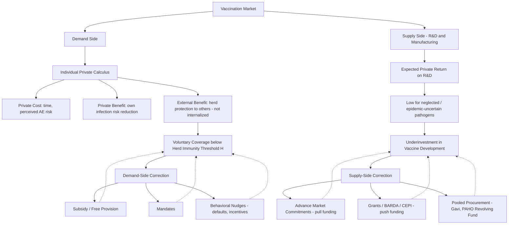

## Economics of Vaccination and Herd Immunity

### Overview

Vaccination sits among the most well-studied applications of externality theory in health economics, combining public goods characteristics, market failure in both private demand and private R&D supply, and complex dynamic optimization problems tied to disease transmission mathematics. This entry covers the demand-side economics of individual vaccination decisions, the supply-side economics of vaccine development and manufacturing, the herd immunity threshold as an economic-epidemiological benchmark, and the policy instruments used to correct systematic market failures on both sides.

### Herd Immunity: The Epidemiological-Economic Benchmark

#### Threshold Formula

Herd immunity (also termed herd or community protection) occurs when a sufficient fraction of a population is immune (via vaccination or prior infection) that sustained disease transmission becomes statistically unlikely, indirectly protecting the remaining susceptible population. The threshold is derived from the basic reproduction number, $R_0$:

$$H = 1 - \frac{1}{R_0}$$

Where $H$ is the minimum immune population fraction required to bring the **effective reproduction number** ($R_e$ or $R_t$) below 1, at which point each infectious case generates, on average, fewer than one secondary case, and the outbreak trajectory declines toward extinction.

- Higher-$R_0$ pathogens require proportionally higher immunization coverage to achieve herd protection. For example, a pathogen with $R_0 = 15$ requires $H \approx 93\%$ coverage, while one with $R_0 = 3$ requires only $H \approx 67\%$.
- This threshold assumes homogeneous mixing (every individual has an equal probability of contacting every other individual), which is a simplifying assumption; real-world contact heterogeneity (e.g., age-structured or network-based contact patterns) modifies the effective threshold, generally lowering it somewhat relative to the homogeneous-mixing estimate, since high-contact individuals contribute disproportionately to transmission and their immunization yields outsized transmission-reduction effects. [Inference: this heterogeneity-lowers-threshold result is a standard finding in network epidemiology, though the magnitude of adjustment is pathogen- and population-specific.]

#### Herd Immunity as a Public Good

Herd immunity has the classic characteristics of a **public good**:

- **Non-excludability**: Once population-level transmission is suppressed, unvaccinated individuals (including those medically ineligible, such as infants or the immunocompromised) cannot practically be excluded from the protective benefit.
- **Non-rivalry** (approximately): One additional person's enjoyment of reduced infection risk from herd protection does not materially diminish another's enjoyment of that same reduced risk, at least up to the point where coverage is comfortably above threshold.

This public goods characterization directly implies, via standard public economics theory, that voluntary private markets will systematically underprovide vaccination relative to the socially efficient level — the same underprovision logic that applies to public goods generally (e.g., national defense, basic research), reinforced in this case by the specific free-rider dynamic described below.

### Demand-Side Economics: The Individual Vaccination Decision

#### Private Cost-Benefit Framework

An individual's private vaccination decision can be modeled as a comparison between expected private costs and expected private benefits:

$$EU_{\text{vaccinate}} = -C_v - p_v \cdot C_{ae}$$

$$EU_{\text{not vaccinate}} = -\lambda(I) \cdot C_i$$

Where $C_v$ is the direct/time cost of vaccination, $p_v$ is the probability of an adverse event with associated cost $C_{ae}$, $\lambda(I)$ is the individual's perceived probability of infection (a function of population prevalence $I$), and $C_i$ is the cost of infection. The individual vaccinates when $EU_{\text{vaccinate}} > EU_{\text{not vaccinate}}$.

The critical feature is that $\lambda(I)$ — perceived infection risk — falls as population-level vaccination coverage rises (since prevalence falls), which means **the private incentive to vaccinate declines precisely as more of one's neighbors vaccinate**. This is the formal mechanism underlying the free-rider problem in vaccination economics.

#### Free-Riding and Equilibrium Instability

Game-theoretic vaccination models (building substantially on the framework developed by Bauch and Earn, 2004, and subsequent extensions) demonstrate several important results:

- **The voluntary Nash equilibrium vaccination rate generally falls below the herd immunity threshold**, because no individual's private calculus internalizes the transmission-reduction benefit conferred on others.
- **Equilibria can be dynamically unstable**: as coverage approaches $H$ and disease incidence falls, perceived risk $\lambda(I)$ falls, weakening the private incentive to vaccinate and potentially causing coverage to drift back downward — a feedback loop sometimes cited as a contributing economic-behavioral factor (alongside other causes such as misinformation and access barriers) in the resurgence of previously well-controlled diseases in some populations and periods. [Inference: this instability mechanism is a well-established theoretical result; its empirical contribution relative to other causes of specific real-world coverage declines is harder to isolate and should not be treated as the sole explanation for any particular outbreak.]
- **Welfare loss quantification**: The gap between the socially optimal coverage level (which would minimize total social cost, including both vaccination costs and infection costs borne by the whole population) and the voluntary equilibrium coverage level represents a quantifiable deadweight loss attributable to the externality, which formal models use to calibrate the size of a corrective subsidy.

#### Behavioral and Informational Frictions

Beyond the pure externality problem, several behavioral economics factors compound underprovision:

- **Present bias / hyperbolic discounting**: The cost of vaccination (a mild, immediate inconvenience) is salient and immediate, while the benefit (avoided future infection risk) is probabilistic and delayed, a pattern consistent with present-biased discounting models producing systematic under-vaccination even absent any externality.
- **Risk perception distortions**: Availability heuristics and base-rate neglect can cause individuals to overweight rare vaccine adverse event risks relative to their actual probability, while underweighting disease risk once disease incidence has fallen (partly as a *result* of vaccination success) — a self-undermining dynamic sometimes termed the "victim of its own success" problem in vaccination economics.
- **Trust and information asymmetry**: Vaccine hesitancy is also shaped by trust in health institutions and information quality, which functions as an independent market failure (imperfect/asymmetric information) distinct from, but interacting with, the pure externality problem.

### Supply-Side Economics: Vaccine R&D and Manufacturing

#### The R&D Market Failure

Vaccine research and development faces a distinct market failure on the supply side, particularly for diseases disproportionately affecting low- and middle-income countries:

- **Insufficient expected private return**: Standard pharmaceutical R&D investment decisions weigh expected revenue against development costs; for diseases where the affected population has low ability to pay (a substantial share of neglected tropical diseases, and historically, epidemic-prone pathogens with uncertain and infrequent outbreak timing), expected private returns are insufficient to justify R&D investment even when the potential social benefit (in disease burden averted) is large.
- **Market uncertainty for epidemic/pandemic pathogens**: Vaccines for pathogens with uncertain outbreak timing (e.g., novel coronaviruses, Ebola between outbreaks) face a particular investment problem: manufacturers must sustain R&D and manufacturing capacity investment against demand that may not materialize for years, creating a classic underinvestment problem under uncertainty.

#### Advance Market Commitments and Push/Pull Funding

Policy responses to the supply-side market failure are typically categorized as **"push" funding** (subsidizing R&D input costs directly, e.g., grants) versus **"pull" mechanisms** (guaranteeing a future revenue stream conditional on successful development):

- **Advance Market Commitments (AMCs)**: Funders (governments, multilateral organizations, foundations) commit in advance to purchase a specified quantity of a not-yet-developed (or not-yet-scaled) vaccine at a guaranteed price if it meets predefined criteria, directly addressing the expected-revenue shortfall that discourages private R&D investment. The pneumococcal AMC, coordinated through Gavi, is a widely cited real-world implementation.
- **Push funding examples**: Public and philanthropic R&D grants (e.g., through BARDA, CEPI, and NIH-funded vaccine research) directly subsidize development costs, reducing the private capital at risk.
- **Advance purchase agreements / pre-commitments**: Distinct from AMCs in that they typically commit to purchasing from a specific, often already-selected candidate or manufacturer (as seen extensively during COVID-19 vaccine development), reducing manufacturer demand uncertainty and enabling at-risk manufacturing scale-up prior to regulatory approval.

#### Manufacturing Capacity and Supply Chain Economics

- **Economies of scale in production**: Vaccine manufacturing (particularly for biologics requiring specialized cold-chain and bioreactor infrastructure) exhibits significant fixed-cost-driven economies of scale, favoring concentrated production in a small number of specialized facilities — with corresponding supply chain concentration risk during demand surges.
- **Technology transfer economics**: Expanding manufacturing capacity to additional geographic regions (a policy goal for pandemic preparedness and equitable access) involves substantial technology transfer costs and intellectual property considerations, an area of active policy debate regarding patent pooling, licensing terms, and manufacturing capability distribution across income levels. [Unverified: specific current policy arrangements and any recent international agreements on vaccine manufacturing technology transfer should be verified against current WHO/WTO sources, given this remains an actively evolving negotiation area.]

### Policy Instruments: Closing the Coverage Gap

#### Demand-Side Corrections

- **Free or subsidized provision**: Directly lowers $C_v$ toward zero, the standard Pigouvian-subsidy-style correction for the externality.
- **Financial incentives**: Direct cash payments or non-cash incentives (e.g., lottery-based incentives, which have been studied in behavioral economics literature as potentially more cost-effective per marginal vaccination than flat payments in some contexts) to further tilt the private cost-benefit calculus.
- **Mandates**: School-entry and, in some jurisdictions, employment-based vaccination mandates function as a quantity-based intervention, directly setting coverage near or above $H$ rather than relying on price incentives, and are generally the most effective single tool for reaching and sustaining coverage above threshold, though they raise distinct legal, ethical, and political-economy considerations (medical/religious/philosophical exemption policy design materially affects effective coverage rates achieved). [Inference: mandates' relative effectiveness compared to subsidy-based approaches is well-supported in the literature, though the magnitude depends heavily on exemption policy stringency.]
- **Default/opt-out framing**: Behavioral "nudge" interventions—such as making vaccination the default enrollment option, requiring active opt-out rather than opt-in—leverage default-effect behavioral economics findings to increase uptake without mandating or subsidizing.

#### Supply-Side Corrections

- **AMCs and pull funding**: As described above, directly addresses the expected-revenue market failure.
- **Public procurement and pooled purchasing**: Mechanisms such as Gavi's pooled procurement or PAHO's Revolving Fund leverage aggregated purchasing power across multiple countries to negotiate lower per-dose prices and provide demand certainty to manufacturers, improving supply-side planning.

### Cost-Effectiveness Analysis in Vaccination Policy

Vaccination programs are commonly evaluated using standard health economic evaluation metrics:

- **Cost per Quality-Adjusted Life Year (QALY) or Disability-Adjusted Life Year (DALY) averted**: Standard metric comparing vaccination program costs against health outcomes gained, used to rank vaccine introduction priorities, particularly in resource-constrained settings guided by bodies such as WHO's SAGE (Strategic Advisory Group of Experts on Immunization).
- **Static vs. dynamic (transmission) modeling**: A critical methodological distinction in vaccine cost-effectiveness analysis: **static models** evaluate only the direct protective benefit to the vaccinated individual, while **dynamic transmission models** additionally capture the indirect (herd protection) benefit to unvaccinated third parties. Because herd protection benefits are, by definition, external to the vaccinated individual, static models systematically **understate** the true cost-effectiveness of vaccination programs, and the field has moved toward dynamic modeling as the more methodologically appropriate standard for vaccines with meaningful transmission-blocking effects. [Inference: the systematic understatement result under static modeling is a well-established methodological point in vaccine health economic evaluation literature.]

### Illustrative Diagram: Vaccination Market Failure Structure

### Related Topics

- Basic reproduction number ($R_0$) estimation methods and data sources
- Game-theoretic vaccination models (Bauch-Earn framework) and equilibrium dynamics
- Advance Market Commitments: design, the pneumococcal AMC case study, and Gavi financing
- Static vs. dynamic transmission modeling in vaccine cost-effectiveness analysis
- Vaccine hesitancy: behavioral economics and risk perception research
- Intellectual property, patent pooling, and vaccine manufacturing technology transfer
- QALY/DALY-based health technology assessment methodology
- School-entry mandate design and exemption policy effects on coverage
- Global vaccine equity and COVAX-style multilateral allocation mechanisms
- Antimicrobial resistance economics as a related common-pool resource problem