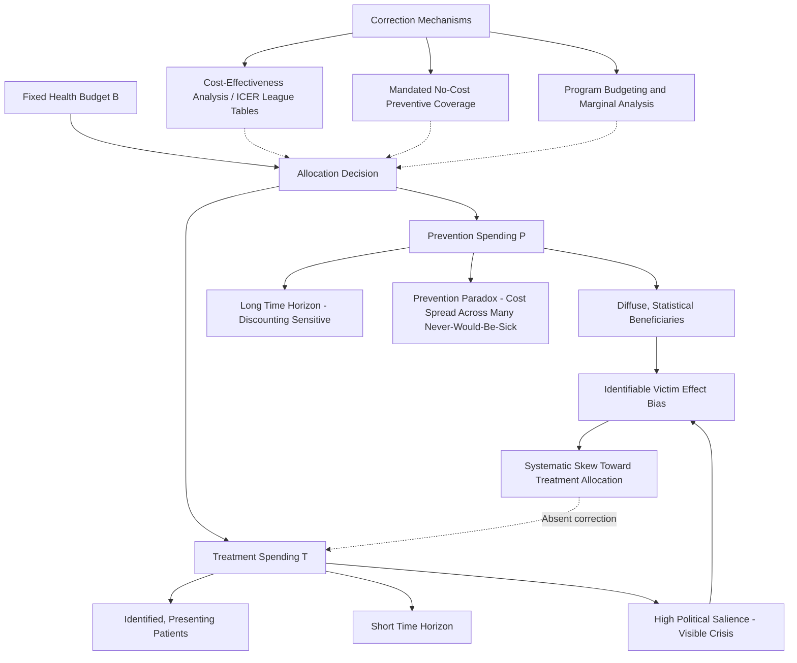

## Prevention Versus Treatment Resource Allocation

### Overview

Health systems face a persistent allocative choice between investing resources in prevention (reducing the incidence of disease before it occurs) and treatment (addressing disease once it has manifested). This is not merely a budgeting question but a distinct economic problem involving different time horizons, different beneficiary populations, different risk structures, and systematically different political-economy and behavioral dynamics. This entry covers the theoretical framework for optimal allocation between prevention and treatment, the specific market failures and behavioral biases that skew real-world allocation toward treatment, and the analytical tools used to evaluate the trade-off.

### Conceptual Framework

#### Defining the Allocation Problem

At the simplest level, a health system (or an individual, or an insurer) with a fixed budget $B$ must allocate spending between prevention $P$ and treatment $T$ to maximize aggregate health outcomes, often measured in QALYs or DALYs averted:

$$\max_{P, T} \, Q(P, T) \quad \text{subject to} \quad P + T \leq B$$

The efficient allocation occurs where the marginal QALY (or DALY averted) per dollar is equalized across prevention and treatment spending:

$$\frac{\partial Q/\partial P}{\text{Cost}_P} = \frac{\partial Q/\partial T}{\text{Cost}_T}$$

In practice, this equalization condition is rarely achieved because prevention and treatment differ along several structural dimensions that complicate direct comparison.

#### Structural Differences Between Prevention and Treatment

- **Beneficiary identifiability**: Treatment benefits an identified, presenting patient with a known condition. Prevention typically benefits a diffuse population of statistical (unidentified) future beneficiaries — the "identifiable victim effect" in behavioral economics describes the well-documented tendency for decision-makers (both individuals and policymakers) to weight identifiable victims more heavily than statistical ones, even when the expected aggregate benefit favors the statistical intervention. [Inference: the identifiable victim effect itself is a well-replicated behavioral economics finding; its specific quantitative influence on health budget allocation decisions is harder to isolate from other factors and is best treated as a contributing mechanism rather than a fully measured effect.]
- **Time horizon and discounting**: Treatment benefits are typically realized in the near term (the patient's condition improves relatively quickly), while prevention benefits (e.g., averting a chronic disease decades later) accrue over a much longer horizon. Under standard discounted-utility frameworks, this time-horizon asymmetry causes prevention's net present value to be more sensitive to the choice of discount rate than treatment's, and under high discount rates (or high present-bias among decision-makers), prevention is systematically disadvantaged relative to treatment even when undiscounted lifetime benefits would favor prevention.
- **Certainty of benefit**: Treatment is typically administered to a patient known to have the condition, so the expected benefit calculation involves less population-level probabilistic uncertainty. Prevention (e.g., a screening or lifestyle intervention) is applied to a population where only a subset will ever have developed the condition absent intervention, meaning per-capita program costs must be spread across many people who would never have gotten sick anyway — sometimes termed the "prevention paradox" (a population-wide preventive measure that brings large aggregate benefit may bring little benefit to each participating individual, since most participants were never going to develop the condition).
- **Political economy and salience**: Acute treatment crises (e.g., a visible disease outbreak, an emergency department overwhelmed) generate immediate political and media salience that favors reactive treatment-oriented budget allocation, while prevention's benefits (a crisis that did not happen) are inherently invisible and non-salient — a dynamic sometimes described as the difficulty of "claiming credit for the disaster that didn't happen," which systematically biases political resource allocation toward treatment/response capacity relative to the ex-ante optimal prevention investment. [Inference: this political salience asymmetry is a widely discussed dynamic in public health policy literature, though it is a qualitative/structural observation rather than a precisely quantified bias.]

### Analytical Tools for Comparison

#### Cost-Effectiveness Analysis (CEA) and the Incremental Cost-Effectiveness Ratio (ICER)

The standard tool for comparing prevention and treatment interventions on a common metric is cost-effectiveness analysis, expressed via the incremental cost-effectiveness ratio:

$$ICER = \frac{C_1 - C_0}{E_1 - E_0}$$

Where $C_1, C_0$ are the costs and $E_1, E_0$ are the health effects (typically QALYs) of the intervention versus the comparator. This allows prevention and treatment interventions across entirely different clinical domains to be ranked on a common cost-per-QALY basis, informing allocation decisions within a fixed budget (a **league table** approach), often benchmarked against a **cost-effectiveness threshold** (a maximum acceptable cost per QALY, which varies by country and payer — for example, thresholds informally referenced in different health systems' technology appraisal processes) [Unverified: specific numeric thresholds vary by jurisdiction, change over time with inflation and policy revision, and should be verified against current national health technology assessment body guidance (e.g., NICE in the UK, ICER in the US) rather than treated as fixed figures].

#### The "Prevention Saves Money" Fallacy

A common but economically imprecise claim in public health advocacy is that "prevention always saves money" (i.e., that averted future treatment costs exceed prevention program costs, making prevention cost-saving rather than merely cost-effective). Rigorous health economic literature finds this claim does not hold universally:

- Many effective prevention interventions are **cost-effective** (a favorable QALY gained per dollar spent) without being strictly **cost-saving** (net cost-negative), because prevention program costs are incurred for the entire treated/screened population, while averted treatment costs are only realized for the subset who would otherwise have developed the condition — and because prevented individuals who live longer may go on to incur other, unrelated healthcare costs later in life.
- This distinction matters for allocation policy: framing prevention purely as a cost-saving measure sets it up for disappointment when rigorous costing shows a positive (though favorable) net cost, potentially undermining political support; the economically correct framing is comparative cost-effectiveness (value per dollar), not a blanket assumption of net savings. [Inference: this critique of the "prevention always saves money" framing is a well-established point in health economics literature (frequently associated with analyses by Russell and colleagues), though it is a general finding about the literature's overall pattern, not a claim that no prevention intervention is ever cost-saving — some (e.g., certain vaccination programs, some tobacco control measures) have been found to be net cost-saving in specific analyses.]

#### Levels of Prevention

Economic analysis of prevention typically distinguishes three levels, each with distinct cost-effectiveness profiles:

- **Primary prevention**: Intervening before disease onset to prevent occurrence entirely (e.g., vaccination, tobacco taxation, safe water infrastructure). Generally has the largest population base (everyone at risk, not just those with early disease markers), which maximizes aggregate benefit potential but also maximizes the "prevention paradox" cost-spreading problem.
- **Secondary prevention**: Early detection and intervention in asymptomatic or early-stage disease (e.g., cancer screening, hypertension screening) to prevent progression. Targets a narrower population (those with detectable early markers), generally improving per-capita cost-effectiveness relative to primary prevention but forgoing the broader population benefit.
- **Tertiary prevention**: Managing established disease to prevent complications or recurrence (e.g., cardiac rehabilitation, diabetes complication management) — economically, this shades into what is conventionally called "treatment," illustrating that the prevention/treatment distinction is not a sharp binary but a continuum.

### Market Failures Affecting the Allocation Balance

#### Insurance and Moral Hazard Asymmetries

Health insurance design can systematically distort the prevention-treatment balance:

- **Cost-sharing asymmetry**: Many insurance benefit designs historically applied higher out-of-pocket cost-sharing (deductibles, coinsurance) to preventive services than to acute treatment, which is economically perverse given prevention's positive externalities and long-term cost-effectiveness — a recognized market distortion that motivated policy responses such as mandated first-dollar coverage for defined preventive services under some regulatory frameworks (e.g., ACA-mandated no-cost preventive service coverage in the U.S. context). [Unverified: the current specific list of mandated no-cost preventive services and any recent litigation affecting this mandate should be verified against current regulatory sources, as this has been subject to legal challenge.]
- **Insurer time horizon mismatch**: Because individuals frequently change health insurance plans/employers, an insurer bears uncertain probability of capturing the long-term treatment-cost savings generated by a prevention investment made today — a form of the "job-lock" / portability-related underinvestment problem, where the insurer rationally under-invests in prevention relative to the socially optimal level because a competitor insurer may capture the downstream savings when the member switches plans. [Inference: this insurer investment-horizon disincentive is a recognized structural issue in health insurance economics, particularly discussed in the context of employer-sponsored insurance churn.]

#### Behavioral and Information Failures on the Demand Side

- **Present bias in individual health investment**: Individuals systematically under-invest in their own preventive health behaviors (screening uptake, healthy behavior adoption) due to hyperbolic/present-biased discounting, independent of any insurance design issue — mirroring the individual-level behavioral economics findings discussed in vaccination-specific contexts but generalizing across the broader prevention domain.
- **Salience and availability bias**: Individuals may underestimate the probability of future disease risk (optimism bias) or overweight the immediate hassle cost of a preventive visit relative to a diffuse future benefit, reinforcing underinvestment.

### Resource Allocation Frameworks in Practice

#### Health Technology Assessment (HTA) and Priority-Setting Bodies

National and sub-national HTA bodies (e.g., NICE in the UK, PBAC in Australia, IQWiG in Germany) formally evaluate both preventive and treatment interventions against a common cost-effectiveness framework to inform coverage and funding decisions, attempting to operationalize the equalized-marginal-benefit efficiency condition described above within real-world budget constraints. [Unverified: specific institutional processes, current thresholds, and recent methodology changes for any named HTA body should be verified against that body's current published guidance.]

#### Program Budgeting and Marginal Analysis (PBMA)

A specific priority-setting methodology used by some health systems to explicitly compare the marginal value of shifting resources between program areas (which can include prevention versus treatment shifts within a disease area or across a budget), based on identifying candidates for disinvestment (services with low marginal benefit per dollar) and reinvestment (services with high marginal benefit per dollar) to move the overall allocation toward the theoretical efficiency condition.

#### The "Rule of Rescue" and Ethical Tensions

A distinct normative counterweight to pure cost-effectiveness-driven allocation is the **"rule of rescue"** — a documented ethical/political tendency to prioritize resources toward identifiable individuals facing immediate, severe risk (typically requiring treatment) even when a formal cost-effectiveness analysis would favor allocating the same resources toward a broader preventive program with larger aggregate expected benefit. This tension is a recurring theme in health policy ethics literature and reflects the identifiable-victim effect operating at the level of formal policy justification rather than merely individual psychology.

### Illustrative Diagram: Prevention vs. Treatment Allocation Trade-offs

### Related Topics

- Incremental cost-effectiveness ratio (ICER) methodology and league table construction
- Identifiable victim effect and behavioral economics of resource allocation
- Insurer time-horizon disincentives and prevention underinvestment in employer-sponsored insurance
- ACA preventive services mandate and first-dollar coverage policy design
- Program Budgeting and Marginal Analysis (PBMA) as a priority-setting tool
- Discount rate selection in health economic evaluation
- Rule of rescue and ethical frameworks in health resource allocation
- Health Technology Assessment (HTA) institutional models across countries
- Screening program economics and overdiagnosis/overtreatment trade-offs
- Social discount rate debates in long-horizon public health investment