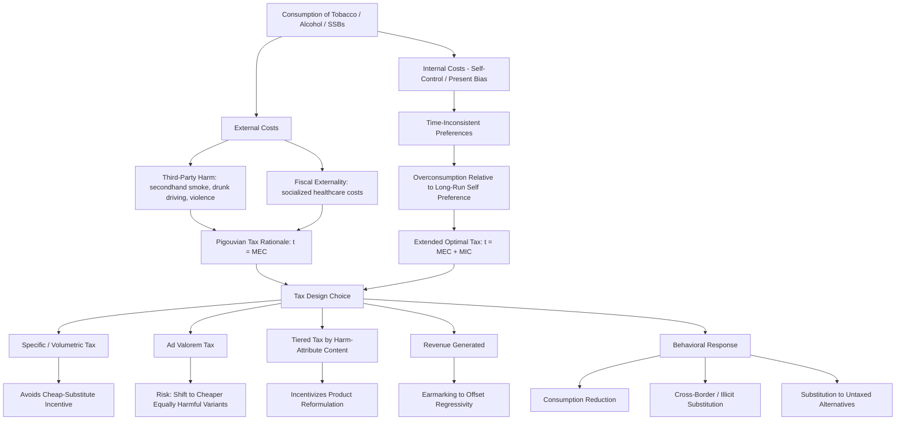

## Sin Taxes on Tobacco, Alcohol, and Sugar-Sweetened Beverages

### Overview

Sin taxes — excise taxes levied specifically on goods deemed to generate negative health or social externalities, most prominently tobacco, alcohol, and sugar-sweetened beverages (SSBs) — occupy a distinctive position in public finance and health economics. They are simultaneously justified as **corrective (Pigouvian) taxes** addressing externalities and internalities, and as **revenue-generating instruments**, and the tension between these two justifications shapes optimal tax design, incidence analysis, and political feasibility. This entry covers the economic rationale, optimal tax design principles, empirical elasticity evidence, incidence and equity considerations, and cross-product design comparisons.

### Economic Rationale

#### Externalities

Consumption of tobacco, alcohol, and (to a debated degree) SSBs generates costs borne by third parties, not merely the consumer:

- **Tobacco**: Secondhand smoke exposure imposes direct health costs on non-consuming third parties (family members, coworkers, bystanders). Additionally, publicly or collectively financed healthcare systems mean that smoking-attributable disease costs are partially socialized across the broader insured or taxpaying population — an externality that exists specifically because of the risk-pooling structure of health financing, sometimes termed a **fiscal externality**.
- **Alcohol**: Generates more directly identifiable third-party harms than tobacco or SSBs, including drunk-driving fatalities and injuries, alcohol-related violence and crime, and workplace/productivity externalities — making alcohol's externality case comparatively the most direct and least contested among the three product categories.
- **Sugar-sweetened beverages**: The externality case for SSBs is more contested than for tobacco or alcohol, since SSB-attributable harm (obesity, type 2 diabetes, cardiovascular disease) accrues predominantly to the consumer themselves rather than to identifiable third parties. The primary economic justification for SSB taxation rests more heavily on the **fiscal externality** channel (socialized healthcare costs from diet-related chronic disease in publicly financed or heavily regulated insurance systems) and on internality-based arguments (below) than on classic third-party physical harm.

#### Internalities and Behavioral Market Failures

A distinct and increasingly prominent justification for sin taxes, particularly for SSBs, rests on **internalities** — costs an individual imposes on their own future self due to systematic behavioral biases, rather than on third parties:

- **Present bias / self-control problems**: Behavioral economics models (e.g., quasi-hyperbolic discounting frameworks) formalize the idea that consumers may systematically over-consume goods with immediate gratification and delayed costs (sugar, nicotine, alcohol), even by their own long-run preferences, due to time-inconsistent preferences. A tax can function as a **commitment device** that shifts consumption toward the level the consumer's own "long-run self" would prefer.
- **Addiction and rational vs. behavioral models**: Two competing economic frameworks address addictive good taxation differently: the **rational addiction model** (Becker and Murphy, 1988) treats even addictive consumption as the outcome of forward-looking utility maximization, implying a smaller role for corrective taxation beyond pure externalities; behavioral/**"sin tax" models incorporating internalities** (e.g., work by O'Donoghue and Rabin) argue that time-inconsistent preferences justify taxation beyond the externality-only optimal rate, since the tax corrects a self-control-driven overconsumption problem, not merely a third-party harm problem. [Inference: this is a genuine and unresolved theoretical debate in public economics; which framework better describes real consumer behavior for a given product is an empirical question without full consensus.]
- **Policy relevance**: The internality argument is doing significant analytical work in justifying SSB taxes specifically, since the pure third-party externality case is comparatively weak relative to tobacco and alcohol — meaning the SSB tax debate is more directly a referendum on the internality/paternalism framework than the tobacco or alcohol tax debates are.

### Optimal Tax Design (Pigouvian Framework)

#### Setting the Tax Rate

Under a pure externality framework, the Pigouvian-optimal excise tax rate equals the marginal external cost imposed by each unit of consumption at the social optimum:

$$t^* = MEC(Q^*)$$

Where $MEC$ is the marginal external cost function and $Q^*$ is the socially optimal consumption quantity. When internalities are incorporated, the optimal tax formula extends to include the internal (self-control) cost component, following frameworks developed in the optimal "sin tax" literature (e.g., Gruber and Köszegi's extension of optimal taxation to incorporate self-control problems):

$$t^* = MEC(Q^*) + MIC(Q^*)$$

Where $MIC$ is the marginal internal cost (the self-imposed future harm not accounted for in myopic present consumption decisions). This formula's practical application is limited by the substantial empirical difficulty of quantifying $MIC$ with precision, in contrast to the comparatively more tractable (though still imperfect) empirical estimation of external healthcare and social costs.

#### Specific (Volume-Based) vs. Ad Valorem (Price-Based) Taxation

A central design question across all three product categories is whether the tax should be levied as a fixed amount per physical unit (specific/volumetric tax, e.g., cents per gram of sugar, per unit of alcohol content, per cigarette) or as a percentage of the retail price (ad valorem tax):

- **Specific/volumetric taxes** are generally preferred on public health economic grounds because they tax the harm-causing attribute directly (alcohol content, sugar content, nicotine/stick count) rather than price, avoiding the perverse incentive under ad valorem taxation for manufacturers and consumers to substitute toward cheaper but equally harmful product variants to minimize tax burden. Volumetric alcohol taxation (taxing per unit of pure alcohol regardless of beverage type) is specifically recommended in public health economics literature as superior to taxing beverage categories (beer, wine, spirits) at different flat rates, since the latter creates incentives to shift consumption toward the less-taxed alcohol-content-equivalent category.
- **Ad valorem taxes** are more susceptible to erosion by producer price discounting and tend to disproportionately tax premium products while doing less to discourage consumption of cheap, high-volume products — often the products of greatest public health concern.
- **Tiered/graduated designs**: SSB taxes in several implemented policies use a graduated structure taxing beverages at different rates based on sugar content thresholds (e.g., higher per-liter tax rates above certain grams-of-sugar-per-100ml thresholds), intended to incentivize reformulation (manufacturers reducing sugar content to move into a lower tax tier) rather than merely raising revenue. [Unverified: specific current tax tier thresholds and rates vary substantially by jurisdiction and are periodically revised; current rates for any specific country's SSB tax should be verified against that jurisdiction's current tax code.]

### Empirical Elasticity Evidence

#### Price Elasticity of Demand

The effectiveness of sin taxes in reducing consumption (as opposed to merely raising revenue) depends on the price elasticity of demand for the taxed good:

- **Tobacco**: Demand is generally found to be **price inelastic** but responsive at the margin — meta-analyses of the extensive tobacco tax literature commonly find price elasticities in the range of roughly $-0.3$ to $-0.5$ for high-income countries (a 10% price increase associated with a 3–5% reduction in consumption), with somewhat higher elasticity magnitudes found in some lower- and middle-income country studies, and higher elasticity among youth/price-sensitive subpopulations relative to established adult smokers. [Unverified: precise elasticity estimates vary considerably across studies, time periods, and countries; the range cited here reflects a commonly referenced order of magnitude in the tobacco tax literature and should be treated as illustrative rather than a fixed current parameter.]
- **Alcohol**: Own-price elasticities are also generally inelastic but vary meaningfully by beverage type, with some meta-analyses finding beer demand somewhat less elastic than wine or spirits demand, and heavy/dependent drinkers generally exhibiting lower price responsiveness than moderate drinkers — an important equity and effectiveness consideration, since taxation may do comparatively less to reduce consumption among the heaviest-consuming, highest-external-cost-generating subpopulation. [Inference: the general finding that heavy drinkers show lower price elasticity than moderate drinkers is a recurring theme in the alcohol tax literature, though specific elasticity magnitudes are heterogeneous across studies.]
- **Sugar-sweetened beverages**: SSB demand elasticity estimates also generally fall in an inelastic-but-responsive range, with observed effects in implemented tax jurisdictions (e.g., Mexico's SSB tax, various U.S. municipal SSB taxes) showing measurable reductions in taxed beverage purchases following tax implementation, alongside some degree of substitution toward untaxed beverages (water, diet beverages) and, in some studies, partial substitution toward untaxed high-calorie alternatives (an important consideration for net health-outcome assessment, since consumption substitution rather than pure reduction can attenuate the intended health benefit). [Unverified: specific consumption-reduction magnitudes from named SSB tax case studies (e.g., Mexico, Philadelphia, Berkeley) vary across studies and evaluation periods; current figures should be verified against recent peer-reviewed evaluations rather than treated as fixed.]

#### Cross-Border and Substitution Effects

A significant empirical and policy design concern across all three product categories is **cross-border shopping and illicit trade substitution**: when a sub-national or single-country tax creates a large enough price differential relative to neighboring untaxed jurisdictions, consumers (and organized illicit supply chains, particularly for tobacco) substitute toward untaxed sources rather than reducing consumption, which erodes both the health benefit and the revenue benefit of the tax. This dynamic is well-documented in the tobacco tax literature (illicit cigarette trade) and has also been observed at smaller scale in municipal-level SSB tax evaluations (cross-border purchasing to adjacent untaxed municipalities).

### Incidence and Equity Considerations

#### Regressivity

A persistent critique of sin taxes is that they are **regressive** in conventional incidence analysis — lower-income households tend to spend a higher share of income on taxed products (particularly tobacco), meaning the tax burden as a share of income falls more heavily on lower-income consumers.

- **Standard incidence critique**: Conventional tax incidence analysis (measuring tax paid as a share of current income) generally finds sin taxes regressive across income deciles for tobacco and, to a lesser and more contested degree, for alcohol and SSBs.
- **Behavioral/internality-adjusted incidence reframing**: A counter-argument from the behavioral public finance literature holds that if lower-income consumers are also more price-responsive (higher elasticity) and derive proportionally larger *internality-correction* benefit from reduced consumption (i.e., the self-control benefit of consuming less, valued from the perspective of the consumer's own long-run preferences), then a naive money-metric regressivity calculation overstates the true welfare burden on lower-income consumers, since it does not net out the internality benefit. This reframing, associated with the "optimal sin tax" behavioral public finance literature (e.g., work building on Gruber and Köszegi), remains debated and does not fully resolve the equity concern, particularly since the internality-benefit assumption requires accepting the underlying behavioral (rather than rational-addiction) model of consumer decision-making. [Inference: this is a genuinely contested theoretical position in the literature, not a settled empirical resolution to the regressivity critique.]

#### Revenue Earmarking and Redistribution

Many implemented sin tax policies address the regressivity critique partially through **earmarking** tax revenue toward programs that disproportionately benefit lower-income populations (e.g., early childhood education funding from some SSB tax revenues, tobacco control and cessation program funding from tobacco tax revenue), which can offset the burden-side regressivity through the benefit-side incidence of revenue use, though the degree of offset depends heavily on program design and targeting effectiveness.

### Cross-Product Design and Political Economy Comparison

| Dimension | Tobacco | Alcohol | Sugar-Sweetened Beverages |
| --- | --- | --- | --- |
| Externality strength | Moderate (secondhand smoke, fiscal) | Strong (drunk driving, violence, fiscal) | Weak (primarily fiscal/internality-based) |
| Typical elasticity | Inelastic, responsive at margin | Inelastic, varies by beverage type | Inelastic, responsive at margin |
| Preferred tax structure | Specific (per-stick/per-pack) | Volumetric (per unit of alcohol) | Tiered/graduated by sugar content |
| Regressivity concern | High | Moderate | Moderate to high |
| Industry opposition intensity | Very high, historically well-organized | High | High, growing as more jurisdictions adopt |
| Reformulation incentive design relevance | Limited (product is relatively homogeneous) | Moderate | High (tiered taxes explicitly designed to incentivize reformulation) |

### Illustrative Diagram: Sin Tax Rationale and Design Logic

### Related Topics

- Rational addiction theory (Becker-Murphy) versus behavioral self-control models
- Optimal sin taxation incorporating internalities (Gruber-Köszegi framework)
- Volumetric alcohol taxation design and minimum unit pricing policy comparison
- Tiered sugar-content SSB tax design and manufacturer reformulation incentives
- Illicit tobacco trade and cross-border tax avoidance economics
- Tax incidence analysis methodology and regressivity measurement
- Revenue earmarking design and equity-offsetting program targeting
- Menu labeling and information-based complements to price-based interventions
- Comparative case studies: Mexico's SSB tax, UK Soft Drinks Industry Levy, tobacco taxation in the WHO FCTC framework
- Political economy of industry lobbying against corrective health taxation