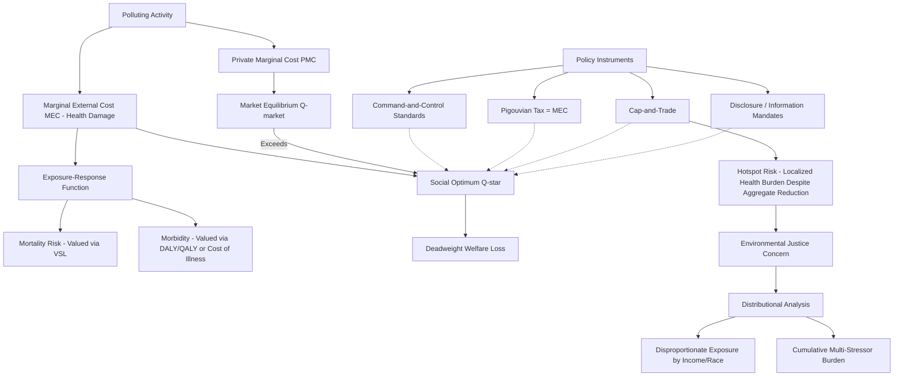

## Environmental Health Economics

### Overview

Environmental health economics analyzes the economic dimensions of health harms caused by environmental exposures — air and water pollution, hazardous waste, chemical exposures, noise, and climate-related health impacts — and the policy instruments used to correct the market failures that produce excessive exposure. This field sits at the intersection of environmental economics and health economics, combining valuation methods for non-market health outcomes with the standard theory of externalities, and is distinguished by particular methodological challenges in establishing exposure-response relationships, valuing statistical health outcomes, and addressing the frequently regressive distribution of environmental health burdens.

### The Core Externality Structure

#### Pollution as a Negative Externality

Environmental health harms are a canonical negative externality: a polluting activity (industrial production, vehicle emissions, agricultural runoff) imposes health costs on third parties who bear none of the associated production or consumption benefit and are typically not compensated. The standard welfare economics framework applies directly:

$$SMC(Q) = PMC(Q) + MEC(Q)$$

Where $SMC$ is social marginal cost, $PMC$ is private marginal cost, and $MEC$ is the marginal external cost (here, the marginal health damage from the pollutant). Because polluters equate private marginal cost to marginal benefit rather than social marginal cost, unregulated markets produce a level of polluting activity, $Q_{\text{market}}$, that exceeds the socially efficient level, $Q^*$, generating a deadweight welfare loss equal to the excess health damage over the efficient output range.

#### What Distinguishes Environmental Health Externalities from Generic Pollution Externalities

While environmental economics broadly treats pollution externalities (ecosystem damage, property value effects, aesthetic harm), environmental *health* economics specifically isolates the human health damage pathway, which introduces distinct analytical requirements:

- **Exposure-response function estimation**: Requires epidemiological dose-response relationships (e.g., the association between fine particulate matter, PM2.5, concentration and mortality/morbidity risk) rather than purely economic modeling, making this subfield inherently interdisciplinary and dependent on epidemiological evidence quality.
- **Latency and attribution complexity**: Many environmental health harms (cancer from chemical exposure, chronic respiratory disease from long-term air pollution exposure) manifest after long latency periods, complicating both scientific attribution (distinguishing environmental from other causal contributors) and the economic discounting of harms that occur far in the future.
- **Non-marginal and threshold effects**: Some pollutants exhibit threshold or non-linear dose-response relationships (e.g., possible thresholds below which no measurable health effect occurs, or supralinear effects at high exposure), which complicates the marginal-cost-pricing intuition underlying standard Pigouvian tax design and requires exposure-response-specific analysis rather than a generic linear damage function.

### Valuation Methods

#### Value of a Statistical Life (VSL)

The central valuation concept used to monetize mortality risk reductions in environmental health cost-benefit analysis is the **Value of a Statistical Life (VSL)** — not the value of an identified individual life, but the aggregate willingness-to-pay of a population for a marginal reduction in mortality risk, divided by the resulting expected number of statistical lives saved:

$$VSL = \frac{WTP}{\Delta p}$$

Where $WTP$ is the aggregate willingness to pay of a population for a risk reduction and $\Delta p$ is the resulting change in mortality probability across that population (e.g., if 100,000 people are each willing to pay $50 for an intervention that reduces each person's annual mortality risk by 1 in 100,000, the intervention saves an expected 1 statistical life, and the implied VSL is $5,000,000 in aggregate willingness to pay divided by 1 statistical life). VSL estimates are derived primarily through two empirical approaches:

- **Revealed preference (hedonic wage) studies**: Estimating the wage premium workers require to accept jobs with elevated occupational mortality risk, inferring an implicit VSL from labor market compensating differentials.
- **Stated preference (contingent valuation) studies**: Directly surveying willingness to pay for hypothetical risk reductions.

VSL estimates used in regulatory cost-benefit analysis (e.g., by the U.S. EPA) vary by country, income level, and time period, and are a frequent subject of methodological debate, particularly regarding whether and how VSL should be adjusted for the age, income, or health status of the affected population — an area with significant ethical controversy (e.g., past controversy over proposals to apply age-adjusted VSL, sometimes termed the "senior death discount" in public debate, to environmental regulations). [Unverified: current VSL figures used by specific regulatory agencies are periodically updated for inflation and methodology revisions; current values should be verified against the relevant agency's current guidance rather than treated as fixed.]

#### Disability-Adjusted Life Years (DALYs) and QALYs in Environmental Burden of Disease

For non-fatal and chronic morbidity outcomes (respiratory disease, developmental effects from lead exposure, etc.), environmental health economics frequently uses **DALYs** (combining years of life lost to premature mortality and years lived with disability, weighted by severity) as the standard metric for burden-of-disease quantification, as used extensively in the WHO/Global Burden of Disease environmental risk factor assessments, and **QALYs** in more health-system-specific cost-effectiveness contexts.

#### Cost of Illness (COI) Method

A complementary, more restrictive valuation approach sums the direct medical treatment costs and indirect productivity losses (lost wages, reduced workforce participation) attributable to an environmentally caused illness. COI is generally considered a **lower-bound** estimate of the true welfare cost of illness, since it excludes the value of pain, suffering, and non-market quality-of-life effects that WTP-based and QALY/DALY-based methods attempt to capture.

### Policy Instruments

#### Command-and-Control Regulation

Direct regulatory standards — technology mandates, emissions limits, exposure ceilings (e.g., National Ambient Air Quality Standards under the U.S. Clean Air Act framework) — set uniform requirements rather than pricing the externality directly. Economically, command-and-control regulation is generally less cost-efficient than market-based instruments when abatement costs vary across polluters (since uniform standards do not allocate abatement effort to the lowest-cost abaters), but can offer greater certainty of achieving a specific health-based exposure target, which is often prioritized in health-critical contexts (e.g., a hard cap on a carcinogen with no established safe threshold).

#### Market-Based Instruments

- **Pigouvian (corrective) taxes**: A tax set equal to the marginal external health damage per unit of pollutant, directly internalizing the externality and, in theory, achieving the efficient reduction in polluting activity at least abatement cost across firms, since each firm abates up to the point where its marginal abatement cost equals the tax.
- **Cap-and-trade / tradable permit systems**: Setting an aggregate emissions cap and allowing firms to trade permits achieves the same aggregate reduction at theoretically equivalent efficiency to a well-calibrated tax (under certainty, by the Coase theorem's logic applied to a regulatory cap), while providing more certainty over the total quantity of pollution (and associated aggregate health damage) than a tax, which provides certainty over price but not quantity. Real-world cap-and-trade programs for pollutants with localized health effects (as opposed to globally mixed pollutants like CO2) raise a distinct **hotspot problem**: trading can allow emissions to concentrate geographically even while aggregate emissions fall, potentially worsening localized health exposure in specific communities even as system-wide totals decline — a significant environmental justice critique of cap-and-trade applied to health-relevant, spatially heterogeneous pollutants.

#### Information-Based Instruments

- **Disclosure and labeling requirements**: Mandated reporting (e.g., toxic release inventories, water quality reporting, air quality index public reporting) address an information asymmetry market failure distinct from the pure externality problem — even absent a pricing mechanism, information provision can shift behavior (residential location decisions, avoidance behavior on high-pollution days) and can indirectly pressure polluters through reputational and political channels.

### Environmental Justice and Distributional Analysis

A defining feature of environmental health economics, distinguishing it from more aggregate-efficiency-focused environmental economics generally, is sustained attention to the **distributional incidence** of environmental health burdens:

- **Disproportionate exposure**: A substantial empirical literature documents that environmental health hazards (proximity to industrial facilities, hazardous waste sites, major roadways, and associated air/water pollution exposure) are disproportionately concentrated in lower-income communities and, in many contexts studied, communities of color — a pattern generally attributed to a combination of historical zoning and siting decisions, lower property values near hazards attracting lower-income residents, and comparatively less political capital to resist unwanted land uses in affected communities. [Inference: the general empirical pattern of disproportionate exposure is well-documented across a large environmental justice research literature; the relative causal weight of the specific contributing mechanisms (siting discrimination versus market sorting versus other factors) remains an active area of research and is more contested than the exposure pattern itself.]
- **Efficiency versus equity tension in policy design**: Because market-based instruments (taxes, cap-and-trade) are designed to minimize aggregate abatement cost, they can, without additional distributional constraints, permit continued or even increased localized pollution in specific communities if that is the lowest-cost outcome system-wide — creating a direct tension between aggregate efficiency and geographic/distributional equity that pure cost-minimizing policy design does not resolve on its own, motivating supplementary tools such as facility-specific emissions floors, environmental justice screening tools used in permitting decisions, or hotspot-specific caps layered onto broader trading systems.
- **Cumulative exposure and multiple-stressor burden**: Communities facing elevated environmental health risk frequently face multiple co-occurring stressors (several pollution sources plus socioeconomic stressors such as limited healthcare access), and standard single-pollutant regulatory risk assessment has been critiqued in environmental justice literature for understating true cumulative health burden by evaluating exposures in isolation rather than jointly.

### Specific Domains

#### Air Quality Economics

Air pollution (PM2.5, ozone, nitrogen oxides) is the most extensively studied environmental health economics domain, given its well-established, large-magnitude mortality and morbidity burden. Cost-benefit analyses of air quality regulations (e.g., historical U.S. Clean Air Act retrospective studies) have generally found substantial positive net benefits, with health benefits (primarily avoided mortality, monetized via VSL) constituting the large majority of quantified benefits relative to compliance costs in most major retrospective analyses. [Unverified: specific benefit-cost ratio figures from named retrospective studies should be verified against the current published analysis, as methodologies and figures have been updated across study revisions.]

#### Water Quality Economics

Water contamination economics (lead in drinking water, agricultural runoff/nitrate contamination, industrial discharge) combines acute health risk economics (e.g., lead's well-established developmental neurotoxicity, for which no safe threshold has been established, complicating standard marginal-damage-based tax-setting) with infrastructure economics (the capital-intensive, natural-monopoly characteristics of water utility infrastructure, which shapes the regulatory approach toward rate-based utility regulation combined with health-based contaminant standards rather than pure market-based pricing of contamination).

#### Climate Change and Health Co-Benefits

An increasingly prominent area of environmental health economics examines the **health co-benefits** of climate mitigation policy — for example, reducing fossil fuel combustion for climate reasons simultaneously reduces co-emitted local air pollutants (PM2.5, NOx), generating near-term, geographically proximate health benefits distinct from the long-term, globally diffuse climate benefit. Some economic analyses find that near-term monetized health co-benefits of certain climate policies can be substantial relative to, and in some assessed cases comparable in magnitude to, the direct climate benefit itself, which has been used as an argument for climate policy that does not rely solely on long-horizon climate damage valuation (subject to more contested discount rate assumptions) to justify near-term action. [Inference: the general finding that health co-benefits are often substantial is well-supported across multiple studies in this literature, though specific magnitude comparisons to climate benefits are sensitive to modeling assumptions, geography, and the discount rate applied to climate damages, and should not be treated as a fixed universal ratio.]

### Illustrative Diagram: Environmental Health Externality and Policy Structure

### Related Topics

- Value of a Statistical Life (VSL) estimation methods and regulatory application debates
- Global Burden of Disease environmental risk factor attribution methodology
- Cap-and-trade hotspot problems and environmental justice policy responses
- Lead exposure economics and no-safe-threshold regulatory design challenges
- Climate policy health co-benefits quantification and integrated assessment modeling
- Hedonic wage studies and revealed preference risk valuation methodology
- Environmental justice screening tools in regulatory permitting decisions
- Water utility rate regulation as a natural monopoly with health-based standards
- Occupational health economics as an adjacent exposure-based field
- Superfund/hazardous waste site remediation cost-benefit analysis