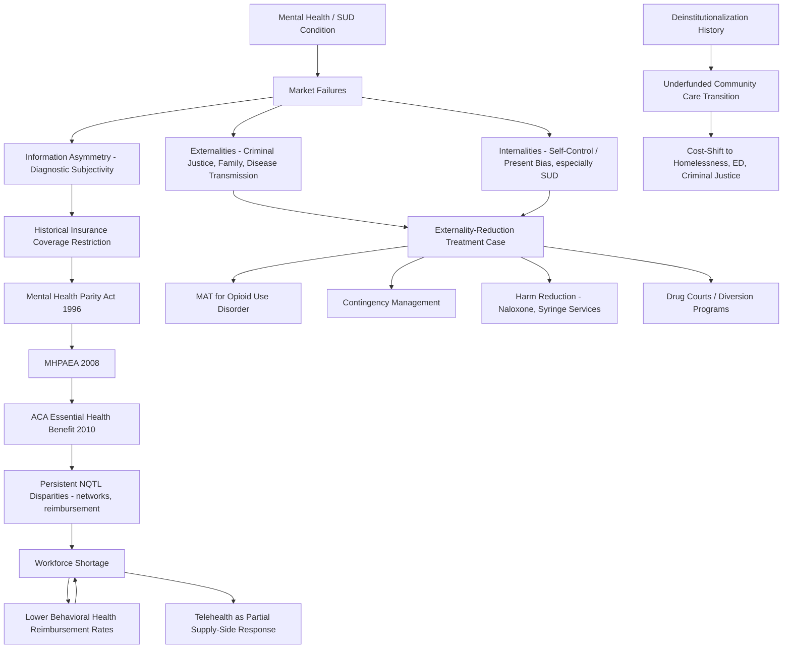

## Economics of Mental Health and Substance Use Treatment

### Overview

Mental health and substance use disorder (SUD) treatment presents a distinctive set of economic challenges relative to general medical care: historically severe insurance coverage disparities, significant externalities and internalities in the case of substance use, complex and heterogeneous treatment production functions, workforce supply constraints, and unusually difficult-to-measure outcomes. This entry covers the market failures specific to behavioral health care, the regulatory history of insurance parity, the economics of substance use disorder treatment specifically, cost-effectiveness and financing mechanisms, and workforce and access economics.

### Market Failures Specific to Behavioral Health

#### Information Asymmetry and Diagnostic Uncertainty

Mental health and SUD conditions generally involve greater diagnostic subjectivity and less standardized, objectively verifiable clinical markers than many physical health conditions (contrast a psychiatric diagnosis based substantially on symptom self-report and clinical judgment against a laboratory-confirmed diagnosis). This heightens the standard health insurance information asymmetry problem in two directions:

- **Adverse selection risk for insurers**: Because self-reported symptom severity is difficult for insurers to independently verify, insurers historically treated behavioral health coverage as more susceptible to adverse selection (individuals with unobservable higher expected utilization disproportionately selecting more generous behavioral health coverage), which contributed to historically lower coverage generosity and stricter utilization management for behavioral health relative to general medical benefits.
- **Moral hazard measurement difficulty**: Distinguishing genuine treatment-responsive utilization from potentially unnecessary utilization is harder when outcome measures are less objective, complicating insurer utilization review design and contributing to historically more restrictive prior authorization and visit-limit practices in behavioral health benefit design relative to general medical care.

#### Externalities of Untreated Mental Illness and Substance Use

Beyond the individual welfare loss from untreated illness, both conditions generate documented externalities:

- **Untreated mental illness**: Associated with elevated risk of homelessness, involvement in the criminal justice system, and, in the case of untreated psychosis in a small subset of cases, risk to others — externalities that are borne by the broader social service, criminal justice, and healthcare systems (a form of fiscal externality analogous to that discussed in the tobacco/SSB context) rather than by the treatment-seeking or treatment-avoiding individual.
- **Substance use disorders**: Generate a documented and comparatively well-quantified set of third-party externalities, including impaired driving, workplace productivity losses affecting employers and coworkers, family/household spillover effects (notably documented effects on children in households with a parent experiencing SUD), and elevated communicable disease transmission risk (e.g., injection drug use and bloodborne pathogen transmission) — providing a stronger classic-externality justification for public subsidization of SUD treatment than exists for most other health conditions.
- **Internalities and self-control problems**: As with the sin tax literature, SUD in particular is frequently analyzed through the lens of internalities — time-inconsistent preferences and impaired self-control leading to consumption/use levels the individual's own long-run preferences would not endorse — which provides an additional economic rationale (beyond externalities) for public investment in treatment access and for policy tools (e.g., commitment-device-style contingency management, discussed below) that directly address the self-control dimension. [Inference: applying the internality framework specifically to substance use disorder, rather than only to legal but harmful consumption goods like tobacco/alcohol/SSBs, is a natural extension made in the behavioral economics and addiction economics literature, though the clinical/economic modeling of addiction as a self-control problem versus a chronic brain disease with its own treatment-response dynamics involves ongoing interdisciplinary debate.]

### Insurance Parity: Regulatory History and Economic Rationale

#### The Parity Problem

Historically, U.S. health insurance plans routinely applied more restrictive coverage terms to mental health and substance use treatment than to general medical/surgical benefits — including separate (and lower) annual/lifetime dollar limits, higher cost-sharing, more restrictive visit limits, and more stringent utilization management — a pattern economists attribute to the adverse-selection and moral-hazard-measurement concerns described above, as well as historical stigma affecting both underwriting practices and political willingness to mandate equal coverage.

#### Key Legislative Milestones

- **Mental Health Parity Act of 1996**: An initial, narrow federal requirement addressing only annual/lifetime dollar limit parity, without addressing the broader set of coverage restrictions (visit limits, cost-sharing structure, utilization management).
- **Mental Health Parity and Addiction Equity Act of 2008 (MHPAEA)**: A substantially more comprehensive federal requirement mandating that group health plans offering mental health/SUD benefits apply financial requirements (deductibles, copays) and treatment limitations (visit limits, prior authorization stringency) that are **no more restrictive** than those applied to substantially all medical/surgical benefits — a "parity" rather than "mandated coverage" approach (plans are not required to cover behavioral health, but if they do, coverage terms must be comparable).
- **Affordable Care Act (2010)**: Extended parity requirements to the individual and small-group insurance markets by designating mental health and substance use disorder services as one of the **Essential Health Benefits (EHB)** categories required in ACA-compliant plans, substantially broadening parity's practical reach beyond the large-group employer market MHPAEA primarily addressed.

#### Persistent Implementation Gaps

Despite this legislative framework, empirical and regulatory enforcement literature has documented persistent **non-quantitative treatment limitation (NQTL)** disparities — parity violations that are harder to detect than simple dollar-limit or visit-count comparisons, such as more stringent "medical necessity" review criteria, narrower behavioral health provider networks (network adequacy disparities), and lower behavioral health provider reimbursement rates relative to general medical reimbursement, which indirectly restrict access even when nominal benefit design appears parity-compliant. [Unverified: the current regulatory enforcement posture, recent rulemaking updates to MHPAEA implementing regulations, and current empirical estimates of network adequacy or reimbursement rate disparities should be verified against current federal regulatory guidance and recent studies, as this remains an active area of regulatory rulemaking and litigation.]

### Substance Use Disorder Treatment Economics

#### Treatment Modalities and Cost-Effectiveness

- **Medication-Assisted Treatment (MAT) for opioid use disorder**: Pharmacological treatments (methadone, buprenorphine, naltrexone) combined with counseling are generally found in the health economics literature to be highly cost-effective relative to abstinence-only or non-pharmacological approaches, with documented reductions in overdose mortality, infectious disease transmission, and criminal justice system involvement — externality-reduction benefits that extend the cost-effectiveness case beyond the direct patient benefit alone. [Inference: MAT's comparative cost-effectiveness advantage relative to non-pharmacological-only approaches for opioid use disorder specifically is well-supported across multiple health economic evaluations, though specific ICER figures vary by study, population, and comparator.]
- **Contingency management**: A behavioral treatment approach providing tangible incentives (vouchers, prizes) contingent on verified abstinence (e.g., negative drug test results), directly leveraging the internality/self-control economic framework by providing an immediate, salient reward to counteract present-biased preference for immediate substance use — found in numerous studies to be effective, particularly for stimulant use disorders where pharmacological treatment options are more limited than for opioid use disorder.
- **Residential vs. outpatient treatment cost-effectiveness**: A recurring finding in SUD treatment economics is that outpatient and intensive outpatient treatment modalities are frequently found to be more cost-effective than residential/inpatient treatment for patients without severe comorbid medical or safety needs, given the substantially higher per-diem cost of residential treatment, though residential treatment retains a clinically important role for higher-acuity presentations (severe withdrawal risk, unstable housing, safety concerns). [Inference: this general cost-effectiveness ranking pattern (favoring outpatient modalities for lower-acuity patients) is well-supported in SUD health services research, though it should not be read as implying outpatient treatment is clinically appropriate for all patients regardless of acuity.]

#### Criminal Justice System Interaction and Diversion Economics

A distinctive feature of SUD treatment economics (less prominent in general mental health economics) is the substantial interaction with the criminal justice system:

- **Drug courts and diversion programs**: Programs that divert individuals with SUD from incarceration toward treatment have been evaluated extensively for cost-effectiveness, with a substantial body of evaluation literature finding net cost savings when accounting for averted incarceration costs and reduced recidivism, relative to standard criminal justice processing — one of the more robust "prevention/treatment is cost-saving" findings in behavioral health economics (in contrast to the more qualified findings typical of general prevention economics discussed elsewhere in this chapter). [Unverified: specific cost-savings magnitudes vary substantially across individual drug court program evaluations and jurisdictions; current aggregate figures should be verified against recent meta-analyses or national evaluation clearinghouses rather than treated as a fixed universal parameter.]
- **Naloxone distribution and harm reduction economics**: Harm reduction interventions (naloxone distribution, syringe services programs) are evaluated using standard cost-per-life-saved and cost-per-QALY frameworks, with numerous economic evaluations finding highly favorable cost-effectiveness ratios given the comparatively low per-unit intervention cost relative to averted mortality and, for syringe services specifically, averted downstream costs of bloodborne infection treatment (HIV, hepatitis C) — an application of the externality-reduction logic discussed above, since these interventions primarily function by reducing transmission risk to others in shared-use contexts, not solely individual overdose risk.

### Public Financing and Delivery System Structure

#### Medicaid as the Dominant Payer

Medicaid is the single largest payer for behavioral health and SUD treatment services in the United States, a role that has expanded further following ACA Medicaid expansion in states that adopted it (given that behavioral health and SUD conditions are disproportionately prevalent among lower-income populations who gained coverage eligibility). This concentration means Medicaid reimbursement rate policy and behavioral health benefit design decisions have outsized influence on national behavioral health treatment system capacity and access relative to their influence on general medical care markets.

#### The Community Mental Health System and Historical Deinstitutionalization

The economic structure of the U.S. public mental health system reflects the legacy of **deinstitutionalization** (the mid-to-late 20th century shift away from long-term psychiatric institutionalization toward community-based care), a policy shift that was economically justified in significant part by the promise of lower-cost community treatment, but which has been widely critiqued in retrospective health policy analysis for having occurred without commensurate investment in community-based treatment infrastructure and capacity, contributing to documented downstream cost-shifting toward homelessness services, emergency departments, and the criminal justice system — third-party and fiscal cost-shifting that a narrower initial cost-comparison analysis (institutional vs. community care cost per patient) failed to capture. [Inference: this critique of under-resourced deinstitutionalization and its downstream cost-shifting effects is a well-established finding in health policy history and mental health services research, though the balance of causal contribution among deinstitutionalization, later funding cuts, and other social policy changes remains debated among historians and policy analysts.]

### Workforce Economics

- **Behavioral health workforce shortages**: A persistent and well-documented shortage of psychiatrists, psychiatric nurse practitioners, and licensed behavioral health counselors/therapists, particularly acute in rural areas, is attributed in the workforce economics literature to a combination of comparatively lower reimbursement rates relative to other medical specialties, training pipeline capacity constraints (limited psychiatric residency slots relative to demand), and geographic maldistribution.
- **Reimbursement rate disparities**: Behavioral health provider reimbursement (both from Medicaid and, per the NQTL parity enforcement literature noted above, in many cases from commercial insurance as well) has been found in multiple studies to lag general medical/surgical reimbursement for comparable service intensity, which economic theory predicts (and empirical workforce distribution data broadly corroborates) discourages provider entry into the specialty and encourages network non-participation (providers choosing to practice on a private-pay, insurance-non-participating basis), further constraining insured-population access despite nominal coverage.
- **Telehealth expansion economics**: The expansion of telehealth-delivered behavioral health services (accelerated substantially during the COVID-19 pandemic period and subject to ongoing regulatory and reimbursement policy evolution) has been analyzed as a potential partial supply-side response to geographic workforce maldistribution, since telehealth delivery relaxes the geographic co-location constraint between provider and patient, though its effect on aggregate workforce capacity (as opposed to redistribution of existing capacity) is more limited, and its long-term reimbursement parity with in-person care remains an evolving regulatory question. [Unverified: current telehealth reimbursement parity policy and any recent extensions or expirations of pandemic-era regulatory flexibilities should be verified against current CMS and state-level regulatory guidance, given this remains subject to periodic legislative and regulatory revision.]

### Illustrative Diagram: Behavioral Health Economics Structure

### Related Topics

- MHPAEA non-quantitative treatment limitation (NQTL) enforcement and network adequacy analysis
- Medication-Assisted Treatment (MAT) cost-effectiveness and access barrier research
- Drug court and criminal justice diversion program economic evaluation
- Deinstitutionalization history and community mental health system financing
- Behavioral health provider reimbursement rate disparities and workforce supply modeling
- Contingency management and behavioral economics applications in addiction treatment
- Harm reduction cost-effectiveness (naloxone, syringe services programs)
- Telehealth reimbursement policy and behavioral health access economics
- Medicaid behavioral health benefit design across states
- Rational addiction versus behavioral/internality models of substance use disorder