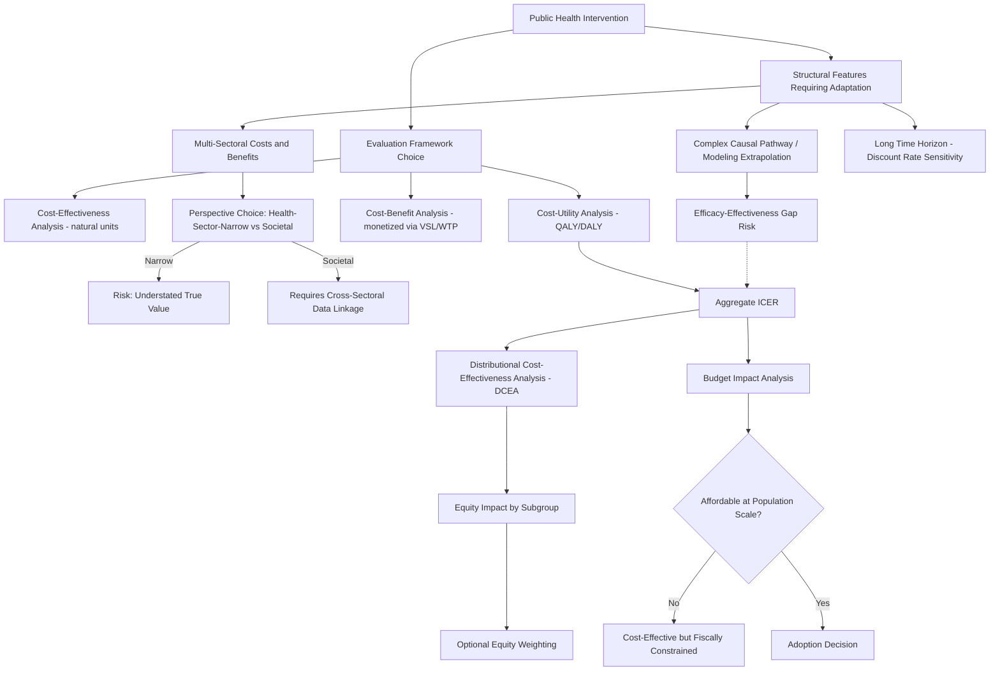

## Economic Evaluation of Public Health Interventions

### Overview

Economic evaluation of public health interventions applies the general toolkit of health economic evaluation — cost-effectiveness, cost-benefit, and cost-utility analysis — to interventions that differ structurally from clinical treatments in ways that create distinct methodological challenges. Public health interventions frequently operate at the population rather than individual level, generate effects across multiple sectors beyond health (education, criminal justice, productivity), unfold over long time horizons with distant outcomes, and often involve complex causal pathways between intervention and health effect. This entry covers the core evaluation methodologies, the specific methodological adaptations required for public health (as distinct from clinical) interventions, and the persistent debates over scope, discounting, and equity weighting in this domain.

### Core Economic Evaluation Frameworks

#### Cost-Effectiveness Analysis (CEA)

CEA compares interventions using a single, typically natural, health outcome unit (cases prevented, lives saved, life-years gained), expressed as an incremental cost-effectiveness ratio:

$$ICER = \frac{C_1 - C_0}{E_1 - E_0}$$

CEA is most useful when comparing interventions targeting the same health outcome (e.g., comparing two different vaccination delivery strategies by cost per case averted), but its single-outcome-unit design limits direct comparability across public health domains addressing fundamentally different health outcomes (e.g., comparing a tobacco control program to a road safety program) unless a common outcome metric (typically QALYs or DALYs) is used, which shifts the analysis into cost-utility analysis.

#### Cost-Utility Analysis (CUA)

CUA extends CEA by using a generic, preference-weighted health outcome metric — most commonly the **Quality-Adjusted Life Year (QALY)** or, particularly in global health and low/middle-income country contexts, the **Disability-Adjusted Life Year (DALY)** — allowing comparison across interventions addressing entirely different health conditions on a common scale. CUA is the dominant framework used by health technology assessment bodies for public health intervention prioritization decisions (e.g., NICE's public health guidance program in the UK), since it enables league-table-style ranking across the full space of candidate interventions.

- **QALY**: Combines survival duration with a health-state utility weight (0 = death, 1 = full health, though states worse than death can be assigned negative values in some methodologies), typically derived from preference-elicitation methods (standard gamble, time trade-off, or standardized instruments such as the EQ-5D).
- **DALY**: Combines Years of Life Lost (YLL) due to premature mortality with Years Lived with Disability (YLD), weighted by disability severity weights, and is the standard metric of the WHO/Global Burden of Disease framework, more commonly used in global and international public health economic evaluation than in high-income-country domestic health technology assessment (which more often defaults to QALYs).

#### Cost-Benefit Analysis (CBA)

CBA monetizes all outcomes, including health effects (typically via Value of a Statistical Life or willingness-to-pay methods, as discussed in environmental health economics), enabling direct comparison of net benefit (benefits minus costs, or a benefit-cost ratio) both within the health sector and against non-health public investments competing for the same budget (e.g., comparing a public health program to an infrastructure or education investment using a common monetary metric). CBA's principal methodological challenge is the well-documented difficulty and controversy of monetizing health and non-market outcomes with a defensible, non-arbitrary value.

### Methodological Adaptations Specific to Public Health Interventions

#### Multi-Sectoral Costs and Benefits

Unlike most clinical interventions, whose costs and benefits are largely confined to the health sector, public health interventions frequently generate substantial costs and benefits in other sectors:

- **Cross-sectoral benefit examples**: A youth violence prevention program may generate benefits captured primarily in criminal justice system cost savings and educational attainment gains rather than direct healthcare cost savings; a road safety intervention generates benefits in reduced healthcare costs, reduced productivity loss, and reduced legal/insurance system costs; early childhood nutrition interventions generate long-run benefits in educational attainment and lifetime earnings that substantially exceed any direct healthcare cost impact.
- **The "narrow health-sector perspective" critique**: A standing methodological critique in public health economic evaluation is that analyses conducted from a narrow health-sector-payer perspective (counting only healthcare costs and savings) systematically understate the true value of many public health interventions, since a substantial share of their benefit accrues outside the health budget. This has motivated increasing methodological advocacy for a **societal perspective** in public health economic evaluation — one that captures costs and benefits across all affected sectors — even though a societal perspective analysis is data-intensive and requires cross-sectoral data linkage that is often unavailable or of variable quality. [Inference: this critique and the corresponding advocacy for societal-perspective analysis is a well-established and recurring methodological position in public health economic evaluation guidance (e.g., reflected in some national HTA body guidance for public health-specific appraisals), though practical implementation varies widely by study given data constraints.]

#### Complex Intervention Evaluation and Causal Pathway Uncertainty

Many public health interventions are **complex interventions** — involving multiple interacting components (e.g., a community-based obesity prevention program combining school nutrition policy, built-environment changes, and community education) — where the causal pathway from intervention to health outcome is longer, more diffuse, and more context-dependent than for a single clinical treatment with a well-defined biological mechanism. This has several economic evaluation implications:

- **Modeling extrapolation burden**: Because complex public health interventions often lack direct trial evidence linking the intervention all the way through to final health outcomes (mortality, chronic disease incidence) within a feasible study timeframe, economic evaluations frequently rely on **decision-analytic modeling** that chains together evidence from multiple sources (intervention effect on an intermediate outcome, established epidemiological relationships between the intermediate outcome and final health outcomes) rather than a single trial-based cost-effectiveness estimate — introducing additional structural and parameter uncertainty relative to a directly trial-measured clinical cost-effectiveness estimate.
- **External validity and context-dependency**: Public health intervention effectiveness is frequently more context-dependent (varying by community characteristics, existing infrastructure, implementation fidelity) than pharmaceutical or device efficacy, which is comparatively more biologically invariant across settings — raising distinct challenges for generalizing a cost-effectiveness estimate from one jurisdiction's evaluation to inform policy decisions elsewhere. [Inference: this general context-dependency concern for complex public health interventions relative to more biologically standardized clinical interventions is a widely recognized methodological point in public health evaluation literature, particularly associated with critiques of naive evidence transfer across settings.]

#### Long Time Horizons and Discounting

Many public health interventions (early childhood programs, tobacco control, vaccination) generate benefits that accrue over decades, making the choice of **discount rate** for both costs and health outcomes an unusually consequential methodological parameter:

- Standard health technology assessment guidance commonly specifies a single discount rate applied to both costs and health outcomes (differential discounting, applying a lower rate to health outcomes than costs, has been proposed and adopted in some national guidance as a way to avoid excessively penalizing interventions with long-delayed health benefits, though this remains a debated methodological choice rather than a universal standard). [Unverified: specific current discount rate requirements vary by country and HTA body and are periodically revised; current rates for any named jurisdiction should be verified against that body's current published methods guidance.]
- Because public health intervention benefit streams are frequently more heavily weighted toward the distant future than typical clinical treatment benefit streams (which often manifest over a shorter post-treatment horizon), public health cost-effectiveness estimates tend to be, all else equal, more sensitive to discount rate assumptions than typical clinical CEA — a technical point with direct policy relevance in prevention-versus-treatment allocation debates (as discussed elsewhere in this chapter).

### Equity Considerations in Public Health Economic Evaluation

#### Distributional Cost-Effectiveness Analysis (DCEA)

A significant recent methodological development is **Distributional Cost-Effectiveness Analysis**, which extends standard aggregate CEA/CUA by explicitly modeling how costs and health outcomes are distributed across population subgroups (typically socioeconomic strata), rather than reporting only an aggregate, population-average ICER. This responds to a core limitation of standard aggregate CEA: an intervention can be judged cost-effective in aggregate while simultaneously worsening health inequality (if its benefits accrue disproportionately to already-advantaged subgroups) or, conversely, an intervention with a less favorable aggregate ICER might be equity-improving if its benefits accrue disproportionately to disadvantaged groups — information a purely aggregate analysis does not surface. DCEA outputs are typically presented alongside, rather than as a replacement for, standard aggregate cost-effectiveness results, providing decision-makers a supplementary equity-impact lens.

#### Equity Weighting

Related to but distinct from DCEA, some economic evaluation frameworks incorporate explicit **equity weights** — adjusting the value assigned to health gains based on the socioeconomic or health status position of the recipient population (e.g., valuing a QALY gained by a more disadvantaged population more highly than an equivalent QALY gained by a more advantaged population) — a normatively explicit departure from the standard "a QALY is a QALY regardless of recipient" assumption underlying conventional aggregate CUA. Equity weighting remains more common in academic and international development-oriented public health economic evaluation frameworks than in mainstream national HTA body practice, reflecting both a genuine normative debate (whether health economic evaluation should be equity-neutral or equity-weighted) and practical challenges in achieving methodological and political consensus on specific weight values. [Inference: the greater practical adoption of equity weighting in academic/international development contexts relative to mainstream national HTA practice reflects a general pattern in the literature, though specific adoption varies by country and evaluation body and should not be treated as a fixed universal rule.]

### Budget Impact Analysis as a Complement to Cost-Effectiveness

Distinct from cost-effectiveness analysis (which addresses value-for-money at a given cost) is **Budget Impact Analysis (BIA)**, which estimates the total financial impact of adopting an intervention on a specific payer's budget over a defined time horizon, holding cost-effectiveness constant. An intervention can be highly cost-effective (favorable ICER) while still being fiscally unaffordable within a constrained short-term budget if it requires a large population-wide rollout (a common tension for population-level public health interventions applied to large at-risk populations, as opposed to a clinical treatment targeted at a narrower diagnosed patient population) — meaning public health decision-makers routinely require both a cost-effectiveness assessment (is this good value) and a budget impact assessment (can we afford to implement this now, at this scale) before adoption decisions, particularly in resource-constrained public payer contexts.

### Common Methodological Pitfalls in Public Health Economic Evaluation

- **Static vs. dynamic modeling for infectious disease interventions**: As discussed in the vaccination-specific entry in this chapter, evaluations of interventions with transmission-blocking effects (vaccination, and by extension other infection-control interventions) that use static rather than dynamic transmission models will systematically understate cost-effectiveness by omitting herd-protection externality benefits.
- **Ignoring intervention synergies and program interactions**: Evaluating public health interventions in isolation can miss cost or effect interactions when multiple interventions are implemented jointly (e.g., combined screening and treatment programs, or co-located service delivery reducing per-intervention marginal delivery cost), leading to potentially biased incremental estimates when interventions are, in practice, adopted as part of a broader program package rather than standalone.
- **Selective outcome measurement**: Given the multi-sectoral benefit profile common to public health interventions, evaluations that measure only readily available healthcare-sector outcome data (due to data access constraints) rather than the full relevant outcome set risk materially understating total intervention value — directly related to the narrow-perspective critique discussed above.
- **Confusing efficacy (controlled trial conditions) with effectiveness (real-world implementation conditions)**: Public health interventions are particularly susceptible to an efficacy-effectiveness gap given their frequent dependence on population-level behavioral uptake, implementation fidelity across variable delivery settings, and sustained engagement over time — meaning economic evaluations based on efficacy trial data may substantially overstate the cost-effectiveness ultimately achieved under real-world program rollout conditions. [Inference: the general concern about efficacy-effectiveness gaps being especially pronounced for behaviorally dependent public health interventions relative to more mechanistically direct clinical treatments is a widely recognized methodological caution in this field.]

### Illustrative Diagram: Public Health Economic Evaluation Framework

### Related Topics

- Distributional Cost-Effectiveness Analysis (DCEA) methodology and applications
- Societal perspective versus health-sector-payer perspective debates in HTA
- Discount rate selection and differential discounting of costs versus health outcomes
- Budget Impact Analysis methodology for population-scale public health programs
- Decision-analytic modeling techniques for complex intervention evaluation
- Efficacy-effectiveness gap and real-world evidence in public health evaluation
- Global Burden of Disease DALY methodology and international comparability
- Value of a Statistical Life applications in public health cost-benefit analysis
- Equity weighting frameworks in global health economic evaluation
- League table construction and cross-program public health resource allocation