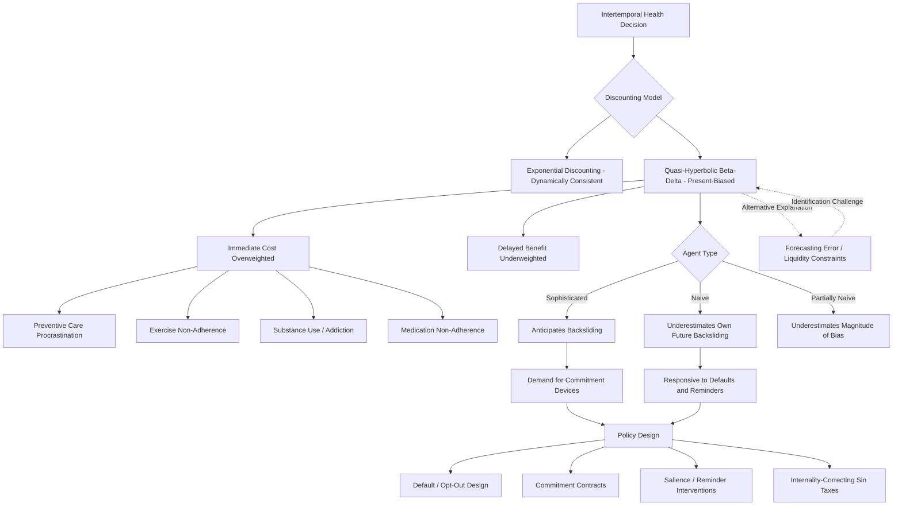

## Time-Inconsistent Preferences and Health Behaviors

### Overview

Time-inconsistent preferences describe a systematic pattern in intertemporal choice where an individual's relative valuation of a given trade-off between a smaller-sooner and larger-later outcome changes depending on when the choice is evaluated — even though nothing relevant to the trade-off itself has changed except the passage of time. This departs from the standard exponential discounting model assumed in classical economics, and has become a central analytical framework in health economics for explaining a wide range of otherwise puzzling health behaviors: procrastinated preventive care, exercise non-adherence, unhealthy diet persistence, smoking and addiction, and medication non-adherence. This entry covers the formal modeling of time-inconsistent preferences, their specific application to health behavior domains, the resulting welfare and policy implications, and the debate over how to interpret and correct for these preferences.

### Formal Modeling Frameworks

#### Exponential Discounting (The Standard Benchmark)

The classical economic model of intertemporal choice assumes **exponential discounting**, where the discounted value of a future outcome at time $t$, evaluated from the present, is:

$$U = \sum_{t=0}^{T} \delta^t u(c_t)$$

Where $\delta \in (0,1)$ is a constant per-period discount factor. A defining property of exponential discounting is **dynamic consistency**: a plan made today about a future trade-off between periods $t$ and $t+1$ will still be preferred when period $t$ actually arrives — the discount factor between any two adjacent periods is constant regardless of how far in the future those periods are.

#### Quasi-Hyperbolic (Beta-Delta) Discounting

The dominant formal model used in behavioral health economics to capture time-inconsistent preferences is the **quasi-hyperbolic ($\beta$-$\delta$) discounting model**, introduced by Laibson (1997) building on earlier hyperbolic discounting work (Ainslie, Loewenstein and Prelec):

$$U_t = u(c_t) + \beta \sum_{\tau=t+1}^{T} \delta^{\tau - t} u(c_\tau)$$

Where $\beta \in (0,1)$ applies an additional discount specifically to *all future periods relative to the present period*, while $\delta$ continues to discount consistently between any two future periods. The critical feature is that $\beta < 1$ creates a **present bias**: any trade-off involving "now" versus "later" is evaluated more impatiently than an equivalent trade-off entirely within the future (e.g., "later" versus "even later"), even though the underlying time gap between the two options may be identical. This produces genuine **dynamic inconsistency**: a plan made in advance (e.g., "I will exercise starting next Monday") is optimal from today's perspective but will typically be abandoned when "next Monday" actually arrives and becomes "now," at which point the same present-bias discount $\beta$ reapplies to the new "now."

#### Naive vs. Sophisticated Agents

A crucial modeling distinction, with direct implications for both individual behavior and policy design, is whether an agent correctly anticipates their own future time-inconsistent behavior:

- **Naive agents**: Incorrectly believe their future selves will behave according to the agent's current (today's) preferences — that is, a naive agent today believes their future self will follow through on today's plan, not realizing that the future self will also apply a fresh present-bias discount when that future moment arrives. Naive agents systematically underestimate their own future procrastination and overestimate their own follow-through, and are the population for whom default-based and reminder-based nudges tend to be particularly effective, since these agents genuinely intend to follow through but predictably fail to without external structure.
- **Sophisticated agents**: Correctly anticipate their own future present bias and their consequent tendency to deviate from today's plan. Sophisticated agents may proactively seek out **commitment devices** — mechanisms that restrict or penalize their own future choice set to prevent anticipated future backsliding (e.g., pre-committing to a gym contract with cancellation penalties, or enrolling in a program with financial deposits contingent on healthy behavior).
- **Partial naivete**: More recent modeling extensions (e.g., work by O'Donoghue and Rabin) allow for intermediate cases where agents correctly recognize that they exhibit present bias but underestimate its magnitude — a modeling refinement found to better match some observed empirical patterns of both commitment-device demand and continued procrastination than either the fully naive or fully sophisticated polar cases alone. [Inference: the empirical support for partial naivete as a better-fitting intermediate case is drawn from a subset of the behavioral economics literature testing commitment device demand and self-control; this remains an active area of empirical refinement rather than a fully settled parameter estimate.]

### Applications to Specific Health Behavior Domains

#### Preventive Care and Screening Procrastination

Time-inconsistent preferences directly predict systematic under-utilization of preventive care and screening: the cost of a preventive visit (time, minor discomfort, inconvenience) is borne immediately, while the benefit (reduced future disease risk or earlier detection) is delayed and probabilistic. Under quasi-hyperbolic discounting, this cost-benefit timing structure is precisely the pattern most heavily penalized by present bias, predicting rational-in-the-moment procrastination of preventive care even among individuals who, from a longer-run perspective, would prefer to have completed the screening. This directly parallels, and provides a micro-foundation for, the identifiable-victim-effect and prevention-underinvestment dynamics discussed in this text's coverage of prevention-versus-treatment resource allocation.

#### Exercise and Dietary Behavior

Exercise adoption and healthy dietary change are frequently cited as paradigm cases of time-inconsistent behavior: the effort/discomfort cost of exercise or dietary restriction is immediate, while health benefits (weight management, cardiovascular risk reduction) accrue gradually over an extended horizon. This structure predicts:

- **Systematic under-exercise relative to stated long-run intentions**: Survey and gym-membership-usage studies have documented a gap between stated intentions (often measured via gym membership purchase, itself sometimes interpreted as a commitment-device purchase) and realized attendance, a pattern consistent with, though not conclusively proving, present-biased preferences (alternative explanations involving pure forecasting error about future scheduling constraints are also consistent with some of the same data patterns). [Inference: the intention-behavior gap in exercise is well-documented empirically; its interpretation as specifically evidence of quasi-hyperbolic present bias, as opposed to alternative explanations such as unforeseen circumstances or simple forecasting error, is a matter of ongoing empirical and theoretical discussion in the literature, not a fully settled attribution.]
- **New Year's resolution / "fresh start effect" patterns**: The empirically documented tendency for healthy-behavior initiation (gym sign-ups, diet starts) to cluster around temporal landmarks (New Year, birthdays, Mondays) has been analyzed through a behavioral economics lens (the "fresh start effect," associated with research by Dai, Milkman, and Riis) as reflecting a psychological mechanism that temporarily overcomes present bias by creating a salient boundary that separates a "flawed past self" from an aspirational "future self," providing a temporary behavioral change window that policy and commercial health-behavior interventions have increasingly sought to leverage deliberately.

#### Addiction and Substance Use

As discussed in this text's coverage of sin taxes and substance use treatment economics, addictive substance consumption is a central application domain for time-inconsistent preference modeling:

- The **quasi-hyperbolic addiction framework** treats addictive consumption as reflecting a particularly acute present-bias problem, where the immediate reward of consumption is heavily overweighted relative to delayed health, financial, and social costs, and where sophisticated agents' demand for commitment devices (e.g., contingency management programs, discussed in the SUD treatment entry) is interpreted as direct evidence of at least partial sophistication about one's own present bias.
- This framework stands in explicit theoretical contrast to the **rational addiction model** (Becker and Murphy, 1988), which models even addictive consumption using standard exponential discounting and forward-looking rational expectations, attributing addictive behavior to rational responses to the addictive good's specific utility structure (where past consumption increases the marginal utility of current consumption) rather than to any discounting anomaly. The empirical and theoretical debate between these two framings remains active, with different implications for optimal policy design (rational addiction models generally support smaller corrective interventions limited to externalities, while present-bias/internality models support more extensive corrective taxation or default-based interventions, as discussed in the sin tax entry's optimal tax formula extension).

#### Medication Adherence

Time-inconsistent preferences have also been applied to explain persistent patterns of medication non-adherence for chronic conditions requiring sustained daily treatment (e.g., antihypertensives, statins, HIV antiretroviral therapy), where the immediate "cost" is a minor daily hassle (remembering to take a pill, potential side effects) and the benefit (avoided disease progression) is diffuse and delayed — a structure directly analogous to the exercise adherence case, and one that has motivated adherence-focused behavioral interventions such as reminder systems, adherence-linked micro-incentive programs, and simplified dosing regimens intended to reduce the salience of the immediate cost.

### Welfare and Policy Implications

#### The Welfare Ambiguity of "Revealed Preference"

Time-inconsistent preferences complicate the standard welfare economics assumption that observed choices reveal true preferences, since a present-biased individual's "in-the-moment" choice (e.g., skipping the gym) and their "long-run planning" choice (e.g., signing the gym membership) reflect the same person's genuinely different, time-inconsistent preference orderings at different points in time — raising the normative question of which self's preferences should be treated as authoritative for welfare and policy evaluation purposes. This question underlies the broader **libertarian paternalism** and "nudge" policy framework (associated with Thaler and Sunstein), which explicitly argues that policy can be designed to help an individual's own long-run-preferred self overcome their short-run present-biased self, without necessarily overriding the individual's ultimate choice (preserving opt-out freedom).

#### Policy Instruments Motivated by Time-Inconsistent Preference Models

- **Commitment devices**: Policy or product designs that allow individuals (particularly sophisticated ones) to voluntarily restrict their own future choice set — e.g., health savings mechanisms with early-withdrawal penalties for non-health spending, or formal commitment contract platforms — directly targeting the demand for self-control assistance identified by the model.
- **Default and opt-out design**: As discussed in the vaccination entry, setting healthy behaviors (enrollment in wellness programs, organ donation, retirement/health savings contributions) as the default option, requiring active opt-out, leverages the finding that present-biased and inertia-prone individuals disproportionately stick with defaults, shifting the "cost of action" away from the healthy behavior and onto the unhealthy alternative.
- **Reminders and salience interventions**: Since present bias operates partly through the differential salience of immediate versus delayed costs/benefits, interventions that increase the salience of delayed benefits at the moment of decision (e.g., text message reminders framed around long-run health goals) are directly motivated by the model, though effect sizes in field implementations are frequently modest and heterogeneous across studies. [Inference: the general finding of positive but often modest and heterogeneous effect sizes for reminder-based interventions is a recurring pattern across behavioral health intervention trial literature, though specific magnitudes vary substantially by context, population, and behavior targeted.]
- **Sin taxes and internality-correcting taxation**: As detailed in this chapter's sin tax entry, the quasi-hyperbolic framework provides the formal micro-foundation for extending optimal corrective taxation beyond pure externality correction to include an internality-correction component, directly linking this entry's theoretical framework to that entry's applied policy design.

#### Critiques and Alternative Explanations

Several critiques temper the explanatory reach of the time-inconsistent preference framework in health behavior contexts:

- **Identification challenges**: Distinguishing genuine present-biased discounting from alternative explanations for the same observed behavior patterns — including simple forecasting errors about future circumstances, liquidity constraints affecting the feasibility of following through on plans, or evolving (rather than time-inconsistent) preferences — is empirically difficult, and much of the health behavior literature applying this framework relies on behavioral patterns consistent with, rather than uniquely diagnostic of, quasi-hyperbolic discounting specifically. [Inference: this identification critique is a standard methodological caution raised within the behavioral economics literature itself regarding the interpretation of field-behavior evidence for present bias, not a claim that the underlying phenomenon is not real, but rather that attributing specific behaviors definitively to this specific mechanism (as opposed to related but distinct explanations) requires care.]
- **Heterogeneity in present bias parameters**: Empirical estimates of $\beta$ vary substantially across studies, populations, and elicitation methods (lab-based intertemporal choice tasks vs. field behavior), and there is no settled consensus "typical" value, complicating direct application of the formal model to precise policy parameter calibration (e.g., the internality-correcting tax component discussed in the sin tax entry) without context-specific empirical estimation. [Unverified: given the wide heterogeneity and ongoing methodological debate over elicitation approaches, no single current point estimate of $\beta$ should be treated as broadly generalizable across contexts without checking the specific study population and method.]

### Illustrative Diagram: Time-Inconsistent Preference Structure and Health Behavior Applications

### Related Topics

- Quasi-hyperbolic discounting formal modeling (Laibson 1997; O'Donoghue and Rabin extensions)
- Rational addiction theory (Becker-Murphy) as a competing framework
- Libertarian paternalism and nudge-based health policy design
- Commitment device design and demand estimation in health behavior interventions
- Fresh start effect and temporal landmark-based behavior change interventions
- Internality-correcting taxation formulas in sin tax policy design
- Default effects and opt-out enrollment in health program design
- Present bias parameter estimation methods and empirical heterogeneity
- Financial incentive design for health behavior change (contingency management applications)
- Retirement and health savings behavior as parallel time-inconsistency domains