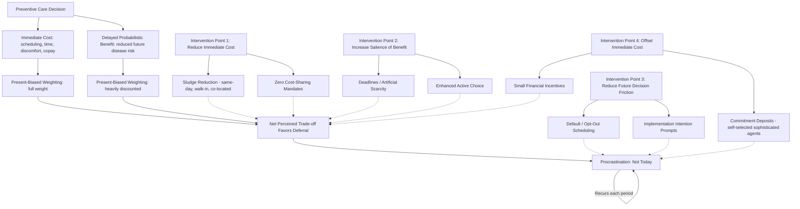

## Present Bias and Procrastination in Preventive Care

### Overview

Preventive care procrastination — delaying or indefinitely postponing screenings, vaccinations, checkups, and other preventive health services despite intending or being advised to obtain them — is one of the most extensively documented applications of present-bias theory in health behavior. This entry focuses specifically on the mechanisms by which present bias produces preventive care procrastination, the empirical evidence documenting the phenomenon across specific preventive care domains, and the behavioral intervention designs developed specifically to counteract it, building on and applying the general time-inconsistent preference framework covered elsewhere in this chapter.

### Why Preventive Care Is Structurally Vulnerable to Present Bias

#### The Cost-Benefit Timing Asymmetry

Preventive care exhibits a specific temporal structure that is, among health behaviors, particularly susceptible to present-biased discounting: the cost of obtaining preventive care (scheduling time, travel, the procedure itself, potential discomfort, time away from work) is concentrated and immediate, while the benefit (reduced probability of a future adverse health event, or earlier detection enabling better treatment outcomes) is diffuse, probabilistic, and realized — if at all — only after a substantial delay, often years. Under the quasi-hyperbolic discounting model detailed elsewhere in this chapter, this "immediate cost, delayed and uncertain benefit" structure is precisely the pattern most heavily penalized by the present-bias parameter $\beta$, since the entire benefit stream falls into the "future" bucket that receives the additional $\beta$ discount, while the cost is borne in the undiscounted present period.

#### Distinguishing Procrastination from Simple Non-Adherence

It is analytically useful to distinguish present-bias-driven procrastination from other, non-behavioral-economics explanations for low preventive care uptake, since policy design differs depending on the underlying mechanism:

- **Present-bias-driven procrastination**: The individual genuinely intends, from a longer-run planning perspective, to obtain the preventive service, but repeatedly defers the specific action of scheduling or attending, with each individual moment's "not today" decision being locally rational under present-biased preferences even though it is inconsistent with the individual's own stated longer-run intention.
- **Access barriers**: Lack of insurance coverage, transportation, childcare, or paid time off can produce observably similar low-uptake outcomes without any discounting anomaly — these are pure resource/constraint barriers, and interventions addressing present bias (e.g., reminders) will have limited effect if the binding constraint is instead a structural access barrier.
- **Risk misperception**: Underestimating one's own baseline disease risk (a judgment/information problem) can also produce low preventive care uptake independent of any discounting bias — an individual with accurate risk perception and no access barriers might still rationally (by their own risk assessment, even if that assessment is inaccurate) decline screening.
- **Fear and avoidance**: Anticipated anxiety about a potential adverse result (e.g., a cancer diagnosis) can motivate active avoidance that is distinct from present-biased discounting, since it reflects a genuine (if perhaps disproportionate) weighting of a specific feared outcome rather than a generic undervaluing of the future.

In practice, these mechanisms frequently co-occur and are difficult to fully disentangle in observational data, which complicates precise attribution of any observed procrastination pattern to present bias specifically, though intervention studies that specifically target present-bias mechanisms (reminders, deadlines, commitment devices) and find measurable effects provide indirect evidence consistent with a meaningful present-bias contribution. [Inference: the general point that these mechanisms co-occur and are difficult to fully disentangle is a standard methodological caveat in the preventive care behavioral economics literature, and the "indirect evidence" framing here reflects that most support for present bias as a contributing mechanism comes from intervention-response patterns rather than direct, unconfounded measurement of individual discount parameters in real-world screening decisions.]

### Empirical Evidence Across Preventive Care Domains

#### Cancer Screening

Cancer screening (colonoscopy, mammography, Pap smears) is among the most heavily studied preventive care procrastination domains, given well-established clinical guidelines specifying recommended screening intervals against which actual uptake and timeliness can be benchmarked.

- **Colonoscopy scheduling studies**: Field experiments involving colonoscopy scheduling have found that specific commitment and default-based interventions (e.g., automatically scheduling an appointment with an easy opt-out, versus requiring the patient to proactively call and schedule) produce meaningfully different completion rates, a pattern consistent with defaults and reduced action-friction counteracting procrastination tendencies, since the "do nothing" default is precisely what a present-biased individual will select if left unscheduled. [Inference: this general pattern — that default-based/opt-out scheduling designs outperform standard opt-in scheduling for screening completion — is well-documented in the health behavioral economics literature; exact completion rate figures vary by study, population, and specific implementation and should be verified against the primary study if a specific figure is needed.]
- **Repeated deferral patterns**: Longitudinal claims-data studies of overdue screening populations have documented that many patients who are overdue for guideline-recommended screening report intending to schedule it, and the gap between stated intention and completed action tends to persist across multiple observation periods rather than resolving — a pattern consistent with a genuinely time-inconsistent (rather than merely one-time-delayed) decision process.

#### Vaccination Timing

While the *decision* to vaccinate at all is covered by the externality/free-rider framework detailed in this chapter's vaccination entry, the *timing* of vaccination among individuals who do not object to vaccination in principle is also subject to present-bias-driven procrastination — deferring an already-intended flu shot or booster dose past the clinically optimal window, with each day's deferral being a locally low-stakes decision that cumulatively can result in never completing the vaccination within the relevant season or interval.

#### Dental and Vision Care

Routine dental checkups and vision screenings, which similarly involve an immediate scheduling/attendance cost against a benefit (early detection of decay, glaucoma, or other slow-progressing conditions) that is both delayed and, for many minor issues, individually low-stakes on any single missed interval, show comparable procrastination patterns in health services utilization data, and are frequently used in the behavioral economics literature as parallel domains to test the generalizability of interventions initially validated in cancer screening or vaccination contexts.

### Behavioral Intervention Designs

#### Active Choice and Enhanced Active Choice

**Active choice** interventions require the individual to make an explicit yes/no decision (rather than allowing passive deferral by simply not acting), which has been found in some studies to increase preventive service uptake relative to a pure opt-in baseline (where inaction is the default) by removing the option of unconsidered procrastination, though active choice interventions generally produce a smaller uptake increase than full default/opt-out designs (where inaction directly results in receiving the service, absent an active opt-out) — reflecting the difference between merely forcing a decision versus additionally setting the default outcome to the recommended action. **Enhanced active choice** designs go further by explicitly highlighting the potential regret or consequence of forgoing the service at the moment of choice, aiming to make the delayed cost of non-action more salient at the decision point.

#### Deadlines and Artificial Scarcity

Introducing an explicit deadline (e.g., "schedule your mammogram by [date] to remain in-network at no cost" or enrollment-window framing) leverages present bias constructively by converting a diffuse, non-urgent future action into a time-bounded decision with a salient near-term consequence for inaction, shifting the decision's framing away from the "someday" bucket that is most heavily discounted under present bias and into a nearer-term, less-discounted decision frame.

#### Reminders and Implementation Intentions

- **Simple reminders** (text messages, mailed postcards, portal notifications) address present bias partly by re-injecting salience of the intended action at a moment closer to when it can actually be acted upon, though evidence on simple reminders alone shows generally modest and heterogeneous effect sizes across studies.
- **Implementation intention prompts**: A specific and generally more effective reminder design, drawing on psychological research (Gollwitzer), asks the individual to specify a concrete "if-then" plan (e.g., "I will get my flu shot on [specific date] at [specific location/time]") rather than a generic reminder to "get your flu shot soon." By converting a vague future intention into a concrete, dated commitment at the moment the reminder is delivered, implementation intention prompts have been found in multiple studies to outperform generic reminders for preventive care completion, plausibly because they reduce the future scheduling decision to a lower-friction, pre-specified action rather than requiring a fresh present-biased trade-off to be resolved at an unspecified future moment. [Inference: the general finding that implementation-intention-style prompts outperform generic reminders is reasonably well-supported across multiple preventive care intervention studies, though the magnitude of the relative improvement varies by study and setting.]

#### Financial Incentives and Micro-Commitment Devices

- **Small, immediate financial incentives**: Conditional cash or voucher incentives tied to completing a preventive service directly counteract present bias by adding an immediate reward to offset the immediate cost, shrinking or reversing the net immediate cost that drives procrastination — found in numerous studies to increase preventive service uptake, generally in a dose-responsive manner (larger incentives producing larger uptake effects, though with diminishing returns and cost-effectiveness considerations relevant to program design at scale).
- **Commitment contracts and deposit-based designs**: Programs allowing individuals to voluntarily place a refundable deposit that is returned upon completing a health behavior (a design directly targeting sophisticated present-biased agents seeking a self-imposed enforcement mechanism, as discussed in this chapter's general time-inconsistent preferences entry) have been piloted for various preventive and health-maintenance behaviors, with take-up rates for the commitment device itself frequently limited to a self-selected subset of the population — a pattern that, per the sophistication/naivete distinction, is expected under the theoretical model, since only agents who correctly anticipate their own procrastination risk would be expected to voluntarily seek out a costly self-restriction mechanism.

#### Reducing Action Friction (Sludge Reduction)

A complementary intervention category focuses not on directly counteracting the discounting bias itself but on reducing the magnitude of the immediate "cost" side of the trade-off — same-day scheduling availability, walk-in options, co-located services (e.g., offering a flu shot at a routine visit for an unrelated condition, sometimes termed **opportunistic screening/vaccination**), and simplified scheduling interfaces. Because present bias operates on the relative weighting of immediate versus delayed costs and benefits, reducing the absolute magnitude of the immediate cost (rather than changing how heavily it is weighted) also narrows the net effect of present-biased discounting on the decision, even without directly altering the discounting process itself.

### Policy and Health System Design Implications

#### Default Scheduling in Health System Workflow Design

Increasingly, health systems have redesigned care workflows to embed default scheduling of preventive services directly into other care encounters (e.g., automatically scheduling a mammogram at checkout following a primary care visit, rather than instructing the patient to schedule it themselves later), operationalizing the default/opt-out design principle directly into clinical workflow and EHR-driven scheduling systems, an approach generally requiring health system-level implementation investment (workflow redesign, staff training, EHR configuration) rather than a purely patient-directed behavioral nudge.

#### Insurance Benefit Design Interaction

As discussed in this chapter's prevention-versus-treatment allocation entry, cost-sharing structure interacts directly with present-bias-driven procrastination: even a modest copay or deductible applied to preventive services adds to the immediate-cost side of the trade-off that present bias already systematically overweights, compounding the procrastination problem beyond what a purely time-preference-driven analysis alone would predict — providing an additional behavioral economics rationale (beyond the externality/positive-spillover rationale) for zero-cost-sharing preventive service mandates, since removing the copay removes one component of the immediate cost that present-biased decision-making disproportionately penalizes.

### Illustrative Diagram: Present Bias Mechanism and Intervention Points in Preventive Care

### Related Topics

- Quasi-hyperbolic discounting formal model and naive/sophisticated agent distinction
- Implementation intentions and if-then planning in health behavior change
- Default effects and opt-out enrollment design in clinical workflow systems
- Zero-cost-sharing preventive service mandates and behavioral rationale
- Financial incentive design and dose-response effects in screening uptake studies
- Commitment contract platforms and self-selection into self-restriction mechanisms
- Risk perception and health literacy as distinct (non-discounting) barriers to screening
- Opportunistic screening and co-located preventive service delivery models
- Electronic health record-driven automated scheduling interventions
- Fresh start effect and temporal landmark framing in preventive care campaigns