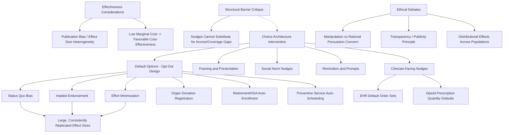

## Nudges and Default Options in Health Policy

### Overview

Nudges are interventions that alter the choice environment to predictably influence behavior in a specific direction while preserving freedom of choice — formally defined by Thaler and Sunstein (2008) as any aspect of choice architecture that alters people's behavior in a predictable way without forbidding any options or significantly changing economic incentives. Default options — the outcome that occurs if an individual takes no action — are among the most extensively studied and most powerful nudge categories in health policy. This entry covers the theoretical foundation for why defaults and nudges work, the taxonomy of nudge types applied in health policy, major empirical applications across health domains, and the ethical and effectiveness debates surrounding their use.

### Theoretical Foundation

#### Why Choice Architecture Matters: Libertarian Paternalism

The theoretical justification for nudge-based policy rests on the observation, central to behavioral economics generally, that human decision-making systematically departs from the frictionless, fully-informed rational actor assumed in classical economic models — departures that include present bias (covered elsewhere in this chapter), limited attention and cognitive load, status quo bias, and reliance on heuristics under complexity or uncertainty. Because some choice architecture is unavoidable (there is no neutral, architecture-free way to present options — a default must be set to *something* if no other design decision is made), Thaler and Sunstein's **libertarian paternalism** framework argues that choice architects (including policymakers) should deliberately design defaults and presentation formats to steer individuals toward outcomes that better serve the individual's own long-run interests (the paternalistic component), while preserving the ability to opt out or choose otherwise (the libertarian component) — distinguishing nudges from mandates, which do not preserve an equivalent-cost alternative choice.

#### The Status Quo Bias and Default Effect Mechanism

Defaults are unusually powerful nudges because they interact with several distinct, independently-documented behavioral tendencies simultaneously:

- **Status quo bias**: A general tendency to disproportionately favor the current or default state, documented across many decision domains beyond health, attributed to a combination of loss aversion (framing a deviation from the default as a loss) and the cognitive/effort cost of actively deliberating and acting to change the default.
- **Implied endorsement / anchoring**: A default may be interpreted by decision-makers as an implicit recommendation from the choice architect (e.g., "if the standard/default option is X, X is probably the sensible choice for most people"), adding an informational or normative signal beyond pure inertia.
- **Effort minimization**: Overriding a default requires active effort (research, form-filling, an explicit request), and for decisions perceived as low-stakes, ambiguous, or subject to present-biased procrastination (as detailed in this chapter's preventive care entry), the effort cost of opting out can be sufficient on its own to sustain default persistence even absent status quo bias or perceived endorsement effects.

These mechanisms compound rather than operating in isolation, which is part of why default effects in field studies are frequently found to be large relative to other nudge categories (e.g., information provision alone), though the relative contribution of each specific mechanism to the observed aggregate default effect is difficult to fully decompose empirically in most field settings. [Inference: the general finding that default effects tend to be comparatively large relative to other nudge types (e.g., pure information nudges) is a recurring pattern across the behavioral economics literature; the specific mechanism decomposition described here reflects standard theoretical explanations offered in that literature rather than a single definitively established causal accounting for any specific case.]

### Taxonomy of Nudge Types in Health Policy

#### Default Options (Opt-Out Design)

Changing enrollment, participation, or selection from an opt-in to an opt-out structure — the individual is automatically enrolled/receives the recommended option unless they actively decline.

- **Organ donation**: Cross-country comparisons of opt-in (explicit consent required to be a donor) versus opt-out (presumed consent, with an explicit right to decline) organ donation registration systems are among the most widely cited real-world default effect case studies, with opt-out countries generally showing substantially higher registered donor rates than opt-in countries, though the relationship between registration defaults specifically and actual organ *donation/transplantation* rates (as opposed to registration rates) is more complex and mediated by family consent practices, healthcare system organ procurement infrastructure, and other factors that vary independently of the registration default. [Unverified: specific current comparative donation rate figures across named countries change over time and depend on the precise metric used (registration vs. actual donation vs. transplantation rates); current comparative statistics should be verified against recent transplant registry data rather than treated as fixed.]
- **Retirement and health savings account defaults**: While not exclusively health-specific, automatic enrollment in employer retirement savings plans (with an opt-out rather than opt-in structure) is one of the most robustly replicated default effect findings in behavioral economics and has directly informed analogous designs in health-adjacent benefit enrollment (e.g., automatic enrollment in employer wellness programs or health savings account contributions).
- **Preventive service scheduling defaults**: As detailed in this chapter's preventive care procrastination entry, automatically scheduling a preventive appointment (with an opt-out/cancel option) rather than requiring the patient to proactively schedule has been used as a direct default-design intervention in clinical workflow redesign.
- **Insurance plan defaults**: Default enrollment into a specific health plan tier (e.g., automatically enrolling new employees into a particular plan absent an active election) shapes plan selection outcomes, an application studied particularly in the context of Medicare Part D and employer-sponsored insurance plan choice architecture.

#### Framing and Presentation Effects

- **Loss vs. gain framing**: Presenting identical information framed as a potential loss ("you are missing out on X% risk reduction by not getting screened") versus an equivalent potential gain ("get X% risk reduction by getting screened") has been found in numerous studies to differentially affect uptake, generally consistent with loss aversion (the tendency to weight losses more heavily than equivalent gains), though the direction and magnitude of the framing effect varies by specific health behavior and population studied.
- **Simplification and information reduction**: Reducing the complexity of choice presentation (e.g., simplified plan comparison tools in health insurance marketplace enrollment, standardized nutrition labeling formats) addresses the cognitive load and choice-overload dimension of decision-making distinct from pure default-setting, based on evidence that excessive option complexity can itself depress engagement and produce worse decisions even when more choice is nominally available.

#### Social Norm Nudges

Providing information about others' behavior (e.g., "most people in your area get their annual flu shot" or comparative energy-use-style feedback applied to clinical practice, such as physician prescribing pattern comparisons) leverages social proof/conformity tendencies to shift behavior toward the referenced norm, applied both to patient-facing health behavior nudges and, notably, to physician-facing nudges intended to reduce unwarranted practice variation (e.g., antibiotic prescribing rate comparisons among peer physicians).

#### Reminders and Prompts

As detailed in the preventive care entry, reminders (including implementation-intention-style prompts) function as a distinct nudge category targeting attention and memory limitations and present-biased procrastination rather than pure inertia/status-quo mechanisms, though the two categories are often deployed jointly in applied interventions (e.g., a default-scheduled appointment accompanied by a reminder).

#### Physician and Clinical Decision Nudges

A distinct and growing application area targets clinician rather than patient behavior:

- **EHR default order sets**: Configuring electronic health record order sets so that evidence-based options (e.g., generic drug selection, guideline-recommended screening intervals, opioid prescription default quantities) appear as the pre-selected default, requiring active clinician effort to deviate, has been studied extensively as a mechanism to shift prescribing and ordering behavior toward guideline concordance without restricting clinician autonomy to override the default when clinically appropriate.
- **Opioid prescribing defaults**: A widely studied specific application — reducing EHR default opioid prescription quantities (e.g., defaulting to a smaller pill count for common post-procedure prescriptions, with the option for the prescriber to manually increase the quantity) has been found in multiple health system studies to measurably reduce average prescribed quantities, illustrating the default effect operating on clinician rather than patient decision-making. [Inference: this general finding — that reducing EHR default opioid prescription quantities reduces average prescribed amounts — is well-supported across several health system-level studies; specific effect-size magnitudes vary by health system, specialty, and study period and should be verified against the specific study if a precise figure is required.]

### Empirical Effectiveness and Cost-Effectiveness Considerations

#### Effect Size Variability

While default and nudge interventions are frequently framed in policy discussion as low-cost, high-leverage tools, the empirical effect size literature shows substantial heterogeneity:

- Default-based interventions (particularly opt-out enrollment designs) tend to show the largest and most consistently replicated effect sizes among nudge categories across the broader behavioral economics literature, though effect sizes for health-specific defaults vary depending on the perceived stakes and reversibility of the specific decision (a low-stakes, easily reversible default, such as a reminder-driven appointment that can be freely cancelled, shows different uptake dynamics than a higher-stakes, harder-to-reverse default).
- A meta-analytic and replication literature examining nudge interventions broadly (not health-specific) has raised methodological concerns about **publication bias and effect size inflation** in the earlier nudge literature, with subsequent larger-scale and pre-registered replication studies in some cases finding smaller average effect sizes than the original influential studies reported. [Unverified: the magnitude and scope of this publication-bias-driven effect-size revision is itself debated within the behavioral economics methodology literature and continues to be an active area of meta-scientific research; specific quantitative claims about the degree of overall effect-size inflation should be verified against current meta-analytic sources rather than treated as a settled, fixed finding.]

#### Cost-Effectiveness of Nudge Interventions

Because default and choice-architecture redesign interventions frequently involve low marginal implementation cost relative to more resource-intensive interventions (financial incentives, expanded staffing, new infrastructure), even a comparatively modest absolute behavior-change effect can produce a favorable cost-effectiveness ratio, which is a major part of the policy appeal of nudge-based approaches — though this favorable cost-effectiveness case depends on the specific implementation cost structure and is not automatically true for every nudge design (e.g., EHR reconfiguration or workflow redesign can carry meaningful one-time implementation costs even if per-patient marginal cost is low thereafter).

### Ethical and Political Debates

#### Autonomy and Manipulation Concerns

Critics of nudge-based health policy raise concerns distinct from pure effectiveness questions:

- **Manipulation versus rational persuasion**: A normative critique holds that nudges exploiting known cognitive biases (as opposed to providing additional accurate information for a fully rational deliberative process) may constitute a form of manipulation that bypasses rather than engages an individual's rational agency, even when the nudge is designed with the individual's own stated long-run interest in mind — a concern raised even by scholars broadly sympathetic to nudge-based policy in some contexts, and more sharply by critics skeptical of paternalistic policy design generally. [Inference: this is a genuine, actively debated normative question in political philosophy and behavioral economics ethics literature, not a settled matter; reasonable scholars disagree on where the line between legitimate choice-architecture design and problematic manipulation should be drawn, and on how much this concern should weigh against demonstrated health benefits.]
- **Transparency requirements**: Partly in response to manipulation concerns, some behavioral ethics literature and policy guidance advocates that nudges should be transparent (the individual should be able to understand, if they inquire, how and why the choice architecture was designed as it was) and should be defensible under public scrutiny — a standard sometimes termed the "publicity principle" — as a check on choice architecture that might not survive public disclosure of its underlying mechanism or intent.
- **Distributional and heterogeneous-effect concerns**: Nudge effectiveness and appropriateness may vary across populations with different baseline levels of health literacy, trust in institutions, or capacity to actively opt out when a default is not well-suited to their individual circumstances, raising equity considerations analogous to those discussed in this chapter's public health economic evaluation entry — a default well-suited to a "typical" population member may be poorly suited to an atypical individual who faces higher effort costs in opting out or whose circumstances differ from those the default was designed around.

#### Nudges as a Complement to, Not Substitute for, Structural Policy

A recurring critique, particularly from public health economists focused on structural and financial barriers to care, is that nudge-based interventions — while frequently low-cost and evidence-supported for the specific behavioral margin they target — cannot substitute for addressing more fundamental structural barriers (lack of insurance coverage, absence of nearby providers, inability to take time off work), and that policy discourse should avoid treating nudges as a low-cost alternative to more resource-intensive structural investments when the binding constraint on health behavior is structural rather than behavioral. This critique parallels the "present-bias-versus-access-barrier" distinction discussed in the preventive care procrastination entry: a nudge targeting a discounting bias will have limited effect on outcomes actually driven by a structural access constraint.

### Illustrative Diagram: Nudge and Default Mechanism Taxonomy in Health Policy

### Related Topics

- Libertarian paternalism theoretical framework (Thaler and Sunstein)
- Status quo bias and loss aversion as psychological foundations of default effects
- Opt-out organ donation policy comparative case studies
- EHR-embedded clinical decision defaults and opioid prescribing interventions
- Publication bias and replication concerns in the behavioral nudge literature
- Publicity principle and ethical frameworks for choice architecture design
- Automatic enrollment design in retirement and health savings accounts
- Present bias and procrastination as a distinct but related behavioral mechanism
- Health insurance marketplace choice architecture and plan-selection simplification
- Social norm feedback interventions in physician prescribing behavior