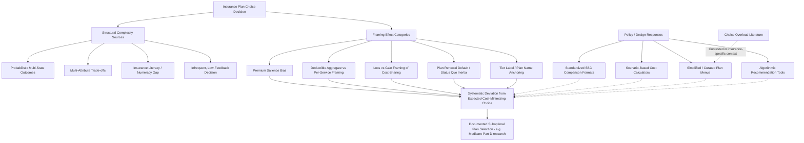

## Framing Effects in Insurance Plan Choice

### Overview

Health insurance plan selection is a decision domain unusually susceptible to framing effects — where logically equivalent presentations of identical plan features produce systematically different choices — because plan comparison inherently requires evaluating multi-attribute, probabilistic, and technically complex information (premiums, deductibles, coinsurance, out-of-pocket maximums, network composition) under conditions of genuine uncertainty about future healthcare utilization. This entry covers the specific cognitive mechanisms that make insurance choice framing-sensitive, the major documented framing effect categories in this domain, empirical evidence on plan choice quality and its policy implications, and the design responses developed to mitigate framing-driven decision error.

### Why Insurance Choice Is Especially Framing-Sensitive

#### Structural Sources of Framing Vulnerability

Several features of health insurance plan choice combine to create unusually high susceptibility to framing and presentation effects, distinguishing it from many other consumer choice domains:

- **Probabilistic, multi-state outcomes**: Unlike a simple price comparison, evaluating an insurance plan requires implicitly forming a probability distribution over one's own future healthcare utilization states and then correctly computing expected costs across plan options — a genuinely difficult calculation that even financially sophisticated individuals frequently perform incorrectly, creating substantial scope for a plan's *presentation format* (rather than its underlying expected-cost profile) to influence perceived attractiveness.
- **Multi-attribute trade-offs**: Plans typically vary simultaneously across premium, deductible, coinsurance rate, out-of-pocket maximum, and network breadth — a high-dimensional comparison problem that exceeds most individuals' capacity for full attribute-by-attribute rational weighting, creating reliance on heuristics (e.g., disproportionately anchoring on the single most salient number, frequently the premium, since it is a certain and immediately visible cost, while deductible and coinsurance exposure is contingent and requires additional calculation to translate into an expected cost).
- **Technical terminology and numeracy demands**: Understanding the practical financial implication of terms like "coinsurance," "deductible," and "out-of-pocket maximum," and correctly combining them into an overall expected-cost estimate, requires a level of insurance literacy and numeracy that empirical studies have found is frequently absent even among individuals with substantial general education, creating a documented and persistent **insurance literacy gap** that widens the space in which framing (as opposed to full comprehension of underlying plan economics) can drive choice.
- **Infrequent, high-stakes, low-feedback decisions**: Most individuals select an insurance plan at most once a year (often less frequently, given persistence in default/rollover plan selection, discussed below), and rarely receive clear, attributable feedback linking their plan choice to its financial consequences (since actual costs depend on the realized, uncertain health utilization path) — a decision structure that provides little opportunity for experiential learning to correct systematic choice errors over time, unlike more frequent consumer decisions where repeated feedback can gradually improve decision quality.

### Major Framing Effect Categories in Insurance Choice

#### Premium Salience and the "Premium Bias"

A well-documented pattern in plan choice research is that consumers disproportionately weight the premium (a certain, immediately visible, recurring cost) relative to deductible and coinsurance terms (contingent costs requiring additional calculation and dependent on uncertain future utilization), even in cases where a full expected-cost calculation would favor a higher-premium, lower-cost-sharing plan for a given individual's risk profile. This **premium-focused decision heuristic** has been documented across multiple plan choice studies (including in Medicare Part D and employer-sponsored plan choice contexts) and produces a systematic mismatch between chosen plans and the individual's own expected-cost-minimizing plan, particularly for individuals whose expected healthcare utilization would justify a higher-premium plan with more comprehensive cost-sharing protection. [Inference: the general finding that premium salience disproportionately drives plan choice relative to a full expected-cost calculation is well-supported across multiple empirical plan-choice studies (notably in Medicare Part D research); the precise magnitude of resulting consumer welfare loss from this bias is more heavily model-dependent and varies across studies.]

#### Deductible Framing: Aggregate vs. Per-Service Presentation

How deductible and cost-sharing information is presented — as a single aggregate annual figure versus broken out by anticipated per-service or per-visit cost exposure — has been found to affect perceived plan attractiveness and choice, with more granular, scenario-based presentations (e.g., "if you need X visits per year, you would pay approximately $Y") generally improving comprehension and choice alignment with expected-cost-minimizing selection relative to presenting only the aggregate deductible figure, consistent with the general finding that reducing the cognitive translation burden between presented information and actual expected financial exposure improves decision quality.

#### Loss vs. Gain Framing of Coverage

Presenting plan cost-sharing information in loss-framed terms (e.g., emphasizing "what you could owe" in an adverse health event) versus gain-framed terms (e.g., emphasizing "what is covered") can differentially affect perceived plan value and risk aversion in plan selection, consistent with prospect-theory-style loss aversion, where potential losses are typically weighted more heavily in decision-making than equivalent potential gains — a framing dimension distinct from, but potentially interacting with, the premium-salience effect described above, since loss-framed presentation of high-deductible exposure may increase perceived risk of a high-deductible plan beyond what a purely expected-cost calculation would justify.

#### Default and Status Quo Effects in Plan Renewal

A distinct but closely related framing/choice-architecture phenomenon, directly connected to this chapter's broader nudges and defaults entry, is **plan choice inertia**: the well-documented tendency for enrollees to remain in their currently enrolled plan during open enrollment (where the default, absent active action, is renewal in the current plan) even when superior, lower-cost alternative plans covering equivalent or better benefits become available. This inertia effect has been documented extensively in Medicare Part D research and employer-sponsored insurance switching studies, and produces a form of framing effect at the choice-architecture level: because remaining enrolled requires no action while switching requires active engagement with the plan comparison process (itself burdened by the complexity and numeracy demands described above), the *default* of automatic renewal effectively frames "staying" as the low-effort baseline option, compounding rather than correcting the underlying comprehension-driven choice errors. [Inference: the general finding of substantial plan-switching inertia, particularly well-documented in Medicare Part D enrollee behavior research, is robust across multiple studies; specific quantitative inertia/switching-rate figures vary by study, year, and market and should be verified against current research if a precise figure is required.]

#### Anchoring on Plan Names and Tier Labels

Plan naming conventions and tier labels (e.g., "Bronze," "Silver," "Gold," "Platinum" tiers under ACA marketplace metal-tier structures, or employer-specific plan names like "Choice Plus" or "Value Plan") can function as framing anchors that convey an implicit quality or value signal independent of the plan's actual, objectively compared cost-sharing structure, potentially influencing perceived plan desirability through connotation (e.g., "Gold" implying superior value) in ways that may or may not align with the plan's actual expected-cost profile for a given individual's risk and utilization pattern.

### Empirical Evidence on Plan Choice Quality

#### Documented Suboptimal Plan Selection

A substantial empirical literature, particularly focused on Medicare Part D (where extensive administrative claims and plan-choice data have enabled detailed analysis), has found that a meaningful share of enrollees do not select the plan that would minimize their own expected annual costs given their actual medication utilization and available plan options, with the gap between actual and cost-minimizing plan choice attributed by researchers to a combination of the framing and comprehension factors described above rather than to enrollees having private information (e.g., anticipated future health changes) that would rationally justify their observed choice. [Unverified: specific quantitative estimates of the magnitude of foregone savings from suboptimal Part D plan choice vary substantially across studies, years, and methodologies; current figures should be verified against recent peer-reviewed research rather than treated as a fixed parameter, given this is an active area of ongoing empirical research with results sensitive to modeling assumptions about what "optimal" choice means under uncertainty.]

#### Choice Overload and the Paradox of Extensive Plan Menus

A related empirical finding is that increasing the *number* of available plan options, intended to enhance consumer welfare by expanding choice, can under some conditions reduce overall decision quality and even reduce engagement/enrollment altogether — a **choice overload** effect studied in both general consumer behavior research (e.g., the classic "jam study" literature) and specifically applied to insurance and retirement plan menus. This finding has direct policy design implications, suggesting a potential trade-off between maximizing nominal choice availability and maximizing realized decision quality, particularly for a decision domain (insurance) already burdened by high comprehension demands. [Inference: while choice overload is a genuine and replicated phenomenon in parts of the broader behavioral economics literature, its specific magnitude and even its presence in some insurance-specific plan-choice contexts has been contested by subsequent research finding weaker or null choice-overload effects in certain settings, making this a more actively debated empirical question within the insurance choice literature specifically than the broader premium-salience or plan-inertia findings described above.]

### Policy and Design Responses

#### Standardized Plan Comparison Tools and Simplified Formats

In response to the documented comprehension and framing challenges, several policy and market design interventions have been developed and studied:

- **Standardized Summary of Benefits and Coverage (SBC) formats**: Regulatory requirements (e.g., under the ACA) mandating standardized plan comparison document formats across insurers, intended to reduce framing-driven variation by ensuring cost-sharing information is presented in a consistent structure across competing plans, reducing insurers' ability to selectively frame their own plan's terms more favorably than a standardized comparison would allow.
- **Scenario-based cost calculators**: Tools that ask users to input expected healthcare utilization patterns (e.g., "how many doctor visits do you expect," "do you take regular prescription medications") and translate plan terms into a personalized total expected cost estimate, directly addressing the multi-attribute calculation burden by performing the expected-cost computation on the user's behalf rather than requiring the user to mentally integrate premium, deductible, and coinsurance information themselves.
- **Simplified plan menus / curated choice sets**: Reducing the number of presented options or organizing options into a more structured decision tree (addressing the choice overload concern) has been tested as an alternative or complementary approach to full information-provision-based interventions, though as noted above, the underlying choice-overload premise motivating this approach is itself contested in some insurance-specific research contexts.

#### Decision Support and Personalized Recommendation Tools

Some employer and marketplace plan-choice platforms have implemented algorithmic recommendation tools that directly suggest a specific plan based on a user's reported expected utilization and risk tolerance, functioning as a stronger intervention than pure information simplification by effectively performing the expected-cost-minimization calculation and presenting a specific recommended default, which raises its own design questions (accuracy and transparency of the underlying recommendation algorithm, appropriate handling of the genuine uncertainty in future health utilization that no algorithm can fully resolve, and the ethical/manipulation considerations discussed in this chapter's nudges entry when a platform's recommendation may not be fully neutral if the platform itself has a financial relationship with certain plans).

### Illustrative Diagram: Framing Effect Pathways in Insurance Plan Choice

### Related Topics

- Medicare Part D plan choice research and suboptimal selection quantification
- Standardized Summary of Benefits and Coverage (SBC) regulatory design
- Choice overload theory and its contested application to insurance plan menus
- Prospect theory and loss aversion in health-related financial framing
- Nudges and default options in health policy (plan renewal inertia)
- Insurance literacy measurement and educational intervention effectiveness
- ACA marketplace metal-tier structure and consumer comprehension research
- Algorithmic decision support tools and transparency/conflict-of-interest design
- Employer-sponsored plan menu design and enrollment platform choice architecture
- Behavioral economics of high-deductible health plan adoption and risk perception