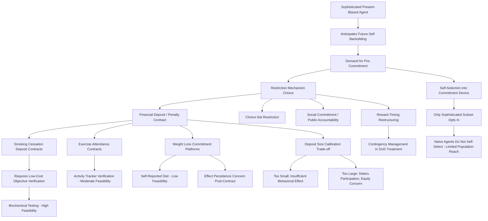

## Commitment Devices for Health Behavior Change

### Overview

Commitment devices are voluntarily adopted mechanisms that restrict, penalize, or otherwise constrain an individual's own future choice set in order to make a desired future behavior more likely and an undesired future behavior more costly. They occupy a distinctive position in behavioral health economics: unlike nudges (which are designed and imposed by an external choice architect) and unlike pure willpower-based approaches, commitment devices are self-imposed tools that individuals — typically those who are at least partially sophisticated about their own time-inconsistent preferences, as detailed in this chapter's general entry on time-inconsistent preferences — voluntarily seek out to bind their future selves. This entry covers the theoretical rationale for commitment device demand, the major categories of commitment devices applied to health behavior, empirical evidence on their effectiveness, and the design and ethical considerations that arise in their implementation.

### Theoretical Rationale

#### Sophistication and Demand for Self-Restriction

As established in this chapter's time-inconsistent preferences entry, a **sophisticated** present-biased agent correctly anticipates that their future self will apply a fresh present-bias discount when the moment of temptation or decision actually arrives, and consequently anticipates that their own current plan (e.g., "I will not smoke," "I will exercise three times a week") may not be honored by their future self absent some additional constraint. This creates a rational, forward-looking demand for **pre-commitment**: restricting one's own future choice set today, while the individual is not yet facing the immediate temptation, in a way that makes the desired behavior more likely or the undesired behavior costlier once the future moment arrives.

Formally, within the quasi-hyperbolic ($\beta$-$\delta$) discounting framework, a sophisticated agent's demand for a commitment device can be understood as the agent using their period-$t$ self's greater weighting of future welfare (relative to their anticipated period-$t+1$ self's present-biased weighting) to impose a cost or restriction on the period-$t+1$ self's ability to deviate from the period-$t$-preferred plan. **Naive agents**, by contrast, do not anticipate their own future backsliding and consequently show little or no independent demand for commitment devices, even though they might, in principle, equally benefit from one — a theoretical prediction with direct empirical implications discussed below.

#### Types of Restriction Mechanisms

Commitment devices operate through several distinct restriction mechanisms, which can be combined:

- **Financial penalty / deposit contracts**: The individual places money at risk (a refundable deposit returned only upon meeting a goal, or a fee forfeited upon failure) — directly imposing a financial cost on future non-compliance that did not exist in the undistorted decision environment, intended to be large enough to shift the future self's cost-benefit calculation toward the desired behavior even under present-biased discounting.
- **Choice-set restriction**: Physically or contractually removing an option from the future choice set entirely (e.g., not keeping tempting food in the house, blocking access to a substance, or a legally binding self-exclusion agreement) rather than merely making the undesired option more costly.
- **Social commitment and public accountability**: Publicly declaring a goal or enlisting a third party (a friend, family member, or online commitment platform) to monitor and enforce compliance, leveraging reputational and social cost concerns as the enforcement mechanism rather than direct financial or physical restriction.
- **Reward-timing restructuring**: Converting a naturally delayed reward structure into one with more immediate, salient positive reinforcement contingent on the desired behavior (closely related to contingency management, discussed below), which can function as a partial commitment device by artificially front-loading reward salience to counteract present bias rather than purely restricting the future choice set.

### Major Applications in Health Behavior

#### Smoking Cessation

Smoking cessation is among the most extensively studied commitment device application domains in health economics, given both the well-documented present-bias/self-control framing of nicotine addiction (discussed in this chapter's time-inconsistent preferences entry) and the clear, objectively verifiable outcome measure (biochemically verified smoking status via cotinine or carbon monoxide testing) that enables rigorous evaluation of deposit-contract-style commitment devices.

- **CARES-style deposit contracts**: Field experiments (notably work by Giné, Karlan, and Zinman on a Philippine smoking cessation deposit contract program, "CARES") have tested programs in which smokers voluntarily deposit money that is forfeited to a charity (or otherwise lost) if they fail a biochemically verified smoking cessation test at a specified future date, with several such studies finding meaningfully higher cessation rates among participants offered the commitment contract relative to a control group offered standard cessation support without the deposit mechanism. [Inference: this general finding — that deposit-contract-style commitment devices for smoking cessation produce measurably higher cessation rates relative to standard support — is drawn from a specific and influential line of field experimental research; effect-size magnitudes and replication across different populations and program designs vary, and current comprehensive meta-analytic figures should be verified against recent systematic reviews rather than treated as a fixed universal effect.]
- **Selection into commitment contracts**: Consistent with the sophistication-based theoretical prediction, studies of these programs have generally found that only a subset of smokers who are offered the commitment device option choose to take it up, and that those who do opt in tend to show different characteristics (consistent with greater self-awareness of their own self-control challenges) than those who decline — a pattern interpreted as indirect evidence supporting the sophistication/naivete theoretical framework, since a purely naive population would show comparatively random or utilization-independent uptake if the mechanism were driving demand.

#### Contingency Management in Substance Use Treatment

As detailed in this text's coverage of mental health and substance use treatment economics, **contingency management** — providing tangible incentives (vouchers, prizes, or privileges) contingent on objectively verified abstinence — functions partly as a commitment/self-control-correction mechanism by providing an immediate, salient positive reinforcement that competes directly against the immediate reward of substance use, rather than relying solely on the naturally delayed and diffuse benefits of sobriety. This has been found particularly effective for stimulant use disorders, where pharmacological treatment options remain more limited than for opioid use disorder.

#### Exercise and Physical Activity

Commitment devices applied to exercise adherence include:

- **Financial deposit and gym-attendance contracts**: Programs analogous to smoking cessation deposit contracts, where individuals stake money returned contingent on verified gym attendance or activity tracker-verified exercise completion, have been studied with generally positive but more modest and sometimes shorter-lived effects relative to the smoking cessation literature, plausibly reflecting exercise's more continuous, effort-graded nature (as opposed to a binary abstinence outcome) and the greater ease of finding partial-compliance loopholes relative to a clear biochemical pass/fail test.
- **Social commitment via fitness communities and public tracking**: Leveraging social accountability (shared activity tracking platforms, exercise partnership commitments) functions as a lower-cost, non-financial commitment mechanism, with evidence generally suggesting a meaningful but again more modest and heterogeneous effect relative to financial deposit contracts. [Inference: the relative-effectiveness comparison between financial deposit-based and pure social-commitment-based exercise interventions described here reflects a general pattern observed across multiple studies in this literature, though direct head-to-head comparative studies are less common than studies evaluating each mechanism separately, making precise relative-magnitude claims more uncertain than the within-mechanism effect findings themselves.]

#### Weight Loss and Dietary Behavior Change

Weight-loss-specific commitment contract platforms (including formal commercial commitment-contract services) have been studied with mixed but generally positive effects on short-to-medium-term weight loss outcomes relative to non-commitment comparison conditions, though — consistent with the broader literature on weight management generally — effect persistence beyond the active commitment period (i.e., after the deposit is returned or the contract period ends) is a documented and significant challenge, raising the question of whether commitment devices durably alter underlying behavior/preferences or merely suppress the undesired behavior for the duration of the externally imposed incentive structure. [Inference: this general concern about effect persistence after a commitment device's active period ends is a widely raised methodological and practical caution across the weight-loss commitment device literature, reflecting a broader pattern noted in behavioral weight-management interventions generally, not a finding unique to commitment devices specifically.]

### Design Considerations

#### Calibrating Deposit/Penalty Size

The size of the financial stake in a deposit-contract-style commitment device involves a design trade-off: a stake too small may be insufficient to overcome the immediate temptation it is meant to counteract (failing to shift the present-biased cost-benefit calculation enough to be behaviorally effective), while a stake too large may deter participation altogether (particularly among lower-income individuals for whom a large at-risk deposit represents a meaningful liquidity or financial-risk burden) — a tension with direct equity implications, since a commitment device design calibrated primarily using data from higher-income study populations may not transfer efficiently to lower-income populations who might benefit similarly from the underlying self-control mechanism but face a different feasible deposit-size range.

#### Verification and Enforcement Costs

Effective commitment devices require credible, low-cost verification of the target behavior (biochemical testing for smoking cessation, activity tracker data for exercise, verified attendance for scheduled behaviors) — domains where objective, low-cost verification technology is available (smoking cessation's biochemical markers being a particularly clean example) have seen more robust and more easily scaled commitment device implementations than domains where verification is inherently more subjective, self-reported, or costly to independently confirm (e.g., dietary intake, which lacks an equivalent low-cost objective biomarker for most relevant dietary behaviors).

#### Voluntary Uptake and the Limits of Self-Selection

Because commitment device effectiveness studies generally rely on voluntary uptake (individuals choosing to opt into the commitment mechanism), the population that self-selects into a commitment device is, per the sophistication-based theoretical model, systematically different from the broader population of individuals who might benefit from the underlying behavior change — meaning commitment devices are best understood as a tool that provides meaningful benefit to the subset of the target population that is sufficiently sophisticated to recognize its own self-control challenge and voluntarily seek out a solution, rather than as a universally applicable intervention for an entire target population, a substantial share of which (the more naive share, under the theoretical model) will not opt in even if they would benefit.

### Policy and Program Design Applications

#### Employer Wellness Programs

Some employer-sponsored wellness programs have incorporated commitment-device-style design elements (e.g., premium surcharge/discount structures contingent on meeting specific health behavior targets, functioning similarly to a deposit contract in that a financial consequence is tied to verified future behavior), raising both the general commitment-device design considerations above and additional regulatory considerations specific to employer wellness program design (e.g., anti-discrimination and privacy regulations governing permissible health-contingent wellness incentive structures). [Unverified: specific current regulatory limits on health-contingent wellness program incentive structures are subject to periodic regulatory revision and should be verified against current EEOC/ACA wellness program regulatory guidance rather than treated as fixed.]

#### Public Health Program Integration

Public health agencies and researchers have piloted commitment-device-informed program designs across various behavior domains (vaccination completion in multi-dose series, prenatal care attendance, chronic disease management adherence), generally finding that commitment-device elements can meaningfully improve outcomes for the self-selected subset of participants who opt in, reinforcing the broader point that commitment devices function most effectively as one tool within a broader intervention portfolio (alongside defaults, reminders, and financial incentives more broadly, as discussed in this chapter's nudges and preventive care entries) rather than as a stand-alone universal solution.

### Illustrative Diagram: Commitment Device Mechanism and Application Structure

### Related Topics

- Quasi-hyperbolic discounting and naive versus sophisticated agent theoretical distinction
- Deposit contract field experiments in smoking cessation (Giné, Karlan, and Zinman)
- Contingency management design in substance use disorder treatment
- Employer wellness program incentive design and regulatory constraints
- Verification technology and biomarker availability in behavior change program design
- Effect persistence and relapse following time-limited behavioral interventions
- Nudges and default options as complementary externally-imposed choice architecture
- Present bias and procrastination mechanisms underlying commitment device demand
- Social accountability platforms and peer-based health behavior interventions
- Equity considerations in financial commitment device accessibility across income levels