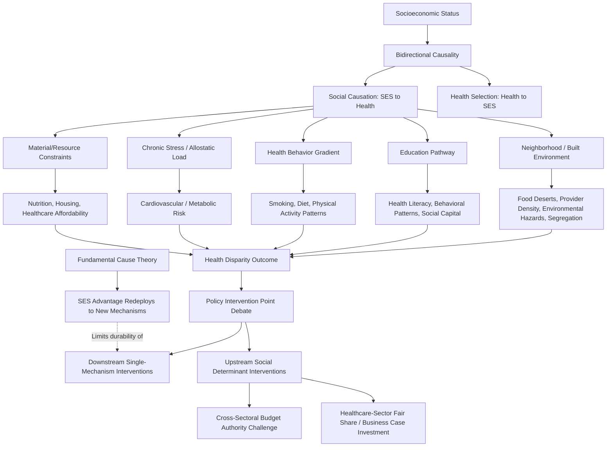

## Socioeconomic Determinants of Health Disparities

### Overview

Socioeconomic determinants of health disparities refer to the systematic differences in health outcomes across income, education, occupation, and wealth strata, and the economic mechanisms that produce and sustain these gradients. Unlike disparities arising purely from differential healthcare access, socioeconomic health disparities persist even in contexts with universal healthcare coverage, implicating a broader set of causal pathways — the **social determinants of health** — that operate largely outside the formal healthcare delivery system. This entry covers the empirical documentation of the socioeconomic health gradient, the leading causal frameworks explaining it, the specific economic mechanisms linking socioeconomic status to health, and the policy debate over where in this causal chain intervention is most effective.

### The Socioeconomic Health Gradient

#### Empirical Pattern

A remarkably consistent finding across health economics and epidemiology is the existence of a **health gradient**: health outcomes (life expectancy, chronic disease prevalence, self-reported health status, infant mortality) improve monotonically across the income, education, and occupational-status distribution, not merely as a threshold effect separating the poor from everyone else, but as a continuous gradient extending across the entire socioeconomic distribution, including differences observed even among comparatively affluent groups. This gradient pattern has been documented across many countries with markedly different healthcare financing systems (including countries with universal coverage), which is a central piece of evidence used to argue that the gradient cannot be explained by differential healthcare access alone. [Inference: the general finding of a continuous, whole-distribution health gradient (rather than a simple poor-versus-non-poor threshold effect) is well-established across a large cross-national epidemiological and health economics literature (associated with foundational work such as the British Whitehall studies); specific current numeric gradient magnitudes for any given country or outcome measure change over time and should be verified against current national health statistics if a precise figure is needed.]

#### Life Expectancy and Income Gradient Estimates

Large-scale administrative data studies (notably work using U.S. tax and mortality records, such as research associated with Chetty and colleagues) have quantified substantial life expectancy gaps across the income distribution within a single country, alongside the further finding that the *magnitude* of the income-health gradient itself varies meaningfully across geographic areas within the same country — a finding used to argue that local area-level factors (healthcare access, environmental conditions, social cohesion, health behaviors) interact with income to produce the observed disparities, rather than income alone mechanically determining health outcomes through a single fixed channel. [Unverified: specific current life-expectancy-gap figures by income percentile change with updated data releases and should be verified against the most recent published research rather than treated as a fixed, permanent statistic.]

### Causal Frameworks

#### Direction of Causality: Health-Selects-Income vs. Income-Determines-Health

A foundational and only partially resolved empirical question in this literature is the direction and relative magnitude of causality between socioeconomic status and health, since the relationship is plausibly bidirectional:

- **Social causation hypothesis**: Lower socioeconomic status causally produces worse health outcomes, operating through the specific mechanisms detailed below (material deprivation, chronic stress, health behavior patterns, differential healthcare access).
- **Health selection hypothesis**: Poor health causally reduces earning capacity and socioeconomic attainment (via reduced work capacity, missed education, or disability), meaning at least part of the observed correlation reflects health's effect on socioeconomic status rather than the reverse.
- **Consensus position**: The empirical literature broadly concludes that both directions of causality operate simultaneously and reinforce each other, though the relative quantitative contribution of each direction varies by life stage (health selection effects are generally considered more significant in explaining socioeconomic mobility/attainment among working-age adults with a health shock, while social causation effects are considered more dominant in explaining child health disparities, where the child has not yet had the opportunity to independently affect their own socioeconomic position) and by the specific health condition and socioeconomic outcome studied. [Inference: this bidirectional consensus, with life-stage-dependent relative contribution, reflects a broadly shared position across the health economics and social epidemiology literature, though precise quantitative decomposition between the two causal directions remains genuinely difficult to establish with full confidence in any given empirical context and continues to be debated in specific applications.]

#### The Fundamental Cause Theory

An influential sociological framework in this literature (associated with Link and Phelan) argues that socioeconomic status functions as a **"fundamental cause"** of health disparities — meaning that socioeconomic advantage provides flexible access to whatever specific resources (knowledge, money, power, prestige, social connections) are most protective against health risk *at a given point in time*, such that even if a specific intervening mechanism is neutralized (e.g., a specific disease is cured or a specific risk factor's health effect is eliminated through medical advance), socioeconomic advantage will be redeployed toward whatever the next most relevant health-protective resource becomes, reproducing the disparity through a different specific mechanism. This framework's key economic implication is that interventions targeting only a single intervening mechanism (e.g., a specific disease treatment) are predicted to reduce disparities in that specific outcome only temporarily or partially, since the underlying socioeconomic-resource advantage will tend to reassert itself through other channels over time — an argument for why disparities research increasingly emphasizes upstream socioeconomic determinants rather than downstream, mechanism-specific interventions alone.

### Economic Mechanisms Linking Socioeconomic Status to Health

#### Material and Resource Constraints

Direct material deprivation pathways include inadequate nutrition, substandard or unstable housing (with associated exposure to environmental health hazards, as detailed in this text's environmental health economics entry, which are themselves disproportionately concentrated in lower-income areas), inability to afford healthcare, medications, or preventive services even with nominal insurance coverage (given the cost-sharing burden discussed in the prevention-versus-treatment entry), and financial strain limiting the ability to take unpaid time off work for healthcare or recovery.

#### Chronic Stress and Allostatic Load

A biologically-mediated pathway, extensively studied in social epidemiology and increasingly integrated into economic models of health disparities, involves the cumulative physiological burden of chronic socioeconomic stress — financial insecurity, job instability, neighborhood safety concerns, and experiences of discrimination — operationalized in some research through the concept of **allostatic load** (cumulative physiological wear from chronic stress response activation), which has been linked in multiple studies to elevated risk of cardiovascular disease, metabolic disorders, and accelerated biological aging markers independent of direct material deprivation pathways. [Inference: the general allostatic load framework and its association with socioeconomic stress exposure is a well-established concept in social epidemiology and health psychology; the precise quantitative contribution of this specific pathway relative to material and behavioral pathways in explaining aggregate socioeconomic health disparities is harder to isolate and remains an active area of interdisciplinary research.]

#### Health Behavior Gradients

Socioeconomic status is associated with systematic differences in health behaviors (smoking prevalence, dietary patterns, physical activity levels) that themselves carry a well-established socioeconomic gradient, generating a further indirect pathway to health disparities. Economic explanations for this behavioral gradient include: differential relative price sensitivity to health-promoting versus health-harming goods (e.g., healthy food often carrying a higher effective cost per calorie in resource-constrained "food desert" contexts, discussed below); differential returns to health investment (individuals facing greater economic precarity or shorter expected healthy working lifespans may rationally discount future health returns more heavily, connecting to this chapter's time-inconsistent preferences and present-bias framework, and interacting with genuinely different economic incentive structures rather than reflecting only a preference difference); and differential exposure to health-promoting versus health-harming marketing and environmental cues across socioeconomic contexts (e.g., differential geographic density of fast-food outlets versus full-service grocery stores, and differential targeted marketing of tobacco and alcohol products).

#### Education as a Distinct Causal Pathway

Education is frequently analyzed as a distinct and possibly particularly influential component of the broader socioeconomic status construct, since educational attainment plausibly affects health through several partially independent channels beyond its role in determining income: health literacy and the capacity to navigate complex healthcare and insurance systems (directly connecting to the insurance choice framing effects entry in this chapter), cognitive and behavioral patterns affecting long-run health-behavior decision-making, and social network composition and social capital access that itself carries independent health-relevant informational and support value. Some economic studies using instrumental variable and natural experiment designs (e.g., leveraging changes in compulsory schooling laws) have attempted to isolate a specifically causal effect of education on health outcomes independent of the income and occupational-status channels education also influences, with mixed and context-dependent findings regarding the magnitude of a health effect attributable to education specifically once income and other correlated factors are accounted for. [Unverified: given that instrumental variable estimates of education's independent causal effect on health vary considerably across studies, countries, and specific health outcomes studied — with some studies finding significant independent effects and others finding effects that are substantially attenuated or not statistically robust once other socioeconomic channels are controlled for — no single generalizable magnitude should be treated as an established universal finding without checking the specific study and context.]

#### Neighborhood and Built Environment Effects

Geographic concentration of socioeconomic disadvantage (residential segregation by income, and in many national contexts, by race) produces area-level effects operating partly independent of individual-level socioeconomic status: differential access to full-service grocery stores and fresh food (**food deserts**), differential healthcare provider density and quality (connecting to this text's discussion of healthcare workforce distribution issues in other entries), differential exposure to environmental health hazards (as detailed in the environmental health economics entry), and differential neighborhood safety affecting outdoor physical activity feasibility and chronic stress exposure. Natural experiment research on residential mobility (notably the Moving to Opportunity housing voucher experiments in the United States) has been used to attempt to isolate neighborhood-level causal effects on health and economic outcomes independent of the individual/family characteristics of those who move, with findings suggesting neighborhood effects on long-run outcomes (particularly for children who moved at younger ages) while showing more modest or mixed effects on some adult health outcomes measured over shorter follow-up periods. [Unverified: specific quantitative findings from natural experiment neighborhood-effect studies vary by outcome measured, age at exposure, and follow-up duration; current comprehensive findings should be verified against the most recent published analyses of these studies rather than summarized as a single uniform result.]

### Policy Implications and the Intervention-Point Debate

#### Downstream (Healthcare Access) vs. Upstream (Social Determinant) Interventions

A central and unresolved policy debate in this literature concerns where along the causal chain intervention is most cost-effective and durable:

- **Downstream interventions**: Expanding healthcare access and insurance coverage, and healthcare-system-based interventions (e.g., screening for social needs within clinical encounters and referring patients to social services) directly address the healthcare-access component of disparities, but — per the fundamental cause theory discussed above — may have limited effect on the broader socioeconomic-health gradient if the underlying resource-based disparity mechanism persists and simply operates through other channels.
- **Upstream interventions**: Policies targeting the socioeconomic determinants directly (income support programs, housing policy, early childhood education investment, minimum wage and labor market policy) are argued by proponents of the fundamental cause and social determinants frameworks to offer more durable disparity reduction, since they address the root resource disparity itself rather than a specific downstream mechanism, though upstream interventions typically fall outside the conventional healthcare policy and financing domain, raising cross-sectoral political economy and budget-authority challenges (connecting to this text's discussion of multi-sectoral costs and benefits in the public health economic evaluation entry) — health benefits from an income-support or housing policy intervention accrue in a health budget that a housing or social-welfare agency did not fund, complicating the political economy of upstream investment even when a societal-perspective cost-benefit analysis would favor it.
- **"Healthcare's fair share" debate**: A related policy question concerns whether and how much healthcare-sector resources (hospital systems, particularly nonprofit hospitals with community benefit obligations, and health insurers with value-based care incentives) should invest directly in upstream social determinant interventions (e.g., housing assistance, food security programs) as part of their own operations, an increasingly active area of health system policy experimentation, motivated by evidence that unaddressed social needs drive downstream avoidable healthcare utilization and cost, creating a potential business case for healthcare-sector-funded upstream investment even absent a broader societal policy mandate. [Inference: this business-case rationale for healthcare-sector investment in social determinants is a genuine and growing area of health policy and health system strategy, though the empirical evidence on return-on-investment for specific healthcare-sector-funded social determinant interventions remains an active area of ongoing evaluation rather than a fully settled finding, and results vary considerably by intervention type and population targeted.]

### Illustrative Diagram: Socioeconomic Determinants Causal Pathway Structure

### Related Topics

- Fundamental cause theory (Link and Phelan) and mechanism-substitution dynamics
- Income-health gradient quantification using administrative data (Chetty et al. methodology)
- Allostatic load and biological embedding of socioeconomic stress
- Moving to Opportunity and neighborhood-effect natural experiment research
- Food desert economics and differential food environment access
- Education as an independent causal determinant of health (instrumental variable studies)
- Healthcare system investment in social determinants and community benefit obligations
- Present bias and differential health-behavior discounting across socioeconomic strata
- Residential segregation and area-level health disparity mechanisms
- Multi-sectoral cost-benefit analysis and cross-agency budget authority in upstream policy