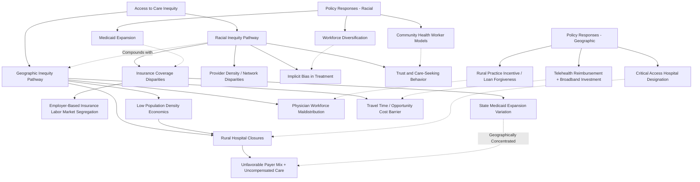

## Racial and Geographic Inequities in Access to Care

### Overview

Racial and geographic inequities in access to care refer to systematic differences in the ability to obtain timely, appropriate healthcare services across racial/ethnic groups and across geographic areas, operating through distinct but often overlapping mechanisms from the broader socioeconomic determinants covered elsewhere in this chapter. This entry focuses specifically on access-to-care inequities — as distinct from health outcome disparities generally — covering the structural economic mechanisms producing racial access gaps, the specific economics of geographic (particularly rural) access barriers, the interaction between these two dimensions, and the policy instruments developed to address each.

### Racial Inequities in Access to Care

#### Insurance Coverage Disparities

Historical and, to varying degrees, persistent differences in health insurance coverage rates across racial and ethnic groups constitute a direct access barrier, with several structural economic drivers:

- **Employment-based insurance and labor market segregation**: Because a substantial share of U.S. health insurance is employer-sponsored, racial disparities in employment type, industry sector, full-time versus part-time status, and firm size (smaller firms are historically less likely to offer coverage) translate mechanically into disparities in employer-sponsored insurance access, independent of any direct discrimination within the healthcare system itself.
- **Medicaid expansion state variation**: Because Medicaid eligibility expansion under the ACA was made optional for states following the 2012 Supreme Court ruling in *NFIB v. Sebelius*, and because non-expansion states are disproportionately concentrated in regions with higher shares of Black and Hispanic low-income populations, state-level Medicaid expansion decisions have produced geographically-mediated racial disparities in coverage access — an example of how a facially race-neutral policy variable (state expansion status) can produce racially disparate coverage outcomes given the underlying demographic geography. [Unverified: current state-by-state Medicaid expansion status changes periodically as additional states adopt expansion; current expansion status by state should be verified against current KFF or CMS tracking rather than assumed static.]

#### Provider Availability and Network Composition

- **Differential provider density in predominantly minority communities**: Empirical research has documented that physician density, particularly for certain specialties, and the presence of comprehensive-service hospitals tend to be lower in predominantly Black and Hispanic neighborhoods relative to predominantly white neighborhoods with comparable income levels, a pattern attributed in the literature to a combination of historical hospital location and closure patterns, physician practice-location preferences, and the compounding effect of the broader neighborhood-level socioeconomic mechanisms discussed in this chapter's socioeconomic determinants entry. [Inference: the general finding of lower provider density in predominantly minority communities, net of income, is documented across multiple health services research studies; the precise causal decomposition among the contributing factors (historical redlining and hospital siting decisions, current practice-location economics, ongoing socioeconomic correlation) remains an active area of research and the relative weight of each factor is not fully settled.]
- **Network adequacy and insurance-type sorting**: Because Medicaid reimbursement rates are generally lower than commercial insurance rates (as discussed in this text's coverage of Medicaid provider participation dynamics elsewhere), and because racial minority populations are disproportionately represented among Medicaid enrollees due to the coverage disparities noted above, lower physician Medicaid-participation rates translate into a further access barrier operating through the insurance-type channel rather than race directly, though the net population-level effect still produces a racially disparate access outcome.

#### Implicit Bias and Differential Treatment Within Encounters

Beyond access to a healthcare encounter in the first place, a distinct body of research (more clinical/epidemiological than economic in method, but with direct relevance to the economic concept of "access" broadly defined to include access to appropriate treatment once a patient reaches care) has documented differential treatment intensity and pain management practices by patient race even after controlling for clinical presentation and insurance type, attributed in this literature to implicit provider bias and differential clinical risk assessment — a mechanism operating at the point of care rather than at the point of initial system entry, and conceptually distinct from (though compounding) the coverage and provider-density mechanisms described above. [Inference: this general finding of differential treatment intensity by race, net of clinical and insurance controls, is documented across a substantial clinical and health services research literature; specific magnitude estimates and the degree to which unmeasured clinical confounding might explain some portion of the observed gap remain subjects of ongoing methodological discussion within that literature, and this text does not intend to imply a single settled quantitative estimate applies universally across all clinical contexts studied.]

#### Trust, Historical Context, and Care-Seeking Behavior

Documented historical instances of unethical research and treatment involving Black patients in the United States (most notably the U.S. Public Health Service Tuskegee syphilis study) are widely cited in the health services research and public health literature as contributing to documented lower levels of institutional trust in the healthcare system among some Black patient populations, a factor associated in multiple studies with reduced preventive care-seeking and clinical trial participation — an access barrier operating through the demand side (willingness to seek and engage with available care) rather than the supply side (availability of care), and one requiring different policy tools (trust-building, community health worker models, diversifying the healthcare workforce) than supply-side interventions addressing provider density or insurance coverage alone.

### Geographic Inequities in Access to Care

#### Rural Healthcare Access Economics

Geographic access barriers, while conceptually distinct from racial access barriers, frequently interact with and compound them (given that many rural areas also have distinct racial/ethnic composition patterns, and many predominantly minority urban neighborhoods face access barriers analogous in structure, if not in specific cause, to rural access barriers). The economics of rural healthcare access are shaped by several structural factors:

- **Low population density and provider economics**: Healthcare provider practice economics generally require a minimum patient volume to sustain fixed costs (facility, equipment, staffing), and low-population-density rural areas frequently cannot generate sufficient patient volume to support a full range of specialty services or, in the most sparsely populated areas, even sustain a general hospital, producing a structural economic (not merely a policy-choice) barrier to comprehensive local care availability.
- **Rural hospital closures**: A substantial and well-documented trend of rural hospital closures, particularly acute since the 2010s, has been attributed in the health economics literature to a combination of the low-volume/fixed-cost economics described above, the unfavorable payer mix in many rural areas (higher shares of Medicare and Medicaid patients, which reimburse at lower rates than commercial insurance, as discussed in this text's nursing home industry entry's analogous payer-mix dynamics), and, in non-Medicaid-expansion states specifically, higher uncompensated care burden from uninsured patients — producing a documented association between non-expansion status and elevated rural hospital closure risk. [Unverified: specific current counts of rural hospital closures and current closure-rate trends should be verified against current tracking data (e.g., from the University of North Carolina Rural Health Research Program or similar current sources), as this is an ongoing and actively tracked trend subject to regular updates.]
- **Physician workforce maldistribution**: As discussed in this text's behavioral health workforce entry (a pattern that generalizes to physician workforce distribution broadly, not only behavioral health specifically), physicians are disproportionately concentrated in urban and suburban areas, attributed to a combination of higher urban compensation potential in many specialties, urban concentration of residency training programs (with substantial evidence that physicians disproportionately practice near where they trained), spousal employment and lifestyle amenity preferences, and, for specialists in particular, the low-volume economics described above making rural specialty practice financially difficult to sustain independent of any individual physician's location preference.
- **Travel time and opportunity cost as an implicit access barrier**: Even where rural healthcare facilities exist, longer travel distances and times to reach them impose a direct time and transportation-cost burden that functions economically as an implicit price increase on healthcare utilization (analogous to a higher effective "full price" inclusive of time cost, as covered in standard health economics demand theory), a barrier that disproportionately affects rural residents without reliable personal transportation and that has been found in multiple studies to reduce utilization of both routine and emergency care, with documented consequences for time-sensitive conditions (e.g., delayed emergency cardiac and stroke care associated with greater distance to the nearest appropriate facility).

#### Telehealth as a Partial Structural Response

As discussed in this text's behavioral health economics entry, telehealth expansion has been analyzed as a potential structural response to geographic access barriers by relaxing the requirement of physical co-location between patient and provider, though its effectiveness is bounded by several factors: broadband and technology access itself carries a documented rural-urban (and, independently, income and age-related) digital divide, meaning telehealth's access-improving potential is not uniformly realized across all currently underserved populations; and telehealth cannot substitute for services requiring in-person physical examination, procedures, or emergency intervention, meaning it addresses only a subset of the total access gap even where technology access is not a limiting factor.

#### Certificate of Need and Facility Distribution Policy

As discussed in this text's nursing home industry entry regarding long-term care facility supply, Certificate of Need (CON) laws — which require regulatory approval before new healthcare facilities or major equipment can be added in a given area — have a direct bearing on geographic access economics more broadly: proponents argue CON laws prevent wasteful facility overbuilding and help preserve the viability of existing rural facilities by limiting competitive entry that might otherwise draw away the limited patient volume needed to sustain them, while critics argue CON laws can entrench existing facility distribution patterns and impede new facility entry into genuinely underserved areas, representing a case where the same regulatory tool is argued by different stakeholders to either help or harm geographic access depending on the specific market structure assumed. [Inference: this is a genuine, actively debated policy question in health economics and health policy literature without full empirical consensus on the net effect of CON laws on rural access specifically; the framing here represents the structure of the debate rather than a resolved empirical finding favoring either side.]

### Policy Instruments

#### Addressing Racial Access Inequities

- **Medicaid expansion and coverage policy**: Directly addresses the insurance-coverage-driven component of racial access disparities in non-expansion states, though as noted, this remains incomplete given continued state-level variation.
- **Health workforce diversification programs**: Programs aimed at increasing the representation of underrepresented racial and ethnic groups within the physician and broader healthcare workforce are motivated partly by evidence (from a body of research distinct from, but related to, the implicit bias literature above) suggesting that racial concordance between patient and provider is associated in some studies with improved patient trust, communication, and certain care process measures — an access-adjacent mechanism operating through the quality/appropriateness of care received rather than pure availability. [Inference: the general finding of some association between patient-provider racial concordance and improved communication/trust measures is documented in a body of health services research; the magnitude and consistency of this association across different outcome measures and clinical contexts varies across studies and remains an active area of ongoing research.]
- **Community health worker and trust-building models**: Programs employing community health workers, often from the communities they serve, to bridge trust and navigation barriers directly target the demand-side trust mechanism described above, distinct from supply-side coverage or provider-density interventions.

#### Addressing Geographic Access Inequities

- **Rural hospital financial support mechanisms**: Federal designations and reimbursement adjustments (e.g., Critical Access Hospital designation providing cost-based Medicare reimbursement, and various rural-specific payment adjustments) are designed specifically to offset the structural low-volume/fixed-cost economics that make standard prospective payment reimbursement rates insufficient to sustain rural facility viability. [Unverified: specific current program names, eligibility criteria, and reimbursement mechanisms for rural hospital support are subject to periodic legislative and regulatory revision and should be verified against current CMS guidance.]
- **Loan forgiveness and rural practice incentive programs**: Programs offering medical education loan forgiveness or direct financial incentives contingent on practicing in a designated underserved or rural area (e.g., National Health Service Corps-style programs) directly address the physician workforce maldistribution economics by artificially adjusting the relative compensation attractiveness of rural versus urban practice.
- **Telehealth reimbursement and broadband investment policy**: As discussed above, expanding telehealth reimbursement parity and complementary rural broadband infrastructure investment address the structural geographic barrier directly, though within the bounded limitations noted (technology access gaps, inapplicability to in-person-required services).

### Illustrative Diagram: Racial and Geographic Access Inequity Mechanism Structure

### Related Topics

- Medicaid expansion state variation and NFIB v. Sebelius policy history
- Rural hospital closure trends and Critical Access Hospital reimbursement policy
- Physician workforce maldistribution and residency training location effects
- Patient-provider racial concordance research and healthcare workforce diversification
- Implicit bias in clinical treatment intensity and pain management research
- Historical medical ethics violations and institutional trust in healthcare access
- Telehealth as a structural response to geographic access barriers
- Certificate of Need laws and healthcare facility distribution policy debates
- Socioeconomic determinants of health disparities as an overlapping causal framework
- Community health worker program design and economic evaluation