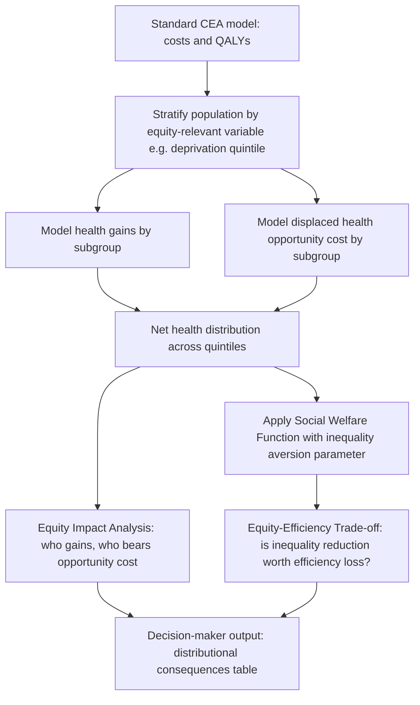

## Frameworks for Health Equity in Economic Analysis

### Overview

Standard cost-effectiveness analysis (CEA) ranks interventions by efficiency — cost per unit of health gained — without regard to who receives that health gain. Frameworks for health equity in economic analysis extend or replace this efficiency-only lens with tools that explicitly value the *distribution* of health and cost across subgroups (income, race, geography, disability status). These frameworks respond to the core tension in health economics: maximizing aggregate health (utilitarian efficiency) can conflict with reducing disparities (distributive justice), since the most efficient intervention often benefits the already-advantaged more than the disadvantaged.

### Why Standard CEA Is Equity-Blind

**Key Points**

- Conventional CEA uses a single incremental cost-effectiveness ratio (ICER): $ICER = \dfrac{\Delta C}{\Delta E}$, where $\Delta C$ is incremental cost and $\Delta E$ is incremental effect (often QALYs).
- This ratio is anonymous — a QALY gained by a wealthy urban patient is treated identically to a QALY gained by a poor rural patient.
- Aggregation can mask regressive outcomes: an intervention that is efficient in aggregate may widen the gap between the best-off and worst-off groups if the health gains concentrate among those already healthier.
- This is sometimes called the "equity-efficiency trade-off," formalized in welfare economics as a choice along a health-related social welfare function.

### Core Frameworks

#### 1. Extended Cost-Effectiveness Analysis (ECEA)

ECEA, developed largely through the Disease Control Priorities (DCP3) project and popularized by Verguet, Laxminarayan, and Jamison, augments standard CEA with four additional outcome domains beyond health gain:

- **Financial risk protection**: cases of catastrophic health expenditure (CHE) averted, typically defined as out-of-pocket health spending exceeding 10–25% of household income or consumption.
- **Distributional consequences of public spending**: how program costs and benefits fall across income quintiles.
- **Poverty impact**: cases of poverty (or medical impoverishment) averted, often using national poverty lines.
- **Disaggregated health gains**: health benefits reported by income quintile or other equity-relevant strata, not just as a population total.

**Example**

An ECEA of a national rotavirus vaccination program would report, alongside the standard cost per DALY averted:

- CHE cases averted, disaggregated by income quintile
- Number of households moved above the poverty line
- Government cost per poverty case averted
- Private (household) expenditure averted by quintile

This lets policymakers see that a program with a moderate ICER may still be prioritized because it delivers disproportionate financial protection to the poorest quintile.

#### 2. Distributional Cost-Effectiveness Analysis (DCEA)

DCEA, developed primarily by Asaria, Griffin, and Cookson (University of York), integrates equity concerns directly into the modeling of health opportunity costs. It has two core components:

- **Equity Impact Analysis**: models how both the health gains of an intervention *and* the health opportunity costs of its funding (displaced spending elsewhere in a fixed-budget system) are distributed across social groups (commonly by socioeconomic deprivation quintile).
- **Equity-Efficiency Trade-off Analysis**: uses an explicit **social welfare function (SWF)** to weigh aggregate health gain against reductions in health inequality, allowing a formal trade-off rather than an implicit one.

A commonly used SWF form is the **Atkinson social welfare function**, which incorporates an inequality-aversion parameter $\varepsilon$:

$$W = \left(\sum_{i} p_i \cdot h_i^{1-\varepsilon}\right)^{\frac{1}{1-\varepsilon}}, \quad \varepsilon \neq 1$$

where $h_i$ is health (e.g., life expectancy or QALYs) in subgroup $i$, $p_i$ is that subgroup's population share, and $\varepsilon$ reflects the degree of aversion to inequality (higher $\varepsilon$ = more weight on the worst-off group). As $\varepsilon \to 1$:

$$W = \prod_i h_i^{p_i}$$

At $\varepsilon = 0$, this collapses to standard utilitarian aggregation (total health, equity-blind). As $\varepsilon \to \infty$, it approaches a Rawlsian maximin criterion, valuing only the health of the worst-off group.

**DCEA Workflow (svg_diagram)**

#### 3. Equity Weighting

A simpler, more direct approach: apply explicit weights to health gains or costs depending on recipient characteristics, producing a **weighted QALY** or **equity-weighted ICER**.

$$E_{weighted} = \sum_i w_i \cdot \Delta E_i$$

where $w_i > 1$ for disadvantaged groups and $w_i \leq 1$ for advantaged groups (normalized around a reference weight of 1). Weights can be derived from:

- Stated-preference surveys (e.g., person trade-off, discrete choice experiments eliciting societal willingness to prioritize the worse-off)
- Normative formulas tied to health opportunity or social rank (e.g., weights that are a function of baseline health or lifetime health expectancy)

The UK's National Institute for Health and Care Excellence (NICE) and WHO-CHOICE have both piloted equity weighting schemes, though formal adoption remains limited and contested. [Inference] Formal adoption of numeric equity weights in routine HTA decision-making remains the exception rather than the rule, as most agencies use qualitative equity considerations alongside, rather than mathematically fused with, the ICER.

#### 4. Health Opportunity Cost and the Marginal Productivity of Spending

Central to DCEA is the recognition that funding a new intervention under a fixed health budget displaces other care — the "displaced" health also has a distribution across the population, often regressive (since disinvestment tends to hit services used more by disadvantaged groups). This requires estimating:

$$k = \frac{\text{Health budget}}{\text{Cost-effectiveness threshold of displaced care}}$$

Claxton et al.'s NHS-based empirical estimate placed the threshold nearer £12,936–£20,000 per QALY (rather than the nominal £20,000–£30,000 NICE range), directly informing UK DCEA opportunity-cost modeling. [Unverified] Exact threshold estimates are jurisdiction- and time-specific and should be re-verified against current published values before use in applied analysis.

#### 5. Capability Approach and Social Determinants Framing

Beyond QALY-based frameworks, the **capability approach** (Sen, Nussbaum) reframes health equity around what people are *able to do and be*, not just health states. In economic evaluation this appears as:

- **ICECAP** measures (ICECAP-O for older adults, ICECAP-A for adults) — capability-based outcome measures sometimes used alongside or instead of QALYs in equity-sensitive economic evaluation, particularly in social care contexts where health-only measures undervalue broader wellbeing.
- Analyses that explicitly model **social determinants of health** (income, housing, education) as both causes of health disparities and legitimate targets of "health" spending, expanding the accounting boundary beyond clinical care.

#### 6. Rawlsian, Prioritarian, and Utilitarian Ethical Foundations

Frameworks differ in their underlying distributive-justice theory:

| Framework | Ethical Basis | Objective |
| --- | --- | --- |
| Standard CEA | Utilitarian | Maximize total health, regardless of distribution |
| Prioritarianism | Weighted utilitarian | Maximize total health, with extra weight on the worse-off |
| DCEA (Atkinson SWF) | Parametrized | Slider between utilitarian and Rawlsian via $\varepsilon$ |
| Rawlsian maximin | Rawlsian | Maximize the health of the worst-off group only |
| Capability approach | Sen/Nussbaum | Expand substantive freedoms/capabilities, not just health metric |

### Applied Metrics for Measuring Disparity

**Key Points**

- **Concentration Index (CI)**: measures socioeconomic-related inequality in a health variable, ranging from −1 (concentrated entirely among the poorest) to +1 (concentrated entirely among the richest); computed from the concentration curve, analogous to a Gini coefficient but ranked by socioeconomic status rather than the health variable itself.

$$CI = \frac{2}{\mu} \text{cov}(h_i, R_i)$$

where $h_i$ is the health variable, $R_i$ is the fractional socioeconomic rank of individual $i$, and $\mu$ is the mean of $h$.

- **Slope Index of Inequality (SII)** and **Relative Index of Inequality (RII)**: regression-based measures of absolute and relative gaps in health across the full socioeconomic distribution, more robust than simple top-vs-bottom quintile ratios.
- **Health Inequality Index / Kolm indices**: extend Atkinson-style inequality aversion directly to health distributions rather than income.

### Data and Implementation Requirements

**Key Points**

- Subgroup-disaggregated cost and outcome data (by income quintile, race/ethnicity, geography, disability status) — often the binding constraint, since most clinical trials and claims datasets are not equity-stratified by default.
- A budget constraint and opportunity-cost threshold ($k$) to model displacement.
- An explicit or implicit social welfare function and inequality-aversion parameter, ideally elicited from the relevant decision-making population rather than assumed by analysts.
- Sensitivity analysis over the equity weighting/SWF parameter, since results (and hence policy conclusions) can be highly sensitive to $\varepsilon$ or $w_i$ choices — this is standard practice, not merely aspirational, in published DCEA and ECEA studies.

### Worked Example: DCEA-Style Comparison of Two Interventions

Consider two interventions competing for the same fixed $10 million budget, evaluated across two deprivation groups (Q1 = most deprived, Q5 = least deprived):

| Intervention | Total QALYs Gained | ICER | QALYs to Q1 | QALYs to Q5 | Opportunity Cost (displaced QALYs) |
| --- | --- | --- | --- | --- | --- |
| A: Targeted community screening | 800 | $12,500/QALY | 560 (70%) | 80 (10%) | 500 (regressive, hits Q1 services) |
| B: Broad hospital-based therapy | 1,000 | $10,000/QALY | 300 (30%) | 350 (35%) | 500 (regressive, hits Q1 services) |

Standard CEA favors Intervention B (lower ICER, higher total QALYs). A DCEA equity impact analysis shows Intervention A generates a **net positive** shift toward Q1 (560 gained vs. its share of displaced cost) while B's gains are distributed closer to the existing (unequal) baseline. Applying an Atkinson SWF with $\varepsilon = 1$ vs. $\varepsilon = 0$ could reverse the ranking — illustrating why the trade-off analysis, not just the ICER, is reported to decision-makers.

### Institutional Applications

- **WHO-CHOICE / DCP3**: primary user of ECEA for global health priority-setting, particularly in low- and middle-income country (LMIC) contexts where catastrophic health expenditure is a first-order policy concern.
- **NICE (UK)**: has explored DCEA methods (via York Health Economics Consortium research) for equity-sensitive HTA, though the standard ICER remains the primary formal decision criterion, with equity treated as a qualitative "modifier."
- **World Bank / Gates Foundation-funded LMIC analyses**: commonly pair ECEA with universal health coverage (UHC) benefit-package design to prioritize interventions with strong poverty and financial-protection benefits, not just favorable ICERs.

### Limitations and Critiques

**Key Points**

- Choice of equity-relevant stratifier (income vs. race vs. geography) is itself a normative decision that shapes results.
- Social welfare function parameters ($\varepsilon$, weights) are analyst- or stakeholder-elicited and contestable; results can shift materially across plausible parameter ranges. [Speculation] Some critics argue this makes equity-weighted CEA less transparent to the public than a simple ICER, though proponents counter that standard CEA's equity-blindness is itself an implicit (and unexamined) value judgment.
- Data granularity requirements (subgroup-level cost and outcome data) are often unmet, particularly in LMIC or under-resourced settings, forcing reliance on proxy distributions.
- Double-counting risk between health gain and financial risk protection domains in ECEA if not carefully specified.
- [Unverified] The practical decision-relevance of these frameworks — i.e., how often they actually reverse a funding decision relative to standard CEA in real institutional settings — is an active empirical research question rather than a settled finding.

### Conclusion

Frameworks for health equity in economic analysis exist on a spectrum from augmenting standard CEA with equity-relevant outcome reporting (ECEA's financial protection and poverty metrics) to fully integrating a formal social welfare function that trades off aggregate efficiency against distributional fairness (DCEA). None displace cost-effectiveness analysis outright; instead they make explicit, quantifiable, and auditable the equity judgments that a bare ICER leaves implicit. Choice among them depends on data availability, the health system's decision-making culture, and the extent to which distributive justice — not just aggregate welfare — is a formal decision criterion in that jurisdiction.

**Related Topics**

- Quality-Adjusted Life Years (QALYs) and their construction/critiques
- Social welfare functions in health economics (Atkinson, Kolm)
- Concentration index and health inequality measurement
- Extended cost-effectiveness analysis (ECEA) case studies (LMIC vaccination, UHC benefit packages)
- NICE health technology assessment (HTA) methodology and equity considerations
- Capability approach and ICECAP measures
- Financial risk protection and catastrophic health expenditure metrics
- Health opportunity cost and marginal productivity of healthcare spending
- Rawlsian vs. utilitarian vs. prioritarian ethics in resource allocation
- Social determinants of health in economic modeling