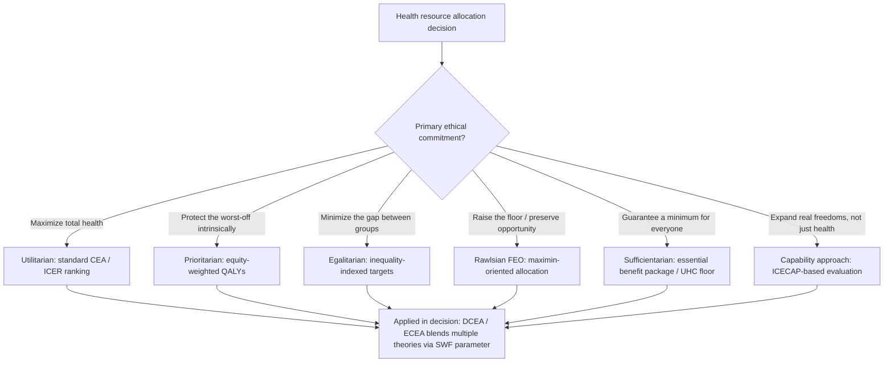

## Distributive Justice Theories in Health Resource Allocation

### Overview

Distributive justice theories answer a prior question that economic technique alone cannot: *on what ethical basis should scarce health resources be allocated?* Cost-effectiveness analysis tells decision-makers how to get the most health per dollar; distributive justice theories tell them what "fair" allocation means when maximizing aggregate health conflicts with other values — equality, need, desert, or opportunity. Every health resource allocation framework, whether explicit or not, embeds one or more of these theories.

### Utilitarianism

**Key Points**

- Founders: Bentham, Mill; applied to health resource allocation through welfarist economics.
- Core principle: maximize aggregate welfare (or health), summed across all individuals, with no intrinsic concern for how that welfare is distributed.
- In practice, this is the ethical foundation of standard cost-effectiveness analysis: maximize total QALYs (or DALYs averted) subject to a budget constraint.

$$\max \sum_{i=1}^{n} \Delta E_i \quad \text{subject to} \quad \sum_{i=1}^{n} C_i \leq B$$

where $\Delta E_i$ is the health gain to individual/group $i$, $C_i$ is cost, and $B$ is the fixed budget.

**Example**

A national health system with a fixed budget funds the intervention with the lowest cost per QALY first, then the next-lowest, until the budget is exhausted (the "league table" approach). If Intervention X costs $5,000/QALY and Intervention Y costs $50,000/QALY, pure utilitarian allocation funds X to capacity before funding any of Y — regardless of who benefits from each.

**Critiques**

- Aggregation can justify concentrating benefits on the "cheap to treat" (often the already-healthier or better-resourced), worsening disparities.
- No intrinsic value placed on equality, need, or rescue of the worst-off — a rich efficient allocation can be judged optimal even if it leaves a small population with no care at all.
- The "QALY discrimination" critique: standard QALY-maximization can systematically disadvantage older people, people with disabilities, and those with chronic conditions that limit maximum attainable health gain (since their $\Delta E$ ceiling is structurally lower). [Inference] This critique is well documented in the bioethics and health-policy literature; the degree to which it manifests in any specific program depends on implementation details (e.g., whether QALY caps or discounting adjustments are applied).

### Prioritarianism

**Key Points**

- Associated with Derek Parfit and, in health economics, formalized by Ord, Norheim, and others.
- Core principle: benefits to the worse-off matter *more* than equivalent benefits to the better-off — not because of any comparison to others (as in egalitarianism), but because giving priority to the badly-off is intrinsically more valuable.
- Operationalized through a **concave transformation** of individual health gains before summing, e.g.,

$$SW = \sum_i f(h_i)\cdot \Delta E_i$$

where $f(h_i)$ is a weighting function that is decreasing in baseline health $h_i$ — the worse a person's starting health, the higher the weight applied to their health gain.

**Example**

The WHO's "Fair Priority Model" for COVID-19 vaccine allocation incorporated prioritarian logic by weighting "years of life saved" against a benefit that gave extra priority to preventing severe economic and social deprivation, not purely maximizing total life-years.

**Distinguishing Prioritarianism from Egalitarianism**

- Prioritarianism cares about *absolute* levels of the worse-off — improving their position is good even if it increases the gap with the better-off, as long as the worse-off gain something.
- Egalitarianism (below) cares about the *gap itself* — it can, in its strict "leveling down" form, treat reducing the better-off's health (with no gain to anyone) as an improvement in fairness, which most theorists consider a fatal flaw.

### Egalitarianism

**Key Points**

- Core principle: health (or access to healthcare) should be as equal as possible across individuals/groups; inequality itself is the primary moral wrong, independent of the absolute level of health.
- Strict (or "telic") egalitarianism is vulnerable to the **leveling-down objection**: reducing the health of the better-off with no benefit to the worse-off counts as an improvement in equality, which is normatively implausible to most.
- **Luck egalitarianism** (Dworkin, Cohen) refines this: only inequalities arising from *unchosen circumstance* (genetic risk, birth into poverty) are unjust and warrant correction; inequalities from voluntary choice (e.g., risky lifestyle choices, fully informed) may not require the same redress. This distinction is highly contested in health policy because health outcomes are rarely cleanly separable into "chosen" vs. "unchosen" causes.

**Applied Egalitarian Metrics**

- Health Concentration Index and Slope/Relative Index of Inequality (see prior item on health equity frameworks) operationalize egalitarian goals empirically.
- "Equity of access" standards (e.g., equal waiting times regardless of ability to pay) apply egalitarian logic to process rather than outcome.

### Rawlsian Justice (Maximin / Fair Equality of Opportunity)

**Key Points**

- John Rawls's *A Theory of Justice* (1971) proposes principles chosen behind a "veil of ignorance" — not knowing one's own place in society, rational agents would choose principles that protect the worst-off.
- The **difference principle**: social and economic inequalities are just only if they work to the greatest benefit of the least-advantaged members of society (maximin criterion).
- **Norman Daniels** extended Rawls's framework explicitly to health via the **Fair Equality of Opportunity (FEO)** account: health matters morally because disease and disability restrict the range of opportunities (life plans) otherwise open to a person; just healthcare systems should protect "normal species-functioning" to preserve equality of opportunity.
- Operationally, Rawlsian maximin in health resource allocation is the limiting case of the Atkinson social welfare function as inequality-aversion $\varepsilon \to \infty$ (see prior item):

$$W_{Rawls} = \min_i (h_i)$$

**Example**

A Rawlsian-informed allocation rule would direct resources first to the group with the lowest health status/opportunity (e.g., a chronically underserved rural population), even if a marginal dollar spent there produces fewer aggregate QALYs than the same dollar spent on a healthier urban population — because the moral priority is raising the floor, not maximizing the sum.

**Critique**: Strict maximin can be inefficient at the margin — if the worst-off group has a biologically/structurally lower ceiling on achievable health improvement (e.g., due to severe multimorbidity), maximin logic can direct disproportionate resources for very small floor-raising, at high opportunity cost to everyone else. Daniels's FEO framework partially addresses this by focusing on opportunity-restoration rather than raw health-maximin.

### Sufficientarianism

**Key Points**

- Core principle: what matters morally is that everyone reaches a sufficient threshold of health/capability, not equality above that threshold and not aggregate maximization.
- Once the threshold is met, further inequality above it is not (or is less) morally troubling.
- Frankfurt's "doctrine of sufficiency" is the general philosophical source; in health policy this underlies **minimum benefit package** designs (e.g., WHO's Universal Health Coverage "essential health services" package) — the goal is to guarantee a floor of access/coverage for all, rather than perfect equality or unconstrained maximization.

**Example**

A country's Universal Health Coverage benefit package defines a set of essential services (e.g., maternal care, vaccination, essential surgery) that all citizens are entitled to regardless of ability to pay — a sufficientarian floor — while allowing supplementary private insurance to produce above-floor inequality that the policy does not attempt to eliminate.

**Critique**: The choice of *where* to set the threshold is itself a value judgment with major distributive consequences, and sufficientarianism offers little guidance on trade-offs entirely above or entirely below the threshold.

### Capability Approach

**Key Points**

- Developed by Amartya Sen and extended by Martha Nussbaum; already introduced operationally in the ECEA/DCEA item via ICECAP measures.
- Core principle: justice concerns individuals' real *capabilities* — substantive freedoms to achieve valuable "functionings" (being healthy, being educated, participating in community life) — not merely resources or subjective utility.
- Health is one capability among several constitutive of a good life; economic evaluation should therefore assess capability expansion, not only clinical health metrics.
- Nussbaum's list of **central human capabilities** includes bodily health and bodily integrity as non-negotiable minimums each person is entitled to, giving the approach a sufficientarian floor combined with a broader multi-dimensional metric than health alone.

### Communitarianism and Solidarity-Based Justice

**Key Points**

- Emphasizes shared social bonds, mutual obligation, and collective responsibility for health, rather than individual entitlement claims derived from abstract principles (Rawlsian or utilitarian).
- Underpins many European "solidarity" based social health insurance systems (e.g., Bismarckian systems in Germany, France, Netherlands) where risk pooling and cross-subsidization (healthy-to-sick, wealthy-to-poor) are justified by communal obligation rather than individual contractarian reasoning.
- Allocation decisions may explicitly incorporate community deliberation/priority-setting processes (e.g., citizen juries, deliberative polling) rather than purely technocratic ICER thresholds.

### Libertarian / Desert-Based Justice

**Key Points**

- Associated with Robert Nozick's entitlement theory: just distribution is whatever results from legitimate acquisition and voluntary transfer; redistribution via taxation for healthcare is not automatically justified by outcome patterns alone.
- In health resource allocation, this underlies systems (or components of systems) that tie benefits to contribution (e.g., employer-based insurance, personal responsibility-linked eligibility) rather than need alone.
- Desert-based variants sometimes factor personal responsibility for health risk (smoking, diet) into allocation or cost-sharing — highly contested both empirically (causal attribution of "responsibility" for health behaviors is difficult) and normatively (luck egalitarians would only penalize fully voluntary, informed choice).

### Comparative Summary

| Theory | Unit of Concern | Allocation Rule | Health Economics Analogue |
| --- | --- | --- | --- |
| Utilitarianism | Aggregate welfare | Maximize total health gain | Standard CEA / ICER ranking |
| Prioritarianism | Weighted individual gains | Extra weight to worse-off gains | Equity-weighted QALYs, DCEA with $\varepsilon > 0$ |
| Egalitarianism | Distribution/gap | Minimize health inequality | Concentration Index, SII/RII targets |
| Rawlsian (maximin/FEO) | Worst-off group | Maximize floor / protect opportunity | DCEA as $\varepsilon \to \infty$; FEO-based priority setting |
| Sufficientarianism | Threshold attainment | Guarantee minimum floor for all | UHC essential benefit packages |
| Capability approach | Substantive freedoms | Expand capability sets | ICECAP measures |
| Communitarianism | Shared solidarity | Collectively negotiated allocation | Social health insurance risk-pooling |
| Libertarian/desert | Individual entitlement | Contribution/responsibility-linked | Employer-based insurance, responsibility-linked cost-sharing |

### Decision Framework: Mapping Theory to Practice (svg_diagram)

### Empirical Elicitation of Distributive Preferences

**Key Points**

- Because no single theory commands universal consensus, applied health economics increasingly elicits **societal preferences** empirically rather than assuming a theory a priori.
- Methods include:
  - **Person trade-off (PTO)**: asks respondents how many QALYs to Group A are equivalent in value to a fixed number of QALYs to Group B (e.g., "how many QALYs to a healthy person equal 10 QALYs to a severely disabled person?").
  - **Discrete choice experiments (DCE)**: present respondents with allocation scenarios varying severity, age, and health gain, and estimate implicit weights via statistical choice models.
  - **Deliberative/citizen panels**: qualitative processes (e.g., NICE Citizens Council in the UK) that surface reasoned public judgments to inform, rather than mathematically fix, priority-setting.
- [Inference] Empirically elicited weights generally show some degree of priority for severity of illness and support for a "rule of rescue" (extra societal weight on saving identifiable individuals in acute danger), though the size and consistency of these effects vary across studies and populations, so specific magnitudes should not be treated as universal constants.

### Tensions and Open Problems

**Key Points**

- **Efficiency vs. equity trade-off**: formalized via the Atkinson SWF's $\varepsilon$ parameter — no purely technical answer exists for the "correct" value; it is a societal value judgment.
- **Aggregation problem**: how to compare gains across people with different baseline health, ages, and life expectancies (raises the "fair innings" argument — that priority should go to those who have not yet lived a full/normal lifespan, associated with Alan Williams).
- **Responsibility and desert**: the extent to which personal health-behavior choices should affect allocation priority remains ethically and empirically unresolved.
- **Global vs. domestic justice**: most of these theories were developed for allocation within a single national polity; extending them to global health resource allocation (e.g., global vaccine equity) raises additional questions about the scope of distributive obligation across borders. [Speculation] Whether cosmopolitan (globally maximin) or statist (nationally-bounded) principles should govern cross-border allocation remains a genuinely unsettled normative debate rather than a technical question with an emerging consensus answer.

### Conclusion

No single distributive justice theory is universally adopted in health resource allocation practice; real health systems typically blend elements — utilitarian efficiency as a baseline, prioritarian or Rawlsian adjustments for the severely ill or disadvantaged, sufficientarian floors via essential benefit packages, and communitarian solidarity in financing design. Understanding these theories is not merely philosophical background: each maps onto a specific, implementable technique in applied health economics (ICER ranking, equity weighting, DCEA social welfare functions, UHC benefit design), and the choice among them materially changes which interventions get funded and who benefits.

**Related Topics**

- Fair Equality of Opportunity (Norman Daniels) and health as opportunity-preservation
- Rule of rescue and identified vs. statistical lives in resource allocation
- Fair innings argument and age-based priority setting
- Social welfare functions and inequality aversion parameters (Atkinson, Kolm)
- Person trade-off and discrete choice experiments for eliciting societal health preferences
- Universal Health Coverage (UHC) essential benefits package design
- QALY discrimination critique and disability-adjusted allocation debates
- Global health justice and cross-border resource allocation obligations
- Deliberative democracy in priority-setting (citizen councils, deliberative polling)
- Luck egalitarianism and personal responsibility in health policy