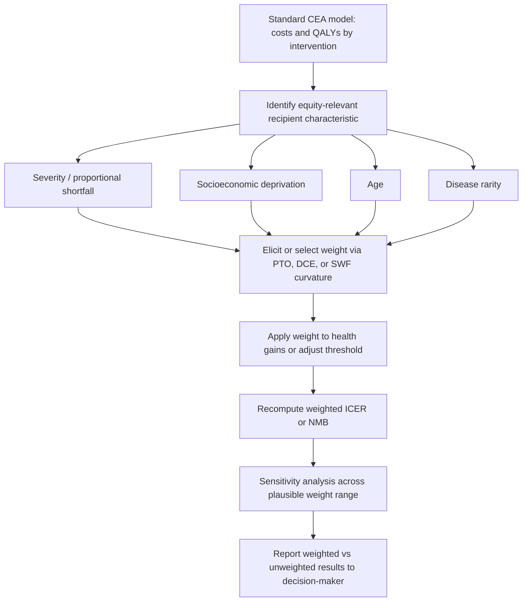

## Equity Weighting in Economic Evaluation

### Overview

Equity weighting is the technique of applying differential numerical weights to health gains, costs, or outcomes depending on the characteristics of who receives them, so that a standard cost-effectiveness analysis (CEA) explicitly incorporates distributive justice preferences rather than treating every QALY as interchangeable regardless of recipient. It converts the qualitative debate between distributive justice theories (utilitarian vs. prioritarian vs. egalitarian — see prior item) into an applied, quantifiable adjustment to the standard decision rule.

### The Core Problem: The "QALY Is a QALY" Assumption

**Key Points**

- Standard CEA treats a QALY gained by any individual as equivalent in social value to a QALY gained by any other individual — a core welfarist/utilitarian simplifying assumption.
- Empirical and normative research consistently finds this assumption does not match observed societal preferences: people, when surveyed, generally do not treat all QALYs as equal — many express willingness to sacrifice some aggregate health to direct more benefit toward the severely ill, the young, or the disadvantaged.
- Equity weighting operationalizes this gap between the technical decision rule and observed/normative societal values.

### Mathematical Formulation

**Unweighted (Standard) CEA decision rule:**

$$ICER = \frac{\Delta C}{\Delta E}$$

**Equity-weighted CEA:**

$$ICER_{weighted} = \frac{\Delta C}{\sum_i w_i \cdot \Delta E_i}$$

where $\Delta E_i$ is the health gain to subgroup $i$ and $w_i$ is an equity weight applied to that subgroup, normalized such that a "reference" or average-priority group has $w_i = 1$. Weights $w_i > 1$ indicate the subgroup's health gains are valued more highly by society (e.g., the severely ill, the poor, children); $w_i < 1$ indicates lower relative priority.

Alternatively, weights can be applied directly to net monetary benefit (NMB):

$$NMB_{weighted} = \lambda \sum_i w_i \Delta E_i - \Delta C$$

where $\lambda$ is the cost-effectiveness threshold (willingness-to-pay per unit of health).

### Sources of Equity Weights

#### 1. Severity-Based Weighting

Weights derived from the severity of the condition being treated — more weight to health gains for those with lower baseline health or higher "proportional shortfall" (the proportion of remaining lifetime health lost to the condition).

The Netherlands' Zorginstituut (National Health Care Institute) formally uses a **proportional shortfall (PS)** metric to set an acceptability threshold that scales with severity:

$$PS = \frac{QALE_{healthy} - QALE_{with\ disease}}{QALE_{healthy}}$$

where $QALE$ is quality-adjusted life expectancy. Higher proportional shortfall permits a higher cost-effectiveness threshold, functioning as an implicit severity-based equity weight.

**Example**

Under the Dutch system, a therapy for a condition with PS $\geq$ 0.7–1.0 (near-total loss of remaining healthy life expectancy) may be accepted up to a €80,000/QALY threshold, whereas a therapy for a condition with PS < 0.1 is capped near €20,000/QALY — a roughly 4x severity-based equity weight embedded directly in the threshold rather than the numerator.

#### 2. Socioeconomic/Deprivation-Based Weighting

Weights derived from recipient socioeconomic status, often via the DCEA social welfare function approach (see prior "Frameworks for health equity" item), where the weight is implicitly generated by the curvature ($\varepsilon$) of an Atkinson-type SWF rather than assigned as a discrete multiplier.

#### 3. Age-Based Weighting

- The **"fair innings" argument** (Alan Williams): individuals who have not yet lived a "normal" lifespan warrant extra priority; health gains to the young may be weighted more heavily than equivalent gains to the very old.
- Conversely, some frameworks apply reduced weight to health gains in very old age on grounds of diminishing returns to lifetime welfare — though this is ethically contested and explicitly rejected in several jurisdictions' HTA guidance (e.g., NICE guidance explicitly disallows age as a standalone discounting criterion, though severity-linked adjustments that correlate with age remain permissible).
- The WHO's original Disability-Adjusted Life Year (DALY) formulation historically included an **age-weighting function** giving less weight to years lived in early childhood and old age relative to young adulthood — this specific age-weighting component was dropped from the Global Burden of Disease methodology in later revisions (post-2010) due to ethical criticism, though this is a case where users should verify the current GBD/WHO methodology directly given ongoing methodological revisions.

#### 4. Rarity/Orphan Disease Weighting

Some HTA systems apply higher acceptable cost-per-QALY thresholds for rare/orphan diseases (e.g., NICE's Highly Specialised Technologies program uses thresholds up to £100,000–£300,000/QALY vs. the standard £20,000–£30,000/QALY range), functioning as an implicit equity weight favoring small, otherwise poorly-served patient populations. [Unverified] Specific threshold figures are subject to periodic revision; current values should be confirmed against the relevant HTA body's published methods guide before citation in applied work.

### Elicitation Methods for Weight Values

**Key Points**

- **Person Trade-Off (PTO)**: respondents state how many units of health gain to Group A they consider equivalent to a fixed number of units of health gain to Group B, directly yielding a relative weight ratio.
- **Discrete Choice Experiments (DCE)**: respondents choose between allocation scenarios that vary systematically in recipient characteristics (age, severity, socioeconomic status) and health gain magnitude; weights are estimated via conditional logit or related discrete-choice econometric models from the resulting choice data.
- **Standard Gamble / Time Trade-Off variants** adapted for social (rather than individual) preferences.
- **Equivalent Income / Willingness-to-Pay approaches**: infer implicit weights from how much society is willing to pay to shift resources toward specific groups.

**Illustrative elicitation structure (PTO):**

> "Program A gives 100 people (currently in mild health) a treatment that adds 1 QALY each (100 total QALYs).
>
> Program B gives 20 people (currently in severe health) a treatment that adds 1 QALY each (20 total QALYs).
>
> At what number of QALYs gained under Program A would you consider the two programs equally socially valuable?"

If respondents indicate indifference at, say, 300 QALYs under Program A (vs. 20 under Program B), the implied severity-based equity weight is $w_{severe} = 300/20 = 15$ relative to the mild-health reference group.

### Applied Equity-Weighting Workflow (svg_diagram)

### Worked Numerical Example

Two interventions compete for funding, both delivering QALY gains to different severity populations:

| Intervention | Population | Unweighted QALYs | Severity Weight ($w_i$) | Weighted QALYs | Cost | Unweighted ICER | Weighted ICER |
| --- | --- | --- | --- | --- | --- | --- | --- |
| A | Mild disease | 500 | 1.0 | 500 | $5,000,000 | $10,000/QALY | $10,000/weighted QALY |
| B | Severe disease | 300 | 2.5 | 750 | $6,000,000 | $20,000/QALY | $8,000/weighted QALY |

Under standard CEA, Intervention A is more cost-effective ($10,000 vs. $20,000 per QALY). Applying a severity-based equity weight of 2.5 to Intervention B's population reverses the ranking: B becomes more cost-effective per *weighted* QALY ($8,000 vs. $10,000). This demonstrates how equity weighting can materially change funding priority, not just reporting.

### Institutional Adoption Status

**Key Points**

- **Netherlands (Zorginstituut)**: formal proportional-shortfall-based threshold scaling — one of the most institutionalized examples of quantitative equity weighting in a national HTA system.
- **NICE (UK)**: does not apply a formal numeric equity weight to the standard QALY in its base-case ICER; instead uses **modifiers** — end-of-life criteria, severity modifiers (introduced 2022, replacing the earlier end-of-life criterion, applying up to a 1.2x or 1.7x QALY weight depending on absolute and proportional QALY shortfall), and Highly Specialised Technology thresholds for rare disease. [Unverified] NICE's severity modifier weight values and thresholds have been subject to methodological updates; current figures should be verified against NICE's latest published methods guide before use in applied analysis.
- **WHO-CHOICE**: has historically explored, but not mandated, equity weights in generalized CEA (GCEA) league tables for global priority-setting.
- **US institutions (ICER - the Institute for Clinical and Economic Review, distinct from the ICER cost-effectiveness ratio)**: reports "equity-informed" contextual considerations qualitatively alongside standard ICERs rather than applying formal numeric weights, reflecting broader US reluctance to adopt explicit QALY-based rationing weights (partly due to legal and political sensitivities, including provisions in the Affordable Care Act restricting the use of QALY thresholds in certain federal program decisions). [Unverified] The precise scope and current status of QALY-related restrictions in US federal programs is a legally and politically contested area subject to ongoing change; verify against current statute and regulatory guidance before relying on this for policy analysis.

### Critiques and Methodological Challenges

**Key Points**

- **Weight selection is itself a value judgment**: whether weights come from elicited public preferences, expert normative argument, or political negotiation changes both the values used and their legitimacy.
- **Interpersonal comparability**: eliciting a numeric trade-off ratio from survey respondents assumes a level of interpersonal utility comparability that some economists consider theoretically fraught.
- **Double-counting risk**: if severity is already implicitly reflected in the QALY calculation (e.g., through utility values capturing disease burden) and then weighted again via a severity multiplier, benefits may be counted twice — modelers must be careful to weight based on characteristics *not* already captured in the health-state utility values.
- **Framing effects in elicitation**: PTO and DCE results are sensitive to question wording, context, and whether respondents are primed to think about identified individuals ("rule of rescue" effects) versus statistical populations — this can produce unstable or inconsistent weight estimates across studies. [Inference] This sensitivity to elicitation framing is well documented in the stated-preference literature generally; the magnitude of resulting weight instability varies by study design and should not be assumed uniform across all elicitation contexts.
- **Aggregation across multiple weighting dimensions**: when severity, socioeconomic status, age, and rarity all plausibly warrant weights simultaneously, no consensus method exists for combining multiple weight dimensions without double-counting or arbitrary interaction assumptions.
- **Threshold vs. numerator approach**: applying weights via an adjusted cost-effectiveness threshold (as the Netherlands does) versus directly weighting the QALY numerator can produce different results and have different transparency properties; the choice is not merely cosmetic.

### Relationship to DCEA and ECEA

Equity weighting is a *component technique* used within the broader DCEA and ECEA frameworks covered in the prior "Frameworks for health equity in economic analysis" item:

- In **DCEA**, the equity weight is generated endogenously by the curvature of the chosen social welfare function (the Atkinson $\varepsilon$ parameter) rather than assigned as a discrete multiplier per subgroup.
- In simpler **standalone equity-weighted CEA** (as practiced in the Netherlands and explored by NICE's severity modifier), discrete multipliers are applied directly, without a full social welfare function apparatus — a lighter-weight, more transparent, but less theoretically grounded approach.

### Conclusion

Equity weighting operationalizes distributive justice preferences directly into the cost-effectiveness calculation, converting normative claims (that a QALY to a severely ill or disadvantaged person deserves greater social priority) into a quantifiable multiplier or threshold adjustment. It ranges from fully formalized systems (the Dutch proportional-shortfall threshold) to partial modifiers (NICE's severity modifier) to purely qualitative equity considerations reported alongside an unweighted ICER (most US HTA-adjacent bodies). The central methodological challenge across all implementations is that weight *values* are contestable, elicitation-sensitive, and can materially reverse funding decisions relative to standard CEA — making sensitivity analysis across plausible weight ranges essential practice rather than optional.

**Related Topics**

- Proportional shortfall and severity-based threshold setting (Dutch Zorginstituut methodology)
- NICE severity modifier and end-of-life criteria history
- Person trade-off and discrete choice experiment methodology for weight elicitation
- Distributional cost-effectiveness analysis (DCEA) and the Atkinson social welfare function
- Extended cost-effectiveness analysis (ECEA) and financial risk protection
- Fair innings argument and age-based priority setting
- Rule of rescue and identified vs. statistical lives
- QALY construction and health-state utility valuation
- Highly Specialised Technologies and orphan drug threshold policy
- US legal and political constraints on QALY-based resource allocation