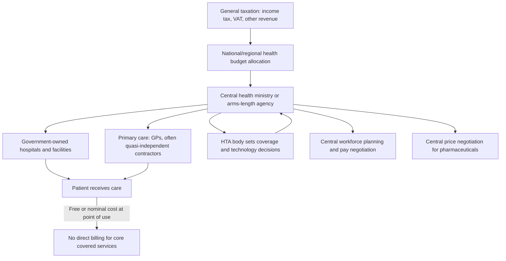

## Beveridge Model of National Health Services

### Overview

The Beveridge model is a health system financing and delivery archetype in which healthcare is funded primarily through general taxation and delivered largely by government-employed or government-owned providers, making the state simultaneously the primary payer, insurer, and (often) owner of the delivery infrastructure. Named after William Beveridge, whose 1942 report to the UK Parliament ("Social Insurance and Allied Services") laid the foundation for the UK's post-war welfare state, the model's clearest institutional embodiment is the UK's National Health Service (NHS), founded in 1948.

### Historical Origins

**Key Points**

- William Beveridge's 1942 report identified "Disease" as one of five "Giant Evils" (alongside Want, Ignorance, Squalor, and Idleness) that a post-war welfare state should address.
- The report proposed a comprehensive National Health Service, universally available, financed through general taxation rather than contributory insurance premiums, free at the point of use.
- The NHS launched on July 5, 1948, nationalizing hospitals and creating a tax-funded, centrally administered health system — historically framed as removing price as a barrier to care.
- The model has since been adopted, with local variation, in countries including Spain, Italy, Portugal, the Nordic countries (Sweden, Norway, Denmark, Finland), and New Zealand, among others.

### Core Structural Features

**Key Points**

- **Financing**: predominantly general taxation (income tax, VAT, other tax revenue), not earmarked payroll-based social insurance contributions (which characterize the Bismarck model instead).
- **Risk pooling**: universal and automatic — the entire tax-paying population constitutes a single national risk pool, with no separate insurance enrollment step required.
- **Provision**: often (though not universally) combines tax financing with direct government ownership of hospitals and direct government employment of clinical staff (a "single payer, single provider" structure), distinguishing it from single-payer models that finance care through taxation but purchase from independently-owned providers.
- **Point-of-use cost**: care is typically free or nominal-cost at the point of use for core services, with the state, rather than the patient, bearing (or centrally negotiating) most cost.
- **Governance**: centralized (or regionally devolved) public administration, typically a ministry of health or an arms-length national agency (e.g., NHS England), sets budgets, negotiates pay, and determines coverage/technology adoption (often via a formal HTA body — see NICE in prior items).

### System Architecture (svg_diagram)

### Financing Mechanics

**Key Points**

- Revenue is collected through the general tax base rather than a dedicated payroll health-insurance contribution, meaning health spending competes directly with other government spending priorities (education, defense, infrastructure) in the annual budget process, rather than sitting in a ring-fenced social insurance fund.
- Budget allocation is typically top-down: national government sets an overall health budget, which is then allocated to regional or local administrative bodies (e.g., NHS England's allocation to Integrated Care Boards) using capitation-based formulas adjusted for population health need and deprivation.
- Capital investment (hospital construction, major equipment) is often centrally planned and funded, though many Beveridge-model systems (including the UK) have experimented with private capital financing mechanisms (e.g., the Private Finance Initiative) for infrastructure, creating hybrid public-private capital structures without altering the tax-funded operating model.

### Economic Characteristics

**Key Points**

- **Administrative efficiency**: single-payer, tax-funded systems generally have lower administrative overhead as a share of total health spending compared to multi-payer insurance-based systems, since there is no need for extensive billing, claims adjudication, or marketing/underwriting infrastructure across competing insurers. [Inference] This is a well-established comparative finding across OECD health-system studies; exact administrative cost-share figures vary by study methodology and year, and should be sourced from current OECD Health Statistics for specific figures rather than assumed as fixed constants.
- **Monopsony purchasing power**: as the dominant (often sole) purchaser of hospital services and a major purchaser of pharmaceuticals, government has strong negotiating leverage to control unit prices — a key mechanism behind Beveridge-model systems' generally lower per-capita health spending as a share of GDP relative to the mixed-financing US system.
- **Rationing mechanism**: because demand is not price-rationed at the point of use, Beveridge systems rely on **non-price rationing** — waiting lists, referral gatekeeping (via primary care), and formal HTA-based coverage decisions — to manage the gap between (near-infinite) demand at zero marginal price and finite supply/budget.
- **Global budgets and cost control**: providers typically operate under global or capped budgets rather than fee-for-service reimbursement, which controls aggregate spending growth but can create incentives for under-provision, waiting-list growth, or cost-shifting to non-covered private options as pressure-release valves.
- **Investment underfunding risk**: because health spending competes annually against other tax-funded priorities, capital investment (equipment, facility modernization) is more exposed to political business-cycle pressures than in earmarked social-insurance systems where funds are ring-fenced. [Inference] This dynamic is frequently cited in comparative health-systems literature discussing NHS capital investment trends specifically, though the general claim about tax-funded systems' capital investment exposure should not be treated as a universal law applicable identically across all Beveridge-model countries.

### Primary Care Gatekeeping

**Key Points**

- Most Beveridge-model systems use a **gatekeeping** structure: patients register with a primary care provider (e.g., a UK General Practitioner) who acts as the first point of contact and controls referral access to specialist and hospital care.
- Economically, gatekeeping functions as a **demand-management mechanism**: it reduces unnecessary specialist utilization, supports care coordination, and is associated in the literature with lower overall system costs relative to open-access specialist systems, though it can also introduce access delays that function as an implicit rationing cost.
- GPs in the UK NHS are formally independent contractors (not direct government employees) paid via a capitation-weighted formula plus quality-linked payments (historically the Quality and Outcomes Framework, QOF) — an important nuance: the "single provider" characterization of Beveridge systems applies most cleanly to hospital care, less so to primary care, which often retains small-business/contractor structures even within an overwhelmingly tax-funded, publicly-governed system.

### Comparison with Other Health System Models

| Dimension | Beveridge (e.g., UK NHS) | Bismarck (e.g., Germany) | National Health Insurance (e.g., Canada) | Out-of-Pocket/Private (fragmented) |
| --- | --- | --- | --- | --- |
| Financing | General taxation | Payroll-based social insurance (sickness funds) | General taxation (national insurance) | Direct private payment/private insurance |
| Risk pooling | Universal, automatic | Mandatory but via multiple competing/quasi-competing insurers | Universal, automatic | Fragmented or absent |
| Provider ownership | Often government-owned (hospitals) | Predominantly private/non-profit providers | Predominantly private providers, public financing | Private |
| Point-of-use cost | Free/nominal for core services | Modest cost-sharing common | Free for core "medically necessary" services | Full price or insurance-dependent |
| Rationing mechanism | Waiting lists, gatekeeping, global budgets | Price/cost-sharing plus some capacity limits | Waiting lists (esp. specialist/elective care) | Price (ability to pay) |

*Note: the UK NHS and Canada's Medicare are often distinguished as "Beveridge" (tax-funded AND publicly-provided) vs. "national health insurance" (tax-funded but privately-provided) respectively, though both are sometimes grouped loosely under "single-payer" terminology — precise categorization varies across health-systems literature and readers should be attentive to which taxonomy a given source uses.*

### Strengths (Economic Perspective)

**Key Points**

- Strong cost-containment via monopsony pricing power and global budgets — Beveridge-model countries (UK, Nordic countries, Spain, Italy) generally spend a lower share of GDP on healthcare than the US, while achieving comparable or better population health outcomes on standard metrics (life expectancy, infant mortality), per commonly cited OECD comparative data. [Unverified] Specific comparative spending and outcome figures change year to year; current OECD Health Statistics or WHO Global Health Expenditure Database figures should be consulted for up-to-date comparisons.
- Lower administrative/transaction costs relative to multi-payer competitive insurance markets.
- Universal coverage by default (no enrollment gaps, no medical underwriting, no risk of coverage loss tied to employment status).
- Reduced financial-risk-protection burden on households (low catastrophic health expenditure risk, per the ECEA financial protection domain covered in the equity frameworks item).

### Weaknesses (Economic Perspective)

**Key Points**

- Non-price rationing via waiting lists can impose real economic costs (lost productivity, deteriorating health while waiting) that are harder to quantify and politically manage than price-based rationing.
- Centralized budget-setting exposes health spending to political/fiscal-cycle volatility rather than protected, ring-fenced financing.
- Monopsony pricing power, while cost-containing, can also depress innovation incentives or delay access to new high-cost technologies pending centralized HTA approval (a trade-off directly connected to the cost-effectiveness threshold and equity-weighting mechanisms covered in prior items).
- Capacity constraints (workforce, hospital beds, equipment) are centrally planned and can be slow to respond to demand shocks (a dynamic starkly illustrated during the COVID-19 pandemic's effect on NHS elective-care waiting lists). [Inference] The general capacity-responsiveness critique is a standard feature of comparative health-systems analysis; specific pandemic-era waiting-list figures for any given country should be sourced from current national statistics rather than assumed from memory, given ongoing post-pandemic recovery trends.

### Hybrid and Mixed Variations

**Key Points**

- Many nominally Beveridge-model countries incorporate substantial private-sector elements: private supplementary insurance (used by a minority of the UK population to bypass NHS waiting lists for elective care), private hospital capacity contracted into NHS-funded pathways, and independent-contractor GP structures noted above.
- Spain and Italy combine national tax-funded universal coverage with significant regional administrative devolution, creating meaningful within-country variation in service delivery and, empirically, in health outcomes and waiting times across regions.
- The Nordic countries generally combine Beveridge-style national/regional tax financing with substantial municipal-level (rather than purely central) administration and funding responsibility, a structurally distinct governance layer from the UK's more centralized NHS model.

### Reform Trends and Purchaser-Provider Splits

**Key Points**

- Several Beveridge-model systems, most notably the UK NHS from the early 1990s onward ("internal market" reforms) and subsequent iterations, introduced a **purchaser-provider split**: separating the entity that holds the budget and commissions care (e.g., NHS Clinical Commissioning Groups, later Integrated Care Boards) from the entity that delivers care (NHS Trusts), intended to introduce competitive/market-like discipline into an otherwise centrally planned system while retaining tax financing and universal coverage.
- This reflects a broader economic critique that pure central planning of a national health service can lack the price-signal and competitive-discipline mechanisms that drive efficiency in market-based delivery — purchaser-provider splits attempt to import some of those disciplines without abandoning universal tax-funded coverage.
- [Unverified] The empirical evidence on whether purchaser-provider splits and related market-style reforms have durably improved efficiency or outcomes within Beveridge systems is genuinely mixed and contested in health-services research; this should not be characterized as a settled question in either direction.

### Conclusion

The Beveridge model represents the archetype of tax-funded, universally-pooled, often publicly-provided healthcare, prioritizing equity of access and cost-containment through monopsony purchasing and centralized budget control, at the economic cost of relying on non-price rationing mechanisms (waiting lists, gatekeeping) and exposure to political-fiscal budget cycles rather than ring-fenced financing. Its clearest real-world exemplar, the UK NHS, illustrates both the model's core strengths (low administrative overhead, strong financial risk protection, universal coverage) and its characteristic economic tensions (capacity planning under centralized budgets, innovation-diffusion delays tied to HTA processes, and the periodic introduction of market-like reforms such as purchaser-provider splits to address efficiency critiques from within a fundamentally tax-funded structure).

**Related Topics**

- Bismarck model of social health insurance (comparative financing structure)
- National Health Insurance model (Canada) vs. Beveridge model distinctions
- NHS purchaser-provider split and internal market reforms
- Monopsony pricing power and pharmaceutical price negotiation
- Non-price rationing mechanisms: waiting lists and gatekeeping economics
- NICE health technology assessment and coverage decision-making
- Capitation-based budget allocation formulas
- Private Finance Initiative and hybrid public-private capital financing
- OECD comparative health spending and outcomes data
- Universal Health Coverage (UHC) financing models globally