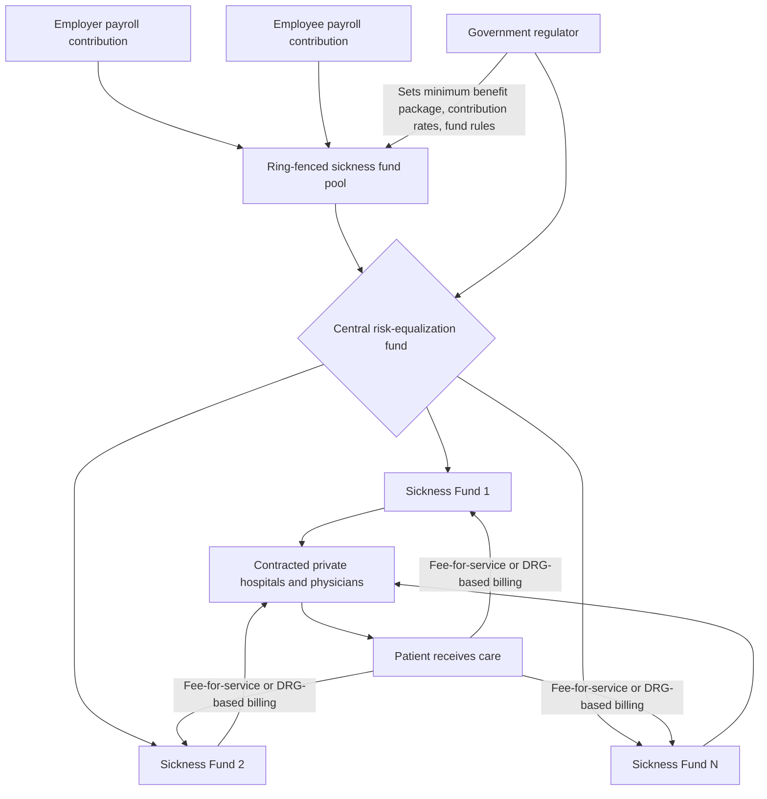

## Bismarck Model of Social Health Insurance

### Overview

The Bismarck model is a health system financing archetype built on mandatory, payroll-based social health insurance administered through multiple non-profit ("sickness fund") insurers, with care predominantly delivered by privately-owned providers under contract with those funds. Named after Otto von Bismarck, who introduced the first modern compulsory health insurance system in Germany with the Health Insurance Act of 1883, the model separates the financing role (multiple competing or quasi-competing insurers) from the provision role (predominantly private, fee-for-service or activity-based providers) more sharply than the Beveridge model's tax-funded, often publicly-provided structure.

### Historical Origins

**Key Points**

- Otto von Bismarck's 1883 *Gesetz betreffend die Krankenversicherung der Arbeiter* (Health Insurance Law) mandated that industrial workers contribute to sickness funds (*Krankenkassen*), with contributions split between employer and employee, marking the world's first national compulsory social health insurance scheme.
- The original design was explicitly political as well as social — intended partly to undercut support for the socialist movement by demonstrating that the state (via mandated, employer-linked insurance) could address worker welfare without wholesale nationalization of industry or medicine.
- Germany's system evolved over 140 years into the modern *Gesetzliche Krankenversicherung* (GKV, statutory health insurance), still recognizably built on the same sickness-fund architecture.
- Countries adopting Bismarck-model or Bismarck-derived systems include Germany, France, the Netherlands, Belgium, Switzerland, Japan, and, in modified form, South Korea and several other OECD and middle-income countries.

### Core Structural Features

**Key Points**

- **Financing**: mandatory payroll-based contributions, typically split between employer and employee as a percentage of wages, paid into dedicated, ring-fenced sickness funds — distinct from Beveridge's general-taxation financing.
- **Multiple payers**: financing and risk-bearing is distributed across multiple non-profit (in most systems) sickness funds/insurers, rather than a single national payer, though funds are typically subject to significant government regulation on benefits, pricing, and risk-adjustment.
- **Provider ownership**: hospitals and physician practices are predominantly privately owned (for-profit, non-profit, or physician-owned), contracting with sickness funds for reimbursement — sharply distinct from the Beveridge model's frequent direct government ownership of hospitals.
- **Universality via mandate**: coverage is (in most modern Bismarck systems) universal or near-universal, achieved through a legal mandate to enroll (either in a statutory sickness fund or, for some income/occupational groups, an approved private alternative) rather than through automatic tax-based inclusion.
- **Risk equalization**: because multiple funds compete for members while being required to accept all applicants regardless of health status (community rating), Bismarck systems require a **risk-adjustment/equalization mechanism** to prevent funds from being financially penalized for enrolling sicker, costlier populations.

### System Architecture (svg_diagram)

### Financing Mechanics

**Key Points**

- Contributions are calculated as a percentage of gross wages up to a contribution ceiling (income above the ceiling is not subject to further mandatory health-insurance payroll deduction), typically split roughly evenly between employer and employee, though exact splits and ceilings vary by country and are periodically revised. [Unverified] Current contribution rates and ceilings (e.g., Germany's GKV contribution rate) change through periodic legislation; specific percentage figures should be verified against current national statutory sources rather than assumed fixed.
- Because contributions are earmarked/ring-fenced for health insurance rather than flowing into general tax revenue, Bismarck-model financing is generally considered more insulated from annual general-budget political pressures than Beveridge-model tax financing — a structural trade-off directly opposite the Beveridge model's capital-investment exposure critique covered in the prior item.
- Self-employed individuals, the unemployed, students, and other non-standard-employment groups typically have separate contribution rules (state-subsidized contributions, minimum-income-based contributions, or exemptions), creating administrative complexity not present in a uniform tax-funded system.
- Higher earners in some Bismarck systems (notably Germany) have a legal option to opt out of the statutory system entirely and purchase private substitutive insurance (*private Krankenversicherung*, PKV) above an income threshold — a structural feature with significant risk-selection implications, since predominantly healthier, wealthier individuals opting out can leave the statutory risk pool relatively worse-off on average health/income composition. [Inference] This risk-selection dynamic is a standard concern raised in comparative health-financing literature regarding opt-out provisions generally; its empirically observed magnitude in any specific country's system should be sourced from current health-economics research rather than assumed.

### Risk Equalization Mechanisms

**Key Points**

- Because multiple insurers coexist and are required (in most Bismarck systems) to practice **community rating** (charging the same premium/contribution rate regardless of individual health risk) and **guaranteed issue** (accepting all applicants), a fund that happens to enroll a sicker population would face a structural financial disadvantage without correction.
- **Risk equalization funds** (e.g., Germany's *Gesundheitsfonds*, morbidity-adjusted risk structure compensation scheme) redistribute money among sickness funds based on enrollees' age, sex, and diagnosed morbidity/disease categories, so that funds are compensated for enrolling higher-risk members rather than incentivized to avoid them.
- This is economically analogous to risk-adjustment mechanisms used in regulated private insurance markets elsewhere (e.g., the risk-adjustment provisions in the US Affordable Care Act marketplaces), reflecting a general principle: **wherever multiple competing risk-bearing insurers with community rating coexist, some form of risk equalization is required to prevent adverse selection dynamics and risk-selection ("cherry-picking") behavior by insurers.**

$$RiskAdjustedTransfer_j = \sum_{k} n_{jk} \cdot (\bar{c}_k - c_{jk})$$

where $j$ indexes the fund, $k$ indexes risk categories (age/sex/morbidity cells), $n_{jk}$ is the fund's enrollment in cell $k$, $\bar{c}_k$ is the population-average expected cost for risk category $k$, and $c_{jk}$ is the fund's realized cost — funds with higher-cost risk profiles receive net transfers in.

### Provider Payment Mechanisms

**Key Points**

- Ambulatory (outpatient) physician care is frequently reimbursed via negotiated fee-for-service schedules, often set through collective negotiation between physician associations and sickness-fund associations (e.g., Germany's *Kassenärztliche Vereinigung* negotiating a uniform fee schedule, the *Einheitlicher Bewertungsmaßstab*, with sickness funds).
- Hospital care is commonly reimbursed via **Diagnosis-Related Groups (DRG)**-based prospective payment (Germany adopted a DRG system, the *German-DRG* or *G-DRG*, modeled partly on the US Medicare DRG approach, to control hospital cost growth while preserving activity-based, provider-diversity financing).
- Because providers are predominantly privately owned and paid on an activity/volume basis (rather than salaried government employment as in much of the Beveridge model), Bismarck systems generally face a structurally different set of cost-control challenges: less direct government control over aggregate volume, offset by negotiated fee schedules and DRG-based prospective payment caps to constrain per-unit and per-episode cost growth.

### Economic Characteristics

**Key Points**

- **Ring-fenced, earmarked financing** provides more budget insulation from general fiscal-policy pressures than tax-funded Beveridge systems, at the cost of a labor-market distortion: payroll-based contributions function economically similarly to a tax on labor, potentially affecting employment costs and creating incentives around formal vs. informal labor-market participation, particularly relevant in middle-income countries adapting Bismarck-style financing.
- **Multiple-payer administrative overhead**: maintaining multiple competing/parallel insurers (each with its own administrative, marketing, and claims infrastructure) generally produces higher administrative costs as a share of total health spending relative to true single-payer Beveridge systems, though this is typically still substantially lower than the highly fragmented, heavily underwritten multi-payer private insurance market structure historically characteristic of the US. [Inference] This administrative-cost comparison is a standard, broadly supported finding in comparative health-systems economics; precise percentage-point differences vary by study methodology, country, and year and should be sourced from current OECD or country-specific data for applied use.
- **Provider autonomy and choice**: predominantly private provider ownership and fee-for-service/DRG-based payment (rather than salaried government employment and hard budget caps) is often associated with greater patient choice of provider and shorter waiting times relative to Beveridge-model systems relying more heavily on non-price rationing, though this comes with correspondingly less direct government control over aggregate cost growth.
- **Cost growth pressures**: activity-based payment (fee-for-service, DRG) creates a structural incentive toward volume growth that tax-funded, globally-budgeted Beveridge systems are comparatively more insulated from — Bismarck systems have historically needed a wider array of supply-side cost-control tools (fee schedule negotiation, DRG rate-setting, reference pricing for pharmaceuticals, gatekeeping requirements in some variants) to manage this.

### Comparison with the Beveridge Model

| Dimension | Bismarck (e.g., Germany) | Beveridge (e.g., UK) |
| --- | --- | --- |
| Financing | Mandatory payroll-based social insurance contributions | General taxation |
| Fund structure | Multiple (often non-profit) sickness funds | Single national/regional payer |
| Provider ownership | Predominantly private | Often government-owned (hospitals) |
| Risk pooling mechanism | Risk-equalization fund across multiple insurers | Automatic universal pooling, single payer |
| Provider payment | Fee-for-service (ambulatory), DRG (hospital) | Salaried employment, global budgets |
| Cost-control lever | Negotiated fee schedules, DRG rates, risk equalization | Monopsony pricing, global budgets, waiting lists |
| Typical rationing mechanism | Price/cost-sharing, limited waiting-list rationing | Waiting lists, gatekeeping, HTA coverage decisions |
| Labor-market interaction | Payroll contribution functions similarly to a labor tax | Financing largely decoupled from direct wage costs |

### Strengths (Economic Perspective)

**Key Points**

- Earmarked, ring-fenced financing provides insulation from general-budget political cycles relative to tax-funded systems.
- Multiple-payer structure with community rating and risk equalization preserves insurer choice/competition (in some variants, notably the Netherlands and Switzerland's more fully "managed competition" models) while still achieving universal coverage and preventing risk-selection-based market failure.
- Predominantly private provider ownership combined with activity-based payment is generally associated with shorter waiting times and greater patient choice relative to heavily rationed Beveridge systems.
- Well-developed risk-adjustment methodology (Germany's morbidity-based risk structure compensation, in particular) is widely studied as a reference model for other countries designing multi-payer risk equalization systems.

### Weaknesses (Economic Perspective)

**Key Points**

- Payroll-based financing narrows the contribution base relative to general taxation (excludes non-wage income sources unless specifically included) and functions similarly to a labor tax, with potential (contested) effects on formal employment costs and labor-market dynamics, particularly acute in economies with large informal sectors attempting Bismarck-style reforms.
- Higher administrative overhead from maintaining multiple parallel insurer administrative structures relative to true single-payer systems.
- Activity-based provider payment creates structural cost-growth pressure requiring continual supply-side rate negotiation and monitoring — a different, arguably more labor-intensive, cost-control challenge than the Beveridge model's global-budget approach.
- Opt-out provisions for high earners (where present, as in Germany) create risk-selection dynamics that can affect the statutory risk pool's average cost and financial sustainability. [Speculation] The long-run fiscal sustainability implications of opt-out provisions specifically are a subject of ongoing policy debate in the relevant countries rather than a settled empirical conclusion, and views on the appropriate policy response (raising thresholds, eliminating opt-out, expanding subsidy design) vary across the political and academic spectrum.

### Country Variations

**Key Points**

- **Germany**: the archetype — multiple competing statutory sickness funds (over 90 as of recent years, though the number has consolidated significantly over decades) plus a substitutive private insurance option for high earners.
- **Netherlands**: a more explicitly "managed competition" variant — since 2006 reforms, all residents purchase mandatory private (though heavily regulated, community-rated, guaranteed-issue) insurance from competing insurers, with a centralized risk-equalization fund, often cited as a hybrid Bismarck/managed-competition model.
- **France**: statutory health insurance (*Assurance Maladie*) historically organized around occupation-based funds (consolidated over time toward greater unification), combined with substantial complementary private insurance (*mutuelles*) covering copayments and services outside the statutory basket, creating a two-tier Bismarck-plus-supplementary-private structure.
- **Switzerland**: mandatory purchase of regulated private insurance from competing insurers (similar in structure to the Dutch model), with income-based subsidies for lower earners and cantonal (sub-national) administrative variation.
- **Japan**: multiple insurer types organized by employment category (employer-based societies, national health insurance for self-employed/retired), with strong centralized fee-schedule regulation constraining cost growth despite the multi-payer structure. [Unverified] Precise current structural details for Japan's system (specific insurer categories, current fee-schedule mechanics) should be verified against current Japanese Ministry of Health, Labour and Welfare sources given periodic system reforms.

### Conclusion

The Bismarck model achieves universal or near-universal coverage through mandatory, payroll-based social insurance distributed across multiple non-profit or regulated private insurers, combined with predominantly privately-owned care delivery — a structurally different approach from the Beveridge model's tax-funded, often publicly-provided architecture. Its economic strengths (ring-fenced financing insulated from general budget cycles, preserved provider and often insurer choice, generally shorter waiting times) come with distinct trade-offs: payroll-based financing's labor-market interactions, higher multi-payer administrative overhead, and the continual supply-side cost-control burden created by activity-based provider payment. The risk-equalization mechanisms Bismarck systems have developed to manage multi-payer community rating are widely studied as a reference architecture for any health system — including regulated private insurance markets outside the classic Bismarck-model countries — seeking to combine insurer choice with universal, risk-blind access.

**Related Topics**

- Beveridge model of national health services (comparative financing structure)
- Risk equalization and risk adjustment methodology in multi-payer systems
- Managed competition models (Netherlands, Switzerland)
- Diagnosis-Related Group (DRG) hospital payment systems
- Community rating and guaranteed issue in health insurance regulation
- Payroll tax incidence and labor-market effects of social insurance financing
- Adverse selection and risk-selection dynamics in insurance markets
- Fee-for-service vs. activity-based vs. capitated provider payment models
- Opt-out and substitutive private insurance provisions in social insurance systems
- Comparative OECD health system financing typologies