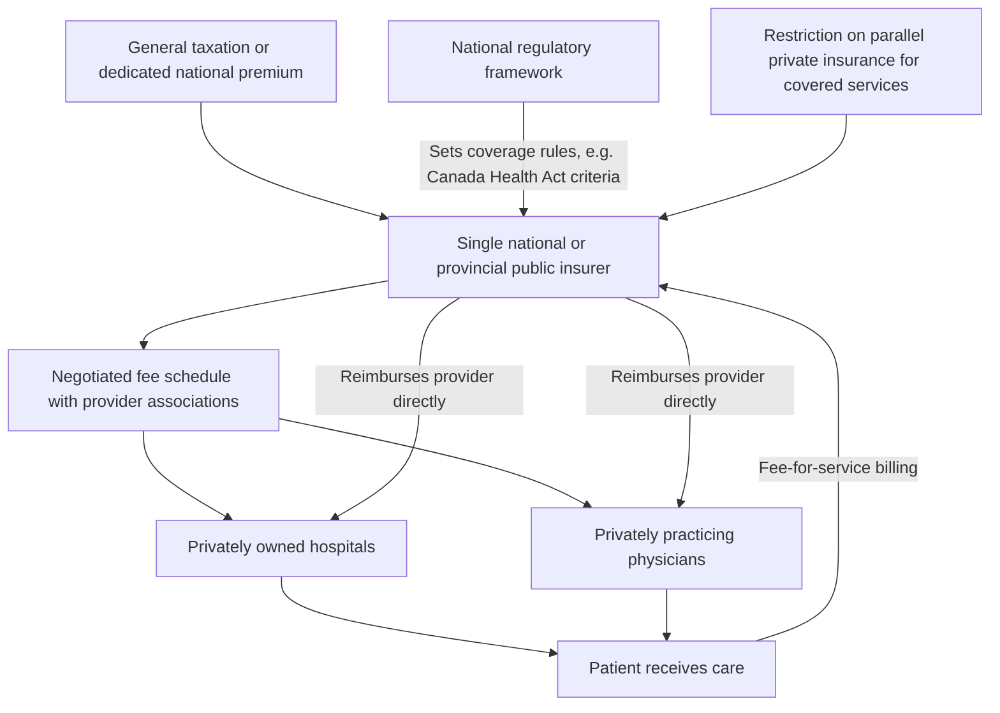

## National Health Insurance Model

### Overview

The National Health Insurance (NHI) model is a health system archetype in which the government acts as a single, tax-funded insurer — collecting contributions and paying claims — while care delivery remains predominantly in private hands, distinguishing it from both the Beveridge model (tax-funded financing *and* often government-owned/staffed delivery) and the Bismarck model (multiple private/non-profit insurers). Canada's Medicare system is the most commonly cited exemplar, giving the model its frequent alternate label, the "Canadian model." South Korea and Taiwan are also widely cited as NHI-model systems, each developed through distinct historical paths toward the same core structural pattern: single tax-funded payer, private provision.

### Historical Origins

**Key Points**

- Canada's system evolved from Saskatchewan's 1947 hospital insurance plan (under Premier Tommy Douglas) and 1962 physician insurance plan, which became the template for national legislation: the Medical Care Act (1966) and the consolidating Canada Health Act (1984), which established the framework still governing the system today.
- The Canada Health Act established five conditions provinces must meet to receive federal transfer funding: **public administration, comprehensiveness, universality, portability, and accessibility** — these criteria are foundational to the NHI model's regulatory logic and are frequently referenced in comparative health-policy analysis.
- Taiwan implemented its National Health Insurance program in 1995, explicitly studying and adapting elements from Canada, Germany, and other systems to design a single-payer, tax/premium-funded, privately-delivered model.
- South Korea's National Health Insurance Service unified previously fragmented multiple-insurer arrangements into a single national insurer over a phased implementation completed by 2000, converging structurally toward the single-payer NHI pattern despite originating from a Bismarck-style multi-fund starting point. [Unverified] Specific consolidation dates and structural details for South Korea's system should be verified against current Korean National Health Insurance Service documentation, as this reflects a system that itself evolved from an initially different structure.

### Core Structural Features

**Key Points**

- **Single payer**: one government (or quasi-government) entity per jurisdiction collects revenue and pays provider claims — structurally distinct from the Bismarck model's multiple sickness funds, and closer to the Beveridge model's single-payer financing.
- **Private delivery**: hospitals and physicians remain predominantly privately owned and operated (for-profit or non-profit), contracting with the single public payer for reimbursement — structurally distinct from the Beveridge model's frequent direct government ownership of hospitals.
- **Financing**: typically general taxation (as in Canada, where provinces administer plans funded through federal transfers plus provincial general revenue) or a dedicated premium/payroll-style contribution collected by the single national insurer (as in Taiwan and South Korea) — financing mechanics vary more across NHI-model countries than in the more financing-uniform Beveridge or Bismarck archetypes.
- **Fee-for-service dominant payment**: providers, being private and independent, are commonly reimbursed via negotiated fee-for-service schedules (Canada) or a mix of fee-for-service and global budget elements (Taiwan), rather than the salaried employment common in Beveridge systems.
- **Prohibition or restriction on private parallel insurance for covered services**: a distinguishing regulatory feature in several NHI systems (most notably Canada) — provinces generally restrict or prohibit private insurance for medically necessary services already covered by the public plan, intended to prevent a parallel private tier from undermining the single-payer risk pool, though the scope and enforcement of these restrictions vary by province and have been subject to legal challenge.

### System Architecture (svg_diagram)



### Financing Mechanics

**Key Points**

- **Canada**: financed through a blend of federal transfers (the Canada Health Transfer, a block grant conditional on provinces meeting the five Canada Health Act criteria) and provincial general tax revenue; provinces administer their own single-payer plans within this federal framework, creating a degree of interprovincial variation atop a common national regulatory floor.
- **Taiwan**: financed through a dedicated National Health Insurance premium, calculated as a percentage of payroll/income with contributions split among employees, employers, and government (with the split varying by employment category), collected by the single National Health Insurance Administration — structurally closer to a payroll-based contribution than Canada's general-tax model, despite Taiwan's system being classified as single-payer NHI rather than Bismarck-style multi-payer.
- **South Korea**: financed through payroll-based premiums collected by the single National Health Insurance Service, again illustrating that "single payer" (NHI model) and "payroll-based financing" (often associated with Bismarck) are not mutually exclusive design choices — the defining NHI-model feature is the *number of insurers* (one) combined with *private delivery*, not the specific revenue-collection mechanism.
- [Unverified] Current premium rates, contribution splits, and transfer-payment formulas for all three countries are subject to periodic legislative revision; specific percentage figures should be verified against current national sources before use in applied analysis.

### Provider Payment Mechanisms

**Key Points**

- **Canada**: physician services reimbursed predominantly via negotiated fee-for-service schedules set through periodic negotiation between provincial medical associations and provincial governments; hospital funding has historically relied more on global budgets (a structural similarity to Beveridge-model hospital financing, layered atop Bismarck-style fee-for-service physician payment) — illustrating that NHI-model systems can hybridize payment mechanisms across care settings.
- **Taiwan**: uses a **global budget** system for overall NHI expenditure (introduced progressively from 1998 onward across sectors) combined with fee-for-service claims within that budget ceiling, plus a point-value system in which the value of each fee-schedule "point" fluctuates based on aggregate claims volume relative to the fixed budget — a distinctive cost-control mechanism designed to constrain aggregate spending growth while preserving fee-for-service's provider-level activity incentives. [Unverified] The specific mechanics of Taiwan's point-value/global-budget interaction have evolved since initial implementation; current operational detail should be verified against current NHI Administration documentation.
- **South Korea**: relies substantially on fee-for-service payment with a nationally negotiated fee schedule, historically associated with strong government control over unit prices as the primary cost-containment lever given the fee-for-service volume-growth incentive structure.

### Economic Characteristics

**Key Points**

- **Single-payer administrative efficiency**: like the Beveridge model, NHI systems benefit from lower administrative overhead relative to multi-payer Bismarck or fragmented private-insurance systems, since there is only one claims-processing, eligibility, and billing infrastructure to maintain nationally (or provincially) rather than across multiple competing insurers.
- **Monopsony purchasing power without direct provider ownership**: the single payer has strong negotiating leverage over provider fee schedules and pharmaceutical prices (similar to the Beveridge model's monopsony advantage), while care delivery remains privately owned — this combination is often cited as capturing much of the Beveridge model's cost-control advantage without the direct government-ownership/employment structure, though it introduces its own frictions around fee-schedule negotiation with independent private providers.
- **Fee-for-service volume-growth pressure**: because delivery is private and often reimbursed on a per-service basis (more so in Canada and South Korea than in globally-budgeted Taiwan), NHI-model systems face structural incentives toward utilization/volume growth similar to Bismarck systems, requiring active fee-schedule and utilization management as an ongoing cost-control task rather than relying primarily on global hospital budgets as the Beveridge model does.
- **Non-price rationing for capacity-constrained services**: Canada in particular is frequently cited in comparative literature for relying on waiting-list-based rationing for elective and specialist procedures (similar in kind to Beveridge-model rationing dynamics), despite its private-delivery structure — illustrating that non-price rationing is more closely tied to *aggregate budget constraint and capacity planning* than to the specific payer/provider-ownership structure. [Inference] The relative severity of Canadian wait-time rationing compared to other systems is a frequently studied and debated topic in comparative health-policy literature; specific current wait-time statistics should be sourced from current Canadian Institute for Health Information data rather than assumed from general characterization.
- **Restriction on parallel private insurance**: Canada's general prohibition on private insurance duplicating publicly covered services (with notable provincial variation and ongoing legal challenges, e.g., the *Chaoulli v. Quebec* 2005 Supreme Court case addressing Quebec's private-insurance restrictions) is a distinctive economic feature — it removes a "release valve" that exists in most Beveridge and Bismarck systems (where supplementary/substitutive private insurance can absorb some waiting-list pressure), concentrating all demand within the single public system and correspondingly raising the economic stakes of capacity-planning and waiting-list management. [Unverified] The current legal and provincial regulatory status of private-insurance restrictions in Canada has evolved through ongoing litigation and provincial policy change since the Chaoulli decision; current status should be verified against up-to-date Canadian health-law sources.

### Comparison Across the Three Core Models

| Dimension | Beveridge (UK) | Bismarck (Germany) | National Health Insurance (Canada) |
| --- | --- | --- | --- |
| Payer structure | Single (tax-funded) | Multiple (payroll-funded sickness funds) | Single (tax-funded, provincially administered) |
| Provider ownership | Often government-owned | Predominantly private | Predominantly private |
| Financing base | General taxation | Payroll contributions | General taxation (federal transfer + provincial revenue) |
| Physician payment | Often salaried | Fee-for-service | Fee-for-service |
| Hospital payment | Global budget, government-owned | DRG-based, private ownership | Global budget, private/non-profit ownership |
| Parallel private insurance | Permitted for supplementary/some elective care | Permitted (opt-out for high earners in Germany) | Restricted/prohibited for covered services in most provinces |
| Primary rationing mechanism | Waiting lists, gatekeeping | Price/cost-sharing, limited waits | Waiting lists (notably for elective/specialist care) |

### Strengths (Economic Perspective)

**Key Points**

- Combines single-payer administrative efficiency and monopsony pricing leverage with preserved private provider ownership, avoiding the direct capital and workforce-management burden the government assumes under a fully Beveridge-style nationalized delivery structure.
- Universal, automatic risk pooling under one national/provincial payer, without the risk-equalization complexity multiple-insurer Bismarck systems require.
- Restriction on parallel private insurance (where present, as in Canada) concentrates political and economic accountability entirely within the public system, which proponents argue strengthens incentives to address systemic access problems (since there is no private release valve to reduce political pressure).

### Weaknesses (Economic Perspective)

**Key Points**

- Fee-for-service payment to independent private providers creates volume-growth cost pressure similar to Bismarck systems, without Bismarck's typically more developed multi-lever cost-control apparatus (DRG rate-setting, competitive fund structures) — requiring active, ongoing fee-schedule negotiation as the primary lever.
- Restriction on parallel private insurance (Canada specifically), while concentrating accountability, also removes a capacity/demand release valve — critics argue this can worsen waiting-list severity relative to systems that permit supplementary private options to absorb some elective-care demand; proponents counter that permitting parallel private tiers risks siphoning capacity (workforce, resources) away from the public system, potentially worsening public-system waits instead. [Speculation] This is a genuinely contested empirical and normative debate in Canadian and comparative health-policy circles without clear resolution; framing it as settled in either direction would misrepresent the state of the literature.
- Interprovincial (Canada) or similar sub-national variation in administration under a common national framework can produce meaningful within-country disparities in wait times, service availability, and specific coverage details, complicating simple national-level characterization of system performance.

### Applied Comparative Positioning (svg_diagram)

```mermaid
<svg xmlns="http://www.w3.org/2000/svg" viewBox="0 0 700 320">
  <text x="350" y="25" font-size="16" font-weight="bold" text-anchor="middle" fill="#1a1a1a">Payer Structure vs Provider Ownership (svg_diagram)</text>
  <line x1="80" y1="280" x2="620" y2="280" stroke="#333" stroke-width="2" />
  <line x1="80" y1="280" x2="80" y2="50" stroke="#333" stroke-width="2" />
  <text x="350" y="310" font-size="13" text-anchor="middle" fill="#333">Provider Ownership: Private ←→ Government</text>
  <text x="30" y="165" font-size="13" text-anchor="middle" fill="#333" transform="rotate(-90 30 165)">Payer: Multiple ←→ Single</text>
  <circle cx="180" cy="90" r="8" fill="#2b6cb0" />
  <text x="180" y="75" font-size="13" text-anchor="middle" fill="#1a1a1a">UK NHS (Beveridge)</text>
  <text x="180" y="110" font-size="11" text-anchor="middle" fill="#555">Single payer, gov-owned</text>
  <circle cx="520" cy="240" r="8" fill="#c05621" />
  <text x="520" y="225" font-size="13" text-anchor="middle" fill="#1a1a1a">Germany (Bismarck)</text>
  <text x="520" y="260" font-size="11" text-anchor="middle" fill="#555">Multiple payers, private</text>
  <circle cx="180" cy="240" r="8" fill="#276749" />
  <text x="180" y="225" font-size="13" text-anchor="middle" fill="#1a1a1a">Canada (NHI)</text>
  <text x="180" y="260" font-size="11" text-anchor="middle" fill="#555">Single payer, private</text>
</svg>
```

*Note: the above is provided as raw SVG per formatting requirements; the preceding plaintext fence is retained only for structural consistency and contains a direct SVG embed rather than Mermaid syntax — render as inline SVG.*

### Country-Specific Notes

**Key Points**

- **Canada**: often called "Medicare" domestically (not to be confused with the US federal Medicare program for seniors/disabled) — administered as 13 separate provincial/territorial single-payer plans operating within a common national regulatory framework (the Canada Health Act), rather than one single national administrative entity.
- **Taiwan**: frequently cited in comparative health-policy literature as a relatively low-administrative-cost, high-satisfaction single-payer system, achieved via a single National Health Insurance Administration covering the entire population under one unified plan (structurally more centralized than Canada's provincial administration).
- **South Korea**: converged toward single-payer NHI structure from an initially fragmented multi-fund starting point (unified by 2000), illustrating that health systems can transition between archetypes over time rather than being permanently fixed to their historical origin model.

### Conclusion

The National Health Insurance model occupies a distinct structural position between the Beveridge and Bismarck archetypes: it captures the administrative-efficiency and monopsony-pricing advantages of single-payer financing (shared with Beveridge) while preserving predominantly private care delivery (shared structurally, though not in payer-number, with Bismarck). This hybrid positioning produces its own characteristic economic tensions — fee-for-service volume-growth pressure requiring active cost-control management, and (in systems like Canada's that restrict parallel private insurance) a concentration of capacity-planning and waiting-list stakes within a single public system with no private release valve. Comparing Canada, Taiwan, and South Korea illustrates that even within the "single payer, private delivery" NHI archetype, considerable variation exists in financing mechanism (general taxation vs. payroll premium), administrative centralization (provincial vs. national), and cost-control apparatus (global budgets with point-value adjustment vs. fee-schedule negotiation alone).

**Related Topics**

- Beveridge model of national health services (comparative structure)
- Bismarck model of social health insurance (comparative structure)
- Canada Health Act criteria: public administration, comprehensiveness, universality, portability, accessibility
- Global budget and point-value payment systems (Taiwan NHI)
- Waiting-list economics and non-price rationing in single-payer systems
- Fee-for-service volume-growth incentives and utilization management
- Parallel private insurance restrictions and the *Chaoulli v. Quebec* case
- South Korea's National Health Insurance Service consolidation history
- Monopsony pricing power in single-payer negotiation
- Comparative OECD health system financing typologies