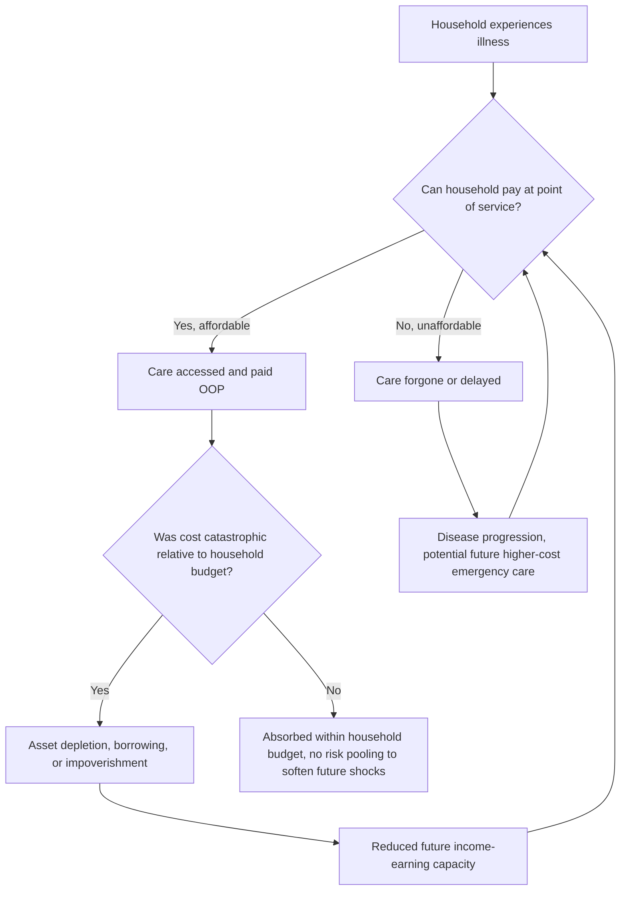

## Out-of-Pocket Dominant Systems in Low-Income Countries

### Overview

Out-of-pocket (OOP) dominant health systems are characterized by direct payment for healthcare services at the point of use as the primary financing mechanism, with limited or fragmented risk pooling through insurance or general taxation. Unlike the Beveridge, Bismarck, or National Health Insurance models — all of which are organized around some form of prepayment and risk pooling — OOP-dominant systems represent the absence (or severe underdevelopment) of such pooling arrangements, leaving individual households as the primary risk-bearers for health-related financial shocks. This pattern remains prevalent across much of Sub-Saharan Africa, South Asia, and parts of Southeast Asia and Latin America, though the specific share of OOP financing varies considerably by country and has been a central target of Universal Health Coverage (UHC) reform efforts globally.

### Defining Characteristics

**Key Points**

- **No systematic prepayment/pooling**: unlike tax-funded or insurance-funded systems, there is no mechanism collecting contributions in advance of illness and pooling risk across a population; payment occurs at (or near) the time of service.
- **Fee-for-service at point of use**: patients (or their households) pay providers directly, often in cash, for consultations, diagnostics, medications, and procedures.
- **Mixed formal-informal provider landscape**: care is often sought across a spectrum from public facilities (which may nominally offer free care but face chronic underfunding, stockouts, and informal user fees) to private formal clinics to informal/unlicensed providers and drug sellers, with households navigating this landscape based on cost, perceived quality, and access.
- **High financial risk exposure**: this is the model's defining economic consequence — households face uninsured exposure to potentially catastrophic health spending with no risk-pooling buffer.

### Economic Mechanics of OOP Dominance

**Key Points**

- **Absence of risk pooling** is the central economic distinction from the three models covered previously. In any of the Beveridge/Bismarck/NHI models, the *ex ante* uncertain cost of illness is converted into a predictable *ex ante* contribution (tax or premium); in OOP-dominant systems, the full *ex post* realized cost falls on the affected household at the moment of illness, when income-earning capacity may itself be compromised.
- **Price-based rationing** operates directly and starkly: care is accessed to the extent a household can pay for it at that moment, with no separation between ability to pay and clinical need — the core mechanism through which OOP dominance generates both underuse of needed care and catastrophic spending when care is sought.
- **Health Financing Identity**: Total Health Expenditure (THE) in these systems is disproportionately composed of OOP spending relative to government and prepaid private/social insurance sources:

$$THE = G + P_{pooled} + OOP + ExtFunding$$

where $G$ is government (tax-funded) spending, $P_{pooled}$ is prepaid private/social insurance, $OOP$ is out-of-pocket spending, and $ExtFunding$ is external/donor financing (often significant in low-income country health budgets). OOP-dominant systems are typically defined by OOP constituting a large majority share of THE — WHO has historically flagged OOP shares above roughly 30–40% of THE as indicating elevated catastrophic-expenditure risk, though [Unverified] specific WHO threshold figures and current country-level OOP shares should be verified against the current WHO Global Health Expenditure Database, as this data is updated regularly and historical figures may not reflect current conditions.

### Catastrophic Health Expenditure and Impoverishment

**Key Points**

- **Catastrophic Health Expenditure (CHE)** is the standard metric for quantifying the financial-protection failure of OOP-dominant systems, typically defined as household OOP health spending exceeding a threshold share (commonly 10% or 25%) of total household expenditure or income:

$$CHE_{10\%} = 1 \text{ if } \frac{OOP_h}{TotalExpenditure_h} \geq 0.10$$

- **Medical impoverishment**: a related metric measuring the number of households pushed below a poverty line (national or international, e.g., the World Bank's international poverty line) specifically due to OOP health spending — calculated by comparing household consumption/income with and without OOP health spending relative to the poverty line.
- These are precisely the metrics operationalized in **Extended Cost-Effectiveness Analysis (ECEA)**, covered in the earlier "Frameworks for health equity in economic analysis" item — ECEA's financial risk protection and poverty domains were developed substantially in response to the policy relevance of OOP-dominant system dynamics in low- and middle-income countries.
- The WHO and World Bank jointly track global CHE and impoverishment estimates as core UHC monitoring indicators (SDG indicator 3.8.2 for catastrophic expenditure), reflecting the centrality of this problem to global health financing policy. [Unverified] Current global and country-specific CHE and impoverishment estimates should be sourced from the current WHO/World Bank UHC Global Monitoring Report, as these figures are periodically updated with new survey data.

### Household Coping Mechanisms and Their Economic Costs

**Key Points**

- **Asset depletion/distress sales**: households facing large OOP health costs commonly sell productive assets (livestock, land, tools) or draw down savings, with long-run economic consequences extending well beyond the immediate health episode (reduced future income-earning capacity).
- **Borrowing/debt**: informal or formal borrowing to cover health costs, often at high interest rates in informal credit markets, can create durable debt burdens.
- **Forgone care (foregone consumption of healthcare itself)**: rather than incurring catastrophic expenditure, many households simply forgo needed care — this is a critical and easily overlooked economic consequence, since CHE metrics only capture spending that *did* occur, systematically undercounting the true burden of OOP dominance by missing care that was never sought or was abandoned partway through treatment due to cost. [Inference] This undercounting critique is a well-established methodological point in the health-financing literature regarding CHE metrics generally; the quantitative magnitude of the undercount varies by context and study and should not be treated as a fixed, universal correction factor.
- **Intra-household reallocation**: health spending shocks can shift household resource allocation away from other welfare-relevant spending (education, nutrition), with documented associations to child schooling and nutritional outcomes in the health-financing and development-economics literature.

### System Architecture and Failure Points (svg_diagram)

### Structural Drivers of OOP Dominance in Low-Income Settings

**Key Points**

- **Large informal-sector labor markets**: payroll-based Bismarck-style contribution collection is administratively difficult when a large share of the workforce is informally employed, self-employed, or agricultural, since there is no reliable payroll withholding mechanism — a key structural barrier distinguishing OOP-dominant low-income country contexts from the payroll-based Bismarck model's original industrial-economy context.
- **Narrow and volatile tax base**: general-taxation-funded Beveridge-style financing requires a sufficiently large, stable, and administratively capturable tax base; low government revenue-to-GDP ratios common in low-income countries constrain the fiscal space available for tax-funded health financing, even where politically desired.
- **Underdeveloped insurance markets and institutions**: private voluntary health insurance requires actuarial, regulatory, and administrative capacity that may be limited; community-based health insurance (CBHI) schemes have been widely piloted as an intermediate step but face persistent challenges with adverse selection, low enrollment, and limited risk-pool size (see below).
- **Donor/external financing dependence**: in many low-income countries, a substantial share of health financing (particularly for specific disease programs — HIV, malaria, immunization) comes from external donors (e.g., the Global Fund, Gavi, PEPFAR, bilateral aid), which, while reducing OOP burden for the specific programs covered, does not typically substitute for a general domestic risk-pooling mechanism covering the full range of health needs, leaving OOP dominant for non-donor-prioritized conditions.

### Community-Based Health Insurance (CBHI) as a Transitional Mechanism

**Key Points**

- CBHI schemes are voluntary, community-organized, typically small-scale risk-pooling arrangements that have been implemented widely across Sub-Saharan Africa and South Asia as an intermediate step toward broader risk pooling in contexts where formal payroll-based or general-tax-based financing is not immediately feasible.
- **Structural limitations widely documented in the literature**: small risk-pool size limits the law-of-large-numbers benefit of insurance (making pools financially fragile to a cluster of high-cost claims); voluntary enrollment creates adverse-selection risk (sicker households disproportionately enroll); low and inconsistent household ability/willingness to pay premiums constrains scheme sustainability and revenue; and administrative capacity for claims management is often limited at the community level.
- Rwanda's *Mutuelles de Santé* CBHI program is among the most frequently cited examples of a CBHI scheme that achieved substantial scale and was subsequently integrated into a broader national health financing strategy, though [Unverified] the current structure, coverage rates, and integration status of Rwanda's scheme should be verified against current Rwandan Ministry of Health sources, as CBHI-to-national-scheme transitions have continued to evolve.
- CBHI is generally understood in the health-financing literature as a useful transitional or supplementary mechanism rather than a durable substitute for broader mandatory risk pooling (general tax-funded or payroll-based), given its structural fragility at small scale.

### The Path Toward Universal Health Coverage (UHC)

**Key Points**

- The dominant global health-financing policy framework for addressing OOP dominance is progression toward **Universal Health Coverage**, formalized as SDG target 3.8, which explicitly targets both service coverage and financial risk protection (reduction of OOP burden and catastrophic expenditure).
- **The "UHC cube"** (WHO's standard conceptual framework) frames progress toward UHC along three simultaneous dimensions: (1) population coverage (who is covered), (2) service coverage (which services are covered), and (3) financial protection (what share of cost is covered vs. remains OOP) — countries face an explicit trade-off in sequencing expansion along these three dimensions given constrained fiscal space.
- Common policy pathways observed across countries transitioning away from OOP dominance include: expanding tax-funded coverage for a defined essential benefits package (a sufficientarian floor, connecting to the distributive justice frameworks covered earlier), consolidating fragmented small-scale risk pools (including CBHI schemes) into larger mandatory national or regional pools, and phased formalization of informal-sector contribution mechanisms.
- Thailand's Universal Coverage Scheme (2002) and Rwanda's health financing reforms are frequently cited in the health-financing literature as relatively successful transitions from OOP-dominant financing toward broader tax-funded risk pooling in a low- or middle-income country context, though [Unverified] specific current outcome statistics for these transitions should be sourced from current peer-reviewed health-financing literature and national statistics rather than assumed from general characterization, given the sensitivity of such claims to measurement methodology and time period.

### Economic Evaluation Implications

**Key Points**

- Standard cost-effectiveness analysis conducted in OOP-dominant contexts must account for the fact that the "cost" side of an ICER may fall substantially on households rather than a government payer — a structural difference from CEA conducted within a tax-funded or insurance-funded system where the payer perspective is more straightforwardly defined.
- This is precisely why **ECEA's financial risk protection and poverty domains** (covered in the "Frameworks for health equity" item) were developed with LMIC and OOP-dominant contexts specifically in mind — a standard ICER alone does not capture an intervention's value in *removing* households from OOP exposure, which ECEA quantifies directly via CHE cases averted and poverty cases averted.
- Benefit-package design for UHC expansion in OOP-dominant contexts commonly uses ECEA-style analysis to prioritize interventions that combine favorable cost-effectiveness with high financial-protection value, rather than cost-effectiveness alone — connecting this item directly to both the equity-frameworks and distributive-justice-theory items earlier in this chapter sequence.

### Comparison with the Three Pooled-Financing Models

| Dimension | OOP-Dominant | Beveridge | Bismarck | National Health Insurance |
| --- | --- | --- | --- | --- |
| Risk pooling | Absent/minimal (individual household) | Universal, automatic | Multiple funds with equalization | Universal, single payer |
| Prepayment | None (payment at point of service) | Tax collected in advance | Payroll contribution in advance | Tax or premium collected in advance |
| Financial protection | Low; high CHE and impoverishment risk | High | Moderate-high (cost-sharing common) | Moderate-high |
| Administrative complexity | Low (no pooling infrastructure) | Moderate | High (multi-fund, risk equalization) | Moderate |
| Typical country income context | Low-income, large informal sector | Higher-income, developed tax base | Higher-income, formalized labor market | Middle-to-higher income |
| Primary rationing mechanism | Direct price (ability to pay) | Non-price (waiting lists) | Price/cost-sharing plus modest waits | Mixed (fee-for-service plus some waits) |

### Conclusion

Out-of-pocket dominant systems represent the structural absence of the risk-pooling mechanisms that define the Beveridge, Bismarck, and National Health Insurance models, leaving individual households as the primary bearers of health-related financial risk. This produces the model's defining economic pathology: price-based rationing at the point of clinical need, elevated catastrophic health expenditure and medical impoverishment risk, and household coping mechanisms (asset depletion, debt, forgone care) with consequences extending well beyond the immediate health episode. Structural drivers — large informal labor markets, narrow tax bases, underdeveloped insurance institutions — mean the transition away from OOP dominance is generally a multi-decade, multi-mechanism policy project (formalizing labor markets, expanding tax-funded essential benefit packages, consolidating fragmented risk pools) rather than a single financing reform, and is the central empirical and policy motivation behind both the Universal Health Coverage agenda and the equity-sensitive economic evaluation frameworks (ECEA in particular) covered earlier in this chapter sequence.

**Related Topics**

- Extended cost-effectiveness analysis (ECEA) and financial risk protection metrics
- Catastrophic health expenditure (CHE) and medical impoverishment measurement
- Universal Health Coverage (UHC) and the WHO UHC cube framework
- Community-based health insurance (CBHI) design and sustainability challenges
- Informal labor markets and health-financing contribution mechanisms
- SDG indicator 3.8.2 and global UHC monitoring
- Thailand Universal Coverage Scheme and Rwanda health financing reform case studies
- Donor/external financing dependence in low-income country health systems
- Essential benefits package design and sufficientarian financing floors
- Beveridge, Bismarck, and National Health Insurance models (comparative financing structures)