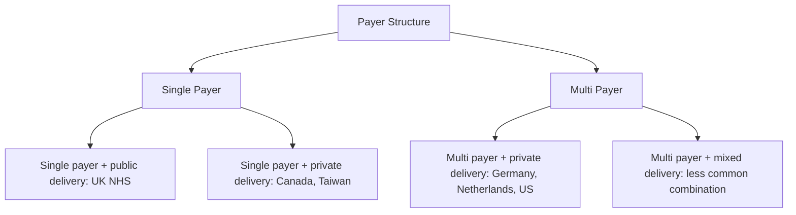
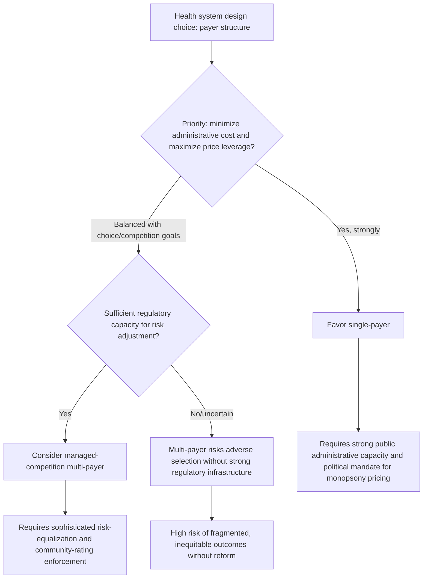

## Single-Payer Versus Multi-Payer System Design

### Overview

Single-payer and multi-payer are structural design choices about the *number of risk-bearing financing entities* in a health system — a dimension that cuts across, rather than maps neatly onto, the Beveridge/Bismarck/NHI typology covered earlier in this chapter. This item synthesizes and formalizes the payer-structure dimension that has run implicitly through the prior four items, isolating it as an independent design axis with its own distinct economic trade-offs, separate from the provider-ownership and financing-source dimensions already covered.

### Defining the Axis

**Key Points**

- **Single-payer**: one entity (a government agency, a national insurance fund) collects revenue, pools risk, and reimburses providers for a defined population — examples include the UK NHS (Beveridge), Canada's provincial Medicare plans (NHI model), and Taiwan's National Health Insurance Administration (NHI model).
- **Multi-payer**: multiple entities (competing or coexisting insurers, whether private, non-profit sickness funds, or a mix) each collect revenue, pool risk within their own enrolled population, and reimburse providers — examples include Germany's multiple statutory sickness funds plus private insurers (Bismarck), the Netherlands' regulated competing private insurers (managed-competition Bismarck variant), and the fragmented multi-payer private insurance market historically characteristic of the United States.
- **Critical distinction from provider ownership**: single-payer says nothing about who owns hospitals or employs physicians — Canada is single-payer with private delivery; the UK is single-payer with substantial public delivery. This is precisely why the Beveridge/Bismarck/NHI typology and the single-payer/multi-payer axis are analytically separate, even though they correlate in the most commonly cited exemplar countries.

### Payer-Structure Matrix (svg_diagram)

### Core Economic Trade-offs

#### 1. Administrative Cost

**Key Points**

- Single-payer systems generally exhibit lower administrative overhead as a share of total health spending, since there is one claims-processing and eligibility infrastructure rather than multiple parallel systems, each requiring its own billing, marketing, underwriting (where applicable), and provider-network administration.
- Multi-payer systems incur additional costs from: duplicated administrative infrastructure across insurers; provider-side costs of billing multiple payers with potentially different rules, forms, and prior-authorization requirements; and, where competition exists, marketing and customer-acquisition spending that has no single-payer analogue.
- [Inference] The single-payer administrative-cost advantage is one of the most consistently replicated findings in comparative health-systems economics, though the precise magnitude of the gap varies substantially across studies depending on methodology (what counts as "administrative" cost) and the specific countries compared; current comparative figures should be sourced from recent peer-reviewed or OECD/CMS-level data rather than treated as a fixed universal differential.

#### 2. Purchasing Power and Price Negotiation

**Key Points**

- A single payer, by definition, has **monopsony** power — as the sole (or dominant) buyer of provider services and pharmaceuticals for its population, it can negotiate lower unit prices than any individual payer in a fragmented multi-payer market, where providers can play payers off against one another or where any single insurer's market share is insufficient to command significant price concessions.
- Multi-payer systems can partially replicate this advantage through **collective negotiation structures** — Germany's system, for instance, negotiates fee schedules through associations representing sickness funds collectively rather than fund-by-fund, substantially mitigating (though not fully eliminating) the fragmentation disadvantage.
- Reference pricing and centralized pharmaceutical procurement are common tools multi-payer systems use to recapture some single-payer-style purchasing leverage without consolidating into a literal single payer.

#### 3. Choice and Competition

**Key Points**

- Multi-payer systems, particularly those designed around **managed competition** (the Netherlands, Switzerland), offer enrollees choice among insurers, which proponents argue creates competitive pressure on insurers to improve service quality, administrative efficiency, and premium pricing — a discipline mechanism single-payer systems lack by construction (there is no alternative payer to switch to).
- This argument requires functioning competition dynamics — informed consumer choice, low switching costs, effective regulation preventing risk-selection ("cherry-picking" healthy enrollees) — to actually deliver claimed efficiency benefits; where these conditions are weak, multi-payer competition can fail to generate meaningful efficiency gains while still incurring the administrative costs of maintaining multiple payers. [Speculation] The empirical question of how much managed-competition multi-payer systems actually outperform well-run single-payer systems on quality and innovation metrics, net of their higher administrative costs, remains genuinely contested in the health-economics literature and should not be characterized as resolved in either direction.
- Single-payer systems can still offer *provider* choice (patients choosing among providers) even without *payer* choice — these are frequently conflated in public debate but are analytically distinct dimensions of "choice" in a health system.

#### 4. Risk Selection and Adverse Selection

**Key Points**

- Single-payer systems eliminate risk-selection concerns by construction — there is no competing payer for a healthier population to sort into, so the entire population is automatically pooled together.
- Multi-payer systems require active regulatory intervention (community rating, guaranteed issue, risk equalization/adjustment — covered in the Bismarck-model item) to prevent insurers from either avoiding high-risk enrollees or facing financial disadvantage from enrolling them; without such intervention, multi-payer systems are vulnerable to an **adverse-selection death spiral**, where the mechanics work as follows:

$$\text{Insurer avoids high-risk enrollees} \rightarrow \text{high-risk pool concentrates elsewhere} \rightarrow \text{that insurer's premiums rise} \rightarrow \text{remaining healthy enrollees exit} \rightarrow \text{premiums rise further}$$

- The sophistication of a multi-payer system's risk-adjustment methodology is therefore a first-order determinant of whether it can deliver on the choice/competition benefits without the adverse-selection costs — Germany's morbidity-based risk structure compensation scheme (covered in the Bismarck item) represents one of the most methodologically developed examples globally.

#### 5. Fiscal and Budgetary Control

**Key Points**

- Single-payer systems generally afford government more direct and immediate control over aggregate health spending growth, since the payer and the fiscal authority are either the same entity or closely linked — enabling tools like global budgets and direct fee-schedule setting.
- Multi-payer systems distribute spending decisions across multiple entities, which can make aggregate cost containment more administratively complex (requiring collective-negotiation structures, global expenditure caps applied across funds, or regulatory price controls) even where the underlying fiscal exposure to government is similar (e.g., through subsidies or tax-financed contributions).
- [Inference] This is a structural tendency rather than a strict rule — several multi-payer systems (Germany, the Netherlands) have developed effective aggregate cost-control mechanisms despite payer fragmentation, indicating that payer-structure alone does not fully determine cost-control outcomes; institutional design details matter substantially.

### Comparative Summary Table

| Dimension | Single-Payer | Multi-Payer |
| --- | --- | --- |
| Administrative overhead | Generally lower | Generally higher (duplicated infrastructure) |
| Price negotiation leverage | High (monopsony) | Moderate, if collectively negotiated; low if fragmented |
| Payer choice for enrollees | None | Available (if functioning competition exists) |
| Risk-selection vulnerability | None (automatic universal pooling) | Present; requires active regulatory correction |
| Aggregate cost-control mechanism | Direct (global budgets, unified fee-setting) | Indirect (collective negotiation, regulatory caps) |
| Regulatory complexity required | Lower | Higher (risk adjustment, community rating enforcement) |
| Innovation/responsiveness argument | Contested; less competitive pressure by construction | Contested; depends on effective competition conditions |

### Hybrid and Intermediate Designs

**Key Points**

- **Managed competition** (Netherlands, Switzerland): multiple private insurers compete for enrollees under heavy regulation (mandatory community rating, guaranteed issue, standardized minimum benefit package, risk equalization) — an attempt to combine multi-payer choice/competition benefits with single-payer-style protection against risk selection and fragmentation.
- **Single-payer with private delivery** (Canada, Taiwan): as covered in the NHI-model item, this combination captures single-payer monopsony and administrative-efficiency advantages while preserving private-sector delivery flexibility, without addressing the choice-of-*payer* dimension (there remains no alternative payer to switch to).
- **Multi-payer with strong collective negotiation** (Germany): sickness funds remain numerous and distinct entities but negotiate fee schedules collectively through associations, substantially narrowing the price-negotiation-leverage gap with single-payer systems while retaining the (modest, since community-rated and heavily regulated) element of insurer choice.
- **Fragmented multi-payer without strong regulation** (historically, portions of the US private insurance market pre-ACA): illustrates the downside risk of multi-payer design without adequate risk-adjustment and community-rating infrastructure — extensive medical underwriting, pre-existing-condition exclusions, and high administrative cost as competing insurers invested heavily in risk selection rather than efficiency competition. [Unverified] Current US insurance-market regulatory structure has changed substantially since ACA implementation (guaranteed issue, community rating within age bands, risk-adjustment transfers among ACA marketplace insurers); current regulatory detail should be verified against current US federal and state insurance-market sources rather than characterized based on pre-reform market dynamics alone.

### Decision Framework for System Designers (svg_diagram)

### Empirical and Normative Caveats

**Key Points**

- Cross-national comparisons of single-payer vs. multi-payer performance are confounded by many co-varying factors (overall spending level, provider-ownership structure, delivery-system organization, cultural and political context), making clean causal attribution of outcome differences to payer-structure alone methodologically difficult. [Inference] This confounding problem is a standard methodological caveat raised throughout the comparative health-systems literature and should temper strong causal claims drawn from simple cross-country correlations.
- The "best" payer structure is not a purely technical question — it interacts directly with the distributive justice theories and equity-weighting considerations covered earlier in this chapter: single-payer designs align more naturally with universalist/egalitarian values (automatic, undifferentiated pooling), while multi-payer designs can be normatively attractive to those who weight individual choice and competitive market discipline as intrinsically or instrumentally valuable, independent of pure efficiency comparison.
- Transition costs and political economy matter enormously in practice — moving from an entrenched multi-payer system to single-payer (or vice versa) involves substantial transitional friction (existing insurer industries, provider contracting relationships, workforce implications) that pure steady-state economic comparison does not capture. [Speculation] The magnitude and political feasibility of such transitions in any specific country context is a matter of ongoing political and economic debate rather than a settled technical calculation.

### Conclusion

Single-payer and multi-payer design represents an independent structural axis from the financing-source and provider-ownership dimensions already covered in this chapter's Beveridge, Bismarck, and NHI items — a system can combine single or multiple payers with tax or premium financing, and with public or private delivery, in varying combinations. The core economic trade-off is administrative efficiency and monopsony pricing power (favoring single-payer) versus payer choice and competitive discipline (the theoretical case for multi-payer, contingent on functioning competition and robust risk-adjustment regulation). Real-world systems increasingly occupy hybrid positions on this axis — managed competition, single-payer-with-private-delivery, and collectively-negotiated multi-payer arrangements — reflecting that the single-payer/multi-payer choice is best understood as a spectrum of institutional design options rather than a binary, with the practical performance of any specific design depending heavily on implementation details (regulatory sophistication, risk-adjustment quality, negotiation structure) rather than the payer-count label alone.

**Related Topics**

- Beveridge, Bismarck, and National Health Insurance models (interaction with payer-structure axis)
- Monopsony pricing power and provider fee-schedule negotiation
- Risk equalization and adverse selection in multi-payer regulation
- Managed competition models (Netherlands, Switzerland)
- Administrative cost comparison methodology in cross-national health-systems research
- Community rating and guaranteed issue regulatory requirements
- US Affordable Care Act marketplace risk-adjustment mechanisms
- Global budgets and direct fee-schedule setting as cost-control tools
- Political economy of health-financing system transitions
- Distributive justice theories and their relationship to payer-structure design choices