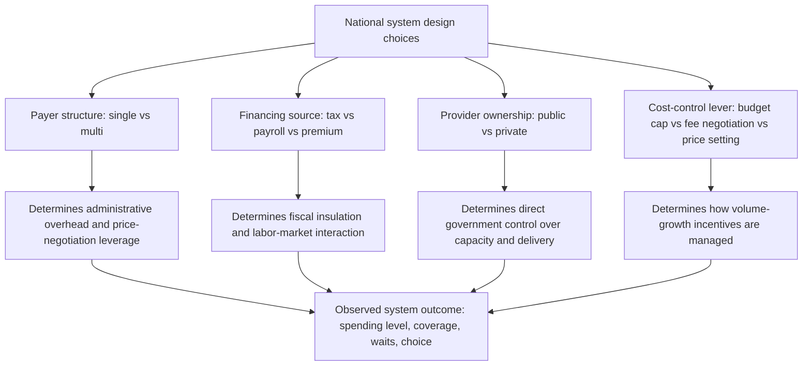

## Case Studies in National Health System Design

### Overview

This item synthesizes the analytical frameworks from the preceding chapter items — the Beveridge, Bismarck, and National Health Insurance models, OOP-dominant systems, and the single-payer/multi-payer design axis — into applied case studies of specific national systems, examining how each country's design choices interact in practice, including hybrid features, historical evolution, and documented economic performance characteristics.

### Case Study 1: United Kingdom (Beveridge Archetype)

**Key Points**

- **Structure**: Tax-funded, single-payer, substantially publicly-provided (hospitals largely NHS-owned; GPs are independent contractors), with a formal HTA body (NICE) governing coverage/technology decisions.
- **Distinctive design feature**: the purchaser-provider split, introduced via 1990s "internal market" reforms and iterated through subsequent reorganizations (Clinical Commissioning Groups, now Integrated Care Boards), attempting to import market-like discipline into a fundamentally centrally-budgeted system.
- **Cost-control mechanism**: monopsony price negotiation plus global/regional budget allocation via capitation-weighted formulas, with NICE technology-appraisal thresholds (historically the £20,000–£30,000/QALY range, with severity modifiers since 2022) governing new-technology adoption.
- **Characteristic tension**: strong financial-protection and low administrative-overhead performance, offset by persistent waiting-list pressure for elective care, which intensified markedly following the COVID-19 pandemic. [Unverified] Current NHS waiting-list figures and post-pandemic recovery trajectory should be sourced from current NHS England statistics given the rapidly evolving nature of this specific metric.
- **Private-sector interaction**: a minority of the population holds private supplementary insurance to bypass NHS waiting times for elective procedures, functioning as a partial release valve absent in more restrictive single-payer NHI systems like Canada's.

### Case Study 2: Germany (Bismarck Archetype)

**Key Points**

- **Structure**: mandatory payroll-based social insurance through multiple statutory sickness funds (*Krankenkassen*), with a legally defined opt-out to private substitutive insurance (*PKV*) above an income threshold, and predominantly private/non-profit provider ownership.
- **Distinctive design feature**: sophisticated morbidity-based risk-equalization scheme (*Gesundheitsfonds*/risk structure compensation), widely referenced internationally as a reference architecture for managing multi-payer community rating without adverse-selection collapse.
- **Cost-control mechanism**: collectively negotiated fee schedules (*Einheitlicher Bewertungsmaßstab*) for ambulatory care, DRG-based (*G-DRG*) prospective payment for hospitals, combining Bismarck-model provider-payment flexibility with negotiated aggregate cost discipline.
- **Characteristic tension**: high multi-payer administrative overhead relative to single-payer systems, and the risk-selection dynamics introduced by the PKV opt-out provision (predominantly wealthier, healthier individuals exiting the statutory risk pool). [Inference] The long-run fiscal implications of the PKV opt-out are a subject of ongoing German health-policy debate rather than settled empirical consensus.
- **Comparative performance note**: generally cited in comparative literature for combining relatively short waiting times and high patient/provider choice with universal coverage, at a higher overall health-spending share of GDP than the UK.

### Case Study 3: Canada (National Health Insurance Archetype)

**Key Points**

- **Structure**: 13 separate provincial/territorial single-payer plans operating within the common regulatory framework of the Canada Health Act (public administration, comprehensiveness, universality, portability, accessibility), with predominantly private care delivery.
- **Distinctive design feature**: general prohibition (with provincial variation) on private insurance duplicating publicly covered "medically necessary" services — the *Chaoulli v. Quebec* (2005) Supreme Court case remains the central legal touchstone for debate over this restriction's constitutionality and policy merit.
- **Cost-control mechanism**: negotiated fee-for-service schedules for physicians (provincial medical association negotiations) combined with global hospital budgets — a hybrid payment structure spanning both Bismarck-style (physician fee-for-service) and Beveridge-style (hospital global budgets) mechanisms within a single-payer NHI frame.
- **Characteristic tension**: single-payer administrative efficiency and monopsony pricing, offset by frequently cited elevated waiting times for specialist and elective procedures relative to peer OECD countries, with no private-insurance release valve for covered services. [Unverified] Current comparative wait-time statistics should be sourced from current Canadian Institute for Health Information (CIHI) data and current OECD comparative reports.

### Case Study 4: Netherlands (Managed-Competition Bismarck Variant)

**Key Points**

- **Structure**: since the 2006 *Zorgverzekeringswet* (Health Insurance Act) reform, all residents are required to purchase regulated private insurance from competing insurers, under mandatory community rating, guaranteed issue, and a standardized minimum benefit package — often cited as the clearest real-world implementation of "managed competition" theory (associated with health economist Alain Enthoven).
- **Distinctive design feature**: a centralized risk-equalization fund compensates insurers for enrolling higher-risk populations, explicitly designed to neutralize the adverse-selection incentives that would otherwise undermine community-rated multi-payer competition.
- **Cost-control mechanism**: relies on insurer-side competition (selective contracting with providers, negotiated rates) rather than direct government fee-setting, combined with regulatory oversight of the mandatory minimum benefit package's scope.
- **Characteristic tension**: tests directly whether multi-payer competitive dynamics can outperform single-payer administrative simplicity — a question the comparative health-economics literature has not definitively resolved, with mixed evidence on whether the reform's efficiency and quality gains outweigh multi-payer administrative overhead. [Speculation] Characterizing the Dutch reform as having "succeeded" or "failed" relative to counterfactual alternatives would overstate the certainty of the underlying comparative-effectiveness evidence.

### Case Study 5: Taiwan (Single-Payer NHI with Global Budget Innovation)

**Key Points**

- **Structure**: single National Health Insurance Administration, financed via a payroll-based premium with employer/employee/government contribution splits varying by employment category, contracting with predominantly private providers.
- **Distinctive design feature**: a global-budget-with-point-value system, in which the value of each fee-schedule "point" fluctuates based on aggregate claims volume relative to a fixed sectoral budget — an attempt to preserve fee-for-service's provider-level activity incentives while imposing aggregate expenditure discipline, addressing the classic Bismarck-style volume-growth cost pressure within a single-payer frame.
- **Comparative significance**: frequently cited in health-financing literature as a relatively low-administrative-cost, broadly popular single-payer system implemented comparatively recently (1995) and explicitly designed by drawing on international comparative experience (Canada, Germany, and others) rather than evolving incrementally from an older historical scheme, making it a useful "designed from first principles" case study relative to path-dependent legacy systems.
- [Unverified] Current point-value mechanics and sectoral budget-setting processes have evolved since initial implementation and should be verified against current Taiwan NHI Administration documentation for applied analysis.

### Case Study 6: United States (Fragmented Multi-Payer with Partial Public Programs)

**Key Points**

- **Structure**: a highly fragmented multi-payer system combining employer-sponsored private insurance (the dominant coverage form for the working-age population), means-tested and categorical public programs (Medicaid for low-income populations, Medicare for those 65+/disabled — itself effectively a single-payer NHI-style program for its covered population), and individual-market private insurance regulated substantially differently pre- and post-Affordable Care Act (ACA, 2010).
- **Distinctive design feature**: the coexistence of multiple distinct financing sub-systems (employer-based, Medicare, Medicaid, ACA marketplace, uninsured) within one country, rather than a single unifying national model — the US is frequently used in comparative health-systems teaching precisely because it does not fit cleanly into the Beveridge/Bismarck/NHI typology, instead containing recognizable elements of multiple archetypes operating in parallel for different population segments.
- **Cost-control mechanism**: highly heterogeneous across sub-systems — Medicare uses administered pricing and DRG-based hospital payment (methodologically influential on Germany's G-DRG system); private insurers negotiate rates bilaterally with providers, often with limited individual negotiating leverage relative to large hospital systems, contributing to well-documented comparative price-level differences.
- **Characteristic tension**: the US is consistently documented in comparative OECD data as having the highest health spending as a share of GDP among high-income countries, alongside coverage gaps and comparatively high administrative overhead attributable to multi-payer fragmentation — though it also exhibits rapid adoption of new medical technologies and, for insured populations, generally low waiting times relative to single-payer peer systems. [Unverified] Specific current comparative spending, coverage, and outcome figures should be sourced from current OECD Health Statistics, CMS National Health Expenditure data, and Census/KFF coverage survey data given how frequently US health-financing figures change through both economic and policy developments.
- **ACA risk-adjustment note**: post-2010, the ACA marketplace introduced mandatory guaranteed issue, community rating within defined bands (age, geography, tobacco use), and inter-insurer risk-adjustment transfers — directly applying the same risk-equalization logic covered in the Bismarck and Netherlands case studies to a segment of the US individual insurance market, illustrating that risk-adjustment infrastructure is a general multi-payer design requirement rather than a feature unique to any one country's system.

### Comparative Synthesis Table

| Country | Payer Structure | Financing | Provider Ownership | Primary Cost-Control Lever | Characteristic Tension |
| --- | --- | --- | --- | --- | --- |
| UK | Single | General taxation | Predominantly public | Global budgets, NICE HTA thresholds | Waiting lists vs. financial protection |
| Germany | Multi (with risk equalization) | Payroll contributions | Predominantly private | Negotiated fee schedules, DRG rates | Admin overhead vs. choice/short waits |
| Canada | Single (provincial) | General taxation/transfers | Predominantly private | Fee negotiation, hospital global budgets | Waiting lists, no private release valve |
| Netherlands | Multi (managed competition) | Mandatory regulated private premiums | Predominantly private | Insurer selective contracting | Untested efficiency gain vs. admin cost |
| Taiwan | Single | Payroll-based premium | Predominantly private | Global budget with point-value adjustment | Balancing volume incentive with budget cap |
| US | Fragmented multi (parallel sub-systems) | Mixed (employer, payroll, tax, private) | Predominantly private | Heterogeneous by sub-system | Highest spending, coverage gaps, high admin cost |

### Cross-Cutting Design Lessons (svg_diagram)

**Key Points**

- No country case study maps perfectly onto a single textbook archetype — every real system (even the UK, the clearest Beveridge exemplar) contains hybrid elements (independent-contractor GPs, private supplementary insurance, purchaser-provider splits).
- The four structural axes (payer structure, financing source, provider ownership, cost-control lever) can be combined in varying ways, and case studies demonstrate that similar aggregate outcomes (e.g., universal coverage) can be achieved through quite different combinations of these design choices.
- Risk-equalization/adjustment infrastructure is a recurring requirement wherever multi-payer competition coexists with community rating, appearing independently in Germany, the Netherlands, and the post-ACA US individual insurance market — a genuinely general design principle rather than a country-specific feature.
- Historical path dependency (existing institutions, political feasibility, administrative capacity at the time of major reform) shapes which combination of design choices a given country adopts at least as much as pure efficiency-optimization reasoning — a theme relevant when evaluating proposals for health-system reform in any specific national context. [Inference] This path-dependency observation is a standard theme in comparative health-policy and political-economy literature rather than a claim specific to any one country studied here.

### Conclusion

These six case studies — the UK, Germany, Canada, the Netherlands, Taiwan, and the United States — illustrate that the Beveridge/Bismarck/NHI typology and the single-payer/multi-payer axis, while analytically useful, describe idealized poles that real national systems approximate with substantial hybridization, historical contingency, and ongoing reform. Comparing these cases directly demonstrates the practical trade-offs formalized in the preceding theoretical items: administrative efficiency versus payer choice, monopsony pricing power versus competitive market discipline, and direct budgetary control versus activity-based provider payment — with each country's specific combination of choices producing a recognizably different balance of spending level, coverage completeness, waiting-time performance, and financial-protection outcomes.

**Related Topics**

- Beveridge model of national health services (UK case detail)
- Bismarck model of social health insurance (Germany case detail)
- National Health Insurance model (Canada, Taiwan case detail)
- Single-payer versus multi-payer system design (theoretical framework)
- Managed competition theory (Alain Enthoven) and Dutch health insurance reform
- Diagnosis-Related Group (DRG) payment systems: German and US comparative development
- Affordable Care Act marketplace risk-adjustment mechanisms
- Medicare and Medicaid as sub-systems within US fragmented multi-payer design
- Purchaser-provider split reforms and NHS internal market history
- Comparative OECD health spending, coverage, and outcomes benchmarking