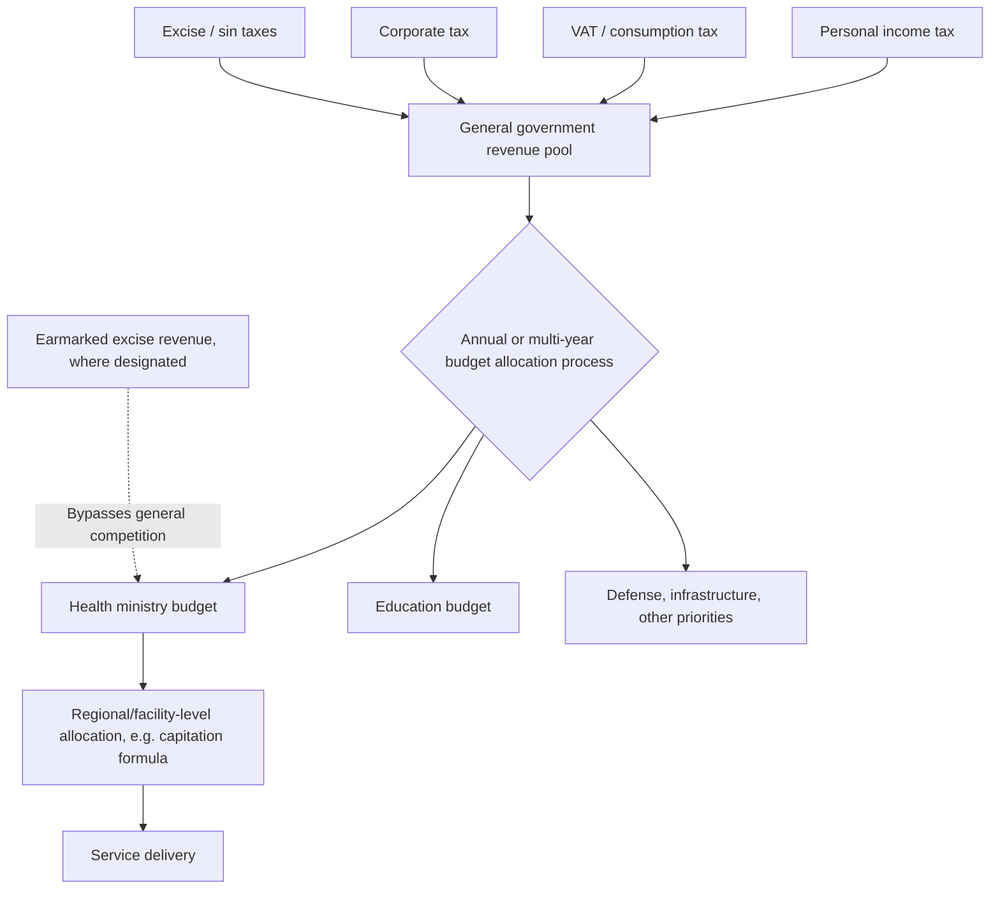

## Tax-Financed Health Care Systems

### Overview

Tax-financed health care refers to the use of general government revenue — collected through income taxes, value-added taxes (VAT), corporate taxes, or other broad-based levies — as the primary funding mechanism for health services, as distinct from earmarked payroll-based social insurance contributions or direct out-of-pocket payment. This item examines tax financing as a standalone financing-mechanism topic, building on but distinct from the Beveridge-model system-design item earlier in this document (tax financing is the financing mechanism most associated with, but not exclusively used by, Beveridge-model systems).

### Defining Tax Financing as a Financing Mechanism

**Key Points**

- **General vs. earmarked taxation**: general tax financing draws on the same revenue pool as all other government spending (defense, education, infrastructure), with health's share determined through the annual/periodic budget process; **earmarked (hypothecated) tax financing** dedicates a specific tax or tax component exclusively to health spending, occupying a middle position between general taxation and payroll-based social insurance.
- **Progressivity**: the distributive incidence of tax financing depends heavily on the underlying tax mix — income-tax-heavy financing tends to be progressive (higher earners contribute a larger share of income), while VAT/consumption-tax-heavy financing tends to be regressive or flat (lower earners spend a larger share of income on taxed consumption), meaning "tax-financed" does not by itself specify a single distributive profile — the specific tax instruments used matter substantially.
- **Distinguishing from Beveridge-model system design**: tax financing is a financing-mechanism choice; it can combine with any provider-ownership structure (public, as in the UK; private, as in Canada's NHI-model system) and any payer-count structure (single, as in most tax-funded systems; the mechanism itself does not preclude a multi-payer tax-subsidized design, though this combination is less commonly observed in practice).

### Revenue Instruments Used in Tax-Financed Systems

**Key Points**

- **Personal income tax**: a common component, generally progressive in incidence; its health-financing capacity depends on the size and formalization of the income-tax base, which varies substantially with a country's income level and labor-market formality (directly connecting to the structural drivers of OOP dominance in low-income settings covered earlier in this chapter — narrow, hard-to-collect income tax bases are a key reason many low-income countries cannot rely on income-tax-financed health systems at scale).
- **Value-added tax (VAT) / consumption tax**: broad-based and often easier to administer and collect than income tax (particularly relevant in economies with large informal labor markets, since VAT is collected at the point of formal-sector transaction regardless of the buyer's employment status), but generally regressive in incidence unless offset by exemptions for necessities or targeted rebates.
- **Corporate tax**: contributes to general revenue in many systems but is rarely a large standalone component of health financing specifically, given its own base volatility and international tax-competition pressures.
- **Excise/"sin" taxes** (tobacco, alcohol, sugar-sweetened beverages): sometimes earmarked specifically for health financing, combining a revenue function with a Pigouvian corrective function (internalizing the health-related externality/internality of the taxed good) — a design feature that connects health financing directly to health-behavior economic theory, distinct from pure general-taxation revenue-raising.
- **Wealth and property taxes**: used in some systems as a supplementary progressive revenue source, though rarely a primary health-financing pillar globally.

### Fiscal Space and the Health Financing Envelope

**Key Points**

- **Fiscal space** for health — the government's capacity to allocate resources to health without jeopardizing fiscal sustainability or crowding out other priority spending — is the binding constraint on tax-financed system generosity, and depends on: overall government revenue-to-GDP ratio, the share of that revenue government is willing/able to allocate to health relative to competing priorities, external financing/debt sustainability considerations, and macroeconomic conditions (growth rate, inflation, debt service obligations).
- This is why tax-financed universal systems have historically been more feasible to sustain at scale in higher-income countries with larger, more easily collected tax bases — directly connecting to the structural barriers discussed in the OOP-dominant-systems item, where narrow tax bases were identified as a key driver of continued OOP dominance in low-income settings.
- **Health share of government spending** is a standard cross-national fiscal-space indicator — the Abuja Declaration (2001), in which African Union member states set a target of allocating 15% of government budget to health, is a frequently cited (though inconsistently achieved) political benchmark illustrating the fiscal-space and political-prioritization dimension of tax-financed health systems. [Unverified] Current country-level achievement relative to the Abuja target should be sourced from current WHO or African Union health-financing monitoring data, as compliance has varied substantially and changed over time since the declaration.

### Economic Trade-offs of Tax Financing

#### Advantages

**Key Points**

- **Broadest possible risk pool and progressivity potential**: general taxation (particularly income-tax-heavy financing) can achieve the most comprehensive risk pooling and, depending on tax-instrument mix, the most progressive financing incidence among the major financing mechanisms, since it draws on the full economy rather than being limited to formal-sector payroll.
- **No direct labor-market distortion from payroll withholding**: unlike Bismarck-style payroll contributions, general tax financing (particularly income-tax and VAT components) does not create a direct wedge specifically tied to formal employment, potentially reducing incentives toward informal-sector labor-market participation that payroll-based financing can create. [Inference] The magnitude of this labor-market distortion effect, and how it compares across specific tax instruments, is a subject of ongoing public-finance and labor-economics research; the qualitative direction of the effect (payroll taxes create a formal-employment-linked wedge that general consumption/income taxes largely avoid) is a standard public-finance point, but precise magnitude claims should be sourced from current empirical literature.
- **Administrative simplicity of collection** (particularly for VAT-heavy financing): leveraging existing general tax-collection infrastructure avoids the need to build separate payroll-contribution collection and enforcement systems from scratch — a relevant consideration in lower-capacity administrative contexts.
- **Countercyclical smoothing potential**: general revenue systems can, in principle, use fiscal policy tools (deficit financing during downturns) to smooth health-spending levels through economic cycles more flexibly than a payroll-contribution-linked fund whose revenue directly tracks (and falls with) employment and wage levels during recessions.

#### Disadvantages

**Key Points**

- **Competition with other spending priorities**: because health financing is not ring-fenced, it competes annually against defense, education, infrastructure, debt service, and other government priorities in the budget process — a structural exposure to political-fiscal-cycle volatility that earmarked payroll-based financing is more insulated from, as discussed in the Beveridge-model item's capital-investment-underfunding-risk point.
- **Regressivity risk depending on tax mix**: heavy reliance on VAT or other consumption taxes for health financing can produce a regressive overall incidence, undermining the equity rationale often cited for universal tax-funded coverage, unless carefully designed with exemptions, rebates, or offsetting progressive elements elsewhere in the tax system.
- **Revenue volatility tied to broader macroeconomic conditions**: general tax revenue (particularly income and corporate tax) can be more cyclically volatile than some payroll-contribution structures, depending on the specific tax mix and the country's economic structure, creating potential health-budget instability during recessions precisely when health needs (and the population's capacity to pay OOP costs) may be most acute.
- **Requires substantial tax-administration capacity**: effective income-tax collection in particular requires substantial state administrative capacity (tax registration, enforcement, anti-evasion infrastructure) that may be underdeveloped in lower-income or lower-governance-capacity settings, reinforcing why many such settings rely more heavily on VAT (easier to collect) or remain OOP-dominant.

### Tax-Financing Revenue and Allocation Flow (svg_diagram)

### Earmarking as a Partial Solution

**Key Points**

- **Earmarked (hypothecated) health taxes** attempt to capture some of the fiscal-insulation benefit of payroll-based Bismarck-style financing while retaining a broader tax base than payroll alone — a specific tax or tax increment is legally designated for health spending rather than flowing into the general fund subject to full budget-process competition.
- Ghana's National Health Insurance Levy (a VAT-linked earmarked component funding its National Health Insurance Scheme) and various countries' tobacco/alcohol excise earmarking for health programs are commonly cited examples of this hybrid approach. [Unverified] Current earmarking mechanics, rates, and the specific share of health financing they represent in any named country should be verified against current national health-financing sources, as these arrangements are periodically revised.
- **Economic critique of earmarking**: public-finance economists have long debated whether earmarking genuinely increases the effective resource envelope for the earmarked purpose, or whether governments simply offset earmarked revenue with reduced general-fund allocation to the same purpose (a "fungibility" concern) — meaning earmarking's practical fiscal-protection benefit is not guaranteed by design alone and depends on specific budgetary institutional rules preventing such offsetting. [Inference] This fungibility critique is a standard, well-established point in public-finance literature regarding earmarked taxation generally, not specific to health financing; its empirical bite in any specific country depends on that country's budgetary institutions and should not be assumed uniform.

### Tax Financing and Distributive Justice Connections

**Key Points**

- Tax-financed systems' distributive properties connect directly to the distributive justice theories item earlier in this chapter sequence: progressive income-tax-heavy financing aligns most naturally with egalitarian and Rawlsian difference-principle reasoning (those with greater ability to pay contribute proportionally more to a universally pooled system), while regressive VAT-heavy financing can undermine this alignment even where the resulting *benefit* distribution (universal, free-at-point-of-use care) remains egalitarian.
- This creates an important applied distinction: a health system can be "universal" and equitable in its *benefit* incidence (who receives care) while being regressive in its *financing* incidence (who pays for it) — a full equity assessment of a tax-financed system requires examining both sides of this ledger, not benefit-incidence alone. [Inference] This financing-vs-benefit-incidence distinction is a standard analytical framework in public health-finance literature (often formalized via benefit-incidence analysis and financing-incidence analysis conducted jointly) rather than a novel claim specific to this synthesis.

### Comparative Positioning Against Other Financing Mechanisms

| Dimension | Tax Financing (General) | Payroll/Social Insurance (Bismarck) | Out-of-Pocket |
| --- | --- | --- | --- |
| Risk pool breadth | Broadest (entire tax base) | Formal-sector employed population primarily | None (individual household) |
| Progressivity potential | High (if income-tax-heavy); variable (if VAT-heavy) | Moderate (capped contribution ceilings often reduce top-end progressivity) | None (regressive by construction — flat cost regardless of income) |
| Fiscal insulation from budget competition | Low (unless earmarked) | High (ring-fenced by design) | Not applicable (no pooling) |
| Administrative collection complexity | Moderate-low (leverages existing tax infrastructure) | Moderate-high (dedicated contribution collection) | Minimal (no pooling infrastructure) |
| Feasibility in large informal-economy settings | Moderate (VAT collectible; income tax harder) | Low (payroll withholding difficult) | High (requires no institutional infrastructure — the "default" in such settings) |

### Conclusion

Tax financing is one of three core health-financing mechanisms (alongside payroll-based social insurance and out-of-pocket payment) and underlies, though is not exclusive to, the Beveridge-model system-design archetype covered earlier in this chapter. Its central economic trade-off is breadth and progressivity potential (drawing on the widest possible revenue base, with distributive incidence depending heavily on the specific tax-instrument mix) against fiscal-insulation weakness (competing annually against other government spending priorities unless specifically earmarked, and earmarking's protective effect is itself contested on fungibility grounds). Its feasibility at scale depends substantially on a country's tax-administration capacity and the formality of its labor market and broader economy — directly connecting tax financing's practical viability to the same structural constraints (informal labor markets, narrow collectible tax bases) identified as key drivers of continued OOP dominance in lower-income settings.

**Related Topics**

- Beveridge model of national health services (primary system-design application of tax financing)
- Payroll-based social insurance financing (Bismarck model) — comparative mechanism
- Fiscal space analysis and the Abuja Declaration health-spending benchmark
- Earmarked/hypothecated taxation and the fungibility critique in public finance
- Benefit-incidence analysis and financing-incidence analysis methodology
- VAT and consumption-tax regressivity in health-financing design
- Pigouvian "sin" taxation (tobacco, alcohol, sugar-sweetened beverages) and health financing
- Distributive justice theories applied to financing incidence vs. benefit incidence
- Out-of-pocket dominant systems and structural drivers of low tax-financing feasibility
- Universal Health Coverage financing-mechanism sequencing and reform pathways