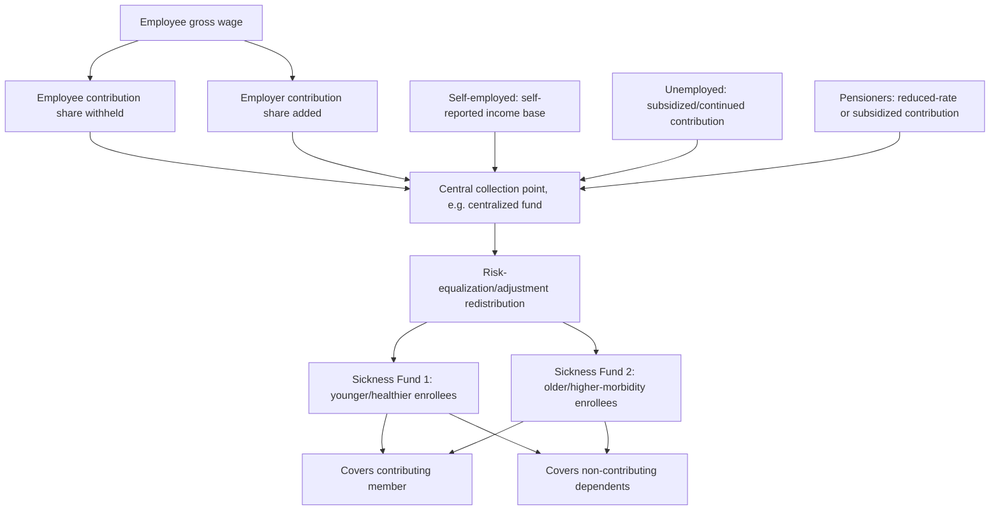

## Social Health Insurance Contributions

### Overview

Social health insurance (SHI) contributions are the earmarked, payroll-linked payments that fund social insurance-based health systems — the specific financing instrument underlying the Bismarck-model architecture covered earlier in this document. This item focuses narrowly on the contribution mechanism itself: how contributions are calculated, collected, and structured, and the public-finance and labor-economics considerations that arise from payroll-based earmarked financing as a standalone design choice, complementing the system-level Bismarck-model item and the tax-financing item preceding this one.

### Defining Features of SHI Contributions

**Key Points**

- **Earmarked by design**: unlike general taxation, SHI contributions are legally dedicated to health-fund financing and are not, in principle, subject to competition with other government spending priorities in the annual budget process — the central fiscal-insulation advantage over general tax financing discussed in the prior item.
- **Payroll-linked base**: contributions are typically calculated as a percentage of gross wages/earnings, distinguishing SHI from both general taxation (broader base) and out-of-pocket payment (no pooling).
- **Contribution ceiling (assessment ceiling)**: most SHI systems cap the wage base subject to contribution — earnings above a defined threshold are not subject to further mandatory SHI deduction, a design feature with direct progressivity implications (discussed below).
- **Employer-employee split**: contributions are typically divided between employer and employee shares, though the specific split ratio, and the economic question of who actually *bears* the burden regardless of the nominal split (tax incidence), vary by country and are addressed separately below.

### Contribution Calculation Mechanics

**Key Points**

- **Standard formula**:

$$Contribution_i = \min(Wage_i, Ceiling) \times ContributionRate$$

where $Wage_i$ is individual $i$'s gross wage, $Ceiling$ is the assessment ceiling (if one exists), and $ContributionRate$ is the statutory percentage rate (often itself split into employer and employee components, e.g., a combined 14.6% rate split roughly evenly in Germany's statutory scheme, though [Unverified] exact current rates should be verified against current national statutory sources as these are periodically revised through legislation).

- **Regressivity above the ceiling**: because earnings above the assessment ceiling are not subject to further contribution, the *effective* average contribution rate as a share of total income declines for earners above the ceiling — a structural regressivity feature at the top of the income distribution that is a well-documented, standard characteristic of ceiling-based payroll contribution systems generally, distinguishing SHI's progressivity profile from an uncapped progressive income tax.
- **Non-wage income exclusion**: SHI contributions are typically assessed only on labor income (wages/salary), not on capital income (dividends, interest, rental income, capital gains) — meaning individuals with substantial non-labor income sources may have SHI contributions representing a smaller share of their *total* economic income than their wage-based contribution rate alone would suggest, a further structural factor affecting the system's overall progressivity that is distinct from, though related to, the ceiling effect above.

### Contribution Base and Coverage of Non-Standard Populations

**Key Points**

- **Employed workers**: the core, most administratively straightforward contribution base — wages are readily observable via employer payroll systems, enabling reliable withholding and remittance.
- **Self-employed individuals**: typically contribute based on self-reported or estimated income, creating both administrative complexity (verification difficulty) and potential under-reporting incentives not present for employer-withheld wage income — a recurring practical challenge across SHI systems internationally.
- **Unemployed individuals**: coverage typically continues through either unemployment-insurance-linked contribution mechanisms (contributions paid on the individual's behalf by the unemployment insurance fund or general government) or exemption/subsidized-premium arrangements, to avoid coverage gaps during unemployment spells.
- **Dependents (spouses, children)**: most SHI systems extend coverage to dependents of a contributing member without requiring a separate/additional contribution — a design feature with direct implications for the effective per-capita financing base (contributions from employed members implicitly cross-subsidize non-contributing dependents), relevant to understanding the true breadth of risk pooling relative to the nominal contributor base.
- **Pensioners/retirees**: contribution arrangements vary — some systems require contributions from pension income (at a reduced rate), others fund retiree coverage through a mix of continued nominal contributions and general-revenue subsidization, reflecting the practical challenge of maintaining earmarked payroll-style financing for a population that, by definition, no longer has payroll income in the traditional sense.

### Tax Incidence: Who Actually Bears the Contribution Burden

**Key Points**

- **Statutory vs. economic incidence**: the legal division of SHI contributions between employer and employee (statutory incidence) does not necessarily reflect who actually bears the economic burden (economic incidence) — standard labor-economics tax-incidence theory holds that in a competitive labor market, the burden of a payroll-based contribution tends to be borne substantially by workers regardless of the statutory split, as employers adjust wage offers downward to offset their nominal contribution obligation over time.
- This is a well-established result in public-finance and labor economics generally (not specific to health-insurance contributions) — the degree to which incidence actually shifts to workers in practice depends on labor-market elasticities (how responsive labor supply and demand are to wage changes), which vary by labor-market conditions, minimum-wage constraints, and other institutional factors. [Inference] The qualitative direction of this incidence-shifting result (contributions substantially borne by labor regardless of statutory split, in competitive labor markets) is a standard, widely accepted finding in public-finance and labor economics; the precise empirical magnitude of shifting in any specific country and time period is an empirical question that varies by study and context and should be sourced from current labor-economics literature rather than assumed as a fixed universal parameter.
- **Policy relevance**: this incidence result is central to debates about whether shifting the employer/employee statutory split (a commonly proposed reform lever) actually changes workers' real economic burden, versus merely relabeling who nominally remits the payment — a distinction frequently underappreciated in public policy debate but well established in the underlying economic theory.

### Labor-Market Effects of Payroll-Based Contributions

**Key Points**

- **Wedge on formal employment**: because SHI contributions are specifically tied to formal payroll, they create a "tax wedge" between the cost of labor to the employer and the net wage received by the employee, specifically for formally employed labor — a structural feature not present with general tax financing (particularly VAT-heavy financing), as discussed in the prior tax-financing item.
- **Informality incentive**: in economies with large informal-sector potential, a substantial payroll-based contribution wedge can create incentives toward informal employment arrangements (to avoid the contribution obligation), a concern more salient in middle-income countries with less-developed formal labor-market institutions than in the historically industrialized economies (Germany, and Bismarck's original context) where the model originated. [Inference] This informality-incentive concern is a standard consideration raised in development and labor economics regarding payroll-based social-insurance financing generally; its empirically observed magnitude varies substantially by country context, enforcement capacity, and the size of the contribution wedge relative to overall labor costs, and should not be treated as a fixed, universal effect size.
- **Employment-level effects**: the broader empirical literature on payroll-tax incidence and employment effects (drawing on both health-insurance-contribution-specific and general payroll-tax research) finds effects that vary by context, labor-market rigidity, and the specific design of the contribution (e.g., presence and level of a ceiling); this remains an active area of applied labor-economics research rather than a settled universal finding. [Speculation] Broad claims about SHI contributions' aggregate employment effects in any specific country should be treated as contested and sourced from current, context-specific empirical research rather than general theoretical priors alone.

### Contribution Collection and Administration

**Key Points**

- Typically collected via employer withholding (similar mechanically to income-tax withholding), remitted to the relevant sickness fund or central collection agency (e.g., Germany's centralized collection through the *Gesundheitsfonds* since 2009 reforms, which then redistributes to individual sickness funds via the risk-equalization mechanism covered in the Bismarck-model item).
- Requires robust employer registration, wage-reporting, and enforcement infrastructure — a meaningful administrative-capacity requirement that is a key reason SHI-based financing has historically been more readily implemented in economies with well-developed formal labor markets and tax/social-security administration capacity.
- Self-employed and informal-sector contribution collection typically requires distinct administrative mechanisms (self-declaration, means-testing, or flat-rate simplified contribution schemes) given the absence of an employer-withholding mechanism, adding administrative complexity relative to pure wage-based collection.

### Contribution Flow and Redistribution Architecture (svg_diagram)

### Comparative Contribution Design Choices

| Design Parameter | Design Option A | Design Option B | Economic Implication |
| --- | --- | --- | --- |
| Contribution ceiling | Present (capped assessment base) | Absent (uncapped, like general income tax) | Ceiling reduces top-end progressivity; uncapped resembles a flat/progressive payroll levy |
| Employer/employee split | Even split | Employer-weighted or employee-weighted | Statutory split has limited effect on true economic incidence per standard tax theory |
| Dependent coverage | Included without added contribution | Requires separate contribution per dependent | Included-dependent design increases effective cross-subsidization from contributing to non-contributing members |
| Self-employed base | Self-reported/estimated income | Flat-rate simplified scheme | Self-reported risks under-declaration; flat-rate sacrifices income-responsiveness for administrative simplicity |
| Non-wage income | Excluded from base | Included (broader base) | Exclusion narrows base and reduces progressivity relative to total economic income; inclusion broadens base but adds administrative complexity |

### Connection to Risk Equalization

**Key Points**

- SHI contributions, once collected, must be redistributed across multiple sickness funds via risk-equalization mechanisms (covered in detail in the Bismarck-model item) precisely *because* contribution collection is typically fund-specific or centrally pooled and then reallocated — the contribution-collection mechanism and the risk-equalization mechanism are two distinct but tightly coupled components of a functioning multi-payer SHI system, and neither is sufficient alone: contribution collection without risk equalization would recreate the adverse-selection vulnerabilities discussed in the single-payer/multi-payer item; risk equalization without a reliable, verifiable contribution base to redistribute would have no revenue to allocate.

### Conclusion

Social health insurance contributions are the payroll-linked, earmarked financing instrument that structurally distinguishes the Bismarck-model architecture from general tax financing, offering fiscal insulation from general-budget competition at the cost of a narrower (labor-income-focused, often ceiling-capped) revenue base and a labor-market "wedge" specifically tied to formal employment. The mechanics of contribution calculation — the assessment ceiling, the non-wage-income exclusion, and the statutory employer/employee split whose economic incidence differs from its legal division — jointly determine both the progressivity profile and the labor-market interaction of SHI-financed systems, distinguishing it in specific, quantifiable ways from both general taxation (covered in the prior item) and out-of-pocket financing (covered earlier in this chapter sequence).

**Related Topics**

- Bismarck model of social health insurance (system-level architecture)
- Tax-financed health care systems (comparative financing mechanism)
- Risk equalization and risk-adjustment methodology in multi-payer systems
- Tax incidence theory and payroll-tax burden shifting in labor economics
- Informal labor markets and social-insurance contribution collection challenges
- Contribution ceilings and progressivity in payroll-based financing
- Diagnosis-Related Group (DRG) payment systems funded through SHI contribution pools
- Self-employed and non-standard-employment coverage design in SHI systems
- Germany's Gesundheitsfonds centralized contribution collection model
- Out-of-pocket dominant systems and structural barriers to SHI contribution collection