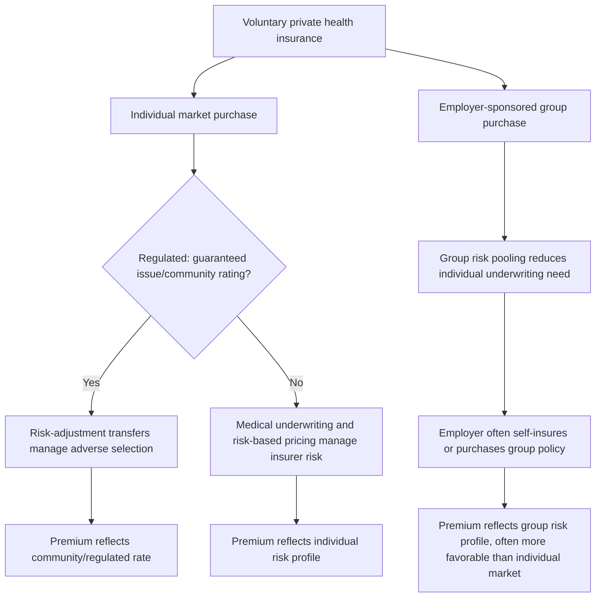

## Private Voluntary Health Insurance Financing

### Overview

Private voluntary health insurance (VHI) is health coverage purchased at the discretion of individuals or employers, priced and underwritten by private insurers operating outside a mandatory social insurance or tax-funded scheme, distinguishing it from the mandatory financing mechanisms — general taxation, social health insurance contributions — covered in the preceding two items. VHI plays structurally different roles across health systems: as the *primary* financing mechanism (historically, the pre-ACA US individual and employer-sponsored market), as a *substitutive* alternative to statutory coverage (Germany's PKV opt-out), or as a *supplementary/complementary* layer atop universal public coverage (the UK's private supplementary insurance, France's *mutuelles*).

### Typology of Voluntary Private Health Insurance

**Key Points**

- **Substitutive VHI**: replaces mandatory statutory coverage entirely for eligible individuals — Germany's *private Krankenversicherung* (PKV) opt-out for high earners above an income threshold is the paradigmatic example, where the individual exits the statutory SHI system entirely rather than adding a private layer on top of it.
- **Complementary VHI**: covers cost-sharing (copayments, deductibles) required under the statutory/public scheme but not covered by it — France's *mutuelles* are the standard example, covering the substantial patient cost-sharing built into the French statutory system's fee structure.
- **Supplementary VHI**: covers services excluded from or not prioritized within the statutory/public benefit package, or provides faster access/greater choice for services that are covered — the UK's private supplementary insurance market (covering faster access to elective procedures the NHS also covers, plus some services outside the NHS benefit package) is the standard example.
- **Primary VHI**: functions as the main source of coverage in the absence of a comprehensive mandatory scheme — historically most prominent in the pre-ACA US individual and employer-sponsored insurance market, though even post-ACA, employer-sponsored insurance remains the dominant primary coverage form for the US working-age population.

### Underwriting and Pricing Mechanics

**Key Points**

- **Experience rating / risk-based pricing**: unlike the community-rated mandatory systems covered in the Bismarck and Netherlands case studies, unregulated VHI markets can price premiums based on individual risk characteristics (age, health status, pre-existing conditions, sometimes gender and occupation), directly tying premium to expected claims cost for that individual or risk group.

$$Premium_i = E[Claims_i] \times (1 + LoadingFactor)$$

where $E[Claims_i]$ is the expected claims cost for individual $i$ based on their risk profile, and the $LoadingFactor$ covers the insurer's administrative costs, profit margin, and risk margin.

- **Medical underwriting**: the process by which insurers assess an applicant's health status (via health questionnaires, medical records review, or examinations) to price or decline coverage — a practice heavily restricted or prohibited in regulated VHI markets (e.g., post-ACA US individual market, Dutch and Swiss mandatory VHI markets) but historically prevalent in unregulated primary VHI markets.
- **Pre-existing condition exclusions**: a related underwriting practice — excluding coverage for conditions the applicant had prior to policy purchase — similarly restricted in regulated markets but a defining feature of historically unregulated VHI.
- **Loading factors and administrative cost structure**: because VHI insurers bear marketing, underwriting, and profit-margin costs not present in most mandatory tax-funded or SHI systems, the loading factor component of VHI premiums is generally higher as a share of total premium than the administrative-cost share of premiums/contributions in regulated mandatory systems — directly connecting to the single-payer/multi-payer administrative-cost comparison covered earlier in this chapter sequence, with unregulated primary VHI representing an extreme case of the multi-payer administrative-overhead disadvantage.

### Adverse Selection and Risk Segmentation in Voluntary Markets

**Key Points**

- **The core economic problem of voluntariness**: because purchase is discretionary, voluntary insurance markets are structurally vulnerable to **adverse selection** — individuals with higher expected health risk have a stronger incentive to purchase coverage (and to purchase more generous coverage) than lower-risk individuals, since the expected value of coverage is higher for them, all else equal.

$$\text{If } E[Claims_{high-risk}] \gg E[Claims_{low-risk}], \text{ high-risk individuals disproportionately self-select into purchasing}$$

- This directly connects to the adverse-selection death-spiral mechanism formalized in the single-payer/multi-payer item: if insurers cannot risk-adjust or medically underwrite (due to regulation), and enrollment is voluntary (unlike mandatory SHI or tax-funded systems), the risk pool that actually enrolls skews sicker than the general population, pushing premiums up, which in turn drives relatively healthier marginal enrollees to decline coverage, worsening the pool further.
- **Insurer responses in unregulated markets**: medical underwriting and risk-based pricing (described above) are the insurer's direct tools for managing adverse selection by matching premium to individual risk — effectively solving the insurer's adverse-selection problem by shifting risk-classification cost onto higher-risk individuals (who face higher premiums or coverage denial), rather than pooling that risk broadly.
- **Regulatory responses in regulated voluntary markets**: where medical underwriting is restricted (e.g., ACA-regulated individual market, Swiss/Dutch mandatory-purchase VHI), adverse selection must instead be managed through **individual mandates** (requiring purchase, converting "voluntary" into de facto mandatory, as in Switzerland/Netherlands) or through penalties/incentives for continuous coverage, combined with risk-adjustment transfers among insurers (the same mechanism covered in the Bismarck and single-payer/multi-payer items) to compensate insurers who enroll higher-risk individuals.

### VHI Market Structure and Purchaser Types (svg_diagram)

### Employer-Sponsored Insurance: A Distinct Sub-Case

**Key Points**

- **Group purchasing dynamics**: employer-sponsored insurance (ESI) — historically dominant in the US working-age population and present as a supplementary layer in many other systems — pools risk across an employer's workforce rather than at the individual level, which partially mitigates (though does not eliminate) individual-level adverse selection, since the risk pool is determined by employment relationship rather than individual purchase decision at the point of enrollment.
- **Tax treatment as an implicit subsidy**: in the US specifically, employer contributions to health insurance premiums are excluded from employees' taxable income — a substantial implicit tax subsidy that significantly reduces the effective cost of ESI relative to individually purchased coverage, and is frequently cited in public-finance literature as a major driver of continued ESI dominance in the US market despite the availability of ACA marketplace alternatives. [Unverified] The current magnitude of this tax expenditure and its precise policy design details should be verified against current US federal tax code and CBO/JCT tax-expenditure estimates, as this remains a live area of ongoing tax-policy debate.
- **Job-lock**: an economic phenomenon where employees remain in a job specifically to retain employer-sponsored health coverage rather than for reasons related to job productivity or preference — a labor-market distortion specific to systems where health insurance access is substantially tied to employment status, a concern largely absent in tax-funded or universal SHI systems where coverage is not employment-contingent. [Inference] Job-lock is a well-documented phenomenon in the labor-economics literature examining US-style employer-tied health insurance specifically; the magnitude of the effect varies across studies and time periods and should be sourced from current labor-economics research for specific quantitative claims.

### Regulatory Approaches to VHI Markets

**Key Points**

- **Guaranteed issue**: requiring insurers to accept all applicants regardless of health status — removes the insurer's ability to decline high-risk applicants, shifting the adverse-selection management burden toward pricing regulation and/or mandates.
- **Community rating (pure or modified)**: requiring insurers to charge the same (pure) or a narrowly banded (modified, e.g., ACA's allowance for age- and geography-based, but not health-status-based, rate variation) premium to all enrollees within a regulated risk pool, regardless of individual health status.
- **Individual mandates**: legally requiring individuals to purchase coverage (or face a penalty), converting a nominally voluntary market into a de facto near-mandatory one specifically to counteract adverse selection — Switzerland and the Netherlands both use this approach within an otherwise "private VHI" market structure, and the US ACA originally included a federal individual mandate penalty (subsequently reduced to $0 at the federal level by 2017 legislation, with some states subsequently implementing their own state-level mandates). [Unverified] Current federal and state-level individual mandate status in the US should be verified against current federal and state statute, given this has been an area of significant legislative change.
- **Risk-adjustment transfers**: as covered in the Bismarck and single-payer/multi-payer items, redistributing funds among insurers based on enrolled population risk profile to neutralize the financial incentive to avoid high-risk enrollees — a standard companion regulation to guaranteed issue and community rating wherever they are jointly imposed on a voluntary or quasi-voluntary multi-insurer market.

### VHI's Role Relative to Mandatory Financing Mechanisms

| Dimension | Voluntary Private Insurance (unregulated) | Voluntary Private Insurance (regulated, e.g., ACA/Swiss/Dutch) | Mandatory SHI (Bismarck) | Tax Financing |
| --- | --- | --- | --- | --- |
| Enrollment | Discretionary | Discretionary or quasi-mandatory (mandate-backed) | Compulsory | Automatic (via tax residency/citizenship) |
| Pricing | Risk-based/medically underwritten | Community-rated within regulated bands | Income-based (payroll %) | N/A (funded from general revenue) |
| Adverse-selection risk | High (managed via underwriting) | Moderate (managed via mandate + risk adjustment) | None (compulsory pooling) | None (automatic universal pooling) |
| Administrative/loading cost | High (marketing, underwriting) | Moderate-high | Moderate | Low-moderate |
| Progressivity | None to regressive (risk-based, not income-based) | Limited (age/geography banding, not income-based directly) | Moderate (income-based, capped) | Variable (depends on tax mix) |

### Economic Evaluation Implications

**Key Points**

- Where VHI plays a substantial role (substitutive, as in Germany's PKV, or primary, as in the pre-ACA and partially post-ACA US market), standard cost-effectiveness and equity-weighted economic evaluation frameworks (ECEA, DCEA — covered earlier in this document) must account for coverage fragmentation: an intervention's population-level cost-effectiveness and distributional profile can differ substantially depending on which financing tier(s) (mandatory SHI/tax-funded vs. voluntary private) a given population segment accesses care through.
- VHI market segmentation is itself a potential equity concern from the distributive-justice-theory perspective covered earlier: if higher-income, healthier populations disproportionately access supplementary or substitutive private coverage (as risk-based pricing and underwriting incentivize), this can create a two-tier system where public/mandatory system capacity and political investment incentives diverge from those of the population still relying primarily on it — a dynamic connected to, though distinct from, the private-insurance-restriction debate covered in the Canada NHI-model case study.

### Conclusion

Private voluntary health insurance financing occupies a structurally distinct position from the mandatory tax-funded and SHI-contribution mechanisms covered in the preceding two items: its defining economic feature is discretionary enrollment, which creates adverse-selection dynamics absent in compulsory systems and requires either risk-based underwriting (in unregulated markets) or a combination of mandates, community rating, and risk-adjustment transfers (in regulated markets) to remain financially viable. VHI's role varies substantially by system — substitutive (Germany), complementary (France), supplementary (UK), or primary (historically, the US) — with correspondingly different implications for progressivity, risk pooling, administrative cost, and the equity of the overall health-financing architecture within which it operates.

**Related Topics**

- Bismarck model of social health insurance and Germany's PKV substitutive VHI system
- Managed competition and the Netherlands/Switzerland mandatory-VHI hybrid model
- Adverse selection and risk-adjustment mechanisms across financing mechanisms
- US Affordable Care Act individual mandate and marketplace regulation history
- Employer-sponsored insurance tax exclusion and job-lock in US labor economics
- Medical underwriting, guaranteed issue, and community rating regulatory tools
- Tax-financed health care systems (comparative financing mechanism)
- Social health insurance contributions (comparative financing mechanism)
- Complementary and supplementary insurance in universal-coverage systems (France, UK)
- Single-payer versus multi-payer system design and payer-structure trade-offs