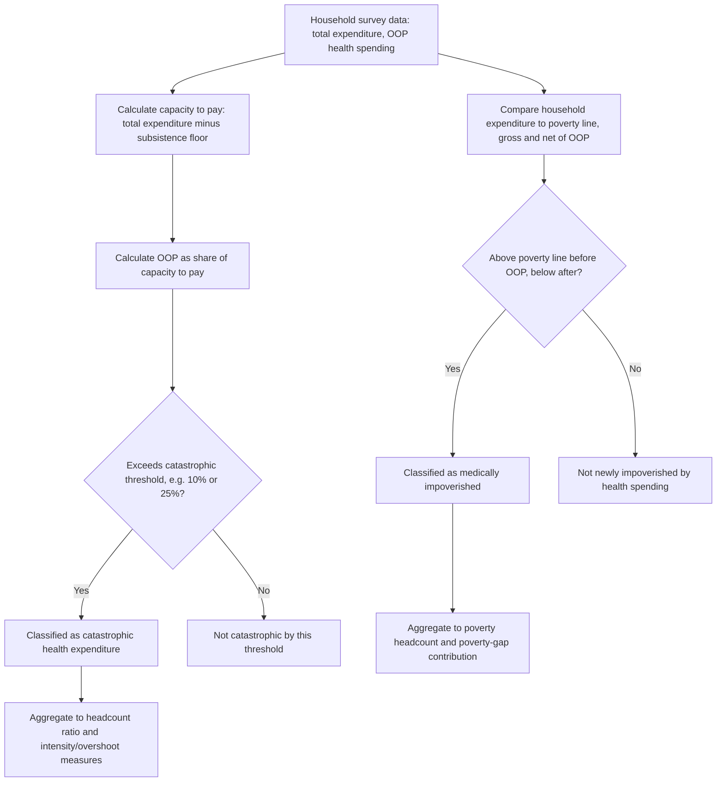

## Out-of-Pocket Payments and Catastrophic Health Expenditure

### Overview

Out-of-pocket (OOP) payments are direct payments made by individuals or households to providers at the point of service, without third-party (insurer or government) pooling — present to some degree in virtually every health system, from residual cost-sharing in generously covered tax-funded systems to the primary financing mechanism in OOP-dominant low-income-country systems (covered earlier in this document). This item provides the technical, measurement-focused treatment of OOP payments and their most significant welfare consequence — catastrophic health expenditure (CHE) — as a standalone financing-mechanism topic, complementing the system-level treatment in the earlier OOP-dominant-systems item.

### Components of Out-of-Pocket Spending

**Key Points**

- **Direct payment for uncovered services**: spending on services entirely outside the covered benefit package of any insurance or public scheme the individual has access to (e.g., cosmetic procedures, some dental/vision care in many systems, services excluded from a national benefit package).
- **Cost-sharing on covered services**: even within well-developed insurance or tax-funded systems, OOP spending frequently persists in the form of:
  - **Copayments**: fixed fees paid per service or prescription (e.g., a fixed fee per GP visit or prescription item).
  - **Coinsurance**: a percentage of the service cost paid by the patient (e.g., 20% coinsurance on a procedure).
  - **Deductibles**: an amount the patient must pay before insurance coverage begins for a defined period (typically annual).
- **Balance billing / extra billing**: charges by providers above the amount reimbursed by insurance or the public scheme, where permitted — a source of OOP spending distinct from formal cost-sharing design, since it reflects provider pricing behavior rather than a designed benefit-structure feature, and is prohibited or restricted in many universal systems (e.g., generally prohibited under Canada's Canada Health Act framework for covered services) but permitted to varying degrees elsewhere.
- **Transportation, informal payments, and indirect costs**: while not always included in formal OOP health-expenditure statistics, informal/under-the-table payments to providers (documented as a significant issue in some health systems with formally free public care but weak provider-payment adequacy or oversight) and transportation/opportunity costs of seeking care are relevant to a complete household financial-burden picture, even when excluded from standard national health accounts OOP measures. [Inference] The scale of informal payments specifically is a well-documented phenomenon in health-systems literature in certain contexts, though its magnitude is inherently difficult to measure precisely (given its informal, often unreported nature) and current context-specific estimates should be treated with appropriate caution regarding measurement uncertainty.

### Cost-Sharing as Deliberate Policy Design vs. System Gaps

**Key Points**

- **Deliberate cost-sharing** is a designed feature of many otherwise well-pooled insurance systems, intended to address **moral hazard** — the tendency for insured individuals to consume more healthcare than they would if fully exposed to its cost, since insurance reduces the marginal price faced by the patient at the point of use toward zero.

$$\text{Moral hazard: } \frac{\partial \text{Quantity Demanded}}{\partial \text{Insurance Coverage}} > 0$$

- The RAND Health Insurance Experiment (1970s–80s) remains the most frequently cited empirical foundation for cost-sharing's price-elasticity effects on healthcare utilization in health economics, establishing that healthcare demand is not perfectly price-inelastic and that cost-sharing measurably reduces utilization — though the experiment's specific quantitative elasticity estimates are dated and [Unverified] current health-economics literature should be consulted for more contemporary and context-specific elasticity estimates, as the original RAND estimates are now several decades old and health-system contexts have changed substantially.
- **System-gap OOP**, by contrast, arises not from deliberate cost-sharing policy design but from genuine coverage gaps — services or populations not covered by any pooling mechanism at all — which is the dominant driver of OOP spending in OOP-dominant low-income-country systems (as opposed to the residual, designed cost-sharing OOP present in well-developed universal systems). Distinguishing these two sources of OOP spending matters for policy response: addressing moral-hazard-motivated cost-sharing requires different tools (cost-sharing redesign, exemptions) than addressing coverage-gap-driven OOP (benefit-package expansion, population coverage expansion).

### Measuring Catastrophic Health Expenditure

**Key Points**

- **Standard CHE definition**: household OOP health spending exceeding a specified threshold share of a reference welfare measure (total household consumption/expenditure, or capacity to pay — total expenditure net of a subsistence/food-spending floor), most commonly set at 10% or 25% thresholds in the international literature:

$$CHE_{\tau} = \mathbb{1}\left[\frac{OOP_h}{X_h} \geq \tau\right]$$

where $OOP_h$ is household $h$'s out-of-pocket health spending, $X_h$ is the reference welfare measure (total expenditure or capacity to pay), and $\tau$ is the catastrophic threshold (e.g., 0.10 or 0.25).

- **Capacity-to-pay refinement**: the WHO's preferred methodology often uses "capacity to pay" — total household expenditure minus a subsistence floor (typically the food-expenditure share of the poorest households, as a proxy for basic non-discretionary consumption needs) — as the denominator rather than total expenditure, since this better captures the household's actual discretionary financial capacity to absorb health costs without threatening basic subsistence:

$$CapacityToPay_h = X_h - SubsistenceExpenditure_h$$

- **Headcount and intensity measures**: CHE is typically reported both as a **headcount ratio** (share of the population/households experiencing CHE) and, in more detailed analyses, an **overshoot/intensity measure** (how far above the threshold, on average, affected households' OOP burden falls) — the headcount alone can understate severity when a smaller number of households face extremely high burden relative to the threshold.

### Measuring Medical Impoverishment

**Key Points**

- **Poverty headcount methodology**: medical impoverishment is measured by comparing household consumption/income against a defined poverty line both **gross** of OOP health spending and **net** of it — households that fall below the poverty line only after subtracting OOP health spending are classified as impoverished specifically due to health costs:

$$Impoverished_h = \mathbb{1}[X_h \geq PovertyLine] \times \mathbb{1}[X_h - OOP_h < PovertyLine]$$

- **Poverty gap contribution**: a related, more granular measure captures not just whether a household crosses the poverty line but the additional depth of poverty (poverty gap) that OOP health spending causes among households already below the poverty line before health spending is considered — relevant because impoverishment headcount measures alone miss this "deepening" effect on households already in poverty.
- These metrics are precisely the ones operationalized in **Extended Cost-Effectiveness Analysis (ECEA)**, covered in the "Frameworks for health equity in economic analysis" item, where CHE cases averted and poverty cases averted are reported as direct financial-protection outcome domains alongside conventional health-outcome metrics.

### CHE and Impoverishment Measurement Workflow (svg_diagram)

### Determinants of CHE Risk at the Household Level

**Key Points**

- **Chronic and high-cost conditions**: households facing chronic disease, cancer, or conditions requiring ongoing high-cost treatment face structurally elevated CHE risk relative to acute, low-cost episodes, since sustained OOP spending over time compounds against a fixed household budget.
- **Low baseline income/expenditure**: poorer households face elevated CHE risk not necessarily because their absolute OOP spending is higher, but because any given absolute OOP amount represents a larger share of a smaller total expenditure base — meaning CHE risk is disproportionately concentrated among lower-income households even when health-spending amounts are similar in absolute terms across income groups.
- **Absence of insurance/pooling coverage**: the most direct determinant — households with no insurance or public-scheme coverage face the full realized cost of illness with no risk-pooling buffer, directly connecting to the OOP-dominant-systems item's core structural argument.
- **Health-system supply-side factors**: provider pricing behavior (including balance billing/extra billing where permitted), availability of lower-cost care alternatives (e.g., generic medications, public-facility options), and geographic access to covered care all mediate how a given health need translates into realized OOP spending.

### Policy Levers to Reduce CHE and Impoverishment

**Key Points**

- **Benefit-package expansion**: extending the scope of services covered under mandatory or subsidized pooling mechanisms directly reduces the residual OOP exposure for previously uncovered services — the primary lever in low-income-country UHC expansion contexts.
- **Cost-sharing exemptions and caps**: many well-developed insurance systems combine deliberate moral-hazard-motivated cost-sharing (see above) with exemptions for low-income households, chronic-disease patients, or an annual out-of-pocket maximum cap, limiting the intensity dimension of CHE even where some cost-sharing remains by design.
- **Population coverage expansion**: extending mandatory or subsidized enrollment to previously uncovered population segments (informal-sector workers, the unemployed) directly addresses the population-coverage dimension of the WHO's UHC cube framework, covered in the OOP-dominant-systems item.
- **Regulation of extra/balance billing**: restricting providers' ability to charge above scheme-reimbursed rates for covered services directly targets a specific, often underappreciated source of OOP spending that persists even in otherwise well-covered systems.
- **Financial-protection-sensitive economic evaluation**: as discussed in the ECEA and equity-frameworks items, explicitly incorporating CHE-cases-averted and poverty-cases-averted as economic evaluation outcome domains helps prioritize interventions and coverage-expansion decisions by their financial-protection value, not cost-effectiveness alone.

### CHE as a Global Monitoring Indicator

**Key Points**

- **SDG indicator 3.8.2** formally tracks the population share experiencing catastrophic health expenditure (typically reported at both 10% and 25% thresholds) as one of the two core indicators (alongside service-coverage indicator 3.8.1) for Sustainable Development Goal target 3.8 (Universal Health Coverage), jointly monitored by WHO and the World Bank.
- This positions CHE measurement not merely as an academic health-economics exercise but as a formal component of global development-policy monitoring infrastructure, directly linking the household-level financial-protection measurement methodology covered in this item to national and international UHC policy accountability. [Unverified] Current global and country-level SDG 3.8.2 estimates should be sourced from the current WHO/World Bank UHC Global Monitoring Report or the SDG indicator database, as these figures are periodically updated with new household survey data.

### Comparative Summary: OOP's Role Across Financing Mechanisms

| Context | OOP's Role | Primary Driver | Typical Policy Response |
| --- | --- | --- | --- |
| OOP-dominant LIC system | Primary financing mechanism | Absence of pooling infrastructure | Population/benefit coverage expansion (UHC pathway) |
| Well-developed tax-funded system | Residual cost-sharing | Moral-hazard-motivated deliberate design | Exemptions, OOP caps for vulnerable groups |
| Bismarck/SHI system | Residual cost-sharing plus uncovered services | Moral hazard design plus benefit-package scope limits | Cost-sharing redesign, complementary VHI (see prior item) |
| Fragmented multi-payer system with coverage gaps | Substantial, driven by both cost-sharing and coverage gaps | Combination of design and population/benefit gaps | Coverage-gap-specific expansion (e.g., Medicaid expansion in relevant contexts) |

### Conclusion

Out-of-pocket payments span a continuum from deliberate, moral-hazard-motivated cost-sharing embedded within otherwise well-pooled systems to the dominant financing mechanism in systems lacking developed risk-pooling infrastructure, with catastrophic health expenditure and medical impoverishment serving as the standard, internationally monitored (SDG 3.8.2) metrics for quantifying OOP's most severe welfare consequences. The technical measurement methodology — capacity-to-pay-based CHE thresholds, gross-versus-net-of-OOP poverty comparisons — provides the empirical foundation for the financial-protection outcome domains formalized in Extended Cost-Effectiveness Analysis, directly connecting this financing-mechanism item to the equity-sensitive economic evaluation frameworks covered earlier in this document, and underscoring that OOP spending's welfare consequences depend as much on *whose* budget it falls on and *how large a share* it represents as on its absolute magnitude.

**Related Topics**

- Out-of-pocket dominant systems in low-income countries (system-level treatment)
- Extended cost-effectiveness analysis (ECEA) and financial risk protection metrics
- RAND Health Insurance Experiment and moral hazard in healthcare demand
- SDG indicator 3.8.2 and global Universal Health Coverage monitoring
- Cost-sharing design: copayments, coinsurance, deductibles, and OOP caps
- Balance billing and extra billing regulation across health systems
- Capacity-to-pay methodology and subsistence-expenditure floor calculation
- Private voluntary health insurance financing as a complementary OOP-reduction mechanism
- Universal Health Coverage benefit-package and population-coverage expansion pathways
- Poverty gap analysis and depth-of-poverty measurement in health-financing research