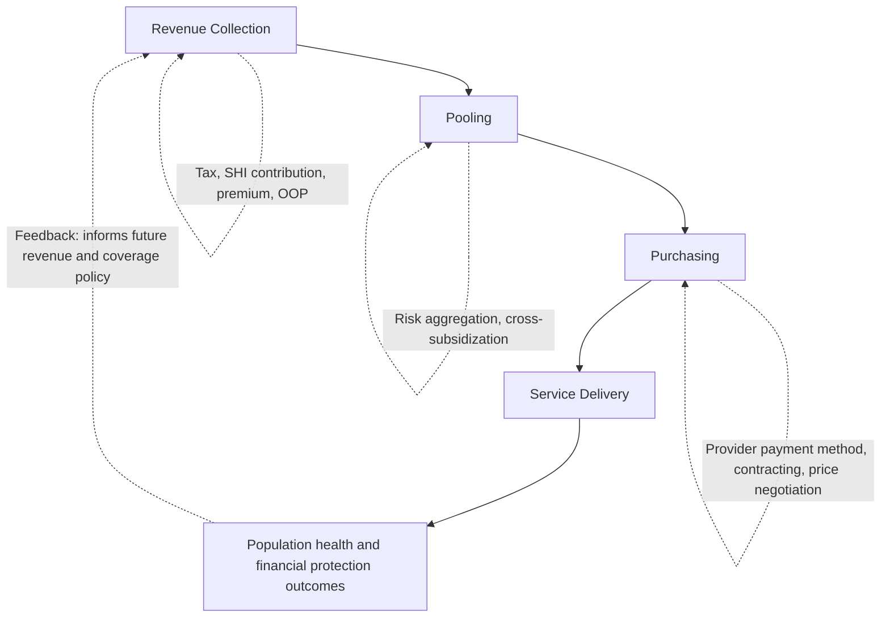

## Pooling and Purchasing Functions in Financing

### Overview

The WHO health-financing framework decomposes any health financing system into three core functions: **revenue collection**, **pooling**, and **purchasing**. The preceding items in this chapter — tax financing, SHI contributions, private voluntary insurance, and out-of-pocket payments — have each primarily addressed revenue collection (how money is raised) and, implicitly, pooling (how risk is aggregated). This item isolates pooling and purchasing as distinct analytical functions in their own right, examining how they operate, why they are conceptually separable from revenue collection, and how their specific design determines a health system's efficiency, equity, and cost-control performance independent of the revenue-collection mechanism used.

### The Three Health-Financing Functions

**Key Points**

- **Revenue collection**: how funds are raised (general taxation, SHI contributions, private insurance premiums, out-of-pocket payment) — the subject of the preceding four items.
- **Pooling**: the accumulation and management of prepaid revenue on behalf of a population, such that the financial risk of illness is shared across members of the pool rather than borne individually — the mechanism that converts collected revenue into risk protection.
- **Purchasing**: the process by which pooled funds are allocated to, and used to pay, healthcare providers in exchange for services on behalf of the covered population — the mechanism that converts pooled funds into actual service delivery.
- **Why the separation matters**: a system can perform each function well or poorly somewhat independently — for example, a system with excellent revenue collection (a broad, well-administered tax base) can still perform poorly overall if its pooling is fragmented (many small, financially fragile pools) or its purchasing is passive/inefficient (simply reimbursing whatever providers bill, without any economic scrutiny) — meaning diagnosing health-system financing performance requires assessing all three functions, not revenue collection alone.

### Function Interaction Diagram (svg_diagram)

### Pooling: Core Concepts

**Key Points**

- **Risk pooling** aggregates the unpredictable, individually variable cost of illness across a population, converting it into a more predictable aggregate cost that can be financed through prepayment — the fundamental insurance principle underlying every mandatory or voluntary pooling mechanism covered in the preceding items.
- **Pool size and the law of large numbers**: larger pools produce more stable, predictable aggregate claims experience (lower variance relative to the mean), directly connecting to the community-based health insurance (CBHI) fragility problem discussed in the OOP-dominant-systems item — small pools remain vulnerable to being overwhelmed by a cluster of high-cost claims regardless of how well revenue is collected into them.
- **Pool fragmentation**: when a health system operates multiple separate, non-integrated pools (e.g., separate schemes for formal-sector employees, informal-sector workers, and the poor, as historically observed in several middle-income countries' health-financing architecture) rather than a single unified pool, the system loses cross-subsidization potential across pools — healthier/wealthier pools cannot subsidize sicker/poorer pools without an explicit inter-pool transfer mechanism, and each fragmented pool individually faces the small-pool fragility problem.
- **Pool consolidation** — merging previously separate pools, or introducing formal cross-subsidization/risk-equalization transfers between them — is a standard UHC-reform lever precisely because it addresses this fragmentation problem directly, independent of whether revenue collection itself changes.

### Types of Cross-Subsidization Within Pools

**Key Points**

- **Risk cross-subsidization**: healthy pool members' contributions effectively subsidize sicker members' higher realized costs within the same period — the core function of any insurance pool, present by construction in mandatory universal pools and requiring active risk-equalization mechanisms (covered in the Bismarck and SHI-contribution items) in voluntary or multi-payer contexts.
- **Income cross-subsidization**: higher-income pool members contribute more (in absolute or proportional terms) than lower-income members receive back in expected benefit value, redistributing resources progressively within the pool — present to the degree the underlying revenue-collection mechanism is progressive (income-tax-heavy financing, uncapped or high-ceiling SHI contributions) and absent or reversed where revenue collection is regressive (flat-rate premiums, VAT-heavy financing, or OOP payment with no pooling at all).
- **Life-cycle cross-subsidization**: working-age, generally healthier contributors subsidize retirees and children who consume more healthcare relative to their (often minimal or absent) direct contribution — present in systems that extend coverage to dependents and retirees without proportionate direct contribution, as discussed in the SHI-contributions item's dependent-coverage design point.
- These three cross-subsidization dimensions are analytically distinct and a given pool's design can deliver strong performance on one dimension while performing poorly on another — for example, a large single national pool with flat-rate (non-income-based) contributions achieves strong risk cross-subsidization but weak income cross-subsidization, illustrating why pool *size* alone does not fully determine pool *equity performance*.

### Purchasing: Core Concepts

**Key Points**

- **Passive vs. strategic purchasing**: **passive purchasing** simply reimburses whatever costs providers incur or bill, with limited scrutiny of provider performance, quality, or value; **strategic purchasing** actively uses the payer's purchasing power to select providers, negotiate prices, design payment incentives, and monitor quality/outcomes — a distinction with major implications for system efficiency and cost control, independent of how much revenue is collected or how well it is pooled.
- **The strategic-purchasing questions**: strategic purchasing is typically framed around three core decisions: *what* services to buy (benefit-package design, connecting to the sufficientarian-floor and essential-benefits-package concepts covered in the distributive-justice-theories item), *from whom* to buy them (provider selection, selective contracting, accreditation requirements), and *how* to pay for them (provider payment mechanism design).
- **Purchaser-provider relationship structure**: purchasing can occur within an **integrated** structure (the purchaser and provider are the same organization, as in much of the UK NHS's traditional hospital-ownership model) or a **split** structure (the purchaser is organizationally separate from the provider and contracts for services, as in the NHS's post-1990s purchaser-provider split, Canada's provincial-plan/private-provider relationship, or Germany's sickness-fund/private-provider contracting) — this structural choice directly connects to, and helps operationalize, the provider-ownership dimension discussed across the Beveridge/Bismarck/NHI case-study items.

### Provider Payment Mechanisms as the Core Purchasing Lever

**Key Points**

- **Fee-for-service (FFS)**: providers paid per unit of service delivered — creates strong volume-incentive (potential overprovision/supplier-induced demand) but preserves provider-level activity flexibility; the dominant mechanism in Bismarck-model ambulatory care and much NHI-model physician payment (covered in earlier items).
- **Capitation**: providers paid a fixed amount per enrolled patient per period, regardless of services delivered — shifts financial risk toward the provider and creates incentives toward cost containment and prevention, but risks underprovision if not paired with quality monitoring; common in primary-care payment across many system types, including UK GP payment components.
- **Global budgets**: providers (typically hospitals) allocated a fixed total budget for a defined period, regardless of patient volume or case mix — strong aggregate cost-control tool, characteristic of Beveridge-model hospital financing, but can create incentives to limit admissions or shift costs if not paired with adequate case-mix/quality safeguards.
- **Diagnosis-Related Groups (DRG)/case-based payment**: providers paid a fixed amount per case, adjusted for diagnosis/severity category, regardless of actual resource use within that case — combines some of capitation's cost-predictability with FFS's activity-linkage, the dominant hospital-payment mechanism in Germany's G-DRG system and a major influence on comparable systems internationally (including US Medicare's DRG-based hospital payment, noted in the case-studies item).
- **Pay-for-performance (P4P)/value-based payment**: supplements a base payment mechanism (FFS, capitation, DRG) with explicit financial incentives tied to measured quality or outcome metrics — the UK's Quality and Outcomes Framework (QOF) for GP payment (mentioned in the Beveridge-model item) is a widely cited example, representing an attempt to counteract the volume/cost-focused incentives of the underlying base payment method with an explicit quality-incentive layer.

### Payment Mechanism Incentive Comparison

| Payment Mechanism | Provider Financial Risk | Volume Incentive | Cost Predictability for Payer | Quality/Underprovision Risk |
| --- | --- | --- | --- | --- |
| Fee-for-service | Low (payer bears volume risk) | Strong incentive toward higher volume | Low (payer exposed to volume growth) | Low underprovision risk; overprovision risk instead |
| Capitation | High (provider bears cost-per-patient risk) | Incentive toward lower volume/cost per patient | High (fixed per-enrollee cost) | Underprovision risk if unmonitored |
| Global budget | High (provider bears aggregate cost risk) | Incentive to limit volume within budget | High (fixed aggregate cost) | Underprovision/waiting-list risk if unmonitored |
| DRG/case-based | Moderate (provider bears within-case resource-use risk) | Incentive toward more cases, but efficient resource use per case | Moderate (predictable per-case, variable aggregate volume) | Risk of "upcoding" (classifying cases into higher-paying categories) |
| Pay-for-performance overlay | Varies (supplements base mechanism) | Redirects incentive toward measured quality dimensions | Depends on base mechanism | Risk of "teaching to the test" — optimizing measured metrics over unmeasured quality dimensions |

### Purchasing Architecture Across the System Case Studies

**Key Points**

- Revisiting the country case studies from earlier in this chapter through the pooling/purchasing lens: the UK NHS combines a largely single national pool with historically integrated purchasing (direct hospital ownership), now layered with a purchaser-provider split introducing more formal strategic-purchasing contracting even within the same overall public ownership structure.
- Germany combines fragmented-but-risk-equalized pooling (multiple sickness funds with morbidity-based risk transfers) with predominantly split, contract-based purchasing (sickness funds negotiating with independently owned providers via collective fee-schedule agreements).
- Canada combines single provincial pools with split purchasing (provincial plans negotiating fee schedules with independent physicians and allocating global budgets to independently governed hospitals).
- This demonstrates that pooling structure and purchasing structure are genuinely independent design axes — a system's position on one does not determine its position on the other, reinforcing why the WHO framework treats them as analytically distinct functions requiring separate design attention.

### Purchasing and Provider Behavior: The Principal-Agent Problem

**Key Points**

- The purchaser-provider relationship is a canonical **principal-agent problem** in health economics: the purchaser (principal) wants to secure high-quality, cost-effective care for the covered population, while the provider (agent) has its own objectives (revenue, workload, professional autonomy) that may not perfectly align with the purchaser's — and the purchaser typically cannot fully observe or verify provider effort and appropriateness of care decisions (information asymmetry), a problem compounded by clinicians' substantial informational advantage over both purchasers and patients regarding what care is clinically appropriate.
- **Supplier-induced demand**: a specific manifestation of this principal-agent/information-asymmetry problem, in which providers — leveraging their informational advantage over patients regarding appropriate care — may recommend or provide more services than are clinically necessary, particularly under FFS payment where doing so increases provider revenue; the empirical extent of supplier-induced demand is a long-debated topic in health economics. [Inference] The theoretical mechanism of supplier-induced demand is well established in health-economics theory; the empirical magnitude of its real-world prevalence and impact is genuinely contested across studies and contexts in the health-economics literature and should not be characterized as a settled, universally quantified phenomenon.
- **Purchasing design as a response**: the choice among FFS, capitation, DRG, global budgets, and P4P overlays (above) represents the purchaser's toolkit for managing this principal-agent problem — each mechanism shifts financial risk and incentive alignment differently, with no single mechanism eliminating the underlying information asymmetry entirely, which is why blended/hybrid payment approaches (e.g., DRG-plus-P4P, capitation-plus-quality-bonus) have become increasingly common internationally as attempts to balance the incentive trade-offs of any single mechanism used alone.

### Conclusion

Pooling and purchasing are the two health-financing functions that convert collected revenue into, respectively, risk protection (pooling) and actual service delivery (purchasing) — functions that are conceptually and empirically separable from revenue collection and from each other, as the cross-national case-study comparison demonstrates. Pooling performance depends on pool size, fragmentation, and the specific mix of risk, income, and life-cycle cross-subsidization achieved; purchasing performance depends on whether the purchaser acts passively or strategically across the what/from-whom/how-to-pay decisions, with provider payment mechanism design serving as the primary lever for managing the underlying principal-agent and information-asymmetry problems inherent in any purchaser-provider relationship. A complete assessment of any health-financing system's performance — building on but going beyond the revenue-collection-focused items earlier in this chapter — requires evaluating all three WHO financing functions jointly, since strong performance on one does not imply strong performance on the others.

**Related Topics**

- WHO health-financing framework: revenue collection, pooling, and purchasing
- Risk equalization and pool fragmentation/consolidation in UHC reform
- Provider payment mechanism design: FFS, capitation, DRG, global budgets, P4P
- Principal-agent theory and information asymmetry in purchaser-provider relationships
- Supplier-induced demand and its contested empirical evidence base
- Purchaser-provider split structures across Beveridge, Bismarck, and NHI systems
- Strategic purchasing: benefit-package design, provider selection, payment method choice
- Community-based health insurance (CBHI) and small-pool fragility
- Diagnosis-Related Group (DRG) systems and case-mix-adjusted payment
- Cross-subsidization dimensions: risk, income, and life-cycle redistribution within pools