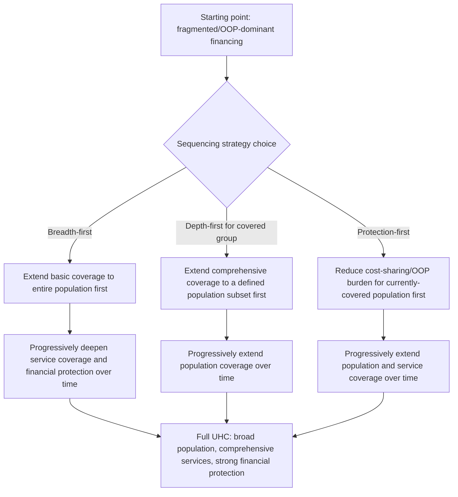

## Universal Health Coverage Financing Strategies

### Overview

Universal Health Coverage (UHC) financing strategies are the deliberate policy pathways countries use to move health-financing architecture from fragmented, OOP-dominant, or partial-coverage arrangements toward the UHC goal — formalized as SDG target 3.8 — of ensuring all people have access to needed health services of sufficient quality without financial hardship. This item synthesizes the revenue-collection mechanisms (tax financing, SHI contributions, private voluntary insurance, OOP payment) and the pooling/purchasing functions covered in the preceding five items into applied *strategy*: the sequencing, combination, and reform choices countries make when deliberately pursuing UHC as a policy objective.

### The WHO UHC Cube Revisited as a Strategic Framework

**Key Points**

- As introduced in the OOP-dominant-systems item, the UHC cube frames progress along three simultaneous dimensions: **population coverage** (breadth — who is covered), **service coverage** (depth — which services are covered), and **financial protection** (height — what share of cost is covered vs. remains OOP).
- UHC financing *strategy* is fundamentally about **sequencing decisions** across these three dimensions under a binding fiscal-space constraint (covered in the tax-financing item) — no country has historically achieved maximum breadth, depth, and financial protection simultaneously from the outset; the strategic question is which dimension(s) to prioritize first given available resources, and how to expand along the other dimensions over time as fiscal space grows.
- This sequencing choice is not merely technical — it connects directly to the distributive justice theories covered earlier in this document: prioritizing population-coverage breadth first (a sufficientarian, universalist-floor approach — extend some coverage to everyone before extending comprehensive coverage to some) versus prioritizing service-coverage depth first for an initially narrower population (a more targeted approach) reflects different implicit value judgments about how to sequence toward the same eventual UHC goal.

### UHC Cube Sequencing Diagram (svg_diagram)

### Core Financing Strategy Archetypes

#### 1. Tax-Funded Universalism (Beveridge-Aligned Strategy)

**Key Points**

- Extends coverage universally and automatically via general tax financing from the outset (or from an early stage), prioritizing population-coverage breadth without requiring an enrollment step — the strategy underlying the UK NHS's founding design and broadly followed by Nordic countries and several other higher-income tax-funded systems.
- **Fiscal precondition**: requires a sufficiently developed tax-collection capacity and revenue base (covered in the tax-financing item's fiscal-space discussion) to sustain population-wide coverage without relying on enrollment-linked contribution collection — historically more readily achieved in higher-income, higher-tax-administrative-capacity settings, though not exclusively (Sri Lanka and Thailand are frequently cited as middle-income examples pursuing largely tax-funded universalist strategies).
- **Strategic trade-off**: achieves population-coverage breadth immediately but may require managing service-coverage depth and financial-protection generosity more gradually as fiscal space allows, using formal benefit-package prioritization processes (often informed by the cost-effectiveness and equity-weighting frameworks covered earlier in this document) to sequence which services are added to the tax-funded benefit package over time.

#### 2. Contributory Expansion (Bismarck-Aligned Strategy)

**Key Points**

- Builds coverage incrementally by extending mandatory SHI-style contributory coverage first to the formal-sector employed population (where payroll-based contribution collection is administratively feasible, per the SHI-contributions item), then progressively extending to informal-sector and non-employed populations through subsidized or modified contribution mechanisms.
- **Historical pattern**: this sequencing broadly describes Germany's own 140-year evolution (from Bismarck's original 1883 coverage of industrial workers to eventual near-universal coverage) and is a commonly referenced strategic template for middle-income countries with substantial formal-sector employment bases (South Korea's phased 1977–1989 extension from large-firm employees to the full population is frequently cited as a relatively rapid execution of this strategy). [Unverified] Specific historical timeline details for South Korea's extension should be verified against current authoritative health-financing history sources, as this synthesis reflects a commonly cited general pattern rather than a claim of precise historical precision on every date.
- **Strategic challenge**: the informal-sector extension phase is typically the most difficult step, since the administrative and contribution-collection mechanisms that work well for formal-sector payroll withholding (covered in the SHI-contributions item) do not transfer straightforwardly to informal, self-employed, or subsistence-agricultural populations — requiring either general-tax-subsidized "free" enrollment for these groups (a hybrid financing approach) or simplified flat-rate/means-tested contribution schemes.

#### 3. Single-Payer NHI Consolidation Strategy

**Key Points**

- Consolidates fragmented pools (formal-sector schemes, informal-sector schemes, safety-net programs for the poor) into a single national or provincial risk pool with unified financing rules — directly addressing the pool-fragmentation problem covered in the pooling-and-purchasing item, and the archetypal strategy underlying Taiwan's 1995 NHI implementation (explicitly designed to consolidate what had previously been separate insurance schemes into a single unified system) and Thailand's Universal Coverage Scheme (2002), which consolidated coverage for the previously uninsured population into a single tax-funded scheme alongside pre-existing civil-servant and formal-sector-employee schemes.
- **Strategic advantage**: directly captures the pooling and purchasing efficiency benefits (larger risk pool, stronger monopsony purchasing power, reduced administrative fragmentation) discussed in the single-payer/multi-payer and pooling-and-purchasing items, in a single consolidating reform rather than gradual incremental extension.
- **Strategic challenge**: politically and administratively demanding — requires simultaneously resolving financing-source questions (how to fund the consolidated pool, often requiring a blend of general tax revenue and continued contributory elements), benefit-package harmonization across previously separate schemes (which may have had different coverage levels), and provider-network integration.

#### 4. Community-Based/Micro-Insurance Bridging Strategy

**Key Points**

- Uses CBHI schemes (covered in the OOP-dominant-systems item) as a deliberate transitional mechanism, building risk-pooling institutional capacity and population familiarity with prepayment/insurance concepts at a small scale before consolidating into larger, more fiscally sustainable pools — Rwanda's *Mutuelles de Santé* is the most frequently cited example of a CBHI-to-national-scheme transition strategy.
- **Strategic rationale**: in settings where neither broad tax-collection capacity nor payroll-based contribution infrastructure is immediately feasible at national scale, CBHI can serve as an incremental, lower-administrative-barrier entry point, with the explicit strategic intent of eventual consolidation (addressing the small-pool fragility problem discussed in the pooling item) rather than permanent reliance on fragmented micro-pools.
- **Strategic risk**: if consolidation does not follow the initial CBHI phase, the strategy risks entrenching the pool-fragmentation and small-pool-fragility problems rather than resolving them — meaning CBHI's value as a *strategy* depends heavily on it being explicitly designed as a bridge rather than an end state. [Inference] This bridge-vs-end-state framing is a standard normative point in the health-financing-strategy literature regarding CBHI; whether any specific country's CBHI experience has successfully functioned as a bridge (versus becoming a persistent fragmented arrangement) is an empirical, country-specific question requiring current, context-specific evidence rather than a general assumption in either direction.

### Comparative Strategy Summary

| Strategy | Primary Financing Mechanism | Sequencing Priority | Key Precondition | Representative Example |
| --- | --- | --- | --- | --- |
| Tax-funded universalism | General taxation | Population breadth first | Developed tax-administration capacity | UK, Nordic countries, Sri Lanka, Thailand |
| Contributory expansion | Payroll-based SHI | Formal sector first, informal sector later | Substantial formal-sector employment base | Germany (historical), South Korea |
| Single-payer consolidation | Mixed (tax and/or contribution, unified) | Pool consolidation as the primary lever | Political/administrative capacity for consolidation reform | Taiwan, Thailand (2002 reform) |
| CBHI bridging | Community-level micro-contributions | Institutional-capacity building, then consolidation | Weak formal tax/payroll collection infrastructure initially | Rwanda |

### Financing-Mix Reality: Hybrid Strategies in Practice

**Key Points**

- Nearly all real-world UHC financing strategies combine elements of general taxation (particularly for subsidizing coverage of the poor, informal-sector workers, and as a supplementary revenue source for consolidated pools), some form of contributory mechanism (for formal-sector or higher-income populations), and, in practice, continued residual OOP payment (cost-sharing, uncovered services) even in relatively mature UHC systems — pure single-mechanism financing strategies are rare in practice, reflecting the genuine difficulty of raising sufficient, sufficiently progressive, sufficiently collectible revenue through any single instrument alone.
- Thailand's Universal Coverage Scheme, for example, is predominantly tax-funded but coexists with the pre-existing Social Security Scheme (a Bismarck-style contributory scheme for formal-sector private employees) and the Civil Servant Medical Benefit Scheme — three distinct schemes covering different population segments under different financing mechanisms simultaneously, illustrating that even a widely cited UHC "success story" reflects a hybrid rather than a single unified financing-mechanism strategy. [Unverified] Current details of Thailand's multi-scheme structure and any subsequent integration reforms should be verified against current Thai health-financing sources given ongoing policy evolution since the 2002 reform.

### Fiscal Sustainability and Financing-Strategy Risk

**Key Points**

- **Demographic transition risk**: strategies relying heavily on payroll-based contributory financing face a structural long-run sustainability question as populations age and the ratio of contributing working-age individuals to non-contributing dependents/retirees declines — a dynamic directly connecting to the life-cycle cross-subsidization concept covered in the pooling item, and a widely discussed structural challenge for mature Bismarck-model systems specifically. [Inference] This demographic-sustainability concern is a standard, well-established point in comparative health- and pension-financing literature regarding payroll-based contributory systems generally; the specific timeline and severity of the challenge varies substantially by country's demographic trajectory and should be sourced from current demographic and fiscal-sustainability projections for any specific country claim.
- **Revenue volatility risk**: strategies relying heavily on general taxation face the fiscal-space competition and revenue-cyclicality risks discussed in the tax-financing item, particularly acute for lower-income countries with narrower, less diversified tax bases.
- **External financing dependence risk**: some low-income-country UHC expansion strategies have relied substantially on external donor financing for specific program components (particularly disease-specific programs) during the expansion phase — a strategy that carries transition risk if external financing is not successfully domesticated (transitioned to sustainable domestic financing sources) over time as donor priorities or funding levels shift, a concern noted in the OOP-dominant-systems item's discussion of donor financing dependence.

### Monitoring UHC Financing Strategy Progress

**Key Points**

- **SDG indicators 3.8.1 (service coverage index) and 3.8.2 (catastrophic health expenditure)**, jointly tracked by WHO and the World Bank, serve as the standard global monitoring metrics for assessing whether a given country's UHC financing strategy is delivering progress along the service-coverage and financial-protection dimensions of the UHC cube respectively — connecting this strategic-synthesis item directly back to the CHE measurement methodology covered in the out-of-pocket-payments item.
- Effective UHC financing-strategy monitoring requires tracking progress across all three UHC cube dimensions jointly (population coverage is typically tracked through scheme enrollment/eligibility data rather than a single standardized SDG indicator), since strong performance on one dimension (e.g., high nominal population enrollment) does not guarantee strong performance on another (e.g., that enrolled populations face low OOP burden or receive comprehensive service coverage in practice) — a point directly paralleling the pooling-and-purchasing item's observation that strong performance on one health-financing function does not imply strong performance on the others.

### Conclusion

Universal Health Coverage financing strategies represent the applied, sequenced synthesis of the revenue-collection mechanisms and pooling/purchasing functions covered throughout this chapter — no single financing mechanism (tax, SHI contribution, or otherwise) constitutes a UHC strategy on its own; rather, UHC strategy is the deliberate sequencing and combination of these mechanisms to progress along the population-coverage, service-coverage, and financial-protection dimensions of the WHO UHC cube under a binding fiscal-space constraint. Country experience (Thailand, Taiwan, Rwanda, Germany, South Korea) demonstrates that real-world UHC financing strategies are consistently hybrid rather than pure-mechanism approaches, that sequencing choices reflect implicit distributive-justice value judgments (breadth-first versus depth-first prioritization), and that fiscal sustainability risk (demographic, revenue-volatility, and donor-dependence) must be actively managed as an ongoing strategic concern rather than a one-time reform achievement, since UHC financing strategy is more accurately understood as a continuous, adaptive policy process than a fixed end-state design.

**Related Topics**

- WHO UHC cube: population coverage, service coverage, and financial protection dimensions
- Out-of-pocket dominant systems and structural barriers to UHC financing transition
- Tax-financed health care systems and fiscal-space constraints
- Social health insurance contributions and contributory-expansion sequencing
- Pooling and purchasing functions: consolidation and fragmentation dynamics
- Community-based health insurance (CBHI) as a transitional financing bridge
- SDG indicators 3.8.1 and 3.8.2 and global UHC monitoring methodology
- Extended cost-effectiveness analysis (ECEA) for benefit-package prioritization
- Demographic transition and long-run sustainability of contributory financing
- Thailand Universal Coverage Scheme and Taiwan NHI as comparative case studies