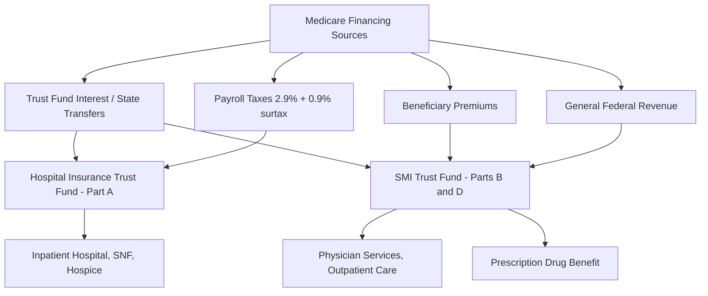

## Medicare Program Structure and Economics

### Overview

Medicare is the United States federal social insurance program providing health coverage primarily to individuals aged 65 and older, along with certain younger people with disabilities and individuals with End-Stage Renal Disease (ESRD) or ALS. Established in 1965 under Title XVIII of the Social Security Act, Medicare is administered by the Centers for Medicare & Medicaid Services (CMS), an agency within the Department of Health and Human Services (HHS). Economically, Medicare functions as a hybrid social insurance system combining payroll-tax-funded compulsory hospital insurance with general-revenue-and-premium-funded voluntary insurance components.

### Program Structure: The Four Parts

#### Part A — Hospital Insurance (HI)

**Key Points**

- Covers inpatient hospital stays, skilled nursing facility (SNF) care, hospice, and some home health care
- Financed primarily through the Hospital Insurance Trust Fund, funded by a dedicated 2.9% payroll tax (1.45% employer + 1.45% employee) under FICA
- An additional 0.9% Medicare surtax applies to high earners (above $200,000 individual / $250,000 married filing jointly) under the Affordable Care Act (ACA)
- Most beneficiaries receive Part A premium-free if they or a spouse paid Medicare payroll taxes for at least 40 quarters (10 years)
- Cost-sharing structured around "benefit periods," not calendar years — a new deductible applies each time a new benefit period begins

Beneficiaries without sufficient work history can purchase Part A, with premiums scaled by quarters of coverage.

#### Part B — Supplementary Medical Insurance (SMI)

**Key Points**

- Covers physician services, outpatient care, durable medical equipment (DME), preventive services, and some home health care
- Voluntary; financed through a combination of general federal revenue (~73%) and monthly beneficiary premiums (~25%), with a small share from interest and other sources
- Standard monthly premium is set annually (2026 standard premium context should be verified via CMS.gov, as it adjusts yearly); higher-income beneficiaries pay an Income-Related Monthly Adjustment Amount (IRMAA)
- Subject to an annual deductible, after which beneficiaries typically pay 20% coinsurance for most services (Medicare pays 80%)
- Late enrollment triggers a permanent premium penalty (10% per each 12-month period of delayed enrollment without qualifying coverage)

#### Part C — Medicare Advantage (MA)

**Key Points**

- Privately administered alternative to Original Medicare (Parts A+B), offered by CMS-approved private insurers
- Plans receive capitated (per-member, per-month) payments from CMS rather than fee-for-service reimbursement
- Must cover at least the same benefits as Original Medicare, but often bundle Part D and offer supplemental benefits (dental, vision, hearing)
- Payment methodology uses a bidding process benchmarked against county-level fee-for-service spending, risk-adjusted using the CMS-Hierarchical Condition Category (HCC) model
- Enrollment has grown substantially — MA now covers more than half of eligible Medicare beneficiaries, a structural shift with major fiscal implications since MA payment dynamics differ from traditional fee-for-service economics [Unverified — exact current enrollment share should be checked against the latest CMS/KFF data]

#### Part D — Prescription Drug Coverage

**Key Points**

- Established under the Medicare Modernization Act of 2003, implemented in 2006
- Delivered exclusively through private Prescription Drug Plans (PDPs) or as part of Medicare Advantage Prescription Drug (MA-PD) plans
- Historically structured around four phases: deductible, initial coverage, coverage gap ("donut hole"), and catastrophic coverage
- The Inflation Reduction Act (IRA) of 2022 restructured Part D starting 2025: eliminated the coverage gap phase, capped annual out-of-pocket spending at $2,000 (indexed thereafter), and introduced the Medicare Prescription Payment Plan allowing beneficiaries to smooth out-of-pocket costs monthly
- The IRA also authorized CMS to negotiate prices directly for a limited set of high-expenditure drugs — a fundamental economic departure from Medicare's historic prohibition on price negotiation

**Medigap (Supplemental Insurance)**, while not a formal "Part," is a related private insurance product purchased by Original Medicare beneficiaries to cover cost-sharing gaps (deductibles, coinsurance). It cannot be used alongside Medicare Advantage.

### Financing Architecture

Medicare operates through **two trust funds**:

1. **Hospital Insurance (HI) Trust Fund** — funds Part A; a "single-purpose" trust fund with a finite balance projected to deplete on a periodic basis absent legislative action, tracked annually by the Medicare Trustees Report
2. **Supplementary Medical Insurance (SMI) Trust Fund** — funds Parts B and D; not subject to the same depletion dynamics because its general-revenue financing is statutorily structured to match projected spending each year (it is "self-balancing" by design, which shifts the fiscal pressure toward the federal budget rather than trust fund insolvency)

This asymmetry is a core economic feature: Part A insolvency projections generate political urgency, while Part B/D's automatic general-revenue financing means their growth pressures the federal deficit more directly and continuously rather than through a visible "trust fund crisis."

### Payment Methodologies

#### Provider Reimbursement Systems

| Setting | Payment Method | Key Mechanism |
| --- | --- | --- |
| Inpatient hospital | Inpatient Prospective Payment System (IPPS) | Diagnosis-Related Groups (DRGs) — fixed payment per case based on diagnosis/procedure bundle |
| Outpatient hospital | Outpatient Prospective Payment System (OPPS) | Ambulatory Payment Classifications (APCs) |
| Physician services | Physician Fee Schedule (PFS) | Resource-Based Relative Value Scale (RBRVS) — payment = (Work RVU + PE RVU + MP RVU) × Conversion Factor |
| Skilled nursing facility | SNF PPS | Patient-Driven Payment Model (PDPM), case-mix adjusted |
| Home health | Home Health PPS | Patient-Driven Groupings Model (PDGM) |
| Medicare Advantage | Capitation | Risk-adjusted per-member-per-month payment via bidding |

**Example: RBRVS Calculation**

$$\text{Payment} = \left[(RVU_{work} \times GPCI_{work}) + (RVU_{PE} \times GPCI_{PE}) + (RVU_{MP} \times GPCI_{MP})\right] \times CF$$

Where GPCI (Geographic Practice Cost Index) adjusts for regional cost variation, and CF (Conversion Factor) is a dollar amount set annually — subject to the Medicare Access and CHIP Reauthorization Act (MACRA) framework, which replaced the earlier Sustainable Growth Rate (SGR) formula after SGR proved politically unsustainable due to recurring threatened payment cuts ("doc fix" legislation).

#### Value-Based Payment Reforms

Traditional fee-for-service Medicare has increasingly incorporated value-based elements:

- **Hospital Readmissions Reduction Program (HRRP)** — penalizes hospitals with excess 30-day readmissions for select conditions
- **Hospital Value-Based Purchasing (VBP) Program** — redistributes a percentage of DRG payments based on quality metrics
- **Merit-based Incentive Payment System (MIPS)** and **Advanced Alternative Payment Models (APMs)** under MACRA's Quality Payment Program — adjust physician payment based on quality, cost, and interoperability performance
- **Accountable Care Organizations (ACOs)**, including the Medicare Shared Savings Program (MSSP) — providers assume varying degrees of financial risk in exchange for shared savings if spending falls below benchmarks while meeting quality thresholds

### Economic Analysis

#### Cost Drivers and Spending Trends

Medicare spending growth is driven by several interacting factors:

1. **Demographic pressure** — aging Baby Boomer cohort increasing enrollment substantially through the 2020s–2030s
2. **Price and utilization growth in medical services** — outpacing general inflation historically, though growth rates have moderated in some periods relative to earlier decades
3. **Technology diffusion** — new drugs, devices, and procedures entering coverage, particularly high-cost specialty pharmaceuticals
4. **Chronic disease burden** — a small share of high-cost beneficiaries (often those with multiple chronic conditions) account for a disproportionate share of total spending, a pattern consistent with general health spending distribution economics

#### Adverse Selection and Risk Adjustment

Because Medicare Advantage plans compete for enrollees while Original Medicare serves as a "residual" option, risk selection dynamics matter significantly:

- CMS uses the **HCC risk-adjustment model** to adjust MA capitation payments based on beneficiary health status, intended to neutralize incentives for plans to "cherry-pick" healthier enrollees
- Critics and MedPAC (the Medicare Payment Advisory Commission) have documented **favorable selection** and **upcoding** (diagnosis coding intensity higher in MA than fee-for-service for comparable patients), which has been linked to MA payments exceeding equivalent fee-for-service costs in aggregate [Inference — magnitude estimates vary by year and methodology; consult the latest MedPAC Report to Congress for current figures]

#### Moral Hazard and Cost-Sharing Design

Standard health-insurance economics applies directly to Medicare's benefit design:

- Part A's benefit-period deductible structure and Part B's coinsurance are designed to introduce some point-of-service cost exposure, moderating first-dollar moral hazard
- Medigap policies, by covering nearly all cost-sharing, can reintroduce moral hazard at the margin — a documented finding in health economics literature comparing utilization between Medigap holders and those without supplemental coverage
- The IRA's 2025 Part D out-of-pocket cap reduces catastrophic financial risk but changes manufacturer and plan liability structure in the catastrophic phase, altering upstream incentives for formulary placement and rebate negotiation

#### Solvency Projections

The HI Trust Fund's projected depletion date is reported annually in the **Medicare Trustees Report**, varying year to year based on updated economic and demographic assumptions. Policy options commonly discussed in the economics literature to address projected shortfalls include:

- Increasing the payroll tax rate or the taxable wage base
- Raising the Medicare eligibility age
- Reducing provider payment updates
- Expanding means-testing (already partially implemented via IRMAA)
- Structural reforms to Part A/B financing integration

[Unverified — specific depletion-year projections change annually; current figures should be sourced from the most recent Trustees Report at the time of use]

### Illustrative Diagram: Beneficiary Cost-Sharing Flow (Original Medicare)

<svg xmlns="http://www.w3.org/2000/svg" viewBox="0 0 800 420">
\<style\>
.title { font: bold 16px sans-serif; fill: #1a1a2e; }
.box { font: 12px sans-serif; fill: #1a1a2e; }
.label { font: 11px sans-serif; fill: #444; }
.node { fill: #eef3fb; stroke: #3b5b92; stroke-width: 1.5; }
.node2 { fill: #fdf3e7; stroke: #b5762a; stroke-width: 1.5; }
.arrow { stroke: #555; stroke-width: 1.5; fill: none; marker-end: url(#arrowhead); }
\</style\>
<text x="20" y="28" class="title">Original Medicare Beneficiary Cost-Sharing Flow (svg_diagram)</text>
<rect x="30" y="60" width="200" height="60" rx="6" class="node" />
<text x="45" y="85" class="box">Beneficiary receives</text>
<text x="45" y="102" class="box">covered service</text>
<rect x="300" y="60" width="220" height="60" rx="6" class="node" />
<text x="315" y="82" class="box">Part A: Deductible per</text>
<text x="315" y="99" class="box">benefit period (inpatient)</text>
<rect x="300" y="150" width="220" height="60" rx="6" class="node2" />
<text x="315" y="172" class="box">Part B: Annual deductible,</text>
<text x="315" y="189" class="box">then 20% coinsurance</text>
<rect x="580" y="60" width="190" height="60" rx="6" class="node" />
<text x="595" y="82" class="box">Medicare pays</text>
<text x="595" y="99" class="box">remaining allowed amount</text>
<rect x="580" y="150" width="190" height="60" rx="6" class="node2" />
<text x="595" y="172" class="box">Beneficiary pays</text>
<text x="595" y="189" class="box">coinsurance/copay</text>
<rect x="300" y="250" width="220" height="60" rx="6" class="node" />
<text x="315" y="272" class="box">Optional: Medigap policy</text>
<text x="315" y="289" class="box">covers residual cost-sharing</text>
<rect x="30" y="250" width="220" height="70" rx="6" class="node2" />
<text x="45" y="272" class="box">Optional: Medicare</text>
<text x="45" y="289" class="box">Advantage (Part C) replaces</text>
<text x="45" y="306" class="box">this flow entirely</text>
<path d="M230,90 L300,90" class="arrow" />
<path d="M230,105 L300,175" class="arrow" />
<path d="M520,90 L580,90" class="arrow" />
<path d="M520,180 L580,180" class="arrow" />
<path d="M520,180 L520,250" class="arrow" />
<path d="M410,120 L410,150" class="arrow" />
<path d="M140,120 L140,250" class="arrow" />

<text x="30" y="360" class="label">Note: Medicare Advantage (Part C) substitutes capitated private-plan</text>

<text x="30" y="376" class="label">administration for the fee-for-service cost-sharing flow shown above.</text>

</svg>

### Practical Example

**Example**

A beneficiary is hospitalized for 5 days (2026 illustrative figures — verify current amounts via CMS.gov):

- Part A inpatient deductible applies once per benefit period (not per admission within the same benefit period)
- If the same beneficiary also has 10 physician office visits that year under Part B, they first satisfy the annual Part B deductible, then pay 20% coinsurance on the Medicare-approved amount for each visit, with Medicare paying the remaining 80%
- If enrolled in a Medigap Plan G, the Part A deductible and Part B coinsurance would largely be covered by the Medigap insurer, leaving the beneficiary primarily responsible for the Part B annual deductible only

**Behavioral disclaimer**: Actual beneficiary liability varies by plan type, specific services rendered, provider network participation (assignment status), and annual CMS-published rate updates; the figures above illustrate structural mechanics rather than current dollar amounts.

### Governance and Oversight Bodies

- **CMS** — administers day-to-day program operations, sets payment rates, issues regulations
- **MedPAC** — independent congressional agency providing analysis and payment recommendations
- **Medicare Trustees** — issue the annual report on trust fund financial status
- **Office of the Actuary (CMS)** — produces official cost projections and actuarial certifications, including for Part D bids and MA benchmarks

### Related Topics

- Medicaid program structure and dual-eligible beneficiary economics
- Diagnosis-Related Groups (DRG) system mechanics and case-mix index
- MACRA, MIPS, and Alternative Payment Model incentive design
- Medicare Advantage risk adjustment (HCC model) and coding intensity
- Inflation Reduction Act drug price negotiation program mechanics
- Accountable Care Organizations and shared savings/risk arrangements
- Health insurance moral hazard and adverse selection theory
- Medicare Trust Fund solvency projections and reform proposals
- Site-of-service payment differentials and post-acute care economics
- Comparative health system financing (single-payer vs. social insurance vs. private models)