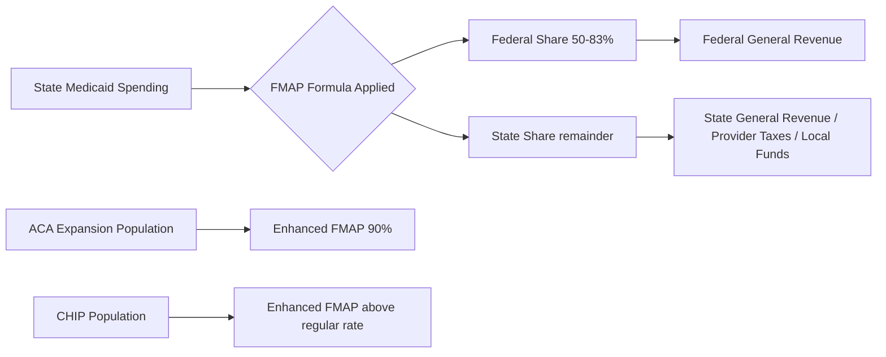
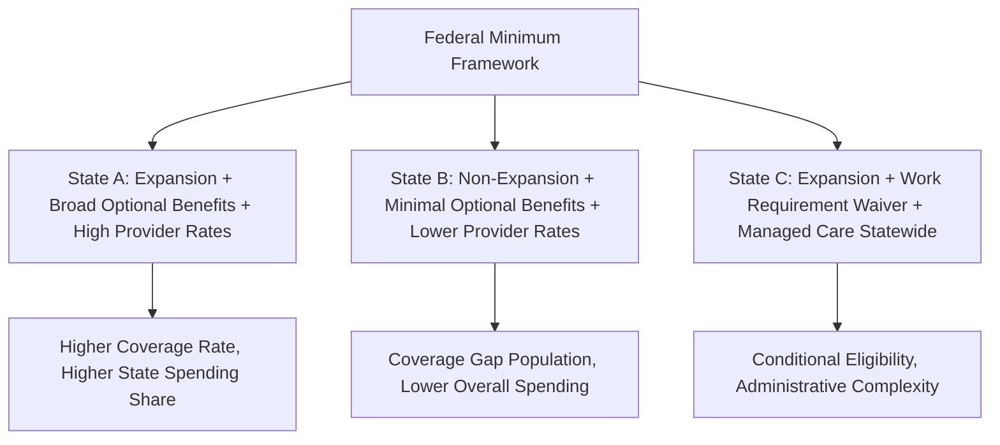

## Medicaid Program Structure and State Variation

### Overview

Medicaid is a joint federal-state means-tested health insurance program established in 1965 under Title XIX of the Social Security Act, serving low-income individuals, families, pregnant women, children, elderly adults, and people with disabilities. Unlike Medicare's largely uniform federal structure, Medicaid is characterized by significant state-level variation in eligibility, benefits, and financing, operating within a federal framework of mandatory minimums and optional expansions. Economically, Medicaid functions as a countercyclical, means-tested social insurance program with shared federal-state fiscal liability, making it one of the largest budget items in most state governments and a major counterparty in health care markets.

### Federal-State Governance Structure

#### Federal Role (CMS)

**Key Points**

- CMS sets minimum federal requirements: mandatory eligibility groups, mandatory benefits, and program integrity standards
- States must submit a **State Plan** to CMS describing how their program operates, and any deviation from standard federal rules requires a **waiver**
- Federal government shares costs with states through the **Federal Medical Assistance Percentage (FMAP)**, a formula-driven matching rate

#### State Role

**Key Points**

- States design and administer their own programs within federal guardrails, including eligibility thresholds (within federal floors/ceilings), optional benefit categories, provider payment rates, and delivery system models (fee-for-service vs. managed care)
- Each state's program often carries a distinct name (e.g., Medi-Cal in California, TennCare in Tennessee, MassHealth in Massachusetts)
- States can request **Section 1115 Demonstration Waivers** to test alternative approaches (e.g., work requirements, alternative benefit designs, delivery system reforms) and **Section 1915 waivers** for home- and community-based services (HCBS)

### Eligibility Framework

#### Mandatory Eligibility Groups

Federal law requires states to cover certain populations, including:

- Children in low-income families (thresholds vary but federal minimums apply)
- Pregnant women up to specified income levels
- Parents/caretakers meeting state's 1996 AFDC-linked income standards (a historical baseline)
- Supplemental Security Income (SSI) recipients (aged, blind, disabled) in most states
- Certain Medicare beneficiaries with low income (dual eligibles, discussed below)

#### Optional Expansion: ACA Medicaid Expansion

**Key Points**

- The Affordable Care Act (2010) authorized states to expand Medicaid eligibility to nearly all adults with incomes up to 138% of the Federal Poverty Level (FPL, effectively 133% plus a 5% income disregard)
- The 2012 Supreme Court decision in *NFIB v. Sebelius* made expansion **optional** for states rather than mandatory, fundamentally altering the program's national uniformity
- The federal government funds expansion populations at an enhanced matching rate (originally 100%, phased down to a permanent 90% federal share), substantially higher than the standard FMAP for traditional populations
- As of the mid-2020s, a majority of states have adopted expansion, but a meaningful minority have not — creating the well-documented **"coverage gap"**, where individuals with income too high for traditional Medicaid but below 100% FPL (and thus ineligible for ACA marketplace subsidies, which begin at 100% FPL) have no viable coverage pathway [Unverified — the specific list of non-expansion states changes periodically and should be verified against current KFF/CMS tracking]

### Financing: The FMAP Mechanism

#### FMAP Formula

The Federal Medical Assistance Percentage determines the federal government's share of most Medicaid spending, calculated using a formula inversely related to state per-capita income:

$$FMAP_{state} = 1 - 0.45 \times \left(\frac{\text{State per capita income}^2}{\text{U.S. per capita income}^2}\right)$$

**Key Points**

- Statutory floor of 50% (wealthier states receive at minimum a 50% federal match) and statutory ceiling of 83%
- Poorer states (e.g., Mississippi) receive higher FMAPs (historically in the high 70s/low 80s percent range); wealthier states receive the 50% floor
- FMAP is recalculated annually and lags actual state economic conditions by roughly two years, which can create a procyclical mismatch: FMAP may decline just as state revenues weaken (economists have criticized this lag as poorly timed for countercyclical fiscal policy) [Inference — the mismatch's practical severity depends on the state and business cycle timing]
- Enhanced matching rates apply to specific categories: ACA expansion adults (90%), Children's Health Insurance Program (CHIP)-funded populations (enhanced FMAP above the regular rate), certain administrative functions (50-90% depending on function), and family planning services (90%)

#### State Financing Mechanisms

States fund their share through a mix of general revenue and other mechanisms, notably:

- **Provider taxes/assessments** — states tax hospitals, nursing facilities, or other providers and use the revenue (partly) to draw down additional federal match, a practice subject to federal limits on "hold harmless" arrangements to prevent circular financing
- **Intergovernmental transfers (IGTs)** from local governments
- **Certified Public Expenditures (CPEs)** from public providers (e.g., public hospitals)

These mechanisms have drawn scrutiny in health economics and policy literature for effectively leveraging federal matching funds using non-general-revenue state sources, sometimes characterized as a fiscal "shell game" by critics, though they are legal within current federal rules [Inference — characterization varies by political and analytical perspective; the underlying financing statistics are factual].

### Benefits: Mandatory vs. Optional

| Category | Mandatory Benefits (examples) | Optional Benefits (examples) |
| --- | --- | --- |
| Institutional | Inpatient/outpatient hospital, nursing facility services (21+) | Intermediate care facilities, private duty nursing |
| Physician/Clinical | Physician services, lab and X-ray, EPSDT (children) | Physical/occupational therapy, dental (adult) |
| Home/Community | Home health (for those entitled to nursing facility care) | Home- and Community-Based Services (HCBS) waivers, personal care services |
| Pharmacy | — (not federally mandatory in the traditional sense, but universally covered in practice) | Prescription drugs (state option, but all states cover) |

**EPSDT (Early and Periodic Screening, Diagnostic, and Treatment)** is a notably broad mandatory benefit for beneficiaries under 21, requiring coverage of any medically necessary service to correct or ameliorate a condition, even services not otherwise covered under the state plan for adults.

The optional nature of many high-cost benefits — particularly **HCBS**, which supports elderly and disabled individuals in home settings rather than institutions — creates significant state variation in long-term care policy and contributes to documented "waiting lists" for HCBS waiver slots in many states, since HCBS is capped/waivered while nursing facility care is a mandatory, uncapped entitlement.

### Delivery System Models

#### Fee-for-Service (FFS)

Traditional model where the state pays providers directly per service rendered, based on state-set fee schedules.

#### Managed Care (Managed Care Organizations, MCOs)

**Key Points**

- The dominant delivery model nationally — most Medicaid beneficiaries are enrolled in some form of managed care
- States pay MCOs a **capitated, risk-adjusted per-member-per-month rate**, transferring utilization risk to the private plan
- States must ensure "actuarial soundness" of capitation rates per federal regulation (42 CFR 438), meaning rates must be developed using generally accepted actuarial principles
- Economic rationale: shifts risk to plans, theoretically incentivizes cost control and care coordination, but raises documented concerns about network adequacy, prior authorization burden, and plan profit margins relative to the **Medical Loss Ratio (MLR)** requirement (Medicaid MCOs generally must spend at least 85% of premium revenue on medical claims and quality improvement)

### Dual Eligibles

**Key Points**

- Individuals qualifying for both Medicare and Medicaid ("dual eligibles") represent a disproportionately high-cost, high-need population — typically low-income seniors or people with disabilities who also have significant chronic disease or long-term care needs
- Medicaid typically covers Medicare premiums, cost-sharing, and services Medicare doesn't cover (notably long-term nursing facility care and HCBS), while Medicare remains the primary payer for acute medical services
- **Full-benefit duals** receive comprehensive Medicaid benefits; **partial-benefit duals** (e.g., Qualified Medicare Beneficiaries, QMBs) receive only Medicare premium/cost-sharing assistance
- Dual eligibles' fragmented financing (two payers, often two sets of rules) is widely cited in health economics literature as a source of misaligned incentives and coordination failure, motivating integrated models like **Dual-Eligible Special Needs Plans (D-SNPs)** and the **Financial Alignment Initiative** demonstrations

### State Variation: Illustrative Dimensions

Sources of variation across states include:

1. **Expansion status** — determines eligibility ceiling for childless adults
2. **Income eligibility thresholds** for other mandatory/optional groups (states can set higher thresholds than federal floors)
3. **Optional benefit generosity** — particularly dental, vision, and HCBS scope
4. **Provider reimbursement rates** — Medicaid rates are generally lower than Medicare and commercial rates, but the gap varies substantially by state, affecting provider network participation and access
5. **Delivery system choice** — FFS vs. managed care penetration, and MCO procurement structures
6. **Waiver-driven policy experiments** — work requirements, premiums/cost-sharing for expansion populations, alternative benefit designs

### Economic Analysis

#### Countercyclical Fiscal Dynamics

Medicaid enrollment tends to rise during economic downturns (as incomes fall and more people qualify) precisely when state tax revenues decline — creating fiscal stress for states at the worst possible time. Historically, Congress has responded with temporary FMAP increases during recessions (e.g., during the 2008-09 financial crisis and COVID-19 pandemic), illustrating the program's role as an automatic stabilizer that requires periodic federal fiscal intervention to sustain state capacity.

#### Crowd-Out and Labor Market Effects

Health economics research has examined whether Medicaid eligibility expansions induce **"crowd-out"** — substitution away from private insurance coverage toward public coverage among marginally eligible populations. Findings in the literature are mixed and dependent on study design, population, and time period [Inference — this remains an active empirical research area rather than a settled consensus].

#### Access and Provider Participation

Because Medicaid reimbursement rates are typically below Medicare and commercial rates, economic theory predicts (and substantial empirical literature confirms to varying degrees) that lower rates are associated with reduced physician willingness to accept new Medicaid patients, though the magnitude varies by specialty, state rate levels, and managed care network requirements [Inference — degree of access impact is state- and specialty-specific and subject to ongoing empirical study].

#### Provider Tax/IGT Financing Critique

The reliance on provider taxes and IGTs to fund the state share has been analyzed as creating potential distortions: it can effectively let states draw a higher federal match than their "true" general-revenue effort would support, a dynamic Congress and CMS have periodically tightened through regulation limiting permissible provider tax structures.

### Practical Example

**Example**

Consider two hypothetical states:

- **State X (expansion state)**: covers adults up to 138% FPL, offers full HCBS waiver benefits, uses statewide managed care, and receives 90% federal match on its expansion population. A single adult earning 100% FPL qualifies for Medicaid.
- **State Y (non-expansion state)**: covers only traditional mandatory groups (pregnant women, children, very-low-income parents, SSI recipients), with no coverage pathway for a childless adult earning 100% FPL — this individual falls into the coverage gap, ineligible for both Medicaid (income too high or category doesn't qualify) and ACA marketplace subsidies (income too low, since subsidies begin at 100% FPL).

**Behavioral disclaimer**: Actual thresholds, benefit packages, and waiver terms vary by state and change over time through legislative and CMS regulatory action; figures above illustrate structural logic rather than current numeric parameters, which should be verified against current state Medicaid agency and CMS documentation.

### Related Topics

- Medicare program structure and economics (comparative financing models)
- Federal Poverty Level (FPL) calculation and subsidy cliff effects in ACA marketplaces
- Section 1115 waivers and Medicaid policy experimentation
- Medicaid managed care actuarial soundness and rate-setting methodology
- Dual-eligible integration models (D-SNPs, PACE, Financial Alignment Initiative)
- Home- and Community-Based Services (HCBS) waiver economics and waiting lists
- Provider tax and intergovernmental transfer financing mechanisms
- Crowd-out effects of public insurance expansion (health economics literature)
- CHIP (Children's Health Insurance Program) structure and financing
- State budget dynamics and Medicaid as a share of state general fund spending