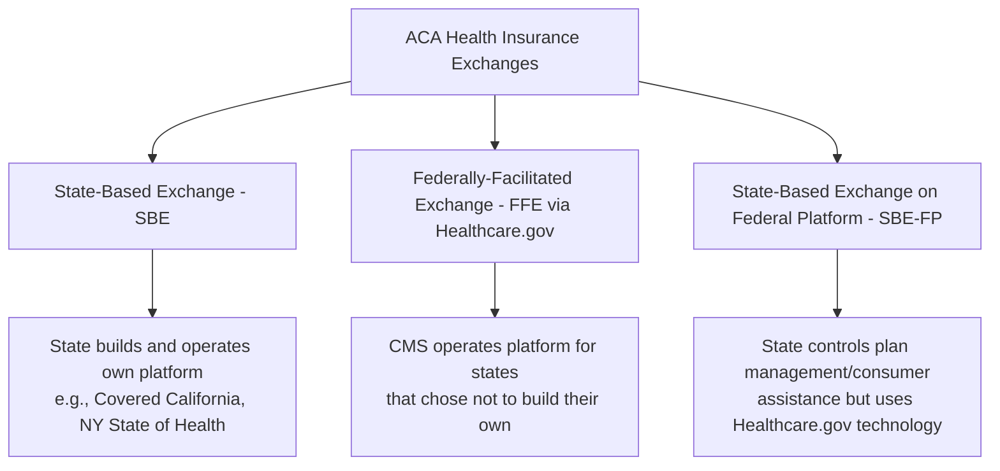
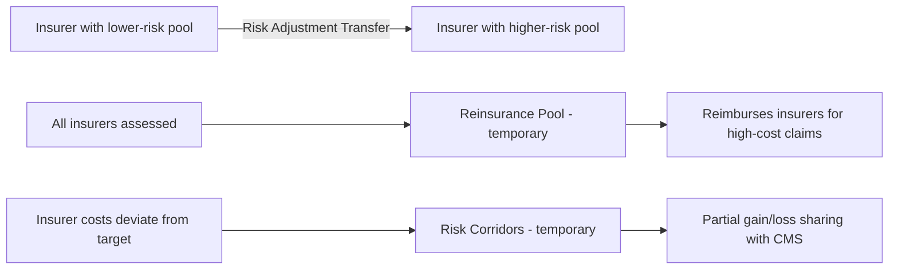

## The Affordable Care Act and Health Insurance Exchanges

### Overview

The Patient Protection and Affordable Care Act (ACA), signed into law in March 2010, represents the most significant restructuring of U.S. health insurance markets since Medicare and Medicaid's creation in 1965. The ACA's core economic strategy addressed adverse selection in the individual insurance market through a interlocking "three-legged stool": guaranteed issue with community rating, subsidized coverage mandates/incentives, and regulated marketplaces (exchanges) where individuals and small businesses could purchase standardized insurance products. This entry covers the law's market reforms, the exchange architecture, subsidy design, and the economic mechanisms underlying its performance.

### Core Market Reforms

#### Guaranteed Issue and Community Rating

**Key Points**

- **Guaranteed issue**: insurers must offer coverage to all applicants regardless of health status, effectively banning medical underwriting in the individual and small-group markets
- **Modified community rating**: premiums can vary only by a limited set of factors — age (up to a 3:1 ratio), geographic rating area, tobacco use (up to 1.5:1), and family size — explicitly prohibiting health-status-based pricing
- **Pre-existing condition exclusions banned**: insurers cannot deny coverage or charge more based on prior health conditions
- These reforms directly address the classic adverse selection problem described in insurance economics (Akerlof-style "market for lemons" dynamics): without some mechanism to keep healthy people in the risk pool, guaranteed issue alone would trigger a death spiral as only sicker individuals purchase coverage, driving premiums up and healthy enrollees out

#### Essential Health Benefits (EHB)

Plans sold in individual and small-group markets must cover ten categories of Essential Health Benefits, including ambulatory care, emergency services, hospitalization, maternity/newborn care, mental health/substance use disorder services, prescription drugs, rehabilitative services, laboratory services, preventive/wellness services, and pediatric services (including dental/vision). This standardization reduces the ability of plans to design benefit packages that implicitly select against high-cost enrollees (a practice known as "adverse selection through benefit design").

#### Individual Mandate (and Its Repeal)

**Key Points**

- Originally required most individuals to maintain minimum essential coverage or pay a tax penalty, designed as the primary mechanism to counteract adverse selection by inducing healthy individuals to enroll
- The Supreme Court upheld the mandate in *NFIB v. Sebelius* (2012) as a valid exercise of Congress's taxing power
- The Tax Cuts and Jobs Act of 2017 reduced the federal penalty to $0, effective 2019, effectively eliminating the mandate's enforcement mechanism while leaving the legal requirement nominally in place
- Post-2019, several states enacted their own individual mandates with state-level penalties (e.g., Massachusetts, New Jersey, California, Rhode Island, D.C.) [Unverified — the current list of states with active mandates should be checked, as it can change through state legislative action]
- Empirical research on the mandate penalty's removal has generally found smaller adverse selection effects than initially projected, attributed partly to the continued presence of subsidies and auto-enrollment/default effects in maintaining enrollment [Inference — this is an active area of health economics research with evolving findings]

### Health Insurance Exchanges (Marketplaces)

#### Structural Models

**Key Points**

- States could choose to build their own exchange (**State-Based Exchange, SBE**), default to the federally-run platform (**Federally-Facilitated Exchange, FFE**, operating as Healthcare.gov), or adopt a hybrid (**SBE-FP**)
- This choice created meaningful variation in exchange operations, outreach funding, and — in some analyses — enrollment outcomes and premium competition, since state-run exchanges can tailor open enrollment marketing, navigator funding, and plan certification standards
- The FFE serves the majority of states that did not establish their own platform, making Healthcare.gov the single largest enrollment portal nationally

#### Metal Tiers and Plan Standardization

Plans sold on exchanges are standardized into four "metal tiers" based on **actuarial value (AV)** — the average percentage of covered health care costs the plan is designed to pay:

| Tier | Actuarial Value | Plan Pays (approx.) | Enrollee Pays (approx.) |
| --- | --- | --- | --- |
| Bronze | 60% | 60% | 40% |
| Silver | 70% | 70% | 30% |
| Gold | 80% | 80% | 20% |
| Platinum | 90% | 90% | 10% |

A **Catastrophic plan** tier also exists for individuals under 30 or those with hardship exemptions, offering minimal coverage with high deductibles at typically the lowest premium.

This standardization allows for genuine "apples-to-apples" comparison shopping — a deliberate market design intervention to reduce search costs and information asymmetry, addressing a documented failure mode in unregulated individual insurance markets where plan complexity impeded effective consumer choice.

### Premium Subsidy Design

#### Premium Tax Credits (PTC)

**Key Points**

- Refundable, advanceable tax credits reducing the net premium cost for eligible individuals purchasing exchange coverage
- Calculated so that the enrollee's required contribution toward the **benchmark plan** (the second-lowest-cost Silver plan, "SLCSP") is capped as a percentage of household income, with the credit covering the difference between that capped contribution and the benchmark plan's actual premium

$$PTC = \text{Premium}_{SLCSP} - \left(\text{Applicable Percentage} \times \text{Household Income}\right)$$

- Originally available only to households between 100%-400% FPL; the American Rescue Plan Act (2021) and Inflation Reduction Act (2022) temporarily removed the 400% FPL cap, capping contributions at 8.5% of income regardless of how high income rises, and increased subsidy generosity at lower income levels
- Because the credit is tied to the **second-lowest-cost Silver plan** rather than the plan actually purchased, enrollees can apply the subsidy to any metal tier — purchasing a cheaper Bronze plan for a very low or $0 net premium, or a more expensive Gold/Platinum plan by paying the full price difference out of pocket

#### Cost-Sharing Reductions (CSRs)

**Key Points**

- Available only to enrollees with income 100%-250% FPL who select a **Silver plan**, CSRs reduce deductibles, copays, and out-of-pocket maximums, effectively raising the plan's actual actuarial value (up to 94% AV for the lowest-income tier) while the enrollee still pays a Silver-tier premium
- CSR federal reimbursement payments to insurers were controversially halted by the Trump administration in October 2017; insurers responded by incorporating the unreimbursed CSR cost into Silver plan premiums specifically — a phenomenon known as **"silver loading"**
- Silver loading had an important, somewhat counterintuitive economic side effect: because PTC subsidies are benchmarked to Silver plan prices, inflated Silver premiums increased subsidy amounts, which enrollees could then apply to comparatively cheaper Bronze or even Gold plans, in some cases making Gold plans cheaper than Silver after subsidy — an unintended market response actively documented and analyzed in health policy literature [Inference — the precise magnitude and persistence of silver-loading effects vary by state rating area and year]

### Risk Mitigation Mechanisms ("3 R's")

The ACA implemented three programs designed to stabilize insurer participation and pricing during the market's transition period:

1. **Risk Adjustment** (permanent) — transfers funds from insurers with lower-risk enrollee pools to insurers with higher-risk pools within a state and market, using a risk-score methodology, to neutralize incentives for risk selection/cherry-picking
2. **Reinsurance** (temporary, 2014-2016) — federal program reimbursing insurers for a portion of high-cost claims, funded by an assessment on all insurers, designed to reduce premium volatility during initial market entry
3. **Risk Corridors** (temporary, 2014-2016) — limited insurer gains/losses by having CMS partially offset outcomes that deviated substantially from projected costs; became politically and legally contentious when Congress restricted risk-corridor payment funding, leading to insurer litigation (culminating in *Maine Community Health Options v. United States*, 2020, where the Supreme Court ruled the government owed the shortfall payments)

### Medicaid Expansion Interaction

The ACA's original design assumed Medicaid expansion to 138% FPL nationwide, with exchange subsidies beginning at 100% FPL — intended to create a seamless coverage continuum. *NFIB v. Sebelius* making expansion state-optional broke this continuum in non-expansion states, producing the **coverage gap** described in the Medicaid entry: individuals below 100% FPL in non-expansion states are ineligible for both Medicaid and exchange subsidies (subsidies statutorily begin at 100% FPL, since the law assumed anyone below that threshold would be covered by expanded Medicaid).

### Small Business Health Options Program (SHOP)

The ACA also established SHOP exchanges intended to allow small employers to purchase group coverage with tax credit incentives (the **Small Business Health Care Tax Credit**, available to qualifying small employers covering a portion of premium costs). SHOP enrollment has been modest relative to individual-market exchanges, and its market impact is generally considered secondary to the individual marketplace reforms [Inference — relative significance assessment; specific enrollment figures should be verified against current SBA/CMS data].

### Economic Analysis

#### Adverse Selection Management

The interlocking design — guaranteed issue + community rating + subsidies + (originally) mandate — represents a textbook policy response to the adverse selection problem in insurance markets. The subsidy structure specifically functions as a demand-side intervention that keeps relatively healthy, price-sensitive individuals in the risk pool by making coverage more affordable, which stabilizes the risk pool composition that community rating alone would otherwise destabilize.

#### Premium and Enrollment Dynamics

Exchange markets experienced substantial premium increases in early years (roughly 2014-2018), attributable to a combination of initial risk-pool uncertainty, insurer entry/exit and reduced competition in some rating areas, the CSR defunding event, and the mandate penalty reduction. Subsequent stabilization and enrollment growth in later years has been associated with enhanced subsidies under ARPA/IRA and improved insurer risk-pool experience as markets matured [Inference — causal attribution across multiple simultaneous policy changes is analytically complex and subject to ongoing health economics research].

#### The "Subsidy Cliff" and Its Temporary Removal

Under the ACA's original design, households just above 400% FPL faced a sharp discontinuity ("subsidy cliff") — losing 100% of subsidy eligibility for a small increase in income, creating a significant marginal tax rate spike and documented enrollment/coverage effects near that threshold. The ARPA/IRA changes replacing the cliff with an 8.5%-of-income cap (with no upper income limit) smoothed this discontinuity, though this provision has required periodic congressional extension and its permanence is subject to ongoing legislative action [Unverified — current subsidy structure status should be verified against the latest legislative developments, given recurring expiration/extension cycles].

### Practical Example

**Example**

A single individual earning 250% FPL shopping on the exchange:

- Their **premium tax credit** is calculated so their required contribution toward the benchmark (second-lowest Silver) plan is capped at a set percentage of income under current law
- If they select that exact benchmark Silver plan, they pay only the capped percentage; if they select a cheaper Bronze plan, they may pay little to nothing in premium (with a higher deductible); if they select a Gold plan, they pay the full premium difference above the subsidy amount
- Because their income falls between 100-250% FPL, if they choose a Silver plan specifically, they also qualify for **Cost-Sharing Reductions**, which lower their deductible and out-of-pocket maximum substantially compared to a standard Silver plan design

**Behavioral disclaimer**: Actual subsidy percentages, FPL brackets, and CSR actuarial value tiers are set by statute and CMS guidance and are subject to change through legislation; current-year parameters should be verified via Healthcare.gov or CMS official guidance.

### Related Topics

- Medicaid program structure and state variation (coverage gap interaction)
- Medicare program structure and economics (comparative public program design)
- Risk adjustment methodology in regulated insurance markets
- Adverse selection and moral hazard in health insurance economics
- Employer-sponsored insurance tax exclusion and its market effects
- Short-term limited-duration insurance plans and ACA-compliant market interactions
- State innovation waivers (Section 1332) and market reform experimentation
- Health insurance rating area design and geographic premium variation
- COBRA continuation coverage economics
- Comparative health system financing models (single-payer vs. regulated multi-payer)