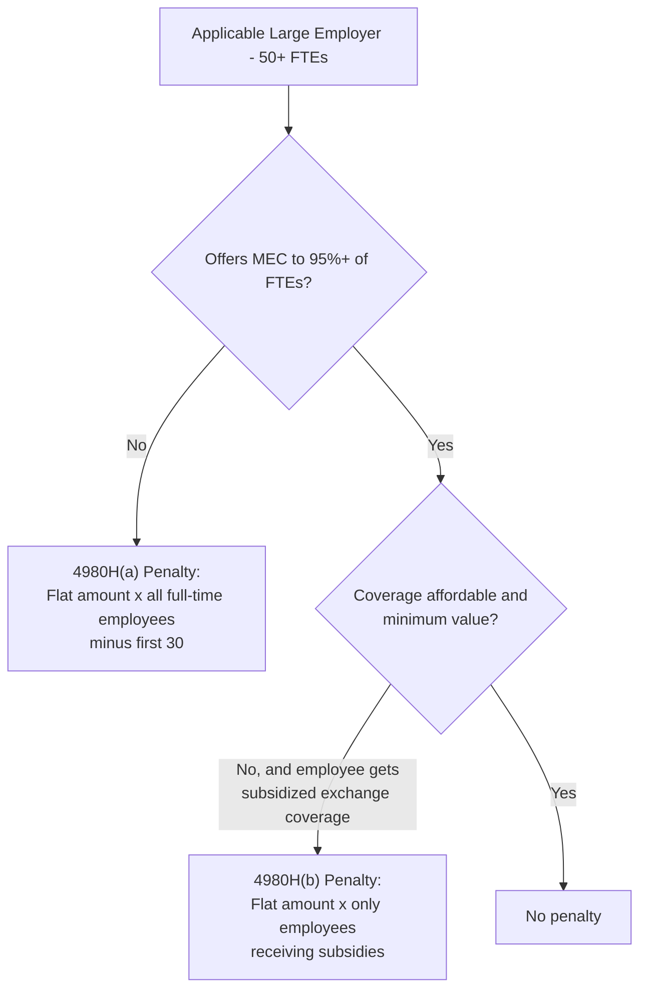

## Individual and Employer Insurance Mandates

### Overview

Insurance mandates are legal requirements compelling individuals to obtain health coverage or employers to offer/contribute to it, functioning as regulatory mechanisms to address adverse selection and coverage gaps in health insurance markets. Under the Affordable Care Act (ACA), two distinct mandates were created: the **Individual Shared Responsibility Provision** (individual mandate) and the **Employer Shared Responsibility Provision** (employer mandate). Though often discussed together, they target different market failures and operate through different legal and economic mechanisms.

### The Individual Mandate

#### Legal and Economic Design

**Key Points**

- Enacted as part of the ACA (2010), effective 2014, requiring most individuals to maintain **minimum essential coverage (MEC)** or pay a **shared responsibility payment** (tax penalty)
- Economic rationale rooted in addressing adverse selection: since the ACA simultaneously required guaranteed issue and community rating (insurers cannot deny coverage or price based on health status), some mechanism was needed to prevent healthy individuals from waiting until sick to purchase coverage — the classic "free rider"/strategic timing problem in insurance markets
- Upheld by the Supreme Court in ***NFIB v. Sebelius*** (2012) as constitutional under Congress's taxing power (not the Commerce Clause, which the Court's majority found insufficient to justify the mandate)
- The penalty was calculated as the **greater of** a flat dollar amount per adult (with a lower amount per child) **or** a percentage of household income above the filing threshold, phased in and increasing through 2016 and indexed thereafter

$$\text{Penalty} = \max\left(\text{Flat Amount}, \; \text{Percentage} \times (\text{Household Income} - \text{Filing Threshold})\right)$$

#### Exemptions

Several categories of individuals were exempt from the mandate penalty, including those with income below the tax filing threshold, individuals for whom the cheapest available plan exceeded an affordability percentage of income, members of recognized religious sects with objections to insurance, incarcerated individuals, and those experiencing qualifying hardships.

#### Repeal of the Penalty

**Key Points**

- The **Tax Cuts and Jobs Act of 2017** reduced the federal individual mandate penalty to $0, effective tax year 2019
- This did not repeal the underlying legal requirement to maintain coverage — it remains technically "on the books" — but eliminated the enforcement mechanism, making it functionally unenforceable at the federal level
- This change became the basis for a subsequent constitutional challenge (***California v. Texas***, 2021), where plaintiffs argued that a $0 penalty could no longer be justified as a tax, potentially invalidating the entire ACA; the Supreme Court did not reach the merits, instead ruling the plaintiffs lacked standing to sue, leaving the ACA intact

#### State-Level Individual Mandates

Following the federal penalty's zeroing-out, several states enacted their own individual mandates with state-specific penalty structures, generally modeled on the original federal design but administered through state tax systems (e.g., Massachusetts had its own pre-ACA mandate predating the federal law; other states including New Jersey, California, Rhode Island, and the District of Columbia enacted mandates post-2019) [Unverified — the current roster of states with active mandates and their specific penalty structures should be verified against current state revenue department guidance, as this list can change through state legislative action].

#### Empirical Effects of Penalty Removal

Health economics research examining the individual mandate penalty's effective elimination has generally found **smaller-than-predicted adverse selection effects** on enrollment and premiums compared to pre-2017 projections [Inference — this is an active empirical research area with results sensitive to methodology and time period studied]. Proposed explanations in the literature include:

- Continued availability of premium subsidies maintaining enrollment incentives independent of the penalty
- Default/inertia effects (auto-reenrollment) keeping existing enrollees in coverage
- Limited public awareness of the penalty's actual removal, potentially sustaining some behavioral compliance effect even absent enforcement
- The relatively modest size of the penalty relative to premium costs for some populations, limiting its behavioral influence even when in effect

### The Employer Mandate

#### Legal and Economic Design

**Key Points**

- Formally the **Employer Shared Responsibility Provision (ESRP)**, applicable to **Applicable Large Employers (ALEs)** — generally defined as employers with 50 or more full-time-equivalent (FTE) employees
- Requires ALEs to offer **minimum essential coverage** that is both **affordable** and provides **minimum value** to at least 95% of full-time employees (and their dependents), or potentially face penalties if even one full-time employee receives subsidized exchange coverage
- Economic rationale differs from the individual mandate: rather than addressing adverse selection directly, it aims to preserve the employer-sponsored insurance (ESI) system's role as the primary coverage mechanism for the working-age population, preventing large employers from shifting employees onto subsidized public exchanges (a cost-shifting concern, sometimes termed preventing "crowd-out" of employer coverage onto taxpayer-subsidized markets)

#### Full-Time Employee Definition

A full-time employee is defined as one averaging at least 30 hours of service per week (or 130 hours per month), a threshold that has been documented in labor economics literature as creating potential incentives for employers to restructure schedules to keep employees under the threshold — sometimes referred to as the **"29-hour workweek" phenomenon** — though the magnitude of this labor market distortion in practice has been debated and empirically contested [Inference — empirical findings on the scale of hour-shifting behavior vary across studies and industries].

#### Affordability and Minimum Value Standards

**Key Points**

- **Affordability**: an employee's required contribution for **self-only** coverage cannot exceed a specified percentage of household income (originally 9.5%, indexed annually, and periodically adjusted by IRS guidance; percentages have varied by year)
- Because employers generally don't know employees' household income, IRS **affordability safe harbors** allow employers to use proxies: the employee's Form W-2 wages, the employee's rate of pay, or the Federal Poverty Line (FPL) safe harbor
- **Minimum value**: the plan must cover at least 60% of the total allowed cost of benefits (an actuarial value threshold), roughly equivalent to a Bronze-tier plan under ACA exchange metal-tier standards

#### Penalty Structure ("A" and "B" Penalties)

Two distinct penalty types exist under Internal Revenue Code Section 4980H:

1. **4980H(a) penalty** ("failure to offer" penalty) — triggered if the employer fails to offer MEC to at least 95% of full-time employees AND at least one full-time employee receives a premium tax credit on an exchange; calculated as a flat annual amount multiplied by the total number of full-time employees (minus the first 30)
2. **4980H(b) penalty** ("failure to offer affordable/adequate" penalty) — triggered if the employer offers coverage, but it's unaffordable or doesn't meet minimum value for the specific employee(s) who then receive subsidized exchange coverage; calculated as a flat amount multiplied only by the number of employees actually receiving subsidies (generally smaller in aggregate than the (a) penalty for most employers, since it applies per affected employee rather than across the whole workforce)

The (b) penalty amount is typically set higher per-employee than the (a) penalty's per-employee equivalent, but because it applies to a narrower base (only subsidized employees rather than the whole workforce), most large employers offering broad coverage face limited (b) exposure.

### Comparative Economic Function

| Dimension | Individual Mandate | Employer Mandate |
| --- | --- | --- |
| Primary market failure addressed | Adverse selection in individual market risk pools | Potential erosion of employer-sponsored insurance base |
| Mechanism | Tax penalty on uninsured individuals | Tax penalty on large employers not offering adequate coverage |
| Current enforcement status | Federal penalty is $0 (post-2017); some states maintain penalties | Federal penalty remains active and enforced |
| Constitutional basis | Upheld as a tax under Congress's taxing power | Generally uncontroversial as a standard employer regulatory/tax provision |
| Key economic concern | Adverse selection / "free rider" problem | Labor market distortions (hour-shifting, hiring thresholds) |

### Employer-Sponsored Insurance (ESI) Context

The employer mandate operates within — and reinforces — the broader U.S. reliance on employer-sponsored insurance as the dominant coverage mechanism for working-age adults, a historical artifact traced to WWII-era wage controls that exempted employer health benefits, subsequently reinforced by the federal tax exclusion for employer-provided health benefits (employer premium contributions are excluded from employee taxable income, a substantial and regressive tax expenditure analyzed extensively in public finance/health economics literature). The employer mandate can be understood as a regulatory backstop protecting this tax-advantaged system's coverage base rather than a primary coverage-expansion tool in its own right [Inference — this framing reflects health economics policy analysis rather than a single authoritative source].

### 50-FTE Threshold Effects

**Key Points**

- The 50-FTE threshold for ALE status has been studied for potential **"bunching" effects** — employers strategically limiting workforce growth or restructuring staffing (e.g., increased use of part-time workers, contractors, or temporary staffing) to remain below the threshold and avoid mandate obligations
- Empirical evidence on the magnitude of bunching at the 50-employee threshold is mixed, with some studies finding modest but detectable effects concentrated among employers near the threshold, while broader macro-level employment effects have been harder to isolate definitively [Inference — findings are sensitive to data source, time period, and identification strategy; this remains a topic of ongoing labor/health economics research]

### Practical Example

**Example**

A company with 60 full-time-equivalent employees is an Applicable Large Employer.

- **Scenario A (no coverage offered)**: If the company offers no health coverage and at least one employee obtains subsidized exchange coverage, the 4980H(a) penalty applies, calculated as the flat annual per-employee amount × (60 − 30) = 30 employees' worth of penalty exposure.
- **Scenario B (coverage offered, unaffordable for some)**: If the company offers coverage, but it fails the affordability safe harbor test for 5 employees who then purchase subsidized exchange coverage, the 4980H(b) penalty applies only for those 5 employees, at the (typically higher) per-employee (b) rate.
- **Scenario C (compliant offer)**: If coverage is offered to 95%+ of full-time employees, is affordable under a safe harbor, and meets minimum value, no penalty applies regardless of individual employee choices to decline coverage.

**Behavioral disclaimer**: Specific penalty dollar amounts, the 95% offer threshold, and affordability percentage thresholds are indexed annually by the IRS and subject to legislative change; current-year figures should be verified against current IRS guidance (e.g., Rev. Proc. updates) rather than assumed static.

### Related Topics

- The Affordable Care Act and health insurance exchanges (subsidy interaction with employer mandate penalties)
- Tax exclusion for employer-sponsored health insurance and its fiscal/distributional effects
- Adverse selection and the economics of insurance risk pools
- Labor market effects of health policy regulatory thresholds (bunching, hour-shifting)
- COBRA continuation coverage and job-loss coverage transitions
- Small Business Health Options Program (SHOP) and small-employer coverage incentives
- Medicaid coverage gap interaction with employer and individual mandate populations
- Comparative international individual mandate models (e.g., Switzerland, Netherlands)