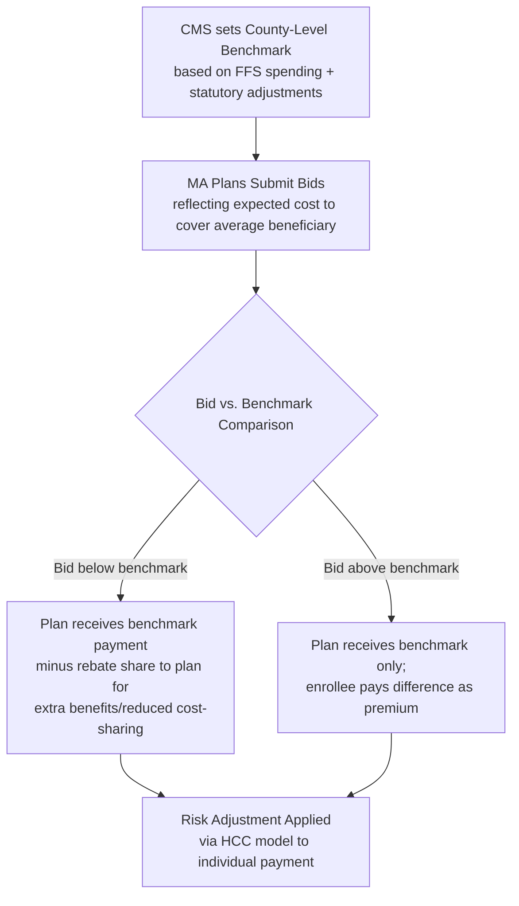

## Medicare Advantage and Managed Competition

### Overview

Medicare Advantage (MA), formally Medicare Part C, is the privatized alternative to Original Medicare in which CMS-approved private insurers receive capitated payments to assume full financial and administrative responsibility for beneficiaries' care. MA is the primary real-world implementation of **managed competition** theory within U.S. health policy — a model in which a public purchaser (CMS) structures a regulated market where private plans compete for enrollees on price and quality within standardized rules, rather than the government directly administering benefits. Understanding MA requires understanding both its administrative mechanics and the underlying managed competition theory it operationalizes.

### Managed Competition Theory Foundations

#### Conceptual Origins

**Key Points**

- Managed competition, as an economic framework, was substantially developed by economist Alain Enthoven in the 1970s-1980s, proposing that health care costs could be controlled and quality improved by having a "sponsor" (employer, government, or purchasing cooperative) structure competition among health plans under common rules
- Core design elements include: standardized benefit packages (to enable comparison shopping), risk adjustment (to prevent risk selection/cherry-picking), price competition constrained by common rules, and a sponsor that manages enrollment, information, and market rules rather than directly providing care
- The theory holds that, properly structured, competition among private plans can achieve efficiency gains, innovation, and cost discipline unavailable to a single monopolistic public payer — while regulation prevents the market failures (adverse selection, risk segmentation) that would otherwise undermine unregulated private insurance competition
- MA (alongside ACA exchanges) represents the clearest large-scale U.S. application of this theory to date [Inference — this framing is standard in health economics/health policy literature discussing MA's theoretical lineage]

### MA Program Structure

#### Plan Types

| Plan Type | Structure | Network Flexibility |
| --- | --- | --- |
| HMO (Health Maintenance Organization) | Requires in-network care, primary care gatekeeping/referrals | Lowest flexibility, typically lowest cost |
| PPO (Preferred Provider Organization) | Allows out-of-network care at higher cost-sharing | Higher flexibility |
| HMO-POS (Point of Service) | HMO with limited out-of-network allowance | Moderate flexibility |
| PFFS (Private Fee-for-Service) | Provider payment terms set by plan; historically less network-restricted | Variable, has declined in prevalence |
| SNP (Special Needs Plans) | Tailored to specific populations (dual eligibles, institutionalized, chronic conditions) | Varies by SNP type |

**D-SNPs (Dual-Eligible Special Needs Plans)** specifically target Medicare-Medicaid dual eligibles, attempting to integrate financing and care coordination across the two programs — addressing the fragmentation concerns discussed in the Medicaid entry's dual-eligible section.

#### Enrollment Trends

MA enrollment has grown substantially since the early 2000s, and by the mid-2020s covers more than half of all Medicare-eligible beneficiaries nationally, a structural shift often described in health policy literature as MA having become the de facto majority delivery model for Medicare rather than a supplementary option [Unverified — exact current enrollment percentage should be verified against the latest CMS/KFF enrollment data, as it changes annually and has been on a consistent upward trajectory].

### Payment Methodology

#### Benchmark and Bidding Process

**Key Points**

- CMS establishes a **county-level benchmark**, derived from a statutory formula referencing historical fee-for-service (FFS) Medicare spending in that county, adjusted by quality **Star Ratings** bonuses
- Plans submit **bids** reflecting their projected per-beneficiary cost to provide Part A/B benefits for an average-risk beneficiary in that service area
- If a plan's bid is **below** the benchmark, the plan receives the benchmark amount but shares a portion of the difference (the "rebate") to fund supplemental benefits (dental, vision, hearing, reduced premiums) — the rebate percentage itself scales with the plan's Star Rating, incentivizing quality performance
- If a plan's bid is **above** the benchmark, the plan receives only the benchmark amount, and must charge enrollees a premium to cover the difference
- Final payment to the plan for each enrollee is **risk-adjusted** using the CMS-Hierarchical Condition Category (HCC) model, which predicts expected costs based on demographic factors and diagnosed conditions, paying plans more for enrolling higher-need beneficiaries

$$\text{Plan Payment}_{i} = \text{Risk Score}_i \times \text{County Benchmark (or Bid, adjusted)}$$

#### Star Ratings and Quality Bonus Payments

**Key Points**

- CMS rates MA plans on a 1-5 star scale across domains including clinical quality (HEDIS measures), member experience (CAHPS survey), member complaints, and plan administration
- Plans achieving 4+ stars receive **Quality Bonus Payments (QBPs)** — an increased benchmark (historically a 5 percentage point benchmark increase for qualifying plans, with additional adjustments in specific circumstances) — directly linking payment to measured quality performance, a core managed-competition design feature intended to make quality (not just price) a competitive dimension
- This creates strong plan-level financial incentives to invest in quality-improvement infrastructure, care management programs, and member experience initiatives, since star rating changes can materially affect plan revenue

### Risk Adjustment and Coding Intensity

#### HCC Model Mechanics

The HCC risk-adjustment model assigns beneficiaries a risk score based on demographic factors (age, sex, Medicaid dual-eligible status, disability status) and diagnosed **Hierarchical Condition Categories** derived from claims/encounter diagnosis codes, with higher scores triggering higher capitated payments. The model is intended to neutralize financial incentives for plans to avoid sicker enrollees, a core managed-competition safeguard against risk selection.

#### Coding Intensity and Upcoding Concerns

**Key Points**

- Because MA plan revenue is directly tied to documented diagnoses, plans have a structural financial incentive to maximize diagnosis capture — through chart reviews, health risk assessments, and provider documentation incentives — a practice termed **"coding intensity"**
- MedPAC and academic research have documented that MA risk scores tend to be systematically higher than equivalent fee-for-service beneficiaries with comparable underlying health status, a pattern generally interpreted as evidence of more complete (or, in critical framings, inflated) diagnosis coding in MA relative to FFS, where diagnosis capture has less direct revenue consequence [Inference — the precise magnitude of "excess" coding intensity versus genuinely more complete/accurate documentation is debated in the literature and estimates vary by study methodology and year]
- CMS applies a **coding intensity adjustment** (a statutory across-the-board downward adjustment to MA risk scores) to partially offset this documented pattern, though MedPAC and other analysts have periodically argued this adjustment is insufficient to fully neutralize the effect
- This dynamic represents one of the most actively debated topics in MA program economics, with direct fiscal implications: MedPAC has periodically estimated that MA payments exceed what equivalent care would cost in FFS Medicare, a gap attributed substantially to risk-score/coding dynamics and favorable selection rather than genuine efficiency differences [Unverified — specific dollar/percentage estimates change with each MedPAC Report to Congress and should be sourced from the current report]

### Favorable Selection Dynamics

Beyond coding intensity, MA plans have also been studied for **favorable selection** — enrolling beneficiaries who are, independent of coding, healthier than the FFS population on average (sometimes attributed to plan marketing patterns, supplemental benefit design attracting healthier/more active seniors, or enrollee self-selection toward managed care features). Some research has found evidence of a "favorable selection at entry, adverse selection at exit" pattern — healthier beneficiaries disproportionately choose MA initially, while beneficiaries with rising health needs sometimes disenroll back to Original Medicare/Medigap when their conditions become complex [Inference — findings and their persistence vary across studies, time periods, and market segments; this is an active area of health services research].

### Supplemental Benefits and Competitive Differentiation

**Key Points**

- MA plans routinely offer benefits beyond traditional Medicare, including dental, vision, hearing, over-the-counter allowances, meal delivery, transportation, and (since 2019 CMS flexibility expansions) certain non-medical **Special Supplemental Benefits for the Chronically Ill (SSBCI)**, such as home modifications or produce benefits, when clinically appropriate
- These supplemental benefits function as the primary competitive differentiation tool among MA plans in a given market, since core Part A/B benefits are federally standardized — plans compete on the generosity of supplemental offerings, network breadth, and star-rating-linked premium/cost-sharing levels rather than on core benefit design
- This is a direct managed-competition mechanism: standardized core benefits prevent competition through benefit-design risk selection, channeling competitive energy instead toward efficiency-funded extras and service quality

### Economic Analysis

#### Efficiency vs. Payment Adequacy Debate

The central, long-running economic debate around MA concerns whether observed MA "savings" relative to benchmarks reflect genuine care-delivery efficiency (better care coordination, utilization management, preventive care investment) versus payment-system artifacts (favorable selection, coding intensity, benchmark-setting methodology). MedPAC's position has generally been that current MA payments, in aggregate, exceed comparable FFS costs — a finding with direct implications for Medicare Trust Fund solvency (discussed in the Medicare entry) since higher MA payments draw more heavily on the same trust funds [Inference — this represents MedPAC's documented analytical position, which industry stakeholders and some other analysts have contested on methodological grounds].

#### Managed Competition Design Trade-offs

MA illustrates both the theoretical promise and practical challenges of managed competition:

- **Promise**: plan competition on quality (Star Ratings) and efficiency, consumer choice among differentiated products, private-sector care management innovation
- **Challenges**: risk-adjustment imperfection creating selection incentives, benchmark-setting complexity creating potential overpayment, network narrowing potentially limiting access despite nominal choice, and prior-authorization/utilization-management practices that have drawn scrutiny (including OIG and MedPAC reports) regarding potential inappropriate care denials relative to FFS Medicare [Inference — utilization management practice critiques are documented in specific regulatory/oversight reports but generalization across the full MA market varies by plan and year]

### Practical Example

**Example**

Consider County Z, where CMS sets a benchmark of $1,000/beneficiary/month based on historical FFS spending.

- **Plan A** bids $900/month (below benchmark) and holds a 4.5-star rating. It receives the $1,000 benchmark, retains a rebate share of the $100 difference (a larger share due to its high star rating) to fund a $0-premium plan with dental/vision benefits, while the remainder returns to CMS.
- **Plan B** bids $1,050/month (above benchmark) with a 3-star rating. It receives only the $1,000 benchmark and must charge enrollees a $50/month premium to cover the gap, with a smaller rebate share for supplemental benefits due to its lower star rating.
- Both plans' actual payments are further adjusted per-enrollee based on individual HCC risk scores — a plan disproportionately enrolling beneficiaries with diabetes, COPD, and CKD would receive higher risk-adjusted payments per member than a plan enrolling a healthier population, holding the benchmark and bid constant.

**Behavioral disclaimer**: Benchmark levels, rebate percentages, star rating bonus thresholds, and risk-adjustment coefficients are set by CMS through annual rate announcements and are subject to change; specific current-year parameters should be verified against the current CMS Rate Announcement and Call Letter.

### Related Topics

- Medicare program structure and economics (Parts A/B/D comparative financing)
- Risk adjustment methodology (HCC model) and its application across Medicare Advantage and ACA exchanges
- MedPAC analysis of MA payment adequacy and Trust Fund implications
- Star Ratings quality measurement methodology (HEDIS, CAHPS)
- Managed competition theory (Alain Enthoven) and its application to ACA exchanges
- Dual-Eligible Special Needs Plans (D-SNPs) and Medicare-Medicaid integration
- Prior authorization and utilization management economics in managed care
- Accountable Care Organizations as an alternative value-based care model within FFS Medicare
- Adverse and favorable selection in regulated insurance markets